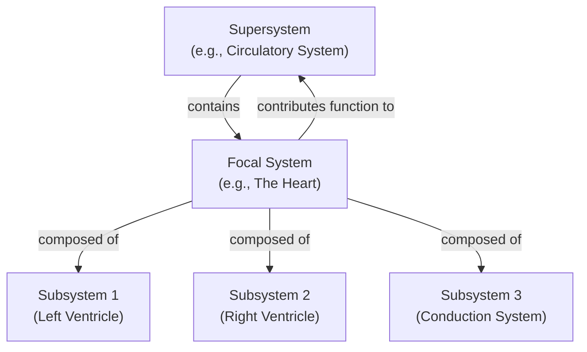

## Systems, Subsystems, and Supersystems

### Overview and Definitions

A **system** is a set of interrelated elements organized to achieve a particular function or purpose, bounded from and embedded within an environment with which it exchanges matter, energy, or information. Every real-world system of any meaningful complexity is simultaneously composed of smaller constituent systems and is itself a component of one or more larger systems — a nested, multi-level organizational structure that systems thinking treats as a fundamental, near-universal feature of how complex reality is organized, rather than an incidental modeling convenience.

**Key Points**

- **System**: the focal level of analysis — the set of interacting components and their relationships that the observer/analyst has chosen to study as a unit, bounded by a defined system boundary separating it from its environment.
- **Subsystem**: a system that is itself a component of a larger system, possessing its own internal structure, function, and (often) partial autonomy, while contributing to the function of the encompassing system of which it is a part.
- **Supersystem** (also called a suprasystem): the larger system within which the focal system is embedded as a component or subsystem, and whose overall function and behavior the focal system's activity contributes to or constrains.

Because these three terms are strictly relative to the analyst's chosen level of focus rather than being absolute categories, the same real-world entity is simultaneously a system, a subsystem, and part of a supersystem depending on which level of the hierarchy is under discussion: a human heart is a system in its own right (composed of subsystems: valves, chambers, the conduction system) while also being a subsystem of the circulatory system, which is itself a subsystem of the whole organism, which is a subsystem of an ecosystem, and so on.

### Diagram: Nested Hierarchy of System, Subsystem, and Supersystem (svg_diagram)

### Hierarchical Organization and Levels of Analysis

The recognition that complex systems are organized as **nested hierarchies of increasing scale and decreasing granularity** is a direct inheritance from Ludwig von Bertalanffy's General Systems Theory and was formalized further by Kenneth Boulding's 1956 hierarchy of system complexity (from simple structural "frameworks" through cybernetic control systems to organisms, social organizations, and beyond). Herbert Simon's influential 1962 essay "The Architecture of Complexity" provided a complementary formal argument for why hierarchical organization is not merely common but should be *expected* to dominate in complex evolved or designed systems: hierarchically organized systems composed of stable, quasi-independent subsystems ("near-decomposable" systems) can be assembled, evolved, and repaired incrementally, whereas equivalent non-hierarchical systems of the same complexity would require improbably long, uninterrupted, error-free construction processes to reach a stable configuration.

**Example**

Simon's parable of the two watchmakers illustrates this argument concretely: one watchmaker, Hora, builds watches from stable sub-assemblies of about ten parts each, which can be set aside without falling apart if interrupted; the other, Tempus, builds watches as a single, non-decomposable sequence of parts, such that any interruption (e.g., a phone call) causes the entire in-progress watch to fall apart, forcing a restart. Hora, using a hierarchical, subsystem-based approach, reliably outcompetes Tempus, illustrating why hierarchical, near-decomposable organization is strongly favored whenever a complex system must be built, maintained, or evolved under conditions of interruption, error, or incremental modification — an argument with direct application to organizational design, software architecture, and evolutionary biology alike.

### Emergent Properties Across Hierarchical Levels

**Key Points**

- Each level of a system hierarchy typically exhibits **emergent properties** that are meaningful only at that level and are not properties of, nor generally predictable in a simple way from, the isolated components at the level below — a cell exhibits metabolism, which is not a property of any single organelle in isolation; an organ exhibits organ-level function (pumping, filtering) not present in any single cell; an organism exhibits organism-level behavior not present in any single organ.
- **Downward causation**: influence in a system hierarchy is not purely bottom-up (subsystem properties determining system properties); higher-level (supersystem) states and constraints also shape and constrain the behavior of lower-level subsystems — an ecosystem's carrying capacity constrains individual organism reproduction rates; an organization's culture and incentive structure shape individual employee behavior — meaning causal explanation in nested systems generally requires attention to both bottom-up (component-driven) and top-down (context/constraint-driven) influence.
- **Boundary permeability varies by level and by direction**: subsystem boundaries are typically more permeable to certain flows (e.g., intra-organizational information flow within a department) than the supersystem's outer boundary is to flows crossing into/out of the environment (e.g., information reaching external competitors), and this differential permeability is itself often what defines a coherent subsystem as a distinguishable unit within the larger system.

### Determining System Boundaries: A Practical and Analytical Challenge

Because subsystem, system, and supersystem are relative to the analyst's chosen frame rather than objectively fixed by nature, one of the most consequential — and frequently underappreciated — methodological steps in any systems-thinking exercise is the explicit, deliberate choice of **system boundary**: which elements and relationships are included within the focal system, and which are treated as external environment or context.

**Key Points**

- **Boundaries are analytical choices, not objective facts of nature**: the same real-world situation can be legitimately bounded in multiple ways depending on the analyst's purpose (e.g., analyzing a hospital's patient-flow system might reasonably include or exclude the surrounding regional healthcare network, ambulance services, or insurance/payer systems, depending on the question being asked).
- **Boundary choice determines what counts as feedback vs. external disturbance**: a variable treated as an internal feedback loop within a broadly-bounded system might instead appear as an unexplained external shock within a narrowly-bounded version of the same situation — a frequent source of the classic systems-thinking pathology of "blaming external factors" for problems that are, at a wider system boundary, actually the consequence of the focal system's own feedback structure (as in Forrester's supply-chain and urban-dynamics work).
- **Trade-offs in boundary breadth**: overly narrow system boundaries risk omitting causally important feedback loops and misattributing systemic problems to external causes; overly broad boundaries risk making the model intractably complex and diluting analytical focus on the actionable core of the problem — practical systems-thinking methodology (e.g., Peter Senge's guidance and formal System Dynamics modeling practice) generally recommends iteratively testing and revising boundary choices against the specific purpose of the analysis rather than assuming a single "correct" boundary exists.

### Subsystem Coupling and Interface Design

The relationships connecting subsystems to each other and to the encompassing system — their **interfaces** — are frequently as important analytically and practically as the internal structure of the subsystems themselves, a principle inherited directly from systems engineering practice (see Operations Research and Early Systems Engineering).

**Key Points**

- **Tight coupling**: subsystems interact frequently, with fast feedback and high mutual dependency; changes in one subsystem propagate quickly and strongly to connected subsystems. Tightly coupled systems can achieve high performance/efficiency but are typically more fragile — a failure or perturbation in one subsystem propagates rapidly through the whole system, a dynamic extensively analyzed in high-reliability organization theory and Charles Perrow's "Normal Accidents" framework for tightly-coupled, complex technological systems.
- **Loose coupling**: subsystems interact less frequently or with buffering/slack between them (inventory buffers, time delays, redundant capacity), which reduces peak efficiency but increases resilience, since perturbations in one subsystem are absorbed rather than directly transmitted to connected subsystems — directly related to Ashby's variety-attenuation and buffering strategies for achieving requisite variety.
- **Interface specification**: in engineered systems, explicit interface contracts (defining what each subsystem provides to and requires from adjoining subsystems) allow subsystems to be designed, modified, or replaced somewhat independently, provided the interface contract is preserved — the systems-engineering justification for modular design, and the direct conceptual ancestor of modular software architecture and API design in computer science.

### Application Across Domains

**Example**

In organizational systems thinking, a company can be analyzed at multiple nested levels simultaneously: an individual team is a system with subsystems (individual employees, sub-teams) and is itself a subsystem of a department, which is a subsystem of the company, which is a subsystem of an industry/market supersystem, which is a subsystem of a national economy. A change initiative aimed at, say, an individual team's workflow (the focal system) may be undermined or amplified by department-level incentive structures (supersystem constraints) that the initiative's designers failed to examine — a common practical failure mode in organizational change efforts traceable directly to inadequate attention to the system's embedding within its supersystem context.

Similarly, in ecological systems thinking, an individual organism is a system composed of subsystems (organs, physiological regulatory systems) and is itself a subsystem of a population, which is a subsystem of a community/ecosystem, which is a subsystem of a biome, which is a subsystem of the biosphere — the multi-level nesting that underlies the entire discipline of ecology's characteristic attention to phenomena at the organism, population, community, and ecosystem levels as distinct but interrelated levels of analysis.

### Common Pitfalls in Reasoning About System Hierarchies

**Key Points**

- **Level confusion**: attributing a property or behavior that properly belongs to one hierarchical level (e.g., an emergent property of the whole organization) to a lower level (e.g., a single employee's individual failing), or vice versa — a frequent source of misdiagnosis in both organizational and biological/medical systems analysis.
- **Premature reductionism**: assuming that fully understanding each subsystem in isolation is sufficient to understand or predict the focal system's behavior, neglecting that the system's function may emerge specifically from subsystem *interaction* and interface dynamics rather than being derivable from subsystem properties alone — the central methodological caution GST, cybernetics, and complexity science all converge on.
- **Boundary neglect**: failing to make the system boundary and its assumptions explicit, leading to unacknowledged disagreements among stakeholders about what is "inside" versus "outside" the system under discussion — a common source of confusion in participatory and organizational systems-thinking exercises, and a central concern of Peter Checkland's Soft Systems Methodology, which treats explicit, negotiated boundary definition (via tools such as the CATWOE framework) as a first-order methodological task rather than a preliminary formality.

### Related Topics

- General Systems Theory and Ludwig von Bertalanffy
- Herbert Simon and near-decomposability ("The Architecture of Complexity")
- Kenneth Boulding's hierarchy of system complexity
- System boundaries and boundary-critique methodology
- Tight vs. loose coupling and Charles Perrow's Normal Accident Theory
- Soft Systems Methodology and the CATWOE framework
- Emergence and downward causation in complex systems
- Modular design and interface contracts in systems engineering