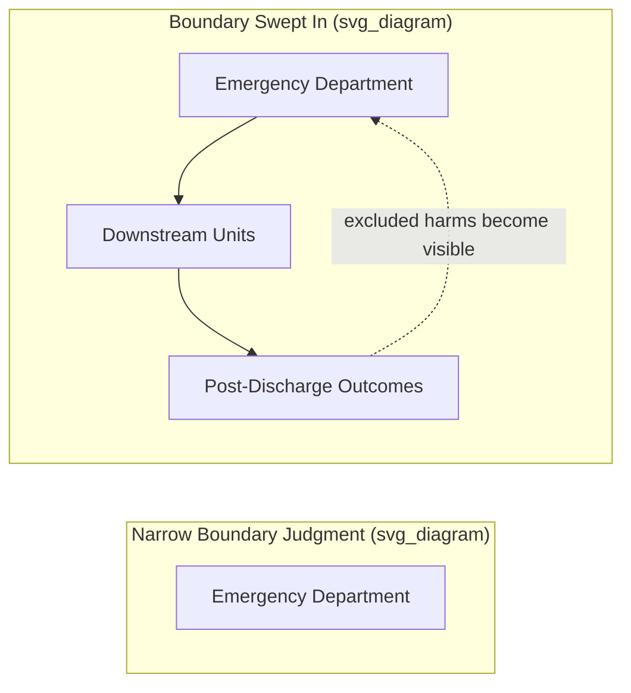

## Boundaries and Boundary Judgments

### Overview and Definitions

A **system boundary** is the analytically defined line separating what is treated as part of a system from what is treated as its environment. A **boundary judgment** is the — often implicit, and always value-laden — decision an observer or analyst makes about where to draw that line: which elements, actors, issues, and time horizons to include within the system of concern, and which to exclude as external context. The concept of boundary judgment, most rigorously developed by systems philosopher C. West Churchman and later systematized by Werner Ulrich in **Critical Systems Heuristics (CSH)**, represents one of the most philosophically significant developments in systems thinking's evolution beyond its mid-century cybernetic and General Systems Theory origins, because it makes explicit that boundary-setting is never a neutral, purely technical act — it is inescapably normative, reflecting whose perspective, interests, and concept of improvement the analysis serves.

### Why Boundaries Are Judgments, Not Given Facts

As established in the discussion of systems, subsystems, and supersystems, no system boundary is handed to the analyst by nature; every boundary is a choice. Churchman's central philosophical contribution was to insist that this choice carries ethical weight, because what is excluded from a system's boundary is thereby also excluded from consideration in evaluating whether the system is functioning well — a decision with real consequences for whoever bears the excluded costs or lacks voice within the analysis.

**Key Points**

- **Boundaries determine what counts as a cost, benefit, or stakeholder**: an analysis that boundaries a factory as an isolated production system, excluding downstream pollution effects on a neighboring community, will evaluate the factory's "performance" without ever registering harms to that community as a relevant cost — the boundary judgment itself, not any subsequent calculation, is what determines whether those harms are visible to the analysis at all.
- **Every boundary judgment privileges some perspective**: because analysts, clients, and affected parties frequently disagree about where the relevant boundary lies (whose problem this is, what timeframe matters, which impacts count), the boundary ultimately adopted in a given analysis typically reflects the perspective and interests of whoever has the power to define the terms of the analysis — often the client commissioning the study rather than those most affected by its conclusions.
- **Rational technical analysis cannot resolve boundary disputes**: because different boundary judgments produce internally coherent but substantively different pictures of "the system" and its performance, disagreements about where to draw the boundary cannot be settled by more rigorous modeling or more data within a given boundary — they require explicit, reflective, often political deliberation about *whose* boundary judgment should prevail and why.

### Churchman's Concept of "Sweeping In"

Churchman, drawing partly on the philosopher Edgar Singer's pragmatist epistemology, argued that genuinely improving a system's design or performance frequently requires deliberately **"sweeping in"** considerations initially excluded by a narrower boundary judgment — enlarging the boundary to include previously external stakeholders, environmental effects, or longer time horizons — precisely because apparent optimization within a narrow boundary can produce outcomes that are locally rational but globally harmful once the artificially excluded considerations are accounted for.

**Example**

A hospital emergency department analyzed with a narrow boundary (the ED alone) might identify "reduce average patient wait time within the ED" as its performance target, and could achieve that target by discharging patients to inadequately prepared downstream units faster. Sweeping in the downstream units, post-discharge readmission rates, and patient outcomes over a longer time horizon reveals that the narrowly-optimized "improvement" may increase total system harm (higher readmission rates, worse outcomes) even while succeeding perfectly on its own narrowly-bounded metric — illustrating why boundary judgments are not a preliminary formality but a substantive determinant of whether an intervention constitutes genuine improvement or merely a locally optimized illusion of one.

### Diagram: Narrow vs. Swept-In Boundary (svg_diagram)

### Critical Systems Heuristics (CSH) and the Twelve Boundary Questions

Werner Ulrich formalized Churchman's insight into **Critical Systems Heuristics**, a structured methodology built around twelve boundary questions organized into four categories, each askable in both an **"is" mode** (how the boundary is currently, often implicitly, drawn) and an **"ought" mode** (how those affected believe the boundary should be drawn) — the systematic contrast between "is" and "ought" answers is CSH's principal diagnostic device for surfacing hidden value conflicts and power asymmetries embedded in a system's current boundary.

**Key Points**

- **Sources of motivation**: Who is the intended beneficiary (the client) of the system? What is the actual purpose being served, as opposed to the stated purpose? What measure of success is being used, and by whom is it defined?
- **Sources of power**: Who is the actual decision-maker with power to change the system's boundary conditions? What resources and conditions of implementation are controlled by the decision-maker versus lying outside their control?
- **Sources of knowledge**: Who is considered a legitimate expert or provider of relevant knowledge for the system? What kind of expertise (professional, experiential, local) is treated as credible, and whose knowledge is excluded or discounted?
- **Sources of legitimacy**: Who represents the interests of those affected but not directly involved in decision-making (the "witnesses" to the system's externalized consequences)? What secures the legitimacy of the system's boundary judgments in the eyes of those excluded from defining them, and what opportunity do the excluded have to challenge that legitimacy?

This structure gives boundary critique methodological rigor: rather than treating "whose perspective should count" as an unanswerable philosophical question, CSH provides a specific, repeatable set of questions that can be posed to any group of stakeholders to surface where their implicit boundary judgments diverge, and to make the resulting value conflicts an explicit object of discussion rather than an unexamined background assumption.

### Boundaries in Soft Systems Methodology: The CATWOE Framework

Peter Checkland's **Soft Systems Methodology (SSM)** addresses the same underlying problem — that different stakeholders in an ill-structured ("messy") situation typically hold different, often incompatible, mental models of what "the system" even is — through the **CATWOE** mnemonic, used to make explicit the boundary assumptions embedded in any particular "root definition" (a concise formal statement of what a system is, for whom, and why) that a stakeholder or analyst proposes:

**Key Points**

- **Customers**: who are the beneficiaries or victims of the system's activity.
- **Actors**: who carries out the system's transformative activities.
- **Transformation process**: what input is converted into what output — the core process the system exists to accomplish.
- **Weltanschauung** (worldview): the taken-for-granted perspective that makes this particular root definition meaningful — a boundary judgment is meaningless without an implicit worldview specifying why the transformation matters and to whom.
- **Owner**: who has the power to modify or abolish the system.
- **Environmental constraints**: what elements are taken as fixed, external givens that the system must accommodate rather than change.

CATWOE, like CSH, treats explicit articulation of the boundary-defining elements of a proposed system definition as a necessary precondition for meaningful comparison across stakeholders' differing mental models, and for identifying where apparently technical disagreements about "what the system is" actually reflect deeper disagreements about whose worldview and interests the analysis should serve.

### Boundary Objects and Negotiated Boundaries in Multi-Stakeholder Systems

**Key Points**

- **Boundary objects** (a concept from science and technology studies, Susan Leigh Star and James Griesemer, 1989, widely adopted into systems and organizational thinking) are artifacts, categories, or representations (shared documents, standardized forms, shared data models) that are flexible enough to be interpreted differently by different stakeholder communities while maintaining enough shared structure to support coordinated action across a boundary that different groups understand differently — a practical mechanism for managing, rather than fully resolving, boundary disagreements in multi-stakeholder systems.
- **Boundary spanning roles**: individuals or functions (liaisons, integrators, translators) who work explicitly across a system boundary to maintain communication and coordination between an organization/subsystem and its environment or adjoining subsystems, a concept extensively studied in organizational theory as essential to managing porous, contested, or ambiguous system boundaries in practice.

### Common Pitfalls in Boundary Setting

**Key Points**

- **Unreflective inheritance of institutional boundaries**: analysts frequently default to whatever organizational, departmental, or disciplinary boundary is administratively convenient (e.g., "the IT department's system") without examining whether that boundary aligns with the actual causal structure of the problem being addressed, often reproducing exactly the boundary blindness that caused the original problem.
- **Boundary shifting as an evasive tactic**: stakeholders facing accountability for a poor outcome may retroactively narrow the boundary of "their system" to exclude the very factors responsible for the failure ("that's outside our control/scope"), a pattern CSH's power and legitimacy questions are specifically designed to surface and challenge.
- **Conflating "cannot change" with "should not consider"**: treating an element as outside the system boundary because it is currently outside the analyst's control (an "environmental constraint" in CATWOE terms) can illegitimately foreclose consideration of interventions aimed precisely at expanding what is within the system's sphere of influence over time — a distinction between boundaries as fixed facts versus boundaries as contestable, potentially expandable, structures of power and control.

### Relationship to Other Systems-Thinking Concepts

Boundary judgment sits at the philosophical foundation beneath more technical systems-thinking machinery discussed elsewhere in this curriculum: the choice of system boundary determines which feedback loops are visible within a System Dynamics model (see Jay Forrester's methodology), which stakeholders' variety must be accounted for under Ashby's Law of Requisite Variety, and which subsystems and supersystems are treated as within versus outside the analytical frame (see Systems, Subsystems, and Supersystems). Where Bertalanffy's General Systems Theory and Wiener's cybernetics largely treated system boundaries as a technical modeling convenience to be specified for analytical tractability, Churchman and Ulrich's boundary-critique tradition represents systems thinking's explicit philosophical maturation into recognizing boundary-setting as an irreducibly ethical and political act — a foundational contribution to what is now broadly termed **critical systems thinking**.

### Related Topics

- C. West Churchman and the philosophy of systems design
- Critical Systems Heuristics and Werner Ulrich
- Soft Systems Methodology, CATWOE, and Peter Checkland
- Systems, Subsystems, and Supersystems
- Stakeholder analysis in organizational systems thinking
- Boundary objects and boundary-spanning roles
- Critical systems thinking as a distinct methodological tradition