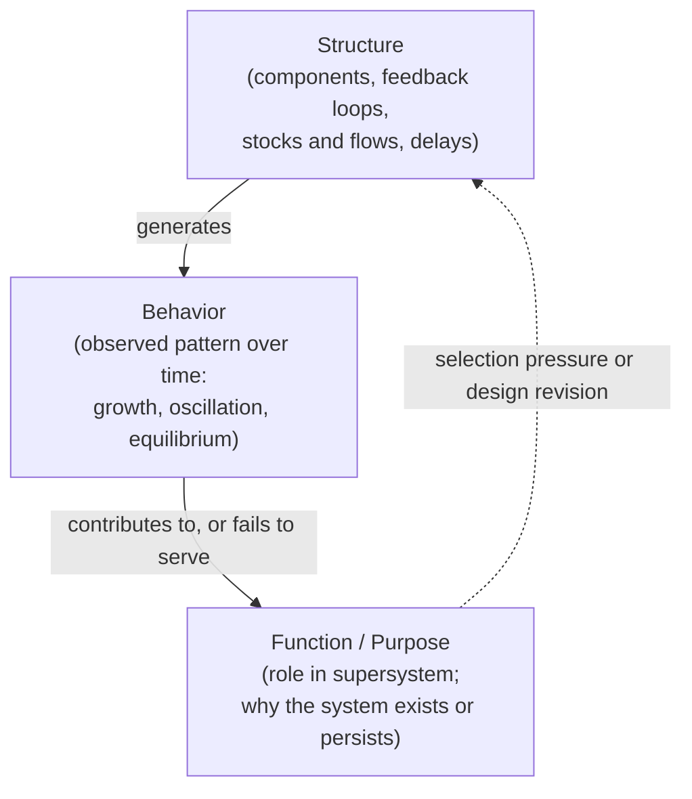

## Structure, Behavior, and Function

### Overview and Definitions

**Structure**, **behavior**, and **function** are three distinct but tightly interrelated dimensions along which any system can be described, and distinguishing them clearly is one of the more consequential conceptual tools in systems thinking, because much confused or unproductive systems analysis stems from conflating these three levels of description or from attempting to explain one purely in terms of another without recognizing the analytical gap between them.

**Key Points**

- **Structure**: the system's components and the relationships (physical, causal, informational) connecting them — the stocks, flows, feedback loops, hierarchical arrangement, and interfaces that constitute the system's internal architecture, largely independent of how the system is currently behaving at any given moment.
- **Behavior**: the pattern of change over time that a system's state variables exhibit — the trajectory of a system's stocks and outputs as a function of time, observable directly (a time-series graph of inventory levels, population size, temperature, stock price) without necessarily requiring knowledge of the underlying structure that produced it.
- **Function** (or purpose): the role the system plays, or the effect it has, within some larger context or supersystem — what the system accomplishes or contributes, often (though not always) corresponding to the reason the system was designed, selected for, or maintained.

### The Central Systems-Thinking Claim: Structure Produces Behavior

The foundational claim linking these three levels, most explicitly articulated by Jay Forrester and central to the entire System Dynamics tradition, is that **a system's structure is the primary determinant of its behavior** — that the characteristic dynamic patterns a system exhibits (growth, oscillation, equilibrium-seeking, overshoot-and-collapse) arise from its feedback-loop architecture, stock-and-flow relationships, and time delays, rather than primarily from the specific intentions, competence, or personalities of the individual actors operating within that structure.

**Key Points**

- This claim is the direct theoretical justification for the systems-thinking practice of diagramming causal loops and stock-and-flow structure *before* attempting to explain or predict a system's behavior — the diagram is treated as more explanatorily fundamental than a narrative account centered on individual decisions or events.
- The practical corollary is the systems-thinking maxim that **"if you want to change behavior, change structure, not people"** — replacing individual actors within an unchanged structural/feedback architecture typically reproduces the same characteristic behavior pattern (the same oscillations, the same policy resistance), because the structure, not the individuals, is generating that pattern.
- This does not claim structure is the *only* influence on behavior (external shocks, individual variation, and stochastic factors also matter), but that structure is generally the dominant and most tractable lever for altering a system's characteristic long-run behavior pattern, especially for recurring, systemic problems rather than one-off events.

### Diagram: The Structure-Behavior-Function Relationship (svg_diagram)

### Why the Three Levels Must Be Distinguished

**Example**

Consider two organizations with identical stated purpose ("resolve customer complaints quickly and fairly") but different internal structures: Organization A routes every complaint through a single centralized review team with no escalation delay; Organization B routes complaints through multiple sequential approval layers with built-in reporting delays at each stage. Both organizations may articulate the same function, but their differing structures will reliably produce different behavior — Organization A will exhibit fast, relatively uniform response times, while Organization B will exhibit the Forrester-Effect-like amplification and delay characteristic of multi-stage systems with feedback and reporting lag, regardless of how well-intentioned or skilled the individual employees in either organization are. Explaining Organization B's slow, uneven complaint resolution by pointing to "unmotivated employees" (an individual-level, non-structural explanation) would misdiagnose a problem that is, on inspection, a direct and predictable consequence of its structural architecture.

### Function Does Not Fully Determine Structure or Behavior

A common analytical error, sometimes called the **teleological fallacy** in systems analysis, is to assume that because a system serves (or appears to serve) a particular function, its structure must be optimally or even adequately designed to fulfill that function — inferring structure or predicting behavior directly from stated purpose while skipping analysis of the actual feedback architecture in between.

**Key Points**

- **Function is often emergent or unintended rather than designed**: a system's actual function-in-practice (what it in fact accomplishes or perpetuates) can diverge substantially from its stated or originally intended purpose — an organizational process ostensibly designed to "ensure quality" may, given its actual structure, function primarily to diffuse individual accountability, a divergence only visible by examining structure and behavior directly rather than inferring backward from stated function.
- **Multiple structures can produce similar behavior (equifinality)**: as established in Bertalanffy's open-systems theory, different structural configurations can converge on similar behavioral outcomes, meaning that observing a system's function or behavior alone is insufficient to infer its underlying structure without direct structural investigation.
- **The same structure can serve different functions in different contexts**: a feedback-control structure built to regulate temperature (a thermostat's structural architecture) is functionally general-purpose with respect to regulation, and the identical structural principle (sense error, actuate correction) is repurposed across radically different functional contexts (cruise control, blood glucose regulation, price stabilization mechanisms) — illustrating that structure and function are only loosely, not rigidly, coupled.

### Behavior Patterns as Diagnostic Signatures of Structure

Because structure is often not directly observable (particularly in social, organizational, or biological systems where the full causal architecture cannot be inspected directly), systems thinking makes extensive diagnostic use of **characteristic behavior-over-time patterns** as signatures that point toward particular classes of underlying structure — a central methodological technique in both System Dynamics practice and Donella Meadows's pedagogy of system archetypes.

**Key Points**

- **Exponential growth or decay**: a smoothly accelerating (or decelerating) curve typically signals a dominant reinforcing (or balancing) feedback loop with no significant countervailing constraint yet active.
- **S-shaped (logistic) growth**: growth that starts exponential but levels off toward a ceiling typically signals an initially dominant reinforcing loop that is progressively overtaken by a balancing loop tied to an approaching limit (e.g., carrying capacity).
- **Oscillation**: regular or irregular fluctuation around a level typically signals a balancing feedback loop operating with a significant time delay, causing the corrective action to consistently overshoot and undershoot the target rather than converging smoothly.
- **Overshoot and collapse**: growth followed by a sharp decline typically signals a reinforcing loop driving growth past a limit that a delayed balancing loop cannot correct for until damage (resource depletion, structural degradation) has already accumulated beyond recovery capacity — the World3/*Limits to Growth* signature pattern.
- **S-shaped growth with overshoot and oscillation**: growth that overshoots a limit, corrects, and then oscillates around the sustainable level typically signals a balancing loop with a moderate (rather than severe) delay, sufficient to eventually stabilize the system but with a period of correction oscillation first.

Recognizing these signature patterns allows a systems thinker to work "backward" from observed behavior to hypothesize the likely class of underlying feedback structure, which can then be tested and refined through more detailed structural modeling (e.g., building an explicit stock-and-flow or causal loop diagram) — a core diagnostic workflow in applied systems thinking.

### Structure-Behavior-Function in Biological and Evolutionary Context

The structure-function relationship carries a distinct and important nuance in evolutionary biology, which systems thinking frequently draws on by analogy: a biological structure's current function need not correspond to the selective pressure that originally produced it (**exaptation**, a concept formalized by Stephen Jay Gould and Elisabeth Vrba), meaning that inferring "why" a structure exists purely from what it currently accomplishes can be historically misleading even when the structure-produces-behavior-produces-function chain holds true at any given point in time. [Inference — this evolutionary-biology nuance is a widely used analogy in systems-thinking literature about organizational and technological path dependence, though its precise applicability to non-biological systems is an analogy rather than a directly transferable formal claim.]

### Implications for Intervention and Leverage

**Key Points**

- Because structure is the primary generator of behavior, effective and durable intervention in a problematic system generally requires identifying and altering the relevant structural elements (a dominant feedback loop, a critical time delay, a poorly designed stock-management policy) rather than merely exhorting individual actors to behave differently within an unchanged structure — the central practical payoff of the structure-behavior-function distinction, and the direct conceptual ancestor of Donella Meadows's later, more elaborated theory of leverage points.
- Function/purpose remains analytically important because it provides the criterion against which observed behavior is judged adequate or inadequate, and because misalignment between a system's actual function-in-practice and its intended or stated function is itself often the clearest available diagnostic signal that something in the structure requires closer investigation.
- Conversely, attempting to change a system's stated function or mission without addressing the structure that actually generates its behavior (a common failure mode in organizational change initiatives — rewriting a mission statement without altering incentive structures, reporting lines, or feedback loops) is a textbook instance of intervening at the wrong level of the structure-behavior-function chain, and predictably fails to produce durable change in actual system behavior.

### Related Topics

- Jay Forrester and the Origins of System Dynamics
- System archetypes and behavior-over-time diagnostic patterns
- Donella Meadows and leverage points
- Equifinality and open-systems theory (Ludwig von Bertalanffy)
- Systems, Subsystems, and Supersystems
- Causal loop diagrams and stock-and-flow modeling
- Exaptation and structure-function decoupling in evolutionary biology