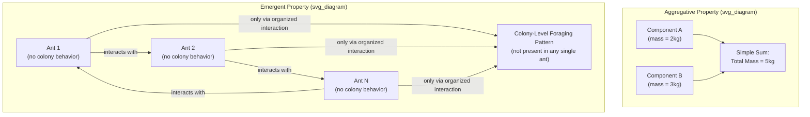

## Emergence and Emergent Properties

### Overview and Definitions

**Emergence** refers to the appearance, at the level of a whole system, of properties, patterns, or behaviors that are not possessed by the system's individual components in isolation and that are not straightforwardly deducible from a simple summation of those components' individual properties. An **emergent property** is any such system-level characteristic — wetness, consciousness, a traffic jam, an organization's culture, a market price — that exists only by virtue of the organized interaction among components, and that would not be a meaningful or applicable description of any single component considered on its own. Emergence is arguably the single most foundational concept in the entire systems-thinking tradition, providing the technical grounding for the intuitive but historically imprecise slogan "the whole is greater than the sum of its parts," and is directly inherited from Bertalanffy's General Systems Theory, given rigorous computational treatment in Santa Fe Institute-style complexity science, and invoked, in one form or another, across virtually every subsequent development in the field.

### Distinguishing Emergence from Mere Aggregation

**Key Points**

- **Resultant (aggregative) properties**: some whole-system properties are simple, additive functions of component properties and do not require any special theoretical apparatus to explain — the total mass of a system is simply the sum of its components' masses, the total revenue of a business is the sum of individual sale amounts. These are not typically what systems thinking means by "emergent," because they can be fully derived by straightforward summation without reference to how the components interact.
- **Emergent properties**: properties arising specifically from the *pattern of interaction and relationship* among components, such that the property cannot be computed by summing or averaging component-level values, and is frequently not even meaningfully attributable to any individual component — the wetness of water is not a property of individual H₂O molecules; the fluidity, transparency, and specific boiling point of liquid water arise from the collective interaction (hydrogen bonding, intermolecular forces) among vast numbers of molecules and are simply category errors to attribute to a single molecule.
- **The key distinguishing test**: an aggregative property survives decomposition (you can compute the whole's value from independently measured component values via simple arithmetic); an emergent property does not survive decomposition (measuring components in isolation, disconnected from their systemic interactions, destroys the very property in question — a single ant exhibits no "colony behavior," because colony-level foraging patterns, nest construction, and division of labor are constituted by the interaction among many ants, not present in, or measurable from, any ant considered alone).

### Diagram: Aggregation vs. Emergence (svg_diagram)

### Weak Emergence vs. Strong Emergence

A significant distinction within philosophy of science and complexity theory separates two senses in which a property can be called "emergent," with substantially different implications for whether emergent phenomena are, in principle, fully explicable from lower-level component behavior:

**Key Points**

- **Weak emergence**: the emergent property is, in principle, fully determined by and derivable from the properties and interaction rules of the lower-level components, but only through detailed simulation or computation of the actual component interactions — there is no shortcut, closed-form derivation, or simple summary rule that predicts the emergent pattern without effectively "running" the interactions; the connection to lower-level rules is unbroken in principle but practically irreducible to simple analytical prediction. Most complexity-science examples of emergence (cellular automata patterns, flocking behavior, market dynamics in agent-based models) are understood as weakly emergent: the macro pattern follows deterministically or probabilistically from the micro rules, but only simulation reveals what pattern actually results.
- **Strong emergence**: the emergent property is claimed to be genuinely irreducible to lower-level component properties and interactions even in principle — it involves, on this stronger and considerably more philosophically contested view, causal powers or properties that are not fixed by (supervenient on) the complete physical facts about the lower-level components, sometimes invoked in debates about the nature of consciousness (i.e., whether subjective experience is strongly emergent from neural activity). [Inference — strong emergence remains a genuinely disputed philosophical position, with many philosophers of mind and science skeptical that it is coherent or empirically supportable, in contrast to weak emergence, which is comparatively uncontroversial and routinely demonstrated computationally.]

Systems thinking, complexity science, and most applied uses of "emergence" in organizational, ecological, and engineering contexts rely on the weak-emergence sense: the claim is that the whole system's behavior follows from component interactions, but that this following-from is complex and irreducible to simple prediction without examining (simulating, observing, or modeling) the actual interaction structure — not a claim that some non-physical causal ingredient is added at the macro level.

### Mechanisms That Give Rise to Emergence

**Key Points**

- **Nonlinearity**: when component interactions are nonlinear (outputs not proportional to inputs), the aggregate behavior of many interacting components can differ qualitatively, not just quantitatively, from what linear extrapolation of individual component behavior would suggest, a mathematical precondition for most emergent phenomena studied in complexity science.
- **Feedback loops**: reinforcing and balancing feedback among components (see Structure, Behavior, and Function) generates system-level dynamic patterns — growth, oscillation, stabilization — that are properties of the loop structure itself, not of any individual component considered in isolation.
- **Local interaction rules producing global pattern**: as extensively studied via cellular automata and agent-based modeling (see The Santa Fe Institute and the Rise of Complexity Science), simple, purely local interaction rules with no centralized coordinating mechanism can generate elaborate, apparently coordinated global patterns — flocking/schooling behavior in birds and fish (modeled via simple local rules of alignment, cohesion, and separation, as in Craig Reynolds's "boids" model), traffic jams (arising from simple local following/braking rules with no single driver "causing" the jam), and market prices (arising from the aggregate interaction of individually simple buy/sell decisions with no central price-setting authority).
- **Self-organization**: emergent order arising spontaneously from component interactions without an external template, blueprint, or organizing agent — closely related to, and often co-occurring with, emergence, though conceptually distinct (self-organization concerns the spontaneous *origin* of order; emergence concerns the *ontological status* of the resulting whole-system properties relative to component properties).

### Emergence and Downward Causation

A philosophically and practically significant corollary of emergence is **downward causation**: once an emergent, system-level pattern or structure exists, it can causally constrain or influence the behavior of the very components whose interaction gave rise to it in the first place, creating a genuinely circular (rather than purely bottom-up) causal structure between levels.

**Example**

A traffic jam is an emergent pattern arising from the aggregate interaction of many individual drivers' local following and braking behavior; once the jam exists as a macro-level structure, it in turn constrains and determines the behavior of individual drivers entering it (forcing them to slow down, brake, and follow the jam's local density pattern) in a way that no single driver's prior behavior directly caused — the emergent pattern has become a causally efficacious constraint on the very type of component behavior that produced it. This bidirectional (bottom-up emergence, top-down constraint) causal structure is a recurring theme across biological (gene regulatory networks constrained by cell-level and organism-level states), organizational (culture emerging from and then constraining individual behavior), and ecological (ecosystem-level carrying capacity constraining individual reproduction) systems.

### Emergence in Organizational and Social Systems

**Key Points**

- **Organizational culture** is a canonical example of an emergent property in social systems thinking: it arises from the aggregate pattern of countless individual interactions, norms, and decisions over time, cannot be reduced to or fully specified by any individual employee's beliefs or behavior, and once established, exerts a powerful downward-causal influence constraining and shaping the behavior of individuals (including new members who never participated in the interactions that originally produced the culture).
- **Market prices** in economics are a classic emergent phenomenon: no single buyer or seller sets "the market price"; it emerges from the aggregate interaction of many individually simple supply and demand decisions, and once established, feeds back to constrain and inform the decisions of the very buyers and sellers who collectively produced it — a dynamic extensively formalized in complexity economics (see The Santa Fe Institute and the Rise of Complexity Science).
- **Collective intelligence and "swarm" phenomena**: emergent group-level problem-solving or decision-making capability (e.g., ant colony foraging optimization, crowd wisdom in prediction markets) that exceeds what any individual member could achieve alone, widely studied both as a natural phenomenon and as an engineering design principle (swarm robotics, distributed computing architectures inspired by emergent coordination).

### Practical and Analytical Implications for Systems Thinkers

**Key Points**

- **Emergence implies limits to purely reductionist analysis**: because emergent properties are not derivable from component-level analysis alone, systems thinking insists that understanding a system's whole-level behavior generally requires studying the system's interaction structure directly (via simulation, modeling, or direct observation of the whole), not merely aggregating detailed knowledge of each component in isolation — the core methodological justification, alongside structure-produces-behavior, for treating whole-system modeling as indispensable rather than a shortcut substitute for exhaustive component-level analysis.
- **Emergent properties are often difficult to predict in advance of construction or intervention**: because weak emergence typically requires simulating or observing actual interactions to reveal the resulting pattern, designers and policymakers frequently cannot fully anticipate a complex system's emergent behavior purely from its design specification, motivating iterative, adaptive management approaches (prototype, observe emergent behavior, adjust) over purely predictive, one-shot design approaches, especially in social, ecological, and organizational systems.
- **Caution against reifying emergent properties as independent entities**: while emergent properties are real and causally significant (via downward causation), systems thinking generally treats them as still fully constituted by, and dependent on, the ongoing pattern of component interaction — an emergent property is not a free-floating additional "thing" added on top of the system, but a genuine, though non-reducible-to-simple-summation, feature of how the components are organized and interacting, a distinction relevant to avoiding both naive reductionism and unwarranted mysticism about emergent wholes.

### Related Topics

- General Systems Theory and Ludwig von Bertalanffy
- The Santa Fe Institute and the Rise of Complexity Science
- Structure, Behavior, and Function
- Self-organization and self-organized criticality
- Downward causation and multi-level causal structure
- Agent-based modeling and cellular automata
- Complexity economics and emergent market prices
- Systems, Subsystems, and Supersystems