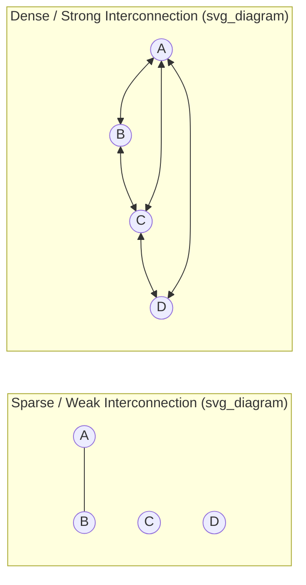

## Interconnection and Interdependence

### Overview and Definitions

**Interconnection** refers to the existence of a relationship — a channel through which matter, energy, or information can flow — linking two or more components of a system. **Interdependence** is the stronger and more consequential condition in which components' states or behaviors are mutually influenced by, and reliant upon, one another through these interconnections, such that a change in one component's state propagates, via the interconnection, to affect the state or behavior of the connected component(s), potentially with reciprocal effects flowing back. Where "system" names the bounded whole and "emergence" names a property of that whole, interconnection and interdependence name the relational substrate — the actual channels and mutual dependencies — that make a collection of elements a system at all, rather than a mere unrelated aggregate.

**Key Points**

- **Interconnection is necessary but not sufficient for interdependence**: two components can be connected (a channel exists) without being significantly interdependent (the channel carries negligible influence, or influence flows in only one direction with no consequential feedback) — a weak, low-bandwidth, or one-way connection is qualitatively different from a strong, bidirectional, consequential dependency, even though both technically qualify as "interconnection."
- **Directionality matters**: an interconnection may be **unidirectional** (A influences B, but not vice versa) or **bidirectional/reciprocal** (A and B mutually influence each other) — bidirectional interconnection is the structural precondition for feedback loops, and therefore for the reinforcing and balancing dynamics central to System Dynamics and cybernetic analysis.
- **Strength and delay of interdependence vary continuously**: interdependence is not binary but graded, characterized by the magnitude of influence transmitted (how much a change in A affects B) and the time delay over which that influence is transmitted — both properties with substantial consequences for system behavior, as established in the discussion of Jay Forrester's stock-and-flow modeling and the role of delays in generating oscillation and overshoot.

### Interconnection as the Foundation of Systemhood

Bertalanffy's foundational definition of a system as "elements standing in interrelation" places interconnection at the very center of what distinguishes a system from a mere collection or pile of unrelated objects. A heap of sand grains, considered purely as isolated particles with no meaningful mutual influence on each other's position or behavior, is not usefully treated as a system in the systems-thinking sense; the same sand, however, when its grains' positions and stability become interdependent through gravitational and frictional interaction (as in a sandpile approaching a critical angle, per Per Bak's self-organized criticality work), becomes a genuine system exhibiting systemic (emergent, threshold, cascading) behavior precisely because interdependence, not mere physical proximity, has been established among its components.

### Diagram: Weak vs. Strong Interconnection Structures (svg_diagram)

### Types of Interdependence

A classic and enduringly useful taxonomy from organizational theory (James D. Thompson, *Organizations in Action*, 1967) distinguishes three qualitatively different patterns by which components can be interdependent, each with different implications for how tightly coordination must be managed and what kind of coordinating mechanism is required:

**Key Points**

- **Pooled interdependence**: each component contributes separately to, and draws separately from, a common shared resource or outcome, without directly interacting with other components — multiple bank branches drawing on a shared central capital pool are pooled-interdependent; failure or change in one branch affects the shared pool available to others, but branches do not directly interact with each other. Coordination requirement: relatively low; standardized rules governing access to the shared resource typically suffice.
- **Sequential interdependence**: the output of one component becomes the direct input of the next in a defined, one-directional sequence — an assembly line, or the sequential stages of Forrester's supply-chain model (retailer → wholesaler → distributor → factory) are sequentially interdependent. Coordination requirement: moderate; planning and scheduling mechanisms are needed to ensure each stage's output matches the next stage's input requirements, but the causal direction of dependency is one-way at each link (though information/orders may flow back upstream).
- **Reciprocal interdependence**: components' outputs become each other's inputs in a genuinely bidirectional, iterative fashion — two departments that continuously exchange partially completed work back and forth (e.g., design and engineering teams iterating on a product), or ecologically, predator and prey populations whose dynamics are mutually determining, are reciprocally interdependent. Coordination requirement: highest; typically requires rich, frequent, often synchronous communication (mutual adjustment) rather than standardized rules or fixed schedules, because neither party's next action can be fully planned in advance without up-to-date information about the other's current state.

Thompson's central practical claim — directly relevant to organizational and systems design — is that the appropriate coordination mechanism must match the type of interdependence present: applying a coordination mechanism suited to pooled interdependence (simple shared rules) to a genuinely reciprocally interdependent relationship will produce coordination failures, because rule-based coordination cannot adequately handle the continuous mutual adjustment reciprocal interdependence requires.

### Interconnection Density, Network Structure, and System Robustness

Building on network science's formal treatment of interconnection patterns (see The Santa Fe Institute and the Rise of Complexity Science), the overall **topology** of interconnections across a system's many components — not merely the existence of individual connections — has significant, often counterintuitive, consequences for system-level behavior:

**Key Points**

- **Highly interconnected (dense) systems** tend to propagate influence, information, and disturbance rapidly across the whole system, which can enable fast coordination and information-sharing but also creates greater vulnerability to cascading failure, since a disruption at any single well-connected node can rapidly reach much of the rest of the system — a dynamic extensively studied in financial-contagion research following the 2008 financial crisis, where dense interbank interconnection was identified as a key mechanism amplifying the crisis's systemic spread. [Inference — the precise quantitative relationship between interconnection density and systemic fragility remains an active area of network-science and financial-economics research, with some findings suggesting interconnection can also dampen shocks under certain conditions (risk-sharing) rather than only amplifying them.]
- **Scale-free networks** (Barabási-Albert model), characterized by a small number of highly connected "hub" nodes and many sparsely connected nodes, exhibit a distinctive robustness profile: they are highly resilient to random node failure (since most nodes are peripheral and their loss barely affects overall connectivity) but highly vulnerable to targeted removal of hub nodes (whose loss can fragment the network's connectivity dramatically) — a structural property with direct relevance to critical-infrastructure protection, epidemic control (targeting high-degree "superspreader" nodes), and organizational design (identifying and protecting/redundantly backing up highly connected key personnel or systems).
- **Modularity**: networks organized into densely interconnected clusters (modules) with comparatively sparse interconnection between clusters tend to localize the impact of disturbances within a module, trading some efficiency of system-wide information/resource flow for containment of cascading failures — directly related to the loose-coupling strategies discussed in relation to subsystem interfaces, and a recurring engineering and organizational design principle for managing the fragility risks of dense interdependence.

### Interdependence, Feedback, and the Origins of Systemic Behavior

Interdependence is the structural precondition without which feedback loops — the central explanatory mechanism throughout cybernetics and System Dynamics — cannot exist: a feedback loop requires, by definition, a bidirectional (reciprocal) chain of interdependence in which a variable's own state eventually influences, via some causal pathway through other interconnected variables, its own subsequent state. Recognizing where genuine reciprocal interdependence exists (as opposed to superficially similar but actually unidirectional or merely pooled relationships) is therefore a critical diagnostic step in constructing accurate causal loop diagrams and stock-and-flow models, since misidentifying a merely sequential or pooled relationship as a full feedback loop (or vice versa) leads directly to structurally incorrect system models.

**Example**

In an ecosystem, a predator population and a prey population exhibit reciprocal interdependence: prey abundance influences predator reproduction and survival (more prey → more successful predator reproduction), while predator abundance influences prey mortality (more predators → higher prey mortality), which in turn feeds back to affect future predator population levels — the classic Lotka-Volterra predator-prey dynamic. Analyzing only the predator's effect on prey (treating it as a one-way, sequential dependency) while ignoring the reciprocal effect of prey abundance on predator population would miss the oscillatory dynamic that reciprocal interdependence with delay characteristically produces, and would misrepresent a genuinely coupled feedback system as a simple linear causal chain.

### Practical and Analytical Implications

**Key Points**

- **Mapping interconnections is a prerequisite for accurate systems modeling**: before feedback loops, stocks, or flows can be correctly diagrammed, the underlying pattern of interconnection and interdependence among the relevant variables must be identified — errors at this mapping stage (missing a genuine interdependence, or assuming interdependence where none meaningfully exists) propagate directly into flawed downstream models.
- **Interdependence implies limits to independent optimization**: because interdependent components mutually influence one another, optimizing any single component's performance in isolation, without accounting for its interdependencies with other components, risks degrading overall system performance — a systems-thinking generalization of the economic concept of externalities, and a recurring theme in the boundary-judgment literature (see Boundaries and Boundary Judgments) regarding the risks of narrowly bounded local optimization.
- **Interdependence complicates attribution of causality and responsibility**: in richly interdependent systems, especially those with reciprocal interdependence and feedback, it is often genuinely difficult (and sometimes a matter of contested interpretation rather than objective fact) to assign a single "root cause" to an outcome, since the outcome may be co-determined by mutual, ongoing influence among multiple interdependent components rather than traceable to any single originating event — a consideration with significant practical implications in fields such as accident investigation, policy evaluation, and organizational post-mortems.

### Related Topics

- General Systems Theory and Ludwig von Bertalanffy
- Structure, Behavior, and Function
- Emergence and Emergent Properties
- James D. Thompson's typology of interdependence in organizational theory
- Network science: scale-free networks and hub vulnerability
- Feedback loops and causal loop diagramming
- Tight vs. loose coupling and Charles Perrow's Normal Accident Theory
- Lotka-Volterra predator-prey dynamics