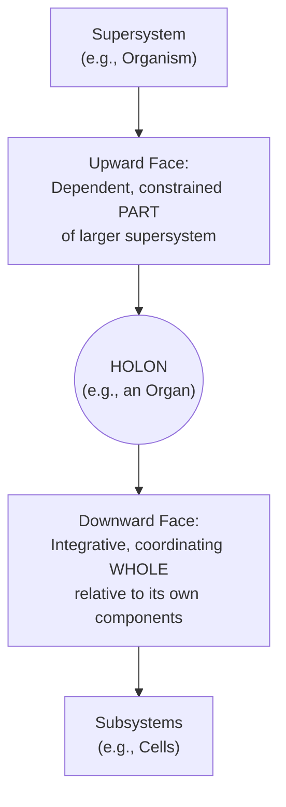

## Hierarchy and Holons

### Overview and Definitions

**Hierarchy**, in the systems-thinking sense already introduced under Systems, Subsystems, and Supersystems, refers to the nested organization of systems within systems, with each level exhibiting emergent properties relative to the level below and being constrained by the level above. The concept of the **holon** — coined by Hungarian-British author and polymath Arthur Koestler in his 1967 book *The Ghost in the Machine* — provides a more precise and philosophically refined vocabulary for describing the units that compose such hierarchies, addressing a persistent conceptual difficulty in earlier systems-hierarchy language: the terms "whole" and "part" are inherently relative and context-dependent (an entity is a "whole" relative to its own components but simultaneously a "part" relative to the larger system containing it), and ordinary language lacks a single word capturing this dual, simultaneously-whole-and-part status. Koestler coined "holon" (from the Greek *holos*, "whole," plus the suffix *-on*, suggesting a particle or part, as in "proton" or "neutron") to name precisely this dual nature.

### The Holon: Simultaneously Whole and Part

**Key Points**

- A **holon** is any entity that is simultaneously a complete, coherent whole in its own right (possessing internal structure, integrity, and, often, some degree of self-regulating autonomy) and a dependent part embedded within, and contributing to, some larger encompassing whole.
- Every holon (except at the very top and very bottom of a given hierarchy, if such limits even exist) exhibits this **Janus-faced** character (Koestler's own term, referencing the Roman god with two faces looking in opposite directions): one "face" looks downward/inward toward its own constituent parts, over which it exercises integrative, coordinating control, and the other "face" looks upward/outward toward the larger systems of which it is a dependent, constrained member.
- Koestler proposed the holon concept specifically to replace what he considered a false, exhaustive dichotomy in earlier philosophical and scientific discourse between purely "wholes" (implying self-sufficient, non-relational entities) and purely "parts" (implying entities lacking internal coherence or autonomy) — in his account, essentially nothing in biological, psychological, or social reality is a pure whole or a pure part; everything of theoretical interest is a holon, exhibiting both aspects at once, to varying degrees and in varying combinations.

### Diagram: The Janus-Faced Holon (svg_diagram)

### Holarchy: Hierarchies of Holons

Koestler proposed the term **holarchy** for a hierarchical arrangement composed specifically of holons at each level — distinguishing holarchies from simpler, non-holonic hierarchies (such as a strict command hierarchy or containment structure with no meaningful semi-autonomy at intermediate levels) by emphasizing that each level in a genuine holarchy possesses its own internal coherence, partial self-regulation, and stability, rather than being a merely passive, fully determined subdivision of the level above.

**Key Points**

- A biological organism is a canonical holarchy: an organ is a holon (a coherent, internally regulated whole composed of cells, and simultaneously a dependent part of the organism); a cell is itself a holon (a coherent whole composed of organelles, and simultaneously a dependent part of the organ/tissue); an organelle is a holon relative to its own molecular constituents — the holarchy extends across many levels, with each level exhibiting genuine partial autonomy (a cell can, to a degree, maintain its own internal homeostasis somewhat independent of the immediate state of the whole organ) alongside genuine dependence (the cell cannot survive or function entirely independent of its supporting tissue and organism-level physiological support).
- Social and organizational holarchies exhibit the same structure: an individual employee is a holon (a coherent whole with their own internal goals, capacities, and partial autonomy, and simultaneously a dependent part of a team); a team is a holon relative to a department; a department is a holon relative to the whole organization — each level exercising genuine, if bounded, self-regulating coherence while remaining dependent on, and constrained by, the level(s) above.

### Stability of Holarchies: Koestler's Argument from Evolvability

Koestler's argument for why holarchic organization is pervasive in biological and social reality closely parallels, and was developed independently of, Herbert Simon's near-decomposability argument (discussed under Systems, Subsystems, and Supersystems): holarchic (hierarchically nested, semi-autonomous) systems are more evolutionarily and developmentally stable than equivalent non-hierarchical systems of the same overall complexity, because each holon can maintain a degree of internal stability and continue functioning somewhat independently even when disturbances or changes occur at other levels or in other branches of the holarchy — a genuinely non-hierarchical system of comparable complexity, lacking stable intermediate holons, would be far more fragile to perturbation, since there would be no stable intermediate-level structures to "absorb" and locally contain disturbances rather than propagating them catastrophically through the entire system.

**Example**

Consider the difference between an organism (a holarchy of organs, tissues, cells, and organelles, each capable of a degree of independent function and localized repair) versus a hypothetical non-hierarchical biological system in which every molecule's function depended equally and directly on every other molecule's simultaneous correct state, with no intermediate stable structures. Damage to a small number of cells in an organ, in the actual holarchic case, can typically be locally contained, repaired, or compensated for by neighboring cells and the organ's own regulatory mechanisms without catastrophically destabilizing the entire organism; in the hypothetical non-holarchic case, comparable localized damage would have no natural containment boundary and could propagate destructively through the entire undifferentiated system — directly illustrating why holarchic organization, wherever it is found, tends to confer substantial evolutionary and functional advantage in robustness and repairability, echoing Herbert Simon's watchmaker parable from a biological rather than manufacturing perspective.

### Autonomy and Integration: The Holon's Dual Tendencies

Koestler further characterized each holon as subject to two simultaneous, potentially competing tendencies, which he termed the **self-assertive (agency) tendency** and the **integrative (communion) tendency**:

**Key Points**

- **Self-assertive/agency tendency**: the holon's disposition to preserve its own individual autonomy, integrity, and distinctness — to maintain its own internal organization and resist being fully absorbed or dissolved into the encompassing whole; corresponds to the holon's "whole-facing" (downward-integrating, self-regulating) aspect.
- **Integrative/communion tendency**: the holon's disposition to function as a cooperative, subordinate, and contributing part of the larger whole, coordinating with and submitting some of its behavior to the requirements of the encompassing system; corresponds to the holon's "part-facing" (upward-constrained, contributing) aspect.
- Pathology, on Koestler's account, arises when either tendency becomes excessively dominant relative to the other: excessive self-assertion at the expense of integration produces a holon that behaves as an unconstrained, disruptive, cancer-like entity relative to its encompassing whole (Koestler explicitly used cancer, in which cells lose the normal integrative constraints coordinating them with the rest of the organism, as his paradigmatic biological illustration); excessive integration at the expense of self-assertive autonomy produces a holon so fully subordinated that it loses its own internal coherence, regulatory capacity, and adaptive flexibility, potentially undermining the very robustness that holarchic organization is meant to confer. [Inference — Koestler's application of this dual-tendency framework beyond the biological cases he emphasized (e.g., directly to organizational or social pathology) is a widely cited extension in later systems-thinking and organizational-theory literature, but represents an interpretive application of Koestler's original biological framework rather than a claim Koestler himself rigorously formalized outside the biological domain.]

### Holon Theory's Influence on Ken Wilber and Integral Theory

Koestler's holon concept was substantially taken up and extended by philosopher Ken Wilber in his **Integral Theory**, which uses "holon" as a foundational ontological unit applicable across physical, biological, psychological, and cultural domains, and proposes several general "tenets" (laws) governing holons — including the claim that holons at higher levels of a holarchy possess greater depth (internal complexity/consciousness) but encompass a comparatively narrower span (fewer instances exist at higher levels) — extending Koestler's originally more narrowly biological/psychological concept into a comprehensive, and considerably more speculative and philosophically contested, general ontology. [Inference — Wilber's Integral Theory extension of holon theory is a substantially more speculative and philosophically contested framework than Koestler's original, comparatively modest formulation, and is generally treated in mainstream systems-science literature as a distinct, more philosophically ambitious offshoot rather than a standard or uncontroversial extension of core systems-thinking holon theory.]

### Practical Applications in Organizational Design: Holacracy

The holon/holarchy concept directly inspired **Holacracy**, a formal organizational governance system developed by Brian Robertson (first codified around 2007), which structures an organization as a nested hierarchy of semi-autonomous "circles" (teams), each circle possessing meaningful decision-making authority and internal self-governance over its own domain (the self-assertive/agency aspect of holonic organization) while remaining accountable to, and coordinated with, the encompassing circles of which it is a part (the integrative/communion aspect) — an explicit, named attempt to operationalize Koestler's holon concept as a practical alternative to conventional top-down command hierarchies, aiming to preserve the robustness and adaptive benefits of holarchic organization (localized authority and repair capacity, reduced fragility to central-point failure) within a formal organizational governance structure.

### Relationship to Other Systems-Thinking Concepts

The holon concept synthesizes and sharpens several ideas developed independently elsewhere in the systems-thinking canon: it gives precise philosophical vocabulary to the whole/part relativity already implicit in the systems/subsystems/supersystems hierarchy, provides a biologically and organizationally grounded rationale — parallel to but independently derived from Herbert Simon's near-decomposability argument — for why hierarchical/holarchic organization confers evolutionary and functional robustness, and anticipates, in its self-assertive/integrative tension, later systems-thinking and organizational-theory discussions of the trade-off between local autonomy and centralized coordination.

### Related Topics

- Systems, Subsystems, and Supersystems
- Herbert Simon and near-decomposability ("The Architecture of Complexity")
- Structure, Behavior, and Function
- Emergence and Emergent Properties
- Holacracy and self-organizing organizational governance
- Tight vs. loose coupling and system robustness
- Ken Wilber's Integral Theory (as an extension of holon theory)