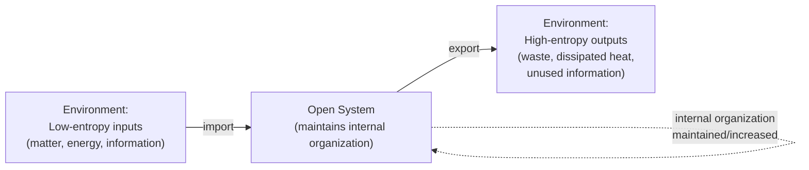

## Open versus Closed Systems

### Overview and Definitions

The distinction between **open** and **closed** systems, introduced in the discussion of Ludwig von Bertalanffy's General Systems Theory, is sufficiently foundational to the entire systems-thinking vocabulary that it merits treatment as a standalone core concept in its own right, with attention to its precise thermodynamic origins, its several distinct senses across different disciplines, and its practical implications for systems modeling and analysis.

**Key Points**

- A **closed system** exchanges energy, but not matter, with its environment (the standard thermodynamic sense), or, in a stricter sense sometimes used in systems theory, exchanges neither matter nor energy with its environment at all (an **isolated system**) — closed systems are governed by the second law of thermodynamics, tending inexorably toward maximum entropy (thermodynamic equilibrium) and, once there, are incapable of spontaneous further change or self-reorganization.
- An **open system** continuously exchanges both matter and energy (and, in later cybernetic and information-theoretic extensions, information) with its environment, and can, as a result, maintain or even increase its internal organization over time by importing usable energy/matter/information and exporting waste/entropy/disorder to its environment — the structural precondition for the maintained, non-equilibrium **steady state** (Bertalanffy's *Fliessgleichgewicht*) characteristic of all living systems.

### The Thermodynamic Foundation

The open/closed distinction originates in classical thermodynamics' formal classification of systems by what crosses their boundary:

| System Type | Matter Exchange | Energy Exchange | Governing Tendency |
| --- | --- | --- | --- |
| Isolated system | None | None | Entropy strictly non-decreasing; approaches maximum entropy (equilibrium) and remains there |
| Closed system | None | Yes | Entropy of the system alone may decrease locally only if compensated by a greater entropy increase transferred to the environment via energy exchange; without ongoing matter exchange, cannot sustain long-run organization-building processes requiring continuous material renewal |
| Open system | Yes | Yes | Can maintain or increase local organization indefinitely (decreasing local entropy) by continuously importing low-entropy matter/energy and exporting high-entropy waste, provided the environment can supply the input and absorb the output — total entropy of system-plus-environment still obeys the second law, but the environment, not the system alone, is where entropy increase is realized |

Bertalanffy's key theoretical move, discussed in detail under General Systems Theory, was recognizing that living organisms are open systems in this strict thermodynamic sense, and that this — not any vitalistic special force — fully accounts for their capacity to build and maintain complex organization in apparent (but not actual) defiance of the second law of thermodynamics: the organism's local entropy decrease is thermodynamically legitimate precisely because it is continuously paid for by a larger entropy increase exported to the environment.

### Diagram: Open System Matter/Energy/Information Exchange (svg_diagram)

### Open and Closed Systems in Systems Engineering and Modeling Practice

Beyond the strict thermodynamic sense, the open/closed distinction is used, with a related but distinct meaning, in systems engineering and general systems-modeling practice to describe the degree to which a system's boundary is treated as permeable to environmental influence for modeling purposes:

**Key Points**

- **Closed-system modeling assumption**: the analyst treats the system as isolable from its environment for the purposes of the analysis — a simplifying assumption often adopted for tractability, valid when environmental influences are genuinely negligible or nearly constant over the relevant time horizon, but a significant source of model error when applied to systems with substantial external interdependence.
- **Open-system modeling assumption**: the analyst explicitly represents exchange with the environment (external inputs, disturbances, exports) as an integral part of the model — the default and generally more defensible modeling stance for social, organizational, ecological, and biological systems, where boundary-crossing exchange with the environment is rarely negligible over any meaningfully long time horizon.
- This modeling-level open/closed distinction is closely related to, but conceptually distinct from, the boundary-judgment discussion (see Boundaries and Boundary Judgments): choosing to model a system as "closed" for a given analysis is itself a boundary judgment, one that implicitly asserts environmental exchange is negligible for the purpose at hand — an assertion that itself deserves explicit scrutiny rather than being adopted purely as a default simplifying convenience.

### Consequences of the Open/Closed Distinction for System Behavior

**Key Points**

- **Equifinality is possible only in open systems**: as established under General Systems Theory, the capacity to reach the same final state from different initial conditions or via different paths (equifinality) depends on the system's ongoing, corrective exchange with its environment; a closed, deterministic system's trajectory is uniquely fixed by its initial conditions and internal dynamics alone, precluding this kind of path-independent convergence.
- **Only open systems can exhibit sustained growth, development, or increasing complexity**: a closed or isolated system's entropy can only increase (or, at best, remain constant), precluding any sustained increase in organized complexity; only continuous import of usable energy/matter/information, characteristic of open systems, can fund the thermodynamic "cost" of building and maintaining increasingly complex organization over time — this is why developmental, evolutionary, and growth phenomena in living and social systems are, without exception, phenomena of open rather than closed systems.
- **Closed-system equilibrium is qualitatively different from open-system steady state**: as discussed under General Systems Theory, a closed system's equilibrium is a terminal, static end-state incapable of spontaneous further activity, whereas an open system's steady state is an actively maintained dynamic condition, continuously "paid for" by ongoing throughput, that can be disturbed and re-established, or can itself evolve into a qualitatively different steady state, in ways a closed system's true equilibrium cannot.
- **Environmental dependency and vulnerability**: because open systems depend on continuous environmental exchange to maintain their organization, they are correspondingly vulnerable to disruption of that exchange (resource scarcity, blocked waste-export pathways, disrupted information flow) in ways that a hypothetically isolated system, having no such dependency, would not be — a vulnerability directly relevant to the discussion of interdependence, interconnection density, and systemic fragility (see Interconnection and Interdependence).

### Boundary Permeability as a Graded, Selective Property

**Key Points**

- Real system boundaries are rarely uniformly open or closed to all forms of exchange; boundary permeability is typically **selective**, permitting certain kinds of matter, energy, or information to cross more readily than others — a biological cell membrane is highly permeable to some molecules and highly impermeable to others; an organization's boundary may be quite open to information exchange (industry news, market data) while being comparatively closed to certain resource flows (proprietary technology, specific personnel).
- **Semi-permeability as a design and analytical variable**: the degree and selectivity of boundary permeability is frequently a consequential design choice (in engineered systems) or an evolved/emergent characteristic (in biological and social systems) that significantly shapes system behavior — a system that is too permeable to disturbance risks losing coherent internal organization (excessive vulnerability to environmental noise or intrusion); a system that is too impermeable risks losing access to the resources, information, or renewal it needs to adapt and persist (stagnation, obsolescence, or eventual internal entropy increase despite nominal "open" status if actual exchange volume becomes too low to sustain organization).
- This selective-permeability perspective connects directly to Ashby's Law of Requisite Variety (see W. Ross Ashby and the Law of Requisite Variety): a system's boundary permeability determines which disturbances actually reach the system's regulatory mechanisms, meaning boundary permeability and internal regulatory variety jointly, rather than either alone, determine a system's overall capacity to maintain organization against environmental disturbance.

### Common Misapplications and Clarifications

**Key Points**

- **"Closed" does not mean "isolated from all influence" in ordinary systems-engineering usage**: a system described as "closed-loop" in control-engineering language (referring to the presence of a feedback loop, as in "closed-loop control system") uses "closed" in a third, distinct sense — referring to the closure of the feedback *circuit* (output routed back to influence input) — entirely unrelated to the thermodynamic open/closed distinction; this terminological overlap is a frequent and understandable source of confusion for newcomers to systems and control vocabulary and should be disambiguated carefully by context.
- **No real-world system is perfectly closed or perfectly open**: the open/closed distinction functions best as a spectrum or an idealized limiting case for analytical purposes rather than as a strict binary applicable without qualification to real-world systems, essentially all of which exhibit some degree of both bounded internal organization and some (even if minimal) environmental exchange.
- **Openness is necessary but not sufficient for adaptive or intelligent behavior**: a system can be thermodynamically open (exchanging matter and energy) while still exhibiting simple, non-adaptive, non-intelligent behavior (e.g., a candle flame is a thermodynamically open, dissipative system maintaining a steady-state structure through continuous fuel/oxygen throughput, but exhibits none of the goal-seeking, informationally-regulated behavior characteristic of cybernetic or biological systems) — openness is the thermodynamic precondition for organization-maintenance, but the additional presence of information-based feedback regulation (see Purpose and Goal-Seeking Behavior) is required for the more specifically cybernetic and biological phenomena systems thinking is typically most interested in.

### Related Topics

- General Systems Theory and Ludwig von Bertalanffy
- Cybernetics and Norbert Wiener
- Boundaries and Boundary Judgments
- W. Ross Ashby and the Law of Requisite Variety
- Dissipative structures and Ilya Prigogine's nonequilibrium thermodynamics
- Interconnection and Interdependence
- Equifinality and multifinality in open-systems theory