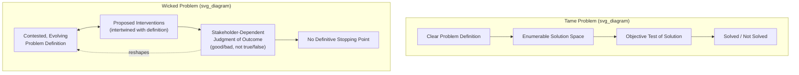

## Wicked Problems and Their Characteristics

### Overview and Historical Context

The concept of a **wicked problem** was introduced by design theorist Horst Rittel and planner Melvin Webber in their influential 1973 paper "Dilemmas in a General Theory of Planning," written in the context of urban and social policy planning, to name a class of problems that systematically resist the kind of well-structured, technically solvable treatment characteristic of engineering and the natural sciences. Rittel and Webber's central claim was that many of the most consequential problems facing planners and policymakers — poverty, crime, urban decay, environmental degradation — are not merely *difficult* versions of ordinary technical problems (which they termed "tame" problems) but belong to a fundamentally different category, for which the very idea of a definitive, verifiable "solution" is conceptually inapplicable.

### Tame Problems versus Wicked Problems

**Key Points**

- **Tame problems**: well-structured problems with a clear, agreed-upon definition, a determinable set of possible solutions, and an objective test (or a small number of competing objective tests) for whether a proposed solution actually solves the problem — a mathematical equation, a bridge-load calculation, or a chess puzzle are canonical tame problems: the problem statement is stable, the solution space is well-defined, and success or failure is unambiguous once a solution is tried.
- **Wicked problems**: ill-structured problems lacking a definitive formulation, where the very act of understanding the problem is entangled with proposing and evaluating potential solutions, where no objective test of a "correct" solution exists (only better or worse outcomes, judged differently by different stakeholders), and where each attempted intervention changes the problem itself, precluding trial-and-error learning of the sort tame problems permit.
- Rittel and Webber's core diagnosis was that planners had inherited from engineering and the natural sciences an inappropriate "tame problem" mindset and toolkit, applying it to inherently wicked social-planning problems, and that this category mismatch was a significant, underappreciated source of planning failure.

### Rittel and Webber's Ten Defining Characteristics

Rittel and Webber's original 1973 paper specified ten distinguishing properties of wicked problems, which remain the canonical reference formulation cited throughout subsequent systems-thinking and policy-design literature:

**Key Points**

1. **There is no definitive formulation of a wicked problem.** Understanding the problem and formulating a solution are not sequential steps but are inextricably intertwined — you cannot fully state the problem without already having a notion of the solution space, because the problem statement itself reflects a particular framing/perspective on what needs to change.
2. **Wicked problems have no stopping rule.** Because there is no definitive problem formulation, there is no definitive test for when the problem has been "solved" — work on a wicked problem typically ends not because a solution has been objectively verified, but because resources, patience, or political will run out, or because stakeholders judge the situation adequately improved for present purposes.
3. **Solutions to wicked problems are not true-or-false but good-or-bad.** Because different stakeholders hold different values and interests, judgments of a proposed intervention's adequacy are inherently plural and contestable rather than objectively verifiable — there is no single, universally agreed criterion against which a solution's correctness can be checked.
4. **There is no immediate or ultimate test of a solution to a wicked problem.** Because interventions in complex social systems produce ripple effects (see Interconnection and Interdependence) extending indefinitely into the future and across many affected parties, the full consequences of any intervention can never be conclusively assessed at any fixed point in time — waves of consequences continue to unfold long after the intervention is judged (prematurely) complete.
5. **Every implemented solution to a wicked problem has consequences that cannot be undone.** Unlike a tame problem (a mathematical proof can be erased and retried), interventions in social systems are frequently irreversible — a demolished neighborhood cannot be reassembled, a policy's social effects cannot be cleanly reversed — meaning every attempted solution is simultaneously a costly, high-stakes, one-shot "trial" rather than a low-cost experiment.
6. **Wicked problems do not have an exhaustively describable set of potential solutions, nor a well-described set of permissible operations for incorporating into the plan.** There is no way to enumerate, even in principle, "all" possible interventions, in contrast to a tame problem's well-defined solution space — creative, previously unconsidered interventions remain perpetually possible.
7. **Every wicked problem is essentially unique.** Despite superficial similarities across cases (two "similar" urban poverty problems in different cities), the specific configuration of local context, stakeholders, history, and constraints means that solutions successful elsewhere cannot be mechanically transplanted with confidence of similar success.
8. **Every wicked problem can be considered a symptom of another problem.** Wicked problems are typically embedded within, and causally entangled with, other wicked problems at higher or adjacent levels of a system hierarchy (see Systems, Subsystems, and Supersystems), such that addressing one inevitably raises, or is entangled with, others — poverty is entangled with education, which is entangled with housing, which is entangled with employment, with no natural, self-contained stopping point for the analysis.
9. **The existence of a discrepancy representing a wicked problem can be explained in numerous ways; the choice of explanation determines the nature of the problem's resolution.** Because a wicked problem's very characterization depends on which causal narrative and which stakeholder perspective is adopted (directly connecting to the boundary-judgment discussion — see Boundaries and Boundary Judgments), different, mutually incompatible explanations of "what the problem really is" lead to substantively different, non-overlapping intervention strategies, with no neutral, purely technical way to adjudicate among these competing framings.
10. **The planner has no right to be wrong.** Unlike a scientist or engineer, who is expected and permitted to test hypotheses that may fail as part of a legitimate, low-stakes learning process, a planner intervening in a wicked social problem is held accountable for the real, often irreversible, consequences of the interventions they recommend, since those interventions are typically implemented at real cost and with real, sometimes severe, effects on real people's lives.

### Diagram: Tame Problem vs. Wicked Problem Structure (svg_diagram)

### Illustrative Example

**Example**

Homelessness is a frequently cited wicked problem exhibiting essentially all ten characteristics: whether it is framed primarily as a housing-supply problem, a mental-health and addiction problem, an economic/labor-market problem, or a social-policy/welfare-system problem (characteristic 9) leads to entirely different, non-overlapping proposed interventions (build more housing; expand mental-health services; raise minimum wages; reform welfare eligibility), each championed by different stakeholders whose underlying values and interests differ (characteristic 3); no single metric definitively establishes when the "problem" is solved, since local reductions in visible homelessness might reflect genuine improvement, displacement to another area, or undercounting (characteristic 2); any large-scale intervention (e.g., large public-housing construction) produces long-lasting, difficult-to-reverse effects on urban form and social composition (characteristics 4 and 5); and homelessness is deeply entangled with, and could equally be described as a symptom of, housing-market dynamics, mental-health-system capacity, and broader economic inequality (characteristic 8) — illustrating why no single agency or single-lever intervention can be expected to "solve" it in the tame-problem sense, and why the term is now standard in public-policy and organizational-strategy discourse for such deeply entangled, contested, multi-stakeholder problem situations.

### Wicked Problems and Systems Thinking Methodology

**Key Points**

- Wicked problems provide the primary motivating case for **soft**, participatory systems-thinking methodologies (Peter Checkland's Soft Systems Methodology, Werner Ulrich's Critical Systems Heuristics — see Boundaries and Boundary Judgments) as distinct from the "hard," optimization-oriented methodologies of classical Operations Research and systems engineering, precisely because wicked problems' characteristics (no definitive formulation, contested values, no objective test of solution) render the assumptions underlying hard-systems optimization (a fixed, well-specified problem with a determinable optimum) inapplicable.
- The systems-thinking response to wicked problems generally emphasizes **iterative, adaptive, participatory intervention** over one-shot, comprehensively planned "solutions": since interventions inevitably reshape the problem itself (characteristic 1) and cannot be definitively tested (characteristic 4), the recommended posture is cautious, incremental, stakeholder-inclusive experimentation with ongoing monitoring and willingness to revise course, rather than confident, large-scale, single-attempt implementation of a presumed optimal solution.
- Wicked problems are closely related to, but conceptually distinct from, Russell Ackoff's later concept of a **mess** — an entangled system of interacting problems (rather than a single well-defined problem, even a wicked one) — with Ackoff explicitly arguing that because messes are systems of problems, no individual constituent problem can be adequately addressed in isolation from the others, reinforcing wicked-problem characteristic 8's point about problems being symptoms of, and entangled with, other problems.

### Boundaries, Stakeholder Plurality, and the Wicked Problem's Connection to Boundary Judgment

Wicked problems' characteristic 9 (multiple valid explanations, each implying a different resolution) directly instantiates the boundary-judgment phenomenon discussed earlier in this chapter: because there is no neutral, value-free way to determine which causal story or which stakeholder's framing of "the problem" should govern the analysis, addressing a wicked problem responsibly requires the same kind of explicit, reflective boundary-critique practice (Churchman and Ulrich's Critical Systems Heuristics questions about whose purposes, power, knowledge, and legitimacy are being served) that Boundaries and Boundary Judgments establishes as foundational to critical systems thinking generally — wicked problems are, in an important sense, the paradigmatic real-world case for which boundary-critique methodology was developed.

### Criticisms and Refinements

**Key Points**

- **Risk of overuse as a rhetorical device**: critics have noted that "wicked problem" is sometimes invoked loosely, in policy and management discourse, simply to signal that a problem is difficult or politically contentious, without careful attention to Rittel and Webber's specific, more demanding ten-part technical definition — a terminological dilution that risks emptying the concept of its original analytical precision. [Inference]
- **Does not imply nothing useful can be done**: despite the name's connotation of intractability, Rittel and Webber and subsequent scholars emphasize that wicked-problem status does not imply paralysis or futility of action, but rather implies a different, more humble, iterative, and participatory mode of engagement than the confident, one-shot "solve it" mode appropriate to tame problems — better and worse interventions remain clearly distinguishable even where a definitive "solution" is conceptually unavailable.
- **Relationship to complexity science's technical vocabulary**: some scholars have proposed reformulating wicked-problem characteristics in terms of the more technically precise vocabulary of complex adaptive systems (nonlinearity, emergence, path dependence — see The Santa Fe Institute and the Rise of Complexity Science), suggesting that wicked problems can be understood as a policy-and-planning-domain manifestation of the general difficulties inherent in intervening in genuinely complex adaptive systems. [Inference]

### Related Topics

- Boundaries and Boundary Judgments
- Soft Systems Methodology and Peter Checkland
- Critical Systems Heuristics and Werner Ulrich
- Russell Ackoff and the concept of a "mess"
- The Santa Fe Institute and the Rise of Complexity Science
- Stakeholder analysis and participatory planning methodologies
- Policy resistance and unintended consequences in social systems