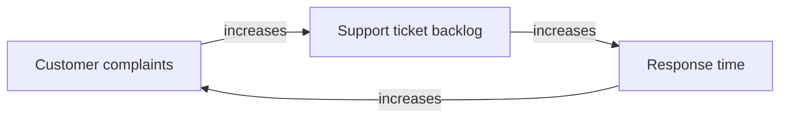
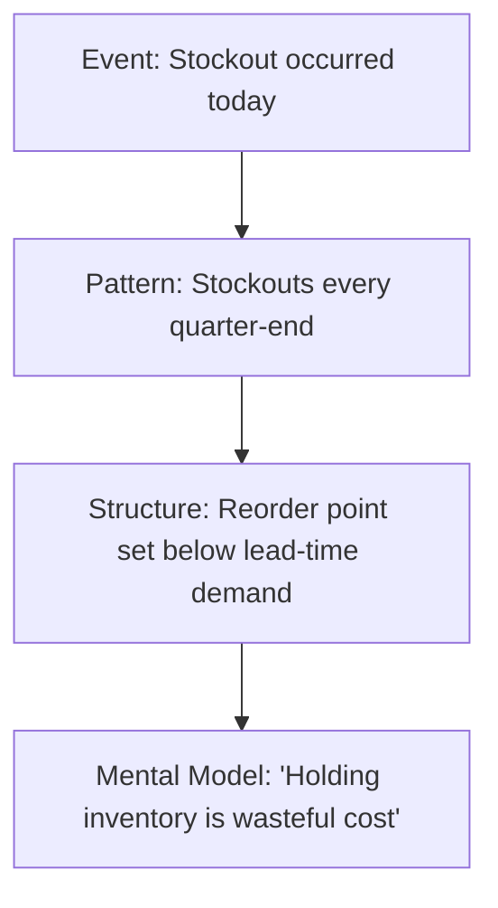

## Habits of a Systems Thinker

### Definition and Scope

A **Habit of a Systems Thinker** is a recurring cognitive or behavioral pattern that a person applies, often without conscious deliberation, when observing, analyzing, or intervening in a system. These habits are distinct from one-time analytical techniques (like drawing a single causal loop diagram) because they represent an internalized disposition that shapes how a person approaches any complex situation, project, or problem, by default.

The concept was popularized and cataloged most notably by the Waters Foundation, which developed a widely used list of 14 "Habits of a Systems Thinker" for education contexts. These habits function as a bridge between abstract systems theory (stocks, flows, feedback loops) and everyday practical reasoning.

### Core Habits (Canonical List)

The following habits are commonly cited as the foundational set. Each is presented with its practical meaning and a worked example.

#### 1. Seeks to Understand the Big Picture

**Key Points**

- Resists the urge to analyze a component in isolation
- Actively maps how a subsystem connects to the larger whole before drawing conclusions
- Uses framing questions like "What is this part of?" rather than only "What is this made of?"

**Example**

A hospital administrator investigating long emergency-room wait times does not stop at staffing levels in the ER. They examine bed availability in the general wards, discharge processes, ambulance routing policies, and insurance pre-authorization delays — because the ER's performance is embedded in the hospital-wide patient-flow system.

#### 2. Observes How Elements Within Systems Change Over Time, Generating Patterns and Trends

**Key Points**

- Prioritizes behavior-over-time graphs over single data points
- Looks for trends, cycles, oscillations, and inflection points rather than snapshots
- Recognizes that a system's history often explains its current state better than its current inputs alone

**Example**

Instead of asking "Why is inventory low today?", the systems thinker plots inventory levels over the past 24 months, revealing a recurring boom-bust cycle tied to a delayed-information feedback loop between sales forecasting and supplier lead times — a pattern invisible in a single day's data.

#### 3. Recognizes that a System's Structure Generates Its Behavior

**Key Points**

- Treats behavior as an output of structure (stocks, flows, feedback loops, delays), not as a product of individual willpower or blame
- Reframes "who caused this" questions into "what structure produces this" questions
- Underlies the systems-thinking maxim: "structure drives behavior"

**Example**

When sales teams consistently sandbag forecasts, a systems thinker does not conclude the salespeople are dishonest. Instead they examine the compensation structure: if quotas are set based on prior performance, a reinforcing loop rewards underreporting, and the "dishonesty" is a rational response to that structure.

#### 4. Identifies the Circular Nature of Complex Cause-and-Effect Relationships

**Key Points**

- Moves beyond linear "A causes B" thinking to closed-loop "A influences B, which influences A" thinking
- Actively looks for feedback loops (reinforcing and balancing) rather than assuming causality flows in a single direction
- Uses causal loop diagrams as an external representation of this internal habit

**Example**

This reinforcing loop shows that complaints and response time are not a one-way chain but mutually reinforcing — a habit of circular thinking reveals the loop instead of stopping at "complaints cause backlog."

#### 5. Makes Meaningful Connections Within and Between Systems

**Key Points**

- Actively transfers structural insight from one domain to another (e.g., recognizing that a "runaway feedback loop" in ecology resembles a viral marketing loop in business)
- Treats analogical reasoning as a legitimate analytical tool, not just a rhetorical device
- Looks for shared archetypes (see "Systems Archetypes" as a related topic) across unrelated domains

**Example**

A systems thinker studying algae blooms in a lake (nutrient runoff → algae growth → oxygen depletion → fish die-off) recognizes the same "Limits to Growth" archetype structure in a startup's customer acquisition strategy (marketing spend → user growth → server costs → margin collapse).

#### 6. Changes Perspectives to Increase Understanding

**Key Points**

- Deliberately views the same system from multiple stakeholder vantage points
- Asks "How would this look from the supplier's perspective? From the regulator's? From the end user's?"
- Reduces blind spots caused by a single, fixed frame of reference

**Example**

Analyzing a traffic congestion policy, the thinker cycles through the perspectives of the commuter (time cost), the city planner (throughput and revenue), the local resident (noise and pollution), and the bus operator (route reliability) before proposing a solution.

#### 7. Considers an Issue Fully and Resists the Urge to Come to a Quick Conclusion

**Key Points**

- Tolerates ambiguity and delays premature closure
- Actively searches for disconfirming evidence and alternative explanations before committing to a diagnosis
- Related to the concept of "cognitive humility" in decision science

**Example**

When a product's user engagement drops after a redesign, the systems thinker resists immediately blaming the new UI. They investigate concurrent factors: a competitor's launch, a seasonal usage pattern, a server latency regression, and a change in the onboarding funnel — before attributing cause.

#### 8. Considers How Mental Models Affect Current Reality and the Future

**Key Points**

- Recognizes that a person's or organization's mental models (deeply held assumptions and beliefs) shape which system structures get built and reinforced
- Surfaces and questions unstated assumptions, since these often lie beneath surface-level events and patterns in the "Iceberg Model"
- Understands that changing outcomes durably usually requires changing the underlying mental model, not just the events

**Example**

A manufacturing firm's leadership holds the mental model "quality control means end-of-line inspection." This belief structurally prevents investment in upstream process control, perpetuating a stable pattern of defect rates regardless of how many inspectors are hired.

#### 9. Uses Understanding of System Structure to Identify Possible Leverage Actions

**Key Points**

- Actively searches for high-leverage intervention points rather than treating all intervention points as equally effective
- Draws on frameworks such as Donella Meadows' "Places to Intervene in a System," which ranks leverage points from low (parameters, numbers) to high (paradigms, goals, rules of the system)
- Prioritizes interventions on system structure, feedback loops, and information flows over interventions on numeric parameters alone

**Example**

Rather than raising a factory's late-delivery penalty (a low-leverage parameter change), a systems thinker redesigns the information flow so that the shop floor sees real-time order status (a higher-leverage change to information flow structure), which durably improves on-time delivery.

#### 10. Considers Short-Term, Long-Term, and Unintended Consequences of Actions

**Key Points**

- Explicitly maps the temporal dimension of consequences before acting
- Anticipates "shifting the burden" and "fixes that fail" archetypes, where short-term fixes create larger long-term problems
- Uses the question "What happens after what happens?" repeatedly

**Example**

A city subsidizes ride-hailing services to reduce short-term traffic congestion. Short-term: fewer private cars. Long-term (unintended): induced demand increases total vehicle-miles traveled, and public transit ridership declines, worsening congestion after the subsidy is removed.

#### 11. Recognizes the Impact of Time Delays When Exploring Cause-and-Effect Relationships

**Key Points**

- Identifies delays between action and effect as a primary source of oscillation, overcorrection, and instability in systems
- Distinguishes between the time an action is taken and the time its full effect is observed
- Understands that delays are often the hidden variable behind "the fix isn't working" complaints, when the fix simply hasn't had time to propagate

**Example**

A central bank raises interest rates to curb inflation. Because monetary policy effects have long transmission delays (often cited as 12–18 months), continuing to raise rates because inflation "hasn't responded yet" can lead to over-tightening once the delayed effects finally materialize.

#### 12. Checks Results and Changes Actions if Needed: "Successive Approximation"

**Key Points**

- Treats interventions as hypotheses to be tested, not final solutions
- Builds explicit feedback and review checkpoints into any intervention plan
- Aligns with the broader Plan-Do-Check-Act (PDCA) and iterative design principles

**Example**

A nonprofit deploys a new microloan structure, sets a 6-month checkpoint to compare default rates and repayment behavior against the model, and revises loan terms based on observed (not assumed) borrower behavior.

#### 13. Understands That System Structure Is the Precursor to Perceived Events, Patterns, and Behaviors

**Key Points**

- Reflects the "Iceberg Model" habit of moving from visible events down through patterns, then structures, then mental models
- Actively resists reacting only to the visible "tip of the iceberg"
- Reinforces habit #3, but emphasized here as a deliberate diagnostic sequence

**Example**

Working down this iceberg, a systems thinker traces a single stockout event to the underlying belief that drives the reorder-point policy.

#### 14. Considers an Issue Fully and Resists the Urge to Come to a Quick Conclusion (Reflective Habit Reinforcement)

**Key Points**

- Often listed alongside habit #7 as a reinforcing practice: the habitual pause before action
- Practically operationalized through techniques like "the five whys," structured debate, and red-teaming one's own conclusions
- Functions as a meta-habit that supports all the others by protecting against premature pattern-matching

**Example**

Before finalizing a report attributing a factory's declining output solely to "aging equipment," the systems thinker schedules a structured review with maintenance, operations, and procurement staff to test that conclusion against alternative explanations (e.g., a supplier's change in raw material specification).

### Supporting Skills That Enable These Habits

**Key Points**

- **Dynamic thinking**: recognizing behavior-over-time patterns (supports Habit 2)
- **Closed-loop thinking**: seeing circular causality instead of linear chains (supports Habit 4)
- **Structural thinking**: linking behavior to stocks, flows, and delays (supports Habits 3, 11)
- **Operational thinking**: understanding how decisions are actually made within a system, not just how they are formally described (supports Habits 8, 9)
- **Continuum thinking**: recognizing that quantities and states exist on a spectrum rather than as binary categories

### Distinguishing Habits from Techniques

| Aspect | Systems Thinking Habit | Systems Thinking Technique |
| --- | --- | --- |
| Nature | Internalized, often automatic disposition | Explicit, deliberately applied tool |
| Example | "Recognizes circular causality" | Drawing a causal loop diagram |
| Timeframe of acquisition | Developed gradually through practice | Learnable in a single session |
| Application context | Applies across all situations by default | Applied when a specific technique is chosen |

[Inference] The distinction above is a pedagogical simplification; in practice, repeated use of a technique (like causal loop diagramming) is one of the primary mechanisms by which the corresponding habit (circular causality recognition) becomes internalized. The two categories are not strictly separable.

### Visual Overview: How the Habits Interrelate (svg_diagram)

<svg xmlns="http://www.w3.org/2000/svg" viewBox="0 0 900 560" font-family="Arial, sans-serif">
<text x="450" y="30" text-anchor="middle" font-size="18" font-weight="bold" fill="#1a1a1a">Habits of a Systems Thinker (svg_diagram)</text>
<circle cx="450" cy="290" r="90" fill="#2c3e50" />
<text x="450" y="285" text-anchor="middle" font-size="14" fill="#ffffff" font-weight="bold">Core</text>
<text x="450" y="303" text-anchor="middle" font-size="14" fill="#ffffff" font-weight="bold">Disposition</text>
<circle cx="220" cy="130" r="80" fill="#2980b9" opacity="0.85" />
<text x="220" y="120" text-anchor="middle" font-size="12" fill="#ffffff">Big Picture</text>
<text x="220" y="136" text-anchor="middle" font-size="12" fill="#ffffff">Multiple</text>
<text x="220" y="152" text-anchor="middle" font-size="12" fill="#ffffff">Perspectives</text>
<circle cx="680" cy="130" r="80" fill="#27ae60" opacity="0.85" />
<text x="680" y="120" text-anchor="middle" font-size="12" fill="#ffffff">Patterns Over</text>
<text x="680" y="136" text-anchor="middle" font-size="12" fill="#ffffff">Time &amp;</text>
<text x="680" y="152" text-anchor="middle" font-size="12" fill="#ffffff">Delays</text>
<circle cx="150" cy="400" r="80" fill="#c0392b" opacity="0.85" />
<text x="150" y="390" text-anchor="middle" font-size="12" fill="#ffffff">Structure Drives</text>
<text x="150" y="406" text-anchor="middle" font-size="12" fill="#ffffff">Behavior &amp;</text>
<text x="150" y="422" text-anchor="middle" font-size="12" fill="#ffffff">Circular Causality</text>
<circle cx="750" cy="400" r="80" fill="#8e44ad" opacity="0.85" />
<text x="750" y="390" text-anchor="middle" font-size="12" fill="#ffffff">Mental Models</text>
<text x="750" y="406" text-anchor="middle" font-size="12" fill="#ffffff">&amp; Leverage</text>
<text x="750" y="422" text-anchor="middle" font-size="12" fill="#ffffff">Points</text>
<circle cx="450" cy="500" r="80" fill="#d35400" opacity="0.85" />
<text x="450" y="490" text-anchor="middle" font-size="12" fill="#ffffff">Test, Reflect,</text>
<text x="450" y="506" text-anchor="middle" font-size="12" fill="#ffffff">Resist Quick</text>
<text x="450" y="522" text-anchor="middle" font-size="12" fill="#ffffff">Conclusions</text>
<line x1="450" y1="290" x2="220" y2="130" stroke="#7f8c8d" stroke-width="2" />
<line x1="450" y1="290" x2="680" y2="130" stroke="#7f8c8d" stroke-width="2" />
<line x1="450" y1="290" x2="150" y2="400" stroke="#7f8c8d" stroke-width="2" />
<line x1="450" y1="290" x2="750" y2="400" stroke="#7f8c8d" stroke-width="2" />
<line x1="450" y1="290" x2="450" y2="500" stroke="#7f8c8d" stroke-width="2" />
</svg>

### Common Pitfalls When Developing These Habits

**Key Points**

- **Analysis paralysis**: over-applying Habit 7 (resisting quick conclusions) to the point that no action is ever taken
- **False circularity**: forcing a feedback-loop narrative onto a genuinely linear cause-and-effect relationship, producing overcomplicated models
- **Perspective overload**: gathering so many stakeholder viewpoints (Habit 6) that a coherent decision becomes impossible without a synthesis step
- **Structural fatalism**: over-applying Habit 3 to excuse poor individual performance entirely on "the system," removing accountability inappropriately

[Unverified] The relative frequency of each pitfall among practitioners has not been rigorously studied; the above list reflects commonly reported anecdotal challenges in systems-thinking education and facilitation literature rather than a benchmarked survey.

### Practical Exercise for Building These Habits

**Steps**

1. Select a recurring problem you have observed at least three times (e.g., a recurring project delay).
2. Plot the events on a rough behavior-over-time sketch (Habit 2).
3. Draw a simple causal loop diagram identifying at least one feedback loop (Habit 4).
4. Identify the mental model that would need to be true for the current structure to make sense (Habit 8).
5. Propose one structural or informational leverage intervention, not a numeric-parameter tweak (Habit 9).
6. Set a review checkpoint before declaring the intervention successful (Habit 12).

### Related Topics

- Systems Thinking Iceberg Model
- Causal Loop Diagrams (CLDs)
- Stock and Flow Diagrams
- Donella Meadows' Leverage Points
- Systems Archetypes (Limits to Growth, Shifting the Burden, Fixes that Fail, Tragedy of the Commons)
- Mental Models and Double-Loop Learning (Chris Argyris)
- Behavior-Over-Time Graphs (BOTGs)
- Feedback Loops: Reinforcing vs. Balancing
- Dynamic, Closed-Loop, and Operational Thinking Skills
- Systems Thinking in Organizational Learning (Peter Senge's "The Fifth Discipline")