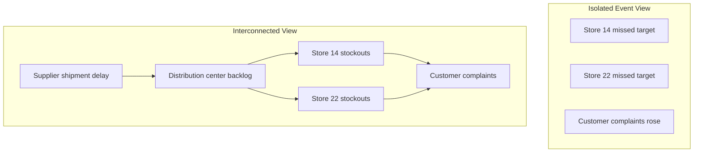
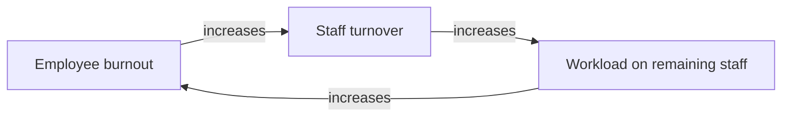

## Seeing Interconnections Rather Than Isolated Events

### Definition and Scope

**Seeing Interconnections Rather Than Isolated Events** is the systems-thinking discipline of perceiving phenomena as nodes within a web of relationships, rather than as discrete, self-contained occurrences. It is the practical application of the principle that in any system, elements are defined less by their individual properties and more by their relationships to other elements. This habit counters the default human cognitive tendency toward **event-level thinking**: reacting to the most recent, most visible occurrence as if it were an isolated incident requiring an isolated response.

This concept sits at the top layer of the **Iceberg Model**, and this habit is precisely what pulls attention *below* that top layer toward patterns, structures, and the web of relationships that produced the event.

### Why the Default Mode Is Event-Based Thinking

**Key Points**

- Human perception and news media are structured around discrete, timestamped occurrences (an accident, a product launch, a stock drop), because events are salient, easy to narrate, and easy to assign a single cause to.
- Event-based thinking supports reactive management: responding to the latest symptom as it appears.
- It typically triggers a search for a single proximate cause and a single responsible party, satisfying a cognitive preference for simple, closed narratives.
- It is cognitively cheap: assigning blame or credit to one event requires no model of the surrounding system.

**Example**

A retail chain sees "Store #14 missed its quarterly sales target" and responds by replacing the store manager. This is event-level thinking: it treats the missed target as an isolated fact about that store and that manager, rather than investigating supply chain timing, regional pricing changes, or a corporate marketing calendar shift that affected all stores in the region.

### The Shift: From Events to Interconnections

**Key Points**

- Interconnection-based thinking asks "What is this event connected to?" instead of "What caused this event?"
- It looks laterally (What else is happening at the same time that could share a common driver?) and vertically (What structure or feedback loop produced this pattern of events?).
- It treats every event as one visible manifestation of an underlying network of relationships, most of which are not directly observable.
- It is a precondition for identifying feedback loops, since a feedback loop cannot be seen if each event in the loop is treated as independent.

**Example**

Instead of treating "Store #14 missed target," "Store #22 missed target," and "regional distributor reported a 3-week shipment delay" as three separate events, the interconnected view treats them as three visible symptoms of one shared upstream relationship: a single supplier disruption propagating downstream through the distribution network to multiple stores.

### Diagram: Event View vs. Interconnected View

The left grouping shows three events treated as unrelated facts. The right grouping shows the same three events revealed as downstream effects of one shared root relationship.

### Core Sub-Skills That Constitute This Habit

#### 1. Lateral Scanning (Cross-Event Correlation)

**Key Points**

- Actively checking whether multiple seemingly unrelated events share a common timeframe, actor, or resource
- Uses techniques like timeline overlay analysis: plotting multiple event streams on a shared time axis to detect co-occurrence

**Example**

A hospital notices increased patient falls, increased nurse overtime requests, and increased medication errors in the same month. Lateral scanning treats these as three symptoms possibly connected through one variable — nurse staffing ratio — rather than three unrelated departmental issues.

#### 2. Upstream/Downstream Tracing

**Key Points**

- Tracing an event backward to its upstream inputs and forward to its downstream consequences
- Distinguishes proximate connections (immediate, one-step relationships) from distal connections (several steps removed, but still causally linked)

**Example**

A late software release (event) is traced upstream to a delayed API dependency from a third-party vendor, and that delay is traced further upstream to a contract renegotiation. Downstream, the late release is traced forward to a missed marketing campaign window and a resulting drop in the first-week user acquisition numbers.

#### 3. Relationship Mapping

**Key Points**

- Explicitly diagramming the relationships between elements (using tools such as causal loop diagrams, stakeholder maps, or network graphs) rather than only listing elements
- Prioritizes the arrows (relationships) over the boxes (entities) — a foundational systems-thinking convention, since systems are defined by their relationships more than their parts

**Example**

When onboarding a new employee into a cross-functional team, a systems thinker does not just list the team members and their titles; they map who depends on whom for information, approvals, and resources, revealing informal influence structures that an org chart hides.

#### 4. Contextual Framing

**Key Points**

- Placing any single event within its surrounding context (organizational, historical, environmental, economic) before interpreting it
- Asks: "What was already true before this event happened that made it possible or likely?"

**Example**

A factory fire is not interpreted only as "an electrical fault caused a fire." Contextual framing considers that a prior cost-cutting decision reduced the maintenance inspection frequency, and a separate decision increased machine utilization rates — both of which raised the fire's likelihood before the spark itself occurred.

### Relationship to Feedback Loops

Seeing interconnections is the perceptual prerequisite for identifying feedback loops. A feedback loop, by definition, requires perceiving that element A affects element B, which in turn affects element A — a fundamentally relational, non-isolated way of seeing.

**Example**

If each of these three events (a resignation, a burnout complaint, an overtime request) were seen in isolation, the reinforcing loop connecting them would remain invisible. Seeing interconnections is what allows the loop itself to be perceived as a single, self-sustaining structure.

### Practical Techniques for Developing This Habit

| Technique | Purpose | Typical Output |
| --- | --- | --- |
| Timeline overlay | Detect co-occurring events across domains | Multi-track event timeline |
| Stakeholder/relationship mapping | Reveal who/what depends on whom | Network diagram |
| "Five whys, then five connects" | Extend root-cause analysis into root-relationship analysis | Cause chain plus lateral links |
| Causal loop diagramming | Formalize perceived interconnections into loops | CLD with reinforcing/balancing loops |
| Cross-functional review meetings | Surface connections only visible from other departments' vantage points | Shared situational map |

### Worked Example: Applying the Habit to a Business Scenario

**Scenario**: A subscription software company observes rising customer churn in Q3.

**Isolated-event response**: Conclude "customers are leaving because of a pricing increase implemented in Q3," and reverse the pricing change.

**Interconnected analysis**:

1. **Lateral scan**: Support ticket volume also rose in Q2, one quarter before the churn spike.
2. **Upstream trace**: The Q2 ticket volume increase followed a platform migration that introduced intermittent login failures.
3. **Relationship map**: Customers who filed a support ticket in Q2 show a measurably higher Q3 churn rate than those who did not, regardless of pricing tier.
4. **Contextual frame**: The pricing increase coincided with, but was not the primary driver of, the churn — the platform migration's reliability issues were the stronger connected factor.

**Conclusion**: Reversing the price increase alone would not resolve the underlying churn driver, since the true interconnection runs from platform reliability through customer trust to churn, with pricing as a comparatively minor contributing factor.

[Inference] This worked example is illustrative and constructed for pedagogical purposes; in a real analysis, the relative strength of "pricing" versus "reliability" as churn drivers would need to be established through statistical analysis (e.g., cohort comparison or regression), not asserted from narrative alone.

### Common Pitfalls

**Key Points**

- **Over-connection ("apophenia")**: perceiving a causal or structural relationship between events that are in fact independent or only coincidentally correlated; systems thinking requires connections to be tested, not merely hypothesized
- **Connection without prioritization**: mapping every possible relationship without identifying which connections are strong/high-leverage versus weak/negligible, resulting in an unusable, overly dense map
- **Neglecting time delays**: assuming a connection is absent simply because two events are not close together in time, when a delayed feedback relationship may still link them
- **Confirmation-driven mapping**: selectively tracing connections that support a pre-existing conclusion while ignoring equally plausible alternative connections

### Diagram: A Structured Process for Practicing This Habit (svg_diagram)

<svg xmlns="http://www.w3.org/2000/svg" viewBox="0 0 900 340" font-family="Arial, sans-serif">
<text x="450" y="28" text-anchor="middle" font-size="17" font-weight="bold" fill="#1a1a1a">Process for Seeing Interconnections (svg_diagram)</text>
<rect x="30" y="120" width="150" height="80" rx="10" fill="#2980b9" />
<text x="105" y="155" text-anchor="middle" font-size="13" fill="#ffffff">Observe</text>
<text x="105" y="173" text-anchor="middle" font-size="13" fill="#ffffff">the Event</text>
<rect x="220" y="120" width="150" height="80" rx="10" fill="#27ae60" />
<text x="295" y="155" text-anchor="middle" font-size="13" fill="#ffffff">Scan Laterally</text>
<text x="295" y="173" text-anchor="middle" font-size="13" fill="#ffffff">for Co-Events</text>
<rect x="410" y="120" width="150" height="80" rx="10" fill="#c0392b" />
<text x="485" y="155" text-anchor="middle" font-size="13" fill="#ffffff">Trace Up/</text>
<text x="485" y="173" text-anchor="middle" font-size="13" fill="#ffffff">Downstream</text>
<rect x="600" y="120" width="150" height="80" rx="10" fill="#8e44ad" />
<text x="675" y="155" text-anchor="middle" font-size="13" fill="#ffffff">Map the</text>
<text x="675" y="173" text-anchor="middle" font-size="13" fill="#ffffff">Relationships</text>
<rect x="315" y="250" width="270" height="70" rx="10" fill="#d35400" />
<text x="450" y="280" text-anchor="middle" font-size="13" fill="#ffffff">Test Connections Against</text>
<text x="450" y="298" text-anchor="middle" font-size="13" fill="#ffffff">Evidence Before Acting</text>
<line x1="180" y1="160" x2="220" y2="160" stroke="#555" stroke-width="2" marker-end="url(#arrow1)" />
<line x1="370" y1="160" x2="410" y2="160" stroke="#555" stroke-width="2" marker-end="url(#arrow1)" />
<line x1="560" y1="160" x2="600" y2="160" stroke="#555" stroke-width="2" marker-end="url(#arrow1)" />
<line x1="675" y1="200" x2="480" y2="250" stroke="#555" stroke-width="2" marker-end="url(#arrow1)" />
</svg>

### Distinguishing This Habit from Related Habits

| Habit | Focus | Key Question |
| --- | --- | --- |
| Seeing Interconnections | Relationships between events/elements | "What is this connected to?" |
| Seeing Patterns Over Time | Behavior of a single variable across time | "How has this changed?" |
| Recognizing Circular Causality | Closed-loop feedback specifically | "Does this loop back on itself?" |
| Understanding Structure Drives Behavior | Root structural cause of behavior | "What structure produces this?" |

[Inference] These four habits are frequently taught as a cluster because they build on one another sequentially — interconnection-seeing typically precedes and enables loop-recognition — but different systems-thinking curricula sequence and separate them somewhat differently, so this ordering is a common pedagogical convention rather than a fixed universal standard.

### Practical Exercise

**Steps**

1. Pick a recent event you reacted to as a standalone problem (a missed deadline, a customer complaint, an equipment failure).
2. List every other event that occurred within the same one-month window in adjacent departments or domains.
3. For each listed event, ask whether a shared resource, decision, or actor could plausibly connect it to your original event.
4. Draw simple arrows between events you believe are genuinely connected, labeling each arrow with the nature of the relationship (e.g., "shared supplier," "shared budget," "sequential dependency").
5. Identify which single connection, if addressed, would have the broadest effect across multiple events — this is a candidate leverage point.

### Related Topics

- Systems Thinking Iceberg Model
- Causal Loop Diagrams (CLDs)
- Feedback Loops: Reinforcing vs. Balancing
- Systems Archetypes
- Network and Stakeholder Mapping
- Root Cause Analysis vs. Root Relationship Analysis
- Time Delays in Cause-and-Effect Relationships
- Habits of a Systems Thinker (Waters Foundation framework)