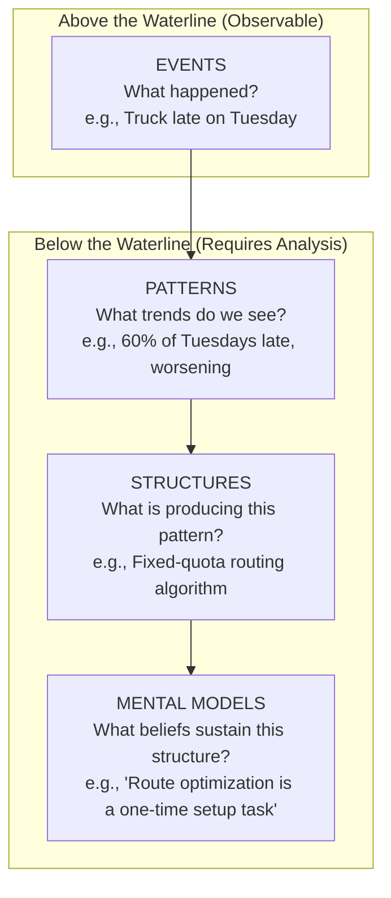
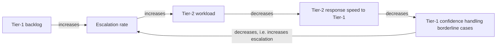

## Distinguishing Events, Patterns, and Structures

### Definition and Scope

**Distinguishing Events, Patterns, and Structures** is the systems-thinking skill of correctly classifying an observation into one of three distinct levels of reality, each requiring a fundamentally different type of response. This three-level classification is the operational core of the **Iceberg Model**, one of the most widely used frameworks in systems thinking. Misclassifying a phenomenon — treating a pattern as if it were a one-off event, or treating a structure as if it were merely a pattern — leads to interventions that are mismatched to the actual level of the problem, producing solutions that fail to hold or that address symptoms while leaving root causes intact.

### The Three Levels Defined

#### Level 1: Events

**Key Points**

- A single, discrete, time-stamped occurrence
- Directly observable and typically what triggers attention or alarm
- Answers the question: "What just happened?"
- The most visible and least informative level, since a single event provides minimal information about whether it is a one-off anomaly or part of a recurring dynamic

**Example**

"The delivery truck arrived four hours late on Tuesday."

#### Level 2: Patterns (Trends)

**Key Points**

- A series of related events observed over time, revealing direction, frequency, or recurrence
- Requires data collected across multiple time points; cannot be perceived from a single observation
- Answers the question: "Has this happened before? Is it getting better or worse?"
- Typically represented visually via a behavior-over-time graph (BOTG)

**Example**

"Deliveries have arrived late on 60% of Tuesdays for the past five months, and the average delay has grown from 45 minutes to nearly 4 hours over that period."

#### Level 3: Structures (Systemic Structure)

**Key Points**

- The underlying arrangement of stocks, flows, feedback loops, delays, policies, rules, and relationships that produces the observed pattern
- Not directly observable; must be inferred through analysis (e.g., causal loop diagrams, stock-and-flow modeling)
- Answers the question: "What arrangement of the system is generating this pattern?"
- Considered the highest-leverage level for durable intervention, since changing structure changes the pattern-generating mechanism itself rather than just its output

**Example**

"The delivery scheduling software assigns routes based on a fixed daily quota rather than real-time traffic and warehouse loading data; as delivery volume has grown, the same fixed-route structure now systematically produces increasing delays on the highest-volume day (Tuesday)."

### The Iceberg Model Visualization

Note: Many curricula extend the classic three levels (Events, Patterns, Structures) with a fourth, deeper layer — **Mental Models** — representing the beliefs and assumptions that keep a given structure in place. This item focuses on the first three; Mental Models is typically treated as a related, subsequent topic.

### Why Each Level Requires a Different Response

| Level | Appropriate Response Type | Typical Timeframe of Effect | Risk if Misapplied |
| --- | --- | --- | --- |
| Event | Reactive fix; immediate corrective action | Short-term, one-time | Wastes effort if the event is not part of a larger pattern |
| Pattern | Trend-based forecasting; anticipatory planning | Medium-term | Fails to address why the pattern exists; only manages its symptoms |
| Structure | Structural redesign; policy or feedback-loop change | Long-term, durable | Only structural change removes the pattern-generating mechanism |

**Example of mismatched response**: Responding to a single late delivery (Event) by firing the driver addresses nothing about the recurring Tuesday pattern, and even addressing the pattern with an extra driver on Tuesdays (a pattern-level patch) leaves the fixed-quota routing structure — the actual generator of the problem — completely unchanged, meaning the pattern will likely resurface as volume grows further or shift to a different day.

### Diagnostic Procedure for Classification

**Steps**

1. State the observation as precisely as possible and ask: "Did this happen more than once, or am I looking at a single instance?" If single instance with no historical data, classify as an **Event**.
2. If multiple instances exist, plot them over time (a behavior-over-time graph). If a clear trend, cycle, or recurring frequency emerges, classify as a **Pattern**.
3. For a confirmed pattern, ask: "What arrangement of stocks, flows, feedback loops, policies, or incentives would consistently produce this specific trend shape?" The identified mechanism is the **Structure**.
4. Validate the structural hypothesis by checking whether it also explains related patterns observed elsewhere in the system (see "Seeing Interconnections Rather Than Isolated Events").
5. If the structural hypothesis cannot account for the trend's shape (e.g., its timing, rate of change, or reversals), revise the hypothesis rather than forcing the data to fit it.

### Worked Example: A Complete Classification Walkthrough

**Scenario**: A software company's customer support team reports a spike in escalated tickets.

**Event-level observation**: "We had 40 escalated tickets yesterday, more than double the usual daily count."

**Pattern-level analysis**: Plotting escalations over the past six months shows a steady upward trend beginning three months ago, with escalations roughly doubling every six weeks, rather than a single anomalous spike.

$$\text{Escalation Rate}(t) \approx E_0 \cdot 2^{t/6}$$

where $t$ is measured in weeks since the trend's onset and $E_0$ is the baseline escalation rate. [Unverified] This exponential form is illustrative for demonstrating pattern-level analysis; an actual escalation trend would need to be fitted to real data to confirm whether growth is exponential, linear, or logistic (S-shaped), since these shapes imply different underlying structures.

**Structure-level analysis**: Investigation reveals a reinforcing feedback loop: as first-line support agents struggle with a growing backlog, they increasingly escalate borderline cases upward to relieve their own workload, which further burdens the tier-2 team, which in turn cannot provide first-line agents with timely guidance on borderline cases, causing even more escalations.

**Conclusion**: An event-level response (praise or reprimand for yesterday's specific ticket count) and even a pattern-level response (temporarily hiring more tier-2 staff) would each fail to break the reinforcing loop. A structural response — such as redesigning the escalation policy to require documented attempted-resolution steps before escalation, or establishing a dedicated tier-1.5 review layer — targets the feedback loop itself.

### Common Pitfalls in Classification

**Key Points**

- **Event-pattern confusion**: treating a genuinely recurring pattern as a series of unrelated one-off events, leading to repeated reactive firefighting without ever stepping back to view the trend
- **Pattern-structure confusion**: correctly identifying a trend but stopping the analysis there, proposing a fix that manages the trend's visible slope (e.g., adding temporary capacity) without ever asking what structural mechanism generates that slope
- **Premature structural closure**: jumping to a structural explanation based on a single event, without first confirming a genuine pattern exists across multiple observations — this risks constructing an elaborate structural theory for what may simply be a random, non-recurring fluctuation
- **Structure-mental model conflation**: [Inference] in more advanced iceberg-model applications, some practitioners also risk mistaking a structural fix (e.g., a new policy) for a complete solution when an unexamined mental model will simply regenerate an equivalent structure over time; this is a known extension of the pitfall but depends on which iceberg-model variant (three-level vs. four-level) is being applied

### Data Requirements by Level

| Level | Minimum Data Needed | Typical Analytical Tool |
| --- | --- | --- |
| Event | Single observation | Direct report, log entry, incident record |
| Pattern | Multiple time-stamped observations (ideally 5+ data points spanning a relevant cycle) | Behavior-over-time graph, trend line, control chart |
| Structure | Pattern data plus knowledge of the system's components, relationships, and policies | Causal loop diagram, stock-and-flow model, policy analysis |

[Inference] The "5+ data points" guideline is a practical rule of thumb commonly used in introductory systems-thinking and quality-improvement training (echoing conventions from statistical process control) rather than a fixed mathematical threshold; the appropriate minimum varies with the natural variability and cycle length of the specific system being observed.

### Diagram: Classification Decision Flow (svg_diagram)

<svg xmlns="http://www.w3.org/2000/svg" viewBox="0 0 900 420" font-family="Arial, sans-serif">
<text x="450" y="28" text-anchor="middle" font-size="17" font-weight="bold" fill="#1a1a1a">Events, Patterns, Structures: Classification Flow (svg_diagram)</text>
<rect x="350" y="55" width="200" height="60" rx="10" fill="#2980b9" />
<text x="450" y="90" text-anchor="middle" font-size="13" fill="#ffffff">Observation Occurs</text>
<polygon points="450,140 560,190 450,240 340,190" fill="#f39c12" />
<text x="450" y="185" text-anchor="middle" font-size="11" fill="#1a1a1a">Seen before,</text>
<text x="450" y="200" text-anchor="middle" font-size="11" fill="#1a1a1a">multiple times?</text>
<rect x="60" y="280" width="180" height="60" rx="10" fill="#c0392b" />
<text x="150" y="315" text-anchor="middle" font-size="13" fill="#ffffff">Classify: EVENT</text>
<rect x="360" y="280" width="180" height="60" rx="10" fill="#27ae60" />
<text x="450" y="315" text-anchor="middle" font-size="13" fill="#ffffff">Classify: PATTERN</text>
<polygon points="660,140 780,190 660,240 540,190" fill="#f39c12" />
<text x="660" y="185" text-anchor="middle" font-size="10" fill="#1a1a1a">Mechanism</text>
<text x="660" y="200" text-anchor="middle" font-size="10" fill="#1a1a1a">identified?</text>
<rect x="620" y="280" width="180" height="60" rx="10" fill="#8e44ad" />
<text x="710" y="315" text-anchor="middle" font-size="13" fill="#ffffff">Classify: STRUCTURE</text>
<line x1="450" y1="115" x2="450" y2="140" stroke="#555" stroke-width="2" marker-end="url(#a2)" />
<line x1="400" y1="220" x2="180" y2="280" stroke="#555" stroke-width="2" marker-end="url(#a2)" />
<text x="260" y="255" font-size="11" fill="#1a1a1a">No</text>
<line x1="450" y1="240" x2="450" y2="280" stroke="#555" stroke-width="2" marker-end="url(#a2)" />
<text x="465" y="260" font-size="11" fill="#1a1a1a">Yes</text>
<line x1="540" y1="190" x2="660" y2="150" stroke="#555" stroke-width="2" />
<line x1="660" y1="240" x2="660" y2="280" stroke="#555" stroke-width="2" marker-end="url(#a2)" />
<text x="675" y="260" font-size="11" fill="#1a1a1a">Yes</text>
</svg>

### Distinguishing This Skill from Related Habits

| Related Habit | Relationship to This Topic |
| --- | --- |
| Seeing Interconnections Rather Than Isolated Events | A precondition for correctly identifying a pattern rather than treating events as isolated |
| Recognizes System Structure Generates Behavior | The natural continuation once a structure has been correctly identified at Level 3 |
| Observes Patterns and Trends Over Time | Directly corresponds to Level 2 classification skill in this topic |

### Practical Exercise

**Steps**

1. Take a recent complaint, incident, or observation from your own work or organization.
2. Write it first strictly as an Event (a single sentence describing only what happened, when).
3. Gather or estimate at least five historical instances of the same or a similar observation, and sketch a rough behavior-over-time graph.
4. Based on the shape of that graph (rising, falling, oscillating, stable), write one sentence naming the Pattern.
5. Brainstorm at least two different structural explanations (feedback loops, policies, or stock/flow arrangements) that could produce that specific pattern shape, and identify what additional evidence would distinguish between them.

### Related Topics

- Systems Thinking Iceberg Model
- Mental Models and Their Role Beneath Structure
- Behavior-Over-Time Graphs (BOTGs)
- Causal Loop Diagrams (CLDs)
- Stock and Flow Diagrams
- Systems Archetypes
- Habits of a Systems Thinker
- Seeing Interconnections Rather Than Isolated Events
- Leverage Points (Donella Meadows)