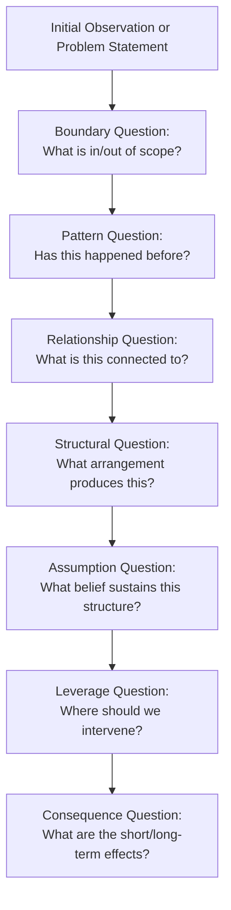

## Asking Systemic Questions

### Definition and Scope

**Asking Systemic Questions** is the deliberate practice of framing inquiries so they probe relationships, structures, feedback, and context rather than isolated facts, individual blame, or single causes. It is the linguistic and cognitive tool that operationalizes most other systems-thinking habits: seeing interconnections, distinguishing events from patterns from structures, and identifying feedback loops all depend on first asking a question shaped to surface that kind of information. A poorly framed question (e.g., "Who is responsible for this failure?") structurally forecloses systemic insight before analysis even begins, regardless of how skilled the subsequent analysis is.

### Systemic Questions vs. Linear Questions

**Key Points**

- **Linear questions** presuppose a single cause, a single responsible actor, or a one-directional chain of events, and typically seek a closed, singular answer
- **Systemic questions** presuppose multiple interacting causes, relationships, feedback, and context, and typically seek an open, exploratory answer that maps a web rather than a point
- The shift from linear to systemic questioning is often just a change in a question's grammar and framing, not a change in the underlying facts being investigated

**Example Comparison**

| Linear Question | Systemic Reframe |
| --- | --- |
| "Who caused the delay?" | "What conditions made this delay likely, and who else is affected by or contributes to it?" |
| "Why did sales drop last month?" | "What has changed in the relationships between marketing, pricing, competition, and customer behavior over the past two quarters?" |
| "What is wrong with this team?" | "What structures, incentives, or information flows shape how this team currently behaves?" |
| "How do we fix this problem?" | "What is this problem connected to, and what would change if we intervened at different points in that web?" |

### Categories of Systemic Questions

#### 1. Boundary Questions

**Key Points**

- Probe what is included in or excluded from the analysis, since every system definition involves a boundary choice, and different boundary choices reveal different dynamics
- Ask: "Where does this system begin and end, and what have we excluded that might matter?"

**Example**

"Are we analyzing 'customer churn' only within our own product usage data, or should the system boundary include competitor pricing actions and macroeconomic conditions that also influence a customer's decision to leave?"

#### 2. Relationship Questions

**Key Points**

- Probe connections between elements rather than the elements themselves
- Ask: "What influences this? What does this influence in turn?"

**Example**

"How does the marketing team's lead-generation volume affect the sales team's follow-up speed, and how does that follow-up speed in turn affect marketing's perceived lead quality?"

#### 3. Pattern Questions

**Key Points**

- Probe behavior over time rather than a single instance
- Ask: "Has this happened before? Is it increasing, decreasing, cyclical, or stable?"

**Example**

"Over the past two years, does customer complaint volume spike at the same point in every product release cycle, or was this month's spike unusual?"

#### 4. Structural Questions

**Key Points**

- Probe the underlying arrangement (stocks, flows, feedback loops, policies, incentives) that produces observed patterns
- Ask: "What structure would have to exist for this pattern to occur exactly as it has?"

**Example**

"What compensation structure or approval process would cause procurement staff to consistently over-order inventory just before each fiscal quarter ends?"

#### 5. Perspective Questions

**Key Points**

- Probe how different stakeholders would see or be affected by the same situation
- Ask: "How would this look from [stakeholder]'s vantage point?"

**Example**

"How does this new return policy look from the perspective of a warehouse worker processing returns, versus a customer expecting a refund, versus a finance manager tracking loss rates?"

#### 6. Leverage Questions

**Key Points**

- Probe where an intervention would have the greatest structural effect, rather than where it is easiest or most familiar to intervene
- Ask: "If we could change only one thing in this system, what would produce the broadest and most durable shift?"

**Example**

"Rather than adding another approval step to slow down over-ordering, is there a single information-flow change — like giving procurement real-time visibility into actual warehouse stock — that would remove the incentive to over-order in the first place?"

#### 7. Consequence and Delay Questions

**Key Points**

- Probe short-term versus long-term effects, and probe how much time might elapse before an intervention's effects become visible
- Ask: "What might this look like a year from now, and how long before we could tell whether it worked?"

**Example**

"If we cut the training budget now to hit this quarter's numbers, what does technical debt and onboarding time look like eighteen months from now, and how would we know it was this decision rather than something else?"

#### 8. Assumption / Mental Model Questions

**Key Points**

- Probe the beliefs that make a given structure feel natural, necessary, or invisible
- Ask: "What would have to be true for this policy to make sense to the people who created it?"

**Example**

"What assumption about employee motivation is embedded in a policy that ties bonuses solely to individual, rather than team, performance metrics?"

### Diagram: The Question-Type Funnel

This sequence is a common progression, though in practice questioning is iterative rather than strictly linear: answers at a later stage often send the inquiry back to revisit an earlier question with new information.

### Worked Example: Reframing a Real Inquiry

**Initial linear question** (posed by a hospital administrator): "Why is the emergency department so slow today?"

**Systemic reframing sequence**:

1. **Boundary**: "Should 'the emergency department' be analyzed alone, or does it need to include inpatient bed availability and discharge processes as part of the relevant system?"
2. **Pattern**: "Is today's slowdown a one-time event, or does ED throughput slow on a recurring basis at certain times of day, week, or month?"
3. **Relationship**: "How does the rate of inpatient discharges earlier in the day affect how many ED patients can be admitted later in the day?"
4. **Structural**: "What discharge-approval process or staffing schedule structurally limits the rate of morning discharges, and how does that constrain ED bed availability by afternoon?"
5. **Assumption**: "Does the current discharge process assume that physician rounds should happen once daily in the late morning, and if so, why?"
6. **Leverage**: "Would shifting physician rounding earlier, or adding a second daily discharge review, have a larger effect on ED throughput than adding ED staff directly?"
7. **Consequence**: "If rounding times shift earlier, what is the delay before ED throughput improvement becomes measurable, and what unintended effects might this have on inpatient care quality?"

[Inference] This worked example is constructed for illustrative purposes. In an actual hospital operations analysis, each answer would need to be verified against real discharge and admission data rather than assumed from the narrative structure of the example alone.

### Common Pitfalls When Asking Questions

**Key Points**

- **Blame-framing**: phrasing a question around "who" before establishing "what structure," which primes the conversation toward defensiveness and away from systemic insight
- **False precision**: asking a systemic-sounding question but expecting a single, simple answer, which pressures the responder to oversimplify a genuinely multi-causal situation
- **Boundary neglect**: never explicitly asking a boundary question, which leaves the scope of analysis implicit and often too narrow to reveal the relevant structure
- **Premature leverage-seeking**: jumping directly to "where should we intervene?" before pattern, relationship, and structural questions have been asked, risking an intervention aimed at the wrong mechanism
- **Rhetorical systemic questions**: phrasing a question in systemic-sounding language while already assuming its answer, which defeats the exploratory purpose of the technique

### Question Reframing Checklist

| If your question contains... | Consider reframing toward... |
| --- | --- |
| "Who" (as the primary subject) | "What structure, policy, or incentive" |
| "Why did this happen" (once) | "Has this happened before, and in what pattern" |
| "What should we do" (immediately) | "What is this connected to, first" |
| "Fix" or "solve" | "Where would intervention have the broadest effect" |
| A single named cause | "What combination of factors interacts here" |

### Diagram: Systemic Question Categories Map (svg_diagram)

<svg xmlns="http://www.w3.org/2000/svg" viewBox="0 0 900 460" font-family="Arial, sans-serif">
<text x="450" y="28" text-anchor="middle" font-size="17" font-weight="bold" fill="#1a1a1a">Categories of Systemic Questions (svg_diagram)</text>
<circle cx="450" cy="240" r="70" fill="#2c3e50" />
<text x="450" y="235" text-anchor="middle" font-size="12" fill="#ffffff" font-weight="bold">Systemic</text>
<text x="450" y="253" text-anchor="middle" font-size="12" fill="#ffffff" font-weight="bold">Inquiry</text>
<circle cx="230" cy="110" r="65" fill="#2980b9" opacity="0.9" />
<text x="230" y="105" text-anchor="middle" font-size="11" fill="#ffffff">Boundary</text>
<text x="230" y="122" text-anchor="middle" font-size="11" fill="#ffffff">Questions</text>
<circle cx="670" cy="110" r="65" fill="#27ae60" opacity="0.9" />
<text x="670" y="105" text-anchor="middle" font-size="11" fill="#ffffff">Relationship</text>
<text x="670" y="122" text-anchor="middle" font-size="11" fill="#ffffff">Questions</text>
<circle cx="130" cy="280" r="65" fill="#c0392b" opacity="0.9" />
<text x="130" y="275" text-anchor="middle" font-size="11" fill="#ffffff">Pattern</text>
<text x="130" y="292" text-anchor="middle" font-size="11" fill="#ffffff">Questions</text>
<circle cx="770" cy="280" r="65" fill="#8e44ad" opacity="0.9" />
<text x="770" y="275" text-anchor="middle" font-size="11" fill="#ffffff">Structural</text>
<text x="770" y="292" text-anchor="middle" font-size="11" fill="#ffffff">Questions</text>
<circle cx="230" cy="410" r="65" fill="#d35400" opacity="0.9" />
<text x="230" y="405" text-anchor="middle" font-size="11" fill="#ffffff">Perspective</text>
<text x="230" y="422" text-anchor="middle" font-size="11" fill="#ffffff">Questions</text>
<circle cx="670" cy="410" r="65" fill="#16a085" opacity="0.9" />
<text x="670" y="405" text-anchor="middle" font-size="11" fill="#ffffff">Leverage</text>
<text x="670" y="422" text-anchor="middle" font-size="11" fill="#ffffff">Questions</text>
<line x1="450" y1="240" x2="230" y2="110" stroke="#7f8c8d" stroke-width="2" />
<line x1="450" y1="240" x2="670" y2="110" stroke="#7f8c8d" stroke-width="2" />
<line x1="450" y1="240" x2="130" y2="280" stroke="#7f8c8d" stroke-width="2" />
<line x1="450" y1="240" x2="770" y2="280" stroke="#7f8c8d" stroke-width="2" />
<line x1="450" y1="240" x2="230" y2="410" stroke="#7f8c8d" stroke-width="2" />
<line x1="450" y1="240" x2="670" y2="410" stroke="#7f8c8d" stroke-width="2" />
</svg>

### Facilitation Applications

**Key Points**

- Systemic questioning is a core technique in group facilitation, organizational development, and systems-mapping workshops, where the facilitator's questions shape whether a group surfaces structural insight or remains at the level of complaint and blame
- Related methodologies that formalize systemic questioning include **Circular Questioning** (originating in family systems therapy, where questions ask each participant how they perceive the relationship between two other participants) and **Appreciative Inquiry** (which systemically reframes problem-focused questions toward strengths and possibility)
- [Unverified] The specific effectiveness of any one questioning technique relative to another (e.g., circular questioning versus standard structural questioning) in organizational settings has not been comprehensively benchmarked across contexts; effectiveness likely depends heavily on group dynamics, facilitator skill, and organizational culture, which are not held constant across studies or anecdotal reports.

### Practical Exercise

**Steps**

1. Take a linear question you have recently asked or heard asked about a real problem (e.g., "Why did X happen?" or "Who is responsible for Y?").
2. Rewrite it as a boundary question, explicitly naming what is included and excluded from the analysis.
3. Rewrite it again as a pattern question, asking whether the issue has occurred before and in what shape.
4. Rewrite it again as a structural question, asking what arrangement of the system would produce that exact pattern.
5. Compare the four versions side by side and note how differently each would guide the subsequent investigation and eventual intervention choice.

### Related Topics

- Systems Thinking Iceberg Model
- Distinguishing Events, Patterns, and Structures
- Seeing Interconnections Rather Than Isolated Events
- Causal Loop Diagrams (CLDs)
- Circular Questioning (Family Systems Therapy)
- Facilitation Techniques for Systems Mapping
- Leverage Points (Donella Meadows)
- Mental Models and Assumption Surfacing