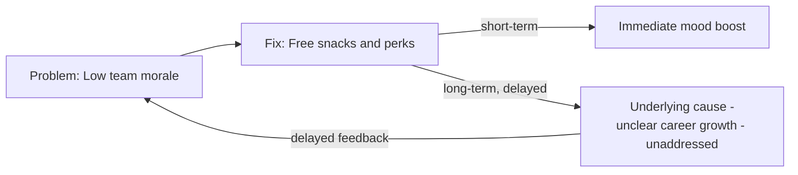
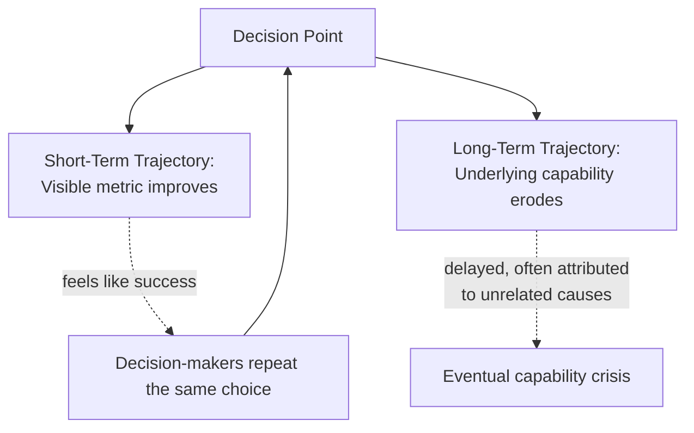

## Considering Short-Term and Long-Term Consequences

### Definition and Scope

**Considering Short-Term and Long-Term Consequences** is the systems-thinking habit of deliberately evaluating an action or decision across multiple time horizons before committing to it, rather than optimizing only for immediate, visible results. This habit is grounded in the recognition that systems frequently exhibit **time delays** between an intervention and its full effects, and that an action producing a favorable outcome in the short term can produce a neutral, unrelated, or actively harmful outcome once slower-acting feedback loops have had time to propagate. It is one of the most consequential habits for avoiding classic systems failure modes such as policy resistance and the "fixes that fail" archetype.

### Why Short-Term and Long-Term Effects Diverge

**Key Points**

- Systems typically contain both fast feedback loops (effects visible within days or weeks) and slow feedback loops (effects visible only over months or years); a decision optimized against the fast loop alone can be structurally blind to the slow loop it simultaneously triggers
- Balancing (goal-seeking) feedback loops often produce a quick, visible correction, while the side effects of the mechanism used to achieve that correction accumulate more slowly and become visible only later
- Stocks (accumulations) change more slowly than flows (rates), so an action that changes a flow can look immediately effective while its cumulative effect on a related stock remains invisible for a long period
- Human and organizational incentive structures (quarterly targets, annual reviews, election cycles) frequently reward short-term performance, structurally biasing decision-makers toward short-term optimization even when they consciously value long-term outcomes

### The Archetype Connection: Shifting the Burden and Fixes That Fail

**Key Points**

- **"Fixes that Fail"**: a quick fix relieves a symptom in the short term but has an unintended long-term consequence that makes the underlying problem worse, often by a delayed side effect of the fix itself
- **"Shifting the Burden"**: a symptomatic short-term solution is applied repeatedly, which reduces the pressure to apply a more effective but slower-acting fundamental solution, allowing the underlying capability to atrophy over the long term
- Both archetypes exist specifically because decision-makers evaluate consequences over too short a time horizon

**Example (Fixes That Fail)**

The free-snacks fix produces a genuine short-term improvement in mood, which reduces urgency to address the slower-acting structural cause (career growth), allowing the original problem to persist or worsen once the novelty of the perk fades.

### The Time-Horizon Evaluation Framework

**Key Points**

- A systemic evaluation of any proposed action should explicitly separate its expected effects into at least three time bands, since collapsing all timeframes into a single "will this work?" judgment hides the divergence
- **Immediate** (days to weeks): direct, visible, often the intended effect
- **Medium-term** (months to a year or two): secondary effects, feedback loop responses, stakeholder adaptation
- **Long-term** (multiple years): structural, cultural, or capability effects, often irreversible or costly to reverse

**Example Table: Evaluating a Single Decision Across Time Bands**

| Decision: Cut R&D budget by 30% to hit this year's profit target |
| --- |
| **Immediate effect**: Profit margin improves this quarter; shareholders react positively |
| **Medium-term effect**: Product roadmap slows; some R&D staff leave for competitors, taking institutional knowledge with them |
| **Long-term effect**: Reduced pipeline of new products two to three years out; competitors who maintained R&D investment gain relative market position; rebuilding the R&D team later costs more than the original savings |

### Diagram: Divergence of Short-Term and Long-Term Trajectories

### Techniques for Systematically Considering Both Horizons

#### 1. Time-Banded Consequence Mapping

**Key Points**

- Explicitly listing predicted effects in separate immediate/medium/long-term columns before a decision is finalized, as demonstrated in the table above
- Forces articulation of long-term effects that would otherwise remain implicit or unexamined

#### 2. Behavior-Over-Time Projection

**Key Points**

- Sketching a hypothesized behavior-over-time graph for a key variable, extending the time axis well beyond the period in which the decision's direct effect is expected to be visible
- Useful for revealing whether a proposed fix produces a sustained improvement, a temporary bump followed by reversion, or an improvement that reverses into a worse outcome than the baseline (the signature shape of "fixes that fail")

**Example (described, not rendered)**: A behavior-over-time sketch for "employee morale" following the snack-perk fix would show a step increase at the time of the fix, a plateau for several weeks, and then a gradual decline back toward or below the original baseline as the underlying career-growth issue continues unaddressed — a pattern that a single-point-in-time measurement immediately after the fix would completely miss.

#### 3. Pre-Mortem for Delayed Effects

**Key Points**

- A structured exercise in which the team imagines it is one, three, and five years in the future and the decision has failed; participants work backward to explain why, specifically focusing on delayed and structural causes rather than immediate execution errors
- Surfaces long-term risks that optimism bias and short-term incentive structures tend to suppress during initial decision-making

#### 4. Reversibility Assessment

**Key Points**

- Classifying a decision by how difficult and costly it would be to reverse once its long-term consequences become visible
- Decisions with low reversibility (e.g., closing a manufacturing plant, disbanding a specialized team) warrant substantially more long-term consequence analysis than decisions with high reversibility (e.g., a temporary pricing promotion)

### Worked Example: A Complete Analysis

**Scenario**: A city government considers removing a bus rapid-transit lane to relieve short-term car traffic congestion complaints.

**Immediate effect**: More lanes available for cars; some reduction in reported car congestion within the first few weeks.

**Medium-term effect**: Bus travel times increase because buses now share lanes with cars; bus ridership begins to decline as reliability drops; some former bus riders switch to driving.

**Long-term effect**: Increased total number of cars on the road (induced demand) gradually erodes the initial congestion relief; the city's costs for road maintenance rise due to greater vehicle-miles traveled; a multi-year effort and significant capital cost would be required to rebuild dedicated transit infrastructure and ridership trust if the city later wants to reverse course.

**Systemic conclusion**: The intervention's own success in the short term (measured by immediate car-congestion feedback) sets in motion medium- and long-term dynamics (mode shift, induced demand) that erode and eventually reverse that same short-term gain, while making the reversal itself costly — a textbook "fixes that fail" signature.

[Inference] This worked example synthesizes well-documented general urban-transportation-planning dynamics (induced demand, transit mode-shift sensitivity to reliability) into an illustrative narrative; the specific magnitudes and exact timeline for any real city would depend on local data (e.g., actual traffic elasticity, existing transit ridership levels) that this example does not draw from a specific case study.

### Common Pitfalls

**Key Points**

- **Discounting the future too heavily**: treating long-term effects as inherently less important simply because they are less certain or less immediately measurable, rather than weighting them by their actual expected magnitude
- **False long-termism**: using "long-term effects are uncertain" as a rationale to avoid any near-term action at all, which can itself have negative short-term consequences (the mirror-image failure of pure short-termism)
- **Single-point evaluation**: judging an intervention's success based on a single post-implementation measurement rather than a sustained behavior-over-time observation, which cannot distinguish a genuine fix from a fix that fails on a delay
- **Attribution failure**: when long-term negative consequences do arrive, failing to trace them back to the original short-term decision because of the time delay involved, and instead attributing them to unrelated, more recent causes

### Comparison Table: Short-Term-Biased vs. Systemic Time-Horizon Thinking

| Aspect | Short-Term-Biased Thinking | Systemic Time-Horizon Thinking |
| --- | --- | --- |
| Success metric | Immediate, visible change in the targeted variable | Sustained change confirmed across multiple time bands |
| Typical failure mode | "Fixes that fail" and "shifting the burden" | Avoided by explicitly tracking delayed and structural effects |
| Evaluation timing | Single measurement shortly after action | Repeated measurement across immediate/medium/long-term |
| Incentive alignment | Often matches quarterly/annual review cycles | Requires deliberately overriding short-cycle incentive pressure |

### Diagram: Consequence Time-Horizon Model (svg_diagram)

<svg xmlns="http://www.w3.org/2000/svg" viewBox="0 0 900 380" font-family="Arial, sans-serif">
<text x="450" y="28" text-anchor="middle" font-size="17" font-weight="bold" fill="#1a1a1a">Consequence Evaluation Across Time Horizons (svg_diagram)</text>
<line x1="80" y1="320" x2="820" y2="320" stroke="#333" stroke-width="2" />
<text x="450" y="350" text-anchor="middle" font-size="13" fill="#1a1a1a">Time since decision</text>
<line x1="200" y1="320" x2="200" y2="60" stroke="#bdc3c7" stroke-width="1" stroke-dasharray="4,4" />
<text x="200" y="55" text-anchor="middle" font-size="12" fill="#2980b9" font-weight="bold">Immediate</text>
<line x1="480" y1="320" x2="480" y2="60" stroke="#bdc3c7" stroke-width="1" stroke-dasharray="4,4" />
<text x="480" y="55" text-anchor="middle" font-size="12" fill="#27ae60" font-weight="bold">Medium-Term</text>
<line x1="760" y1="320" x2="760" y2="60" stroke="#bdc3c7" stroke-width="1" stroke-dasharray="4,4" />
<text x="760" y="55" text-anchor="middle" font-size="12" fill="#c0392b" font-weight="bold">Long-Term</text>
<path d="M100,300 Q200,150 480,180 T820,260" stroke="#2980b9" stroke-width="3" fill="none" />
<text x="140" y="290" font-size="11" fill="#2980b9">Visible metric</text>
<path d="M100,310 Q300,300 480,260 T820,120" stroke="#c0392b" stroke-width="3" fill="none" stroke-dasharray="6,3" />
<text x="640" y="145" font-size="11" fill="#c0392b">Hidden structural cost</text>
</svg>

### Practical Exercise

**Steps**

1. Take a decision currently under consideration (personal, organizational, or policy-related).
2. Write down its expected immediate effect (within weeks) as concretely as possible.
3. Write down its expected medium-term effect (within one to two years), explicitly considering how affected parties might adapt their behavior in response to the immediate effect.
4. Write down its expected long-term effect (multiple years out), explicitly considering structural, cultural, or capability changes that could result.
5. Assess reversibility: if the long-term effect turns out to be undesirable, how difficult and costly would it be to reverse the original decision?
6. Identify what early indicator, measurable well before the long-term effect fully materializes, could serve as an early warning sign that the medium-term trajectory is diverging from what was intended.

### Related Topics

- Systems Archetypes: Fixes That Fail, Shifting the Burden
- Time Delays in Cause-and-Effect Relationships
- Behavior-Over-Time Graphs (BOTGs)
- Stocks and Flows
- Feedback Loops: Reinforcing vs. Balancing
- Leverage Points (Donella Meadows)
- Habits of a Systems Thinker
- Policy Resistance