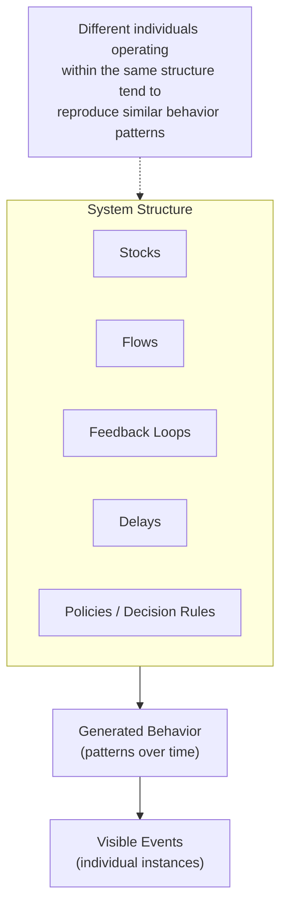
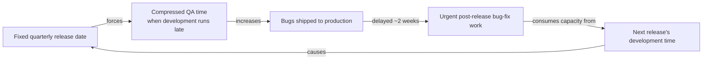

## Recognizing How Structure Generates Behavior

### Definition and Scope

**Recognizing How Structure Generates Behavior** is the systems-thinking principle holding that the observable behavior of a system — its patterns, trends, and recurring problems — is produced by the system's underlying structure (its stocks, flows, feedback loops, delays, and policies), rather than by the personalities, competence, or intentions of the individuals acting within it. This principle is frequently summarized by the maxim, most closely associated with systems dynamicist Jay Forrester and popularized in organizational contexts, that **"structure drives behavior."** It represents a fundamental reorientation from event- and person-level explanation toward structural explanation, and it directly underlies the systems-thinking practice of intervening in systems by redesigning structure rather than by replacing people or issuing one-off directives.

### The Core Claim

**Key Points**

- Given the same structure, different individuals placed into a system will tend to produce similar patterns of behavior over time, because the structure — not the individuals — is the primary generator of the pattern
- This does not claim that individual variation has zero effect; it claims that structure sets the range and tendency of behavior, and individual variation operates within that structurally determined range
- The claim shifts the primary unit of analysis and intervention from the person to the system's arrangement of stocks, flows, feedback loops, and decision rules

**Example**

If a call center's compensation structure rewards agents purely for call volume (calls handled per hour) rather than resolution quality, replacing underperforming agents with new hires will tend to reproduce the same pattern — short, rushed calls and high callback rates — because the structure itself creates the incentive to rush, regardless of who occupies the role.

### Distinguishing Structural Explanation from Personal/Event Explanation

| Explanation Type | Example Statement | Implied Intervention |
| --- | --- | --- |
| Personal/dispositional | "The team lead is disorganized." | Replace or retrain the team lead |
| Event-based | "We missed the deadline because of last week's server outage." | Prevent that specific server outage |
| **Structural** | "Deadlines are missed because the project approval structure requires sequential sign-offs from four departments with no parallel review path." | Redesign the approval structure |

**Example**

A hospital observes that emergency department wait times remain persistently long despite multiple rounds of staff turnover and retraining. A structural explanation asks what arrangement — bed availability, discharge timing, staffing schedules, triage protocols — remains constant across all these personnel changes and continues to generate the same wait-time pattern regardless of who staffs the department.

### The Structural Elements That Generate Behavior

**Key Points**

- **Stocks**: accumulations (inventory, backlog, trust, skill, morale) whose current level constrains what behavior is possible
- **Flows**: rates of change into and out of stocks (hiring rate, attrition rate, production rate) that determine how quickly stocks shift
- **Feedback loops**: closed circuits of influence (reinforcing or balancing) that connect flows and stocks back to the decisions that affect them
- **Delays**: time lags between an action and its visible effect, which shape whether a system's behavior is smooth, oscillating, or unstable
- **Policies/decision rules**: the explicit or implicit rules that determine how decision-makers within the system respond to information (e.g., "reorder when inventory drops below X")

### Diagram: Structure as the Behavior Generator

### Worked Example: A Classic Structural Case

**Scenario**: A software company experiences a recurring pattern in which every product release is followed within two weeks by a spike in urgent bug-fix work that disrupts planned development for the next release.

**Personal-level explanation (rejected as incomplete)**: "The developers aren't testing thoroughly enough before release."

**Structural investigation**:

1. The release schedule is fixed on a quarterly calendar regardless of a feature's actual readiness (a **policy**).
2. Quality-assurance testing time is treated as a flexible buffer that gets compressed whenever development runs behind schedule (a **flow** allocation rule).
3. There is no dedicated stock of "tested and verified" features maintained ahead of the release date; testing happens just-in-time under schedule pressure.
4. The delay between a rushed release and the discovery of resulting bugs is roughly two weeks — long enough that the connection to the compressed testing phase is not obvious to the team living through it.

**Structural diagram**:

**Conclusion**: This reveals a reinforcing loop in which the fixed release-date policy itself generates the recurring "late development pressures QA, which generates post-release bugs, which delays the next release" pattern. Replacing developers or QA staff, without changing the fixed-date policy or the testing-time allocation rule, would very likely reproduce the same pattern with new personnel, because the structure — not the specific people — generates it.

[Inference] This scenario is a synthesized, illustrative case built from commonly documented software-delivery dynamics (schedule pressure compressing QA); it is not drawn from a specific named company's data, and actual root causes in any real organization would need to be confirmed through direct investigation rather than assumed from this general pattern.

### Relationship to Feedback Loops and the Iceberg Model

**Key Points**

- This habit is the direct continuation of the Iceberg Model's third level (Structure), and this topic essentially unpacks what it means to reach and act on that level
- Recognizing structure as the behavior generator is what makes reinforcing and balancing feedback loops analytically actionable: once a loop is identified, it becomes clear that the loop itself — not any single actor in it — sustains the pattern
- It reframes "Recognizes the circular nature of complex cause-and-effect relationships" (a related core habit) from a perceptual skill into an explanatory commitment: circularity is treated as the mechanism generating behavior, not just an interesting observation

### Structural Leverage: Why This Recognition Matters for Intervention

**Key Points**

- Donella Meadows' hierarchy of leverage points places structural elements (feedback loop strength, information flow structure, rules of the system) well above simple parameter adjustments (numeric targets, buffer sizes) in terms of their power to produce durable change
- Recognizing that structure generates behavior is the conceptual prerequisite for seeking leverage at the structural level rather than settling for lower-leverage parameter tweaks or, worse, purely personnel-level interventions that leave the generating structure untouched
- [Inference] The relative "power" of different leverage points, as ranked in Meadows' original hierarchy, is presented in her work as a reasoned ordering based on systems-dynamics theory and case examples rather than as a strictly, universally quantified ranking; practitioners generally treat it as a directionally reliable heuristic rather than an exact formula.

### Common Pitfalls

**Key Points**

- **Structural fatalism**: over-applying this principle to excuse all individual accountability entirely, treating every poor outcome as purely structural even in cases where genuine individual negligence, skill gaps, or misconduct are legitimate contributing factors
- **Premature structural diagnosis**: asserting a structural explanation before verifying that the same pattern actually recurs across different individuals; if a problem is genuinely unique to one person's specific actions and does not recur when that person is replaced, the explanation may in fact be more personal/event-level than structural
- **Structure-blindness under pressure**: reverting to "find and fix the person" explanations during a crisis, when time pressure discourages the more demanding work of structural analysis
- **Confusing policy with structure**: treating a single written rule as the entire structure, when the actual generative structure often includes unwritten norms, informal information flows, and incentive effects that operate alongside or independently of official policy

### Diagnostic Test for Structural vs. Personal Explanation

**Steps**

1. Identify the recurring behavior pattern in question.
2. Ask: "If every individual currently involved in this system were replaced with different people tomorrow, would this pattern likely persist?"
3. If the honest answer is "yes, it would likely persist," the explanation is primarily structural, and intervention should target stocks, flows, feedback loops, delays, or policies.
4. If the honest answer is "no, this specific pattern seems tied to specific individuals' actions," investigate further before assuming a structural cause, since the pattern may genuinely be personal/event-level, or it may be a structural issue that has not yet been correctly identified.
5. Where structural, map the specific feedback loop or policy responsible before proposing an intervention, following the "Distinguishing Events, Patterns, and Structures" workflow.

### Diagram: Structure vs. Personnel Persistence Test (svg_diagram)

<svg xmlns="http://www.w3.org/2000/svg" viewBox="0 0 900 380" font-family="Arial, sans-serif">
<text x="450" y="28" text-anchor="middle" font-size="17" font-weight="bold" fill="#1a1a1a">Structural Persistence Test (svg_diagram)</text>
<rect x="340" y="55" width="220" height="60" rx="10" fill="#2c3e50" />
<text x="450" y="90" text-anchor="middle" font-size="13" fill="#ffffff">Recurring Behavior Pattern</text>
<polygon points="450,140 600,200 450,260 300,200" fill="#f39c12" />
<text x="450" y="195" text-anchor="middle" font-size="10" fill="#1a1a1a">Would pattern persist</text>
<text x="450" y="210" text-anchor="middle" font-size="10" fill="#1a1a1a">with new people?</text>
<rect x="80" y="300" width="220" height="60" rx="10" fill="#8e44ad" />
<text x="190" y="335" text-anchor="middle" font-size="13" fill="#ffffff">Structural Cause</text>
<rect x="600" y="300" width="220" height="60" rx="10" fill="#c0392b" />
<text x="710" y="335" text-anchor="middle" font-size="13" fill="#ffffff">Investigate Personal/</text>
<text x="710" y="350" text-anchor="middle" font-size="11" fill="#ffffff">Event-Level Factors</text>
<line x1="450" y1="115" x2="450" y2="140" stroke="#555" stroke-width="2" marker-end="url(#a3)" />
<line x1="380" y1="230" x2="230" y2="300" stroke="#555" stroke-width="2" marker-end="url(#a3)" />
<text x="290" y="270" font-size="12" fill="#1a1a1a">Yes</text>
<line x1="520" y1="230" x2="670" y2="300" stroke="#555" stroke-width="2" marker-end="url(#a3)" />
<text x="600" y="270" font-size="12" fill="#1a1a1a">No</text>
</svg>

### Practical Exercise

**Steps**

1. Identify a recurring problem in an organization or system you know well, one that has persisted across at least one change in personnel.
2. Apply the persistence test: would this pattern likely continue if every current participant were replaced?
3. If structural, list the stocks, flows, feedback loops, delays, and policies you believe are involved, and sketch a simple causal loop diagram connecting them.
4. Identify the specific policy or information-flow element within that structure that, if changed, would most directly interrupt the pattern.
5. Contrast this structural intervention with what a purely personnel-focused response (retraining, replacement, discipline) would look like, and note what each approach would leave unaddressed.

### Related Topics

- Systems Thinking Iceberg Model
- Distinguishing Events, Patterns, and Structures
- Feedback Loops: Reinforcing vs. Balancing
- Stocks and Flows
- Leverage Points (Donella Meadows)
- Systems Archetypes
- Habits of a Systems Thinker
- Mental Models and Their Role Beneath Structure