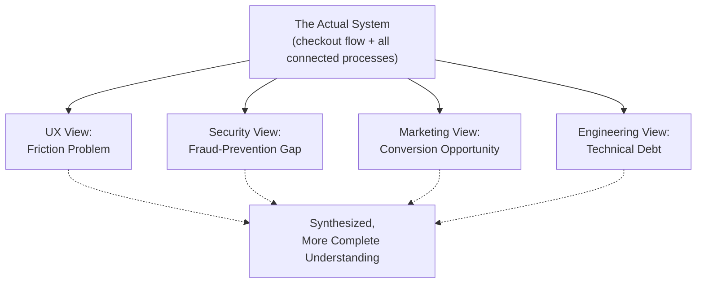

## Seeking Multiple Perspectives on a Problem

### Definition and Scope

**Seeking Multiple Perspectives on a Problem** is the systems-thinking habit of deliberately viewing a situation from more than one stakeholder's, discipline's, or vantage point's frame of reference before forming a conclusion or designing an intervention. It rests on the systems-thinking premise that no single observer, positioned at a single point within or around a system, can perceive the whole system directly; each vantage point reveals certain relationships and structures while obscuring others. This habit directly counters a natural cognitive tendency to treat one's own immediate, professional, or organizational vantage point as if it were a complete and objective view of the entire system.

### Why a Single Perspective Is Structurally Insufficient

**Key Points**

- Every stakeholder occupies a specific position within a system's structure (a role, a department, a boundary condition), and that position determines which flows, feedback loops, and delays are directly visible to them and which are not
- Information within complex systems is typically distributed and partial; no single node in an organizational or social network has complete visibility into the whole
- Mental models differ systematically by role, training, and incentive structure, meaning that different stakeholders may interpret the identical event or data differently even when their observations are factually consistent
- A single-perspective analysis risks conflating "what this problem looks like from where I stand" with "what this problem actually is" across the full system

**Example**

A software product's checkout flow simultaneously appears as a "friction problem" to the UX team, a "fraud-prevention gap" to the security team, a "conversion-rate optimization opportunity" to marketing, and a "technical-debt liability" to engineering. Each team is accurately describing a real aspect of the same system component from its own vantage point; none alone describes the complete picture.

### The Structural Basis: The Blind Men and the Elephant as a Systems Metaphor

**Key Points**

- The classic parable in which several blind men each touch a different part of an elephant (trunk, ear, leg, tail) and each describes a completely different animal is frequently used in systems-thinking literature to illustrate this habit
- The parable's systemic lesson is not merely "everyone has an opinion," but specifically that each partial description is locally accurate and globally incomplete, and that a complete description requires deliberately synthesizing multiple partial views rather than selecting the single "correct" one
- This maps directly onto systems boundaries: each stakeholder's perceptual boundary captures a genuine subsystem, but treating any one subsystem's view as the whole system produces systematic distortion

### Diagram: Perspective-Dependent System Views

### Categories of Perspective-Seeking

#### 1. Stakeholder Perspective-Taking

**Key Points**

- Deliberately considering how each affected party (customer, employee, supplier, regulator, competitor) experiences and interprets the same situation
- Often operationalized through stakeholder mapping, which identifies who is affected by and who has influence over a given system element

**Example**

When redesigning a hospital's patient intake process, stakeholder perspective-taking considers the patient (waiting time, anxiety), the intake nurse (workload, information completeness), the billing department (data accuracy for claims), and hospital administration (throughput metrics) as four distinct, legitimate vantage points on the same process.

#### 2. Disciplinary/Domain Perspective-Taking

**Key Points**

- Deliberately applying the analytical lens of a different professional or academic discipline to the same problem
- Recognizes that disciplines are themselves specialized vantage points, each with characteristic mental models, vocabularies, and default assumptions about what matters

**Example**

Analyzing rising urban traffic congestion through an engineering lens (road capacity, signal timing) yields different levers than analyzing the same congestion through an economic lens (congestion pricing, externalities) or a behavioral-psychology lens (habit formation around mode choice).

#### 3. Temporal Perspective-Taking

**Key Points**

- Considering how the same situation would be assessed by someone viewing it before it developed, during its unfolding, and well after its consequences have played out
- Complements the "Considering Short-Term and Long-Term Consequences" habit by applying a perspective shift specifically along the time dimension rather than the stakeholder dimension

#### 4. Scale Perspective-Taking

**Key Points**

- Considering the same phenomenon at different levels of scale: individual, team, organizational, industry, or societal
- A pattern that appears dysfunctional at one scale (e.g., an individual employee's risk-averse behavior) may appear rational or even optimal at another scale (e.g., an organizational incentive structure that punishes visible failure more than it punishes invisible stagnation)

#### 5. Adversarial/Opposing Perspective-Taking

**Key Points**

- Deliberately constructing the strongest possible case for a position the analyst does not currently hold, functioning similarly to a formal "red team" or "devil's advocate" role
- Protects against the pitfall of only gathering perspectives that already tend to confirm an existing hypothesis

### Worked Example: Applying Multiple Perspectives to a Policy Problem

**Scenario**: A city is deciding whether to implement a congestion-pricing scheme in its downtown core.

| Perspective | Key Concerns Surfaced |
| --- | --- |
| Commuter (private vehicle) | Increased daily cost; perceived unfairness if alternatives are inadequate |
| Public transit rider | Potential for improved bus speeds if car volume drops; interest in whether pricing revenue funds transit improvements |
| Small downtown business owner | Concern over reduced customer foot traffic; interest in delivery-vehicle exemptions |
| City budget office | Interest in net revenue after administrative costs; interest in how revenue is earmarked |
| Environmental health advocate | Interest in air-quality improvements from reduced idling and congestion |
| Low-income resident in an outer district | Concern that pricing disproportionately burdens those without transit access, who must drive out of necessity |

**Systemic synthesis**: Considered together, these perspectives do not simply "average out" to a single recommendation; rather, they reveal a structural design question the single-perspective analyses individually miss — namely, that the scheme's overall effect depends heavily on how transit alternatives and pricing exemptions are structured for those without viable alternatives, a factor that is invisible if only the commuter or budget-office perspective is consulted.

[Inference] This worked example illustrates a generic and commonly discussed pattern in congestion-pricing policy debates; the specific stakeholder concerns and their relative weight would vary by city, and a real policy analysis would require direct local stakeholder consultation rather than the generic perspectives listed here.

### Techniques for Systematically Gathering Perspectives

| Technique | Description | Best Suited For |
| --- | --- | --- |
| Stakeholder interviews | Direct, structured conversations with representatives of each affected group | Deep, qualitative understanding of a specific perspective |
| Role-play / perspective rotation | Team members deliberately argue from an assigned stakeholder's viewpoint | Rapid, low-cost internal exploration of multiple views |
| Cross-functional workshops | Bringing multiple departments into the same room to map the same problem jointly | Surfacing interdependencies and disagreements directly |
| Red-teaming | A designated subgroup argues explicitly against the prevailing conclusion | Testing robustness of an emerging consensus |
| Survey/data triangulation | Comparing quantitative data collected from or about different stakeholder groups | Validating whether qualitative perspective differences are reflected in behavior/outcome data |

### Common Pitfalls

**Key Points**

- **Perspective collection without synthesis**: gathering many viewpoints but failing to integrate them into a coherent systemic picture, leaving the team with a list of competing opinions rather than a deeper structural understanding
- **False equivalence**: treating all perspectives as equally weighted or equally well-informed regardless of their proximity to and depth of experience with the actual system dynamics in question
- **Perspective-seeking as delay tactic**: using "we need more input" indefinitely to avoid making a necessary decision, rather than treating perspective-gathering as a bounded, purposeful phase of analysis
- **Token consultation**: soliciting a stakeholder's perspective without genuine intention to let it influence the analysis, which can also damage trust with that stakeholder group going forward
- **Perspective substitution for evidence**: treating a stakeholder's stated perspective as equivalent to objective data about system behavior, when perspectives are themselves shaped by partial information and should be triangulated against other evidence where possible

### Diagram: Perspective Synthesis Process (svg_diagram)

<svg xmlns="http://www.w3.org/2000/svg" viewBox="0 0 900 400" font-family="Arial, sans-serif">
<text x="450" y="28" text-anchor="middle" font-size="17" font-weight="bold" fill="#1a1a1a">Perspective Synthesis Process (svg_diagram)</text>
<circle cx="150" cy="150" r="55" fill="#2980b9" />
<text x="150" y="146" text-anchor="middle" font-size="11" fill="#ffffff">Stakeholder</text>
<text x="150" y="162" text-anchor="middle" font-size="11" fill="#ffffff">A</text>
<circle cx="330" cy="90" r="55" fill="#27ae60" />
<text x="330" y="86" text-anchor="middle" font-size="11" fill="#ffffff">Stakeholder</text>
<text x="330" y="102" text-anchor="middle" font-size="11" fill="#ffffff">B</text>
<circle cx="330" cy="230" r="55" fill="#c0392b" />
<text x="330" y="226" text-anchor="middle" font-size="11" fill="#ffffff">Stakeholder</text>
<text x="330" y="242" text-anchor="middle" font-size="11" fill="#ffffff">C</text>
<circle cx="150" cy="290" r="55" fill="#8e44ad" />
<text x="150" y="286" text-anchor="middle" font-size="11" fill="#ffffff">Stakeholder</text>
<text x="150" y="302" text-anchor="middle" font-size="11" fill="#ffffff">D</text>
<rect x="520" y="140" width="280" height="100" rx="12" fill="#2c3e50" />
<text x="660" y="180" text-anchor="middle" font-size="13" fill="#ffffff">Synthesized Systemic</text>
<text x="660" y="200" text-anchor="middle" font-size="13" fill="#ffffff">Understanding</text>
<text x="660" y="220" text-anchor="middle" font-size="11" fill="#ffffff">(reveals interdependencies</text>
<line x1="200" y1="150" x2="520" y2="185" stroke="#7f8c8d" stroke-width="2" />
<line x1="380" y1="100" x2="520" y2="170" stroke="#7f8c8d" stroke-width="2" />
<line x1="380" y1="220" x2="520" y2="205" stroke="#7f8c8d" stroke-width="2" />
<line x1="200" y1="285" x2="520" y2="220" stroke="#7f8c8d" stroke-width="2" />
</svg>

### Relationship to Other Habits

| Related Habit | Connection |
| --- | --- |
| Seeing Interconnections Rather Than Isolated Events | Different perspectives often reveal different connections; synthesizing perspectives surfaces relationships invisible from any single view |
| Asking Systemic Questions | "Perspective questions" are one of the core systemic question categories, directly generating this habit's practice |
| Recognizing How Structure Generates Behavior | Different stakeholders often occupy different positions within the same generative structure, so their perspectives collectively help map that structure more completely |

### Practical Exercise

**Steps**

1. Select a current problem or decision you are analyzing from primarily one vantage point (your own role, department, or discipline).
2. List at least four other stakeholders or disciplinary lenses that are meaningfully affected by or influential over this same situation.
3. For each, write two or three sentences describing how the problem would look from that vantage point, using their likely priorities, constraints, and available information, not your own.
4. Identify at least one factor or relationship that becomes visible only when comparing two or more of these perspectives side by side, and that was invisible from your original single vantage point.
5. Revise your original problem statement to explicitly incorporate this newly surfaced factor.

### Related Topics

- Systems Thinking Iceberg Model
- Stakeholder Mapping
- Asking Systemic Questions
- Seeing Interconnections Rather Than Isolated Events
- Mental Models and Their Role Beneath Structure
- Habits of a Systems Thinker
- Red-Teaming and Devil's Advocacy Techniques
- Systems Boundaries and Boundary Critique