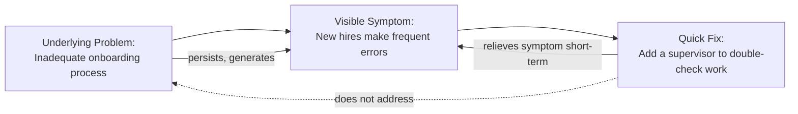
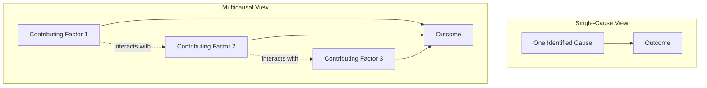

## Resisting Quick Fixes and Single-Cause Explanations

### Definition and Scope

**Resisting Quick Fixes and Single-Cause Explanations** is the systems-thinking discipline of deliberately delaying closure on a diagnosis or solution until multiple contributing causes and their interactions have been considered, rather than accepting the first plausible explanation or the fastest available remedy. This habit operates as a check on two related cognitive shortcuts: **monocausality** (attributing an outcome to a single cause when multiple interacting causes are typically present in complex systems) and **symptomatic fixing** (applying an intervention that relieves a visible symptom without addressing the structure that produces it). Both shortcuts are efficient in the short term and frequently reinforced by organizational pressure for rapid answers, which is precisely why resisting them must be practiced as a deliberate habit rather than assumed to occur naturally.

### Why Quick Fixes and Single Causes Are the Default

**Key Points**

- Single-cause explanations satisfy a cognitive preference for simple, closed narratives and assign clear, actionable responsibility, which feels more resolvable than an open, multi-causal account
- Quick fixes are rewarded by organizational incentive structures that measure and reward visible, immediate resolution of a reported problem, rather than the durability of that resolution
- Complex systems typically exhibit **equifinality** (multiple different causal pathways can produce the same observed outcome) and **multifinality** (the same cause can produce different outcomes depending on context), both of which make single-cause explanations structurally likely to be incomplete or simply wrong
- Time pressure and crisis conditions specifically suppress the more effortful cognitive process required to consider multiple interacting causes, making this exactly the condition under which the habit is both most needed and least naturally present

### The Structural Link to "Fixes That Fail"

**Key Points**

- A quick fix addresses the visible symptom of a problem while leaving its underlying structural cause intact, and where the underlying cause continues generating the same symptom over time
- This is the generative mechanism behind the "Fixes That Fail" systems archetype: the fix appears successful in the short term precisely because it targets the symptom directly, which delays recognition that the underlying structure was never addressed
- Resisting the quick fix is therefore not simply about being more careful or more patient; it is about recognizing that speed and thoroughness trade off against different points in a system's structure (symptom vs. root cause)

**Example**

The supervisor double-check relieves the visible symptom (errors reaching customers) without touching the structural cause (the onboarding process itself), so the underlying error-generating capacity of new hires remains unchanged, and the organization now also carries the ongoing cost of the supervisory layer indefinitely.

### Multicausality: Why Single-Cause Explanations Usually Fail in Complex Systems

**Key Points**

- Complex systems typically involve multiple interacting factors operating at different structural levels (individual, process, organizational, environmental) that jointly produce an observed outcome
- Isolating any one of these factors and declaring it "the cause" typically reflects where investigation stopped rather than where causal influence actually stopped
- A useful test: if removing only the identified "single cause" would not plausibly have prevented the outcome given the other contributing factors still present, the explanation is very likely incomplete

**Example**

An airplane accident investigation that concludes "pilot error" as the sole cause, without also examining contributing factors such as maintenance scheduling pressure, ambiguous cockpit instrumentation design, air traffic control communication protocols, and regulatory oversight gaps, is very likely to have stopped short of the full causal structure — a pattern well documented in aviation-safety investigation methodology, which formally requires multi-factor causal analysis (e.g., root-cause and contributing-factor frameworks) precisely because single-cause conclusions have historically proven insufficient to prevent recurrence.

### Diagram: Single-Cause vs. Multicausal Investigation

### The Iceberg-Model Connection

**Key Points**

- Resisting quick fixes is closely tied to the earlier habit of distinguishing events, patterns, and structures: a quick fix is characteristically an event-level response applied to what is, upon closer analysis, a pattern or structural-level problem
- The discipline required here is essentially procedural: delaying the move to "fix it" until the diagnostic process has reached at least the pattern level, and ideally the structural level, before committing to an intervention

### A Structured Procedure for Resisting Premature Closure

**Steps**

1. When a problem is first reported, explicitly label the initially proposed explanation as a **hypothesis**, not a conclusion, regardless of how plausible it seems.
2. Apply the "five whys" or an equivalent iterative questioning technique, but extend it laterally at each step: at each "why," ask not only "what is the next cause" but also "what else might also be a contributing cause at this same step."
3. Actively seek at least one alternative explanation that competes with the leading hypothesis, and identify what evidence would distinguish between them.
4. Before implementing a proposed fix, explicitly ask whether it addresses a symptom, a pattern, or a structural cause (see "Distinguishing Events, Patterns, and Structures"), and document this classification.
5. If the fix addresses a symptom rather than a structural cause, either escalate the analysis toward the structural level before proceeding, or explicitly and consciously accept the fix as a temporary, symptom-level stopgap while a structural investigation continues in parallel.
6. After implementation, schedule a follow-up review timed to occur after any known feedback delay has had time to elapse, specifically checking for recurrence or a "fixes that fail" reversal pattern.

### Worked Example: A Complete Case

**Scenario**: A manufacturing plant experiences an increase in defective units on a specific production line.

**Premature single-cause conclusion**: "The new machine operator isn't calibrating the equipment correctly." Proposed quick fix: retrain the operator.

**Resisting closure — lateral "five whys plus" analysis**:

1. Why are defect rates up? → Calibration appears inconsistent.
2. What else could affect calibration consistency, besides operator skill? → Equipment wear, raw material variability, ambient temperature/humidity changes, and shift-handoff documentation quality.
3. Investigation reveals: the machine's calibration sensor has an undocumented drift issue that worsens with ambient temperature — the new operator happened to start during a seasonal temperature shift, timing that made the sensor drift look like an operator-skill problem.
4. Cross-checking with historical data: the previous, experienced operator's defect rate also rose slightly during the same seasonal window in the prior year, though the increase was smaller and had been dismissed at the time as normal variation.

**Structural conclusion**: The primary structural cause is an uncalibrated response to ambient temperature in the sensor's design or maintenance schedule, not operator competence; the new operator's timing coincided with, but did not solely cause, the increased defect rate.

**Consequence of the resisted quick fix**: Had the plant proceeded directly to retraining, the sensor drift issue would have remained unaddressed, and the defect pattern would very likely have recurred — including with the retrained operator — during the next seasonal temperature shift.

[Inference] This worked example is constructed for illustrative purposes to demonstrate the lateral-questioning technique; it is not drawn from a specific documented manufacturing incident, and any real defect-rate investigation would require actual sensor and environmental data to confirm the proposed structural cause rather than accepting it as established fact.

### Common Pitfalls in Attempting This Habit

**Key Points**

- **Analysis paralysis**: over-applying this habit to the point that no decision is ever made, using "we need to consider more causes" as an indefinite delay tactic rather than a bounded diagnostic phase
- **False multicausality**: listing many superficially plausible contributing factors without weighting or testing them, producing an unfocused analysis that provides no more actionable insight than the single-cause explanation it was meant to replace
- **Conflating "resisting quick fixes" with "avoiding all near-term action"**: a legitimate structural investigation can often run in parallel with a consciously chosen, temporary symptomatic stopgap, provided the stopgap is explicitly labeled as temporary and the structural investigation is not abandoned once the symptom is relieved
- **Selective multicausality**: acknowledging multiple causes in principle but privately treating one preferred cause as primary and only superficially investigating the others, defeating the purpose of the multicausal analysis

### Comparison Table: Quick-Fix Mode vs. Resisting-Closure Mode

| Aspect | Quick-Fix / Single-Cause Mode | Resisting-Closure Mode |
| --- | --- | --- |
| Time to first proposed solution | Fast | Deliberately delayed pending investigation |
| Number of causes considered | One | Multiple, explicitly weighted |
| Typical target of intervention | Symptom | Structure (where investigation supports it) |
| Risk of recurrence | Higher, especially on a delay | Lower, if structural cause correctly identified |
| Resource cost upfront | Lower | Higher (more investigation time/effort) |
| Resource cost over time | Potentially higher (repeated fixes) | Potentially lower (addressed at the source) |

### Diagram: Resisting Premature Closure — Process Flow (svg_diagram)

<svg xmlns="http://www.w3.org/2000/svg" viewBox="0 0 900 400" font-family="Arial, sans-serif">
<text x="450" y="28" text-anchor="middle" font-size="17" font-weight="bold" fill="#1a1a1a">Resisting Premature Closure (svg_diagram)</text>
<rect x="60" y="80" width="180" height="60" rx="10" fill="#2980b9" />
<text x="150" y="115" text-anchor="middle" font-size="12" fill="#ffffff">Initial Hypothesis</text>
<rect x="290" y="80" width="180" height="60" rx="10" fill="#27ae60" />
<text x="380" y="105" text-anchor="middle" font-size="12" fill="#ffffff">Lateral "Five Whys</text>
<text x="380" y="123" text-anchor="middle" font-size="12" fill="#ffffff">Plus" Expansion</text>
<rect x="520" y="80" width="180" height="60" rx="10" fill="#c0392b" />
<text x="610" y="105" text-anchor="middle" font-size="12" fill="#ffffff">Seek Competing</text>
<text x="610" y="123" text-anchor="middle" font-size="12" fill="#ffffff">Explanation</text>
<rect x="750" y="80" width="120" height="60" rx="10" fill="#8e44ad" />
<text x="810" y="115" text-anchor="middle" font-size="11" fill="#ffffff">Weigh Evidence</text>
<rect x="290" y="220" width="320" height="70" rx="10" fill="#d35400" />
<text x="450" y="250" text-anchor="middle" font-size="12" fill="#ffffff">Classify Fix: Symptom, Pattern,</text>
<text x="450" y="268" text-anchor="middle" font-size="12" fill="#ffffff">or Structural Level?</text>
<rect x="290" y="330" width="320" height="55" rx="10" fill="#16a085" />
<text x="450" y="362" text-anchor="middle" font-size="12" fill="#ffffff">Implement + Schedule Delayed Review</text>
<line x1="240" y1="110" x2="290" y2="110" stroke="#555" stroke-width="2" marker-end="url(#a4)" />
<line x1="470" y1="110" x2="520" y2="110" stroke="#555" stroke-width="2" marker-end="url(#a4)" />
<line x1="700" y1="110" x2="750" y2="110" stroke="#555" stroke-width="2" marker-end="url(#a4)" />
<line x1="810" y1="140" x2="450" y2="220" stroke="#555" stroke-width="2" marker-end="url(#a4)" />
<line x1="450" y1="290" x2="450" y2="330" stroke="#555" stroke-width="2" marker-end="url(#a4)" />
</svg>

### Relationship to Other Habits

| Related Habit | Connection |
| --- | --- |
| Distinguishing Events, Patterns, and Structures | Quick fixes are characteristically pitched at the event level; resisting them means insisting on reaching the pattern/structure level first |
| Recognizes How Structure Generates Behavior | The structural cause this habit seeks is precisely the kind of generative structure described in that habit |
| Considering Short-Term and Long-Term Consequences | A quick fix's short-term relief and its long-term recurrence risk are exactly the divergence that time-horizon thinking is designed to catch |
| Asking Systemic Questions | Structural and pattern questions are the specific tools used to resist a premature single-cause answer |

### Practical Exercise

**Steps**

1. Recall a recent problem where you or your team arrived quickly at a single explanation and a fast fix.
2. List at least three additional plausible contributing factors beyond the one originally identified.
3. For each additional factor, identify one piece of evidence that would support or rule it out.
4. Classify the fix that was actually implemented: did it target a symptom, a pattern, or a structural cause?
5. If symptom-level, describe what a structural-level investigation would look like, and identify a realistic timeframe at which the original symptom would be expected to reappear if the structural cause remains unaddressed.

### Related Topics

- Systems Archetypes: Fixes That Fail, Shifting the Burden
- Distinguishing Events, Patterns, and Structures
- Recognizing How Structure Generates Behavior
- Root Cause Analysis and Contributing-Factor Analysis
- Considering Short-Term and Long-Term Consequences
- Asking Systemic Questions
- Habits of a Systems Thinker
- Cognitive Biases in Causal Attribution