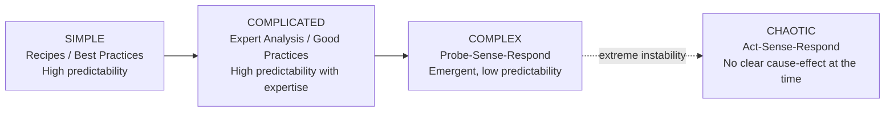

## Simple, Complicated, and Complex Systems

### Definition and Scope

**Simple, Complicated, and Complex Systems** is a foundational classification scheme in systems thinking that categorizes systems according to the nature of their component relationships, predictability, and the kind of knowledge required to understand and act on them. This tripartite distinction (sometimes extended to a fourth category, **chaotic**, as in the Cynefin framework) is essential because each category demands a fundamentally different analytical approach and a different style of intervention; applying a simple-system approach (fixed recipes, best practices) to a complex system, or an overly elaborate complex-system approach to a genuinely simple problem, is a common and consequential category error.

### Simple Systems

**Key Points**

- Composed of few components with linear, fixed, and highly predictable relationships between cause and effect
- Best practices exist and can be reliably followed by anyone with basic training, producing consistent, repeatable results
- The relationship between inputs and outputs is stable over time and does not change based on who is performing the task or the specific context, within normal operating conditions
- Governed by clear, static rules; once understood, the system's behavior can be fully anticipated

**Example**

Following a standardized recipe to bake a basic loaf of bread: given the same ingredients, quantities, oven temperature, and baking time, the outcome is highly predictable and repeatable regardless of who follows the recipe, provided basic technique is followed correctly.

### Complicated Systems

**Key Points**

- Composed of many components with relationships that, while more intricate than simple systems, are ultimately knowable, analyzable, and decomposable through expertise
- Cause and effect are still determinable, but doing so typically requires specialized knowledge, expert analysis, or engineering-level understanding rather than a simple recipe
- Complicated systems are generally still predictable: given sufficient expertise and analysis, outcomes can be reliably forecast and reproduced, and the same expert intervention will tend to produce the same result across similar instances
- Good practices (rather than universal best practices) tend to apply, since some variation in optimal approach exists depending on expert judgment, but the range of viable approaches is still relatively bounded and learnable

**Example**

Building a commercial aircraft involves an enormous number of components and specialized subsystems (aerodynamics, propulsion, avionics, materials science), but the relationships between these components are governed by well-understood physical and engineering principles; teams of aerospace engineers can reliably design, analyze, and reproduce working aircraft using established engineering methods.

### Complex Systems

**Key Points**

- Composed of many components whose interactions are non-linear, dynamic, and context-dependent, such that the system's overall behavior cannot be reliably predicted or fully decomposed from knowledge of its individual parts
- Exhibits **emergence**: system-level properties and behaviors arise from component interactions that are not present in, or predictable from, any individual component in isolation
- Relationships between cause and effect are often only clear in retrospect (post-hoc), and the same intervention applied twice, even under seemingly similar conditions, can produce different outcomes due to feedback loops, adaptation, and sensitivity to initial conditions
- Involves adaptive agents (people, organisms, organizations) that change their behavior in response to the system itself and to interventions within it, meaning the system is not static but co-evolves with attempts to understand or manage it
- Best and even good practices are generally unreliable; instead, practitioners typically rely on **probing, sensing, and responding** — running small experiments, observing emergent results, and adapting accordingly

**Example**

Raising a child, managing an organizational culture, or responding to a fast-moving public health crisis are complex systems: the same parenting approach, management technique, or public health intervention can produce different outcomes in different children, teams, or populations, because each involves adaptive agents whose responses are shaped by feedback, individual history, and context that cannot be fully specified or controlled in advance.

### Comparative Table: Core Distinctions

| Dimension | Simple | Complicated | Complex |
| --- | --- | --- | --- |
| Number of interacting elements | Few | Many | Many |
| Nature of relationships | Linear, fixed | Intricate but analyzable | Non-linear, dynamic, context-dependent |
| Predictability | High | High, given expertise | Low; often only clear in hindsight |
| Repeatability of outcome | High | High | Low; same action can yield different results |
| Presence of adaptive agents | Typically absent | Typically absent or limited | Central feature |
| Emergent properties | Absent | Rare or minimal | Central feature |
| Governing knowledge type | Best practices / recipes | Expert good practices | Heuristics, probing, sensing, adapting |
| Example | Following a recipe | Building an aircraft | Raising a child; organizational culture |

### Diagram: The Simple-Complicated-Complex Spectrum

Note: The **Chaotic** domain is commonly appended to this classification, most notably in Dave Snowden's **Cynefin framework**, to describe situations with such turbulence that no clear cause-and-effect relationship is even discernible in the moment, requiring immediate stabilizing action before any analysis is possible. The core three-part classification (Simple, Complicated, Complex) is the version most directly associated with foundational systems-thinking pedagogy; the Cynefin extension is a related but distinct, more formalized decision-framework often introduced alongside it.

### Why the Distinction Matters for Intervention Strategy

**Key Points**

- **Simple-system approach**: standardize and follow the established best practice; deviation from the recipe is the primary risk to manage
- **Complicated-system approach**: commission or apply expert analysis; the primary task is thorough, competent decomposition and engineering-style problem-solving
- **Complex-system approach**: run small, safe-to-fail experiments (probes), closely observe the emergent results (sense), and adjust strategy based on what is learned (respond), rather than committing to a single large-scale plan based on upfront analysis alone

**Example of a category error**: Applying a rigid, standardized best-practice checklist (a simple-system approach) to organizational culture change (a complex system) typically fails, because the same checklist produces different results in different teams due to each team's distinct history, informal norms, and adaptive responses to the very fact of being managed — precisely the dynamics a simple-system approach assumes away.

### Worked Example: Classifying a Real-World Initiative

**Scenario**: A company wants to reduce employee turnover.

**Misclassification (as Simple)**: Leadership assumes a single best practice — raising salaries by a fixed percentage — will reliably fix turnover everywhere in the company, the way a recipe reliably produces the same bread.

**Better classification (as Complex)**: Turnover is driven by an interacting web of factors — team-specific management quality, individual career-stage expectations, local labor-market conditions, peer influence within teams, and evolving employee sentiment that changes in response to the company's own actions (including the salary increase itself, which may be perceived as insufficient, as fair, or as suspicious depending on context). The same salary increase could reduce turnover in one department while having negligible or even counterproductive effects in another, because employees are adaptive agents whose interpretation of the raise depends on team-specific history and expectations.

**Appropriate complex-system approach**: Run small pilot interventions (e.g., adjusted compensation in one division, expanded career-development conversations in another) as probes, closely monitor resulting turnover and engagement data over a period of months (sense), and scale or adjust based on what is actually observed rather than assuming a single company-wide fix in advance (respond).

[Inference] This worked example illustrates a widely discussed pattern in organizational-behavior literature regarding compensation and turnover; it is constructed for pedagogical purposes rather than drawn from a specific company's documented case study, and actual turnover drivers in any real organization would need to be empirically investigated rather than assumed from this general pattern.

### Relationship to Broader Systems-Thinking Concepts

| Related Concept | Connection |
| --- | --- |
| Recognizing How Structure Generates Behavior | In complicated systems, structure reliably generates predictable behavior; in complex systems, structure interacts with adaptive agents, making the same structure produce varying behavior |
| Feedback Loops | Complex systems are typically dense with feedback loops (especially reinforcing loops involving adaptive agents), which is a primary source of their unpredictability, whereas complicated systems have feedback loops that are more fully mapped and accounted for by expert models |
| Emergence | Emergence is a defining feature specifically of complex (not merely complicated) systems |
| Cynefin Framework | Extends this classification with a fourth "Chaotic" domain and a formal decision-making protocol matched to each domain |

### Common Pitfalls

**Key Points**

- **Complicating the simple**: applying expert-level, resource-intensive analysis to a genuinely simple, well-understood problem, wasting effort where a standard recipe would suffice
- **Simplifying the complex**: the most consequential and common error — treating a complex, adaptive system as if it were merely complicated, applying rigid expert plans that assume predictability the system does not actually have
- **Static classification**: assuming a system's classification is permanent, when systems can shift category over time (e.g., a technology that begins as complex during early development can become complicated, and eventually simple, once mature, standardized engineering practices are established)
- **False precision in complex domains**: presenting probe-sense-respond findings from complex-system experimentation with the same confidence and generalizability appropriate to complicated-system expert analysis, overstating how well a successful local probe will scale

### Diagnostic Questions for Classification

**Steps**

1. Ask: "If the same action is repeated under seemingly identical conditions, will it reliably produce the same result?" A confident "yes" suggests Simple or Complicated; an honest "not necessarily" suggests Complex.
2. Ask: "Are the agents involved (people, organizations, organisms) capable of changing their behavior in response to this system or to interventions within it?" If yes, lean toward Complex.
3. Ask: "Can an expert, given enough time and access to information, fully decompose this system into its component causal relationships?" If yes and no adaptive agents are involved, lean toward Complicated.
4. Ask: "Is there a single, widely applicable best practice that reliably works regardless of context?" If yes, lean toward Simple.
5. Reassess periodically: a system's classification may shift as it matures, as knowledge about it accumulates, or as the agents within it adapt.

### Diagram: Classification Decision Guide (svg_diagram)

<svg xmlns="http://www.w3.org/2000/svg" viewBox="0 0 900 380" font-family="Arial, sans-serif">
<text x="450" y="28" text-anchor="middle" font-size="17" font-weight="bold" fill="#1a1a1a">Classifying Simple, Complicated, or Complex (svg_diagram)</text>
<rect x="360" y="55" width="180" height="55" rx="10" fill="#2c3e50" />
<text x="450" y="88" text-anchor="middle" font-size="12" fill="#ffffff">Describe the System</text>
<polygon points="450,130 570,180 450,230 330,180" fill="#f39c12" />
<text x="450" y="175" text-anchor="middle" font-size="10" fill="#1a1a1a">Adaptive agents</text>
<text x="450" y="190" text-anchor="middle" font-size="10" fill="#1a1a1a">involved?</text>
<rect x="620" y="150" width="200" height="60" rx="10" fill="#8e44ad" />
<text x="720" y="185" text-anchor="middle" font-size="13" fill="#ffffff">COMPLEX</text>
<polygon points="450,260 570,310 450,360 330,310" fill="#f39c12" />
<text x="450" y="305" text-anchor="middle" font-size="10" fill="#1a1a1a">Requires expert</text>
<text x="450" y="320" text-anchor="middle" font-size="10" fill="#1a1a1a">decomposition?</text>
<rect x="60" y="280" width="200" height="60" rx="10" fill="#27ae60" />
<text x="160" y="315" text-anchor="middle" font-size="13" fill="#ffffff">COMPLICATED</text>
<rect x="360" y="330" width="180" height="50" rx="10" fill="#2980b9" />
<text x="450" y="360" text-anchor="middle" font-size="13" fill="#ffffff">SIMPLE</text>
<line x1="450" y1="110" x2="450" y2="130" stroke="#555" stroke-width="2" marker-end="url(#a5)" />
<line x1="570" y1="180" x2="620" y2="180" stroke="#555" stroke-width="2" marker-end="url(#a5)" />
<text x="590" y="170" font-size="11" fill="#1a1a1a">Yes</text>
<line x1="450" y1="230" x2="450" y2="260" stroke="#555" stroke-width="2" marker-end="url(#a5)" />
<text x="465" y="248" font-size="11" fill="#1a1a1a">No</text>
<line x1="330" y1="310" x2="260" y2="310" stroke="#555" stroke-width="2" marker-end="url(#a5)" />
<text x="290" y="300" font-size="11" fill="#1a1a1a">Yes</text>
<line x1="450" y1="360" x2="450" y2="380" stroke="#555" stroke-width="0" />
<line x1="450" y1="360" x2="450" y2="360" stroke="#555" stroke-width="0" />
<line x1="440" y1="345" x2="440" y2="345" stroke="#555" stroke-width="0" />
<line x1="420" y1="345" x2="420" y2="345" stroke="#555" stroke-width="0" />
<line x1="450" y1="360" x2="450" y2="360" stroke="none" />
<line x1="450" y1="345" x2="450" y2="330" stroke="#555" stroke-width="2" marker-end="url(#a5)" />
<text x="465" y="345" font-size="11" fill="#1a1a1a">No</text>
</svg>

### Practical Exercise

**Steps**

1. Select three current problems or initiatives you are involved in.
2. For each, apply the diagnostic questions above and classify it as Simple, Complicated, or Complex.
3. For any classified as Complex, identify one small, low-risk "probe" experiment that could be run to learn more before committing to a full-scale intervention.
4. For any classified as Complicated, identify what specific expertise or analytical method would be needed to fully decompose and address it.
5. Reflect on whether any current strategy is mismatched to its system's actual classification (e.g., a rigid best-practice approach being applied to a genuinely complex, adaptive situation).

### Related Topics

- Cynefin Framework (Simple/Complicated/Complex/Chaotic/Disorder)
- Emergence in Complex Systems
- Adaptive Agents and Complex Adaptive Systems (CAS)
- Recognizing How Structure Generates Behavior
- Feedback Loops: Reinforcing vs. Balancing
- Probe-Sense-Respond and Safe-to-Fail Experiments
- Systems Thinking Iceberg Model
- Nonlinearity and Sensitivity to Initial Conditions