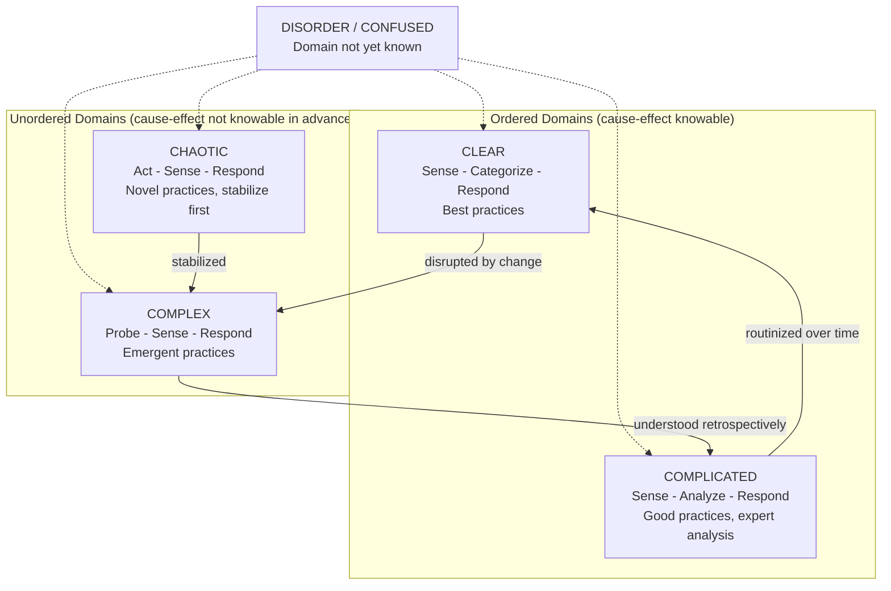

## The Cynefin Framework for Sensemaking

### Definition and Scope

The **Cynefin Framework** is a sensemaking model, developed by Dave Snowden (originally at IBM, later through the Cynefin Company), that helps practitioners diagnose which kind of situation or system they are facing and select a decision-making approach appropriate to that situation. Unlike a categorization framework that sorts objects into fixed types, Cynefin (a Welsh word roughly meaning "habitat" or "place of multiple belongings") is explicitly a **sensemaking** framework: it does not tell you what a situation *is* in some absolute sense, but helps you determine what kind of relationship between cause and effect currently applies, so that you can choose the right decision-making protocol rather than defaulting to a single approach for every problem.

### The Five Domains

#### 1. Clear (formerly "Simple" or "Obvious")

**Key Points**

- Cause and effect relationships are clear, stable, and evident to anyone; best practices exist and reliably apply
- The recommended decision protocol is **Sense–Categorize–Respond**: perceive the situation, categorize it against known patterns, then apply the established best practice
- Risk in this domain is largely about complacency: the danger of assuming a situation is Clear when it is not, or of following a best practice past the point where it still applies

**Example**

Processing a standard employee expense reimbursement request: the rules are well-defined, the correct category is easily identified, and the established procedure is simply applied.

#### 2. Complicated

**Key Points**

- Cause and effect relationships exist and are knowable but require analysis or expertise to uncover; multiple good practices may apply rather than a single best practice
- The recommended decision protocol is **Sense–Analyze–Respond**: perceive the situation, apply expert analysis to determine viable options, then respond with a chosen good practice
- Risk in this domain includes over-reliance on a narrow set of experts, or "analysis paralysis" from treating every option as equally worth exhaustive evaluation

**Example**

Diagnosing a mechanical fault in an aircraft engine: the fault has a knowable cause, but identifying it requires specialized diagnostic expertise and systematic analysis rather than an obvious, universally applicable fix.

#### 3. Complex

**Key Points**

- Cause and effect are only coherent in retrospect; the system involves adaptive agents whose interactions generate emergent behavior that cannot be reliably predicted in advance
- The recommended decision protocol is **Probe–Sense–Respond**: run small, safe-to-fail experiments (probes), closely observe what emerges (sense), and amplify successful patterns or dampen unsuccessful ones (respond)
- Risk in this domain includes attempting to apply Complicated-domain expert analysis (over-planning) or Clear-domain best practices (rigid procedures) to a fundamentally unpredictable, emergent situation

**Example**

Shaping organizational culture: no single directive reliably produces a desired cultural shift, since employees are adaptive agents; instead, an organization might run several small, parallel initiatives (probes), observe which ones generate genuine emergent adoption (sense), and invest further in those that show traction while abandoning those that do not (respond).

#### 4. Chaotic

**Key Points**

- No discernible relationship between cause and effect exists at the time; the situation is turbulent, high-tempo, and unstable
- The recommended decision protocol is **Act–Sense–Respond**: take immediate, decisive action to establish some stability, then sense the resulting situation, then respond further as clarity emerges
- The priority in this domain is stopping the immediate crisis (stabilization), not diagnosis or optimization; analysis is deferred until enough stability exists to make sense of the situation
- Chaotic situations are often (though not always) transitional and time-limited; effective action typically moves a situation out of Chaos and into Complex or Complicated, where more considered approaches become possible

**Example**

The immediate hours following a sudden, large-scale infrastructure failure (e.g., a major data center outage during peak load): the immediate priority is decisive action to restore basic service or contain damage, not an extended root-cause investigation, which is deferred until the acute crisis is stabilized.

#### 5. Confused / Disorder (the Center Domain)

**Key Points**

- Represents the state of not yet knowing which of the other four domains actually applies to the situation at hand
- Practitioners in this state are at risk of defaulting to whichever domain approach they are personally most comfortable with, regardless of whether it actually fits the situation — a documented tendency in Snowden's original formulation
- The task within this domain is explicitly diagnostic: to break the situation apart, examine its different aspects, and assign each to the domain it actually belongs in, rather than assuming the whole situation is uniform

**Example**

Encountering a novel crisis with no immediately obvious precedent, a manager who defaults to "let's just apply our standard operating procedure" (treating it as Clear) when the situation actually contains significant unpredictable, emergent elements (making parts of it genuinely Complex) illustrates the risk of resolving Disorder by comfortable habit rather than genuine diagnosis.

### Diagram: The Cynefin Domains

Note on the boundary between Clear and Chaotic: Snowden's formulation places particular emphasis on the boundary between the Clear and Chaotic domains as a "catastrophic" or dangerous edge — organizations that have operated for a long time in the Clear domain can become complacent, and a shock event can cause a sudden, uncontrolled collapse directly into Chaos rather than a more gradual transition through Complicated or Complex. This dynamic is often depicted as a "cliff edge" between those two domains specifically.

### Comparative Table: The Four Action Domains

| Domain | Cause-Effect Relationship | Decision Protocol | Typical Practice Type | Primary Risk |
| --- | --- | --- | --- | --- |
| Clear | Evident, stable | Sense–Categorize–Respond | Best practice | Complacency; misapplied over-standardization |
| Complicated | Knowable via expertise | Sense–Analyze–Respond | Good practice | Analysis paralysis; over-reliance on experts |
| Complex | Coherent only in hindsight | Probe–Sense–Respond | Emergent practice | Premature planning; false pattern-matching |
| Chaotic | Not discernible at the time | Act–Sense–Respond | Novel practice | Analysis delay when action is urgently needed |

### Worked Example: Diagnosing and Navigating a Real Scenario

**Scenario**: A retailer discovers a sudden, sharp drop in sales across all stores simultaneously.

**Step 1 — Initial state**: Disorder/Confused. The cause is not yet known, and it is unclear which domain applies.

**Step 2 — Immediate triage**: If systems (e.g., point-of-sale infrastructure) appear to be actively failing and no clear pattern is yet visible, treat the immediate technical situation as **Chaotic**: take decisive stabilizing action (e.g., failover to backup payment processing) before attempting root-cause analysis.

**Step 3 — Once stabilized, reclassify**: Investigation reveals point-of-sale systems are functioning normally, but customer traffic itself has genuinely dropped. This shifts the situation toward **Complex**, since consumer behavior involves many adaptive agents responding to conditions (economic sentiment, a competitor's promotion, social media sentiment) that are not fully knowable in advance.

**Step 4 — Complex-domain response**: Run small probes — targeted local promotions in a subset of stores, direct customer surveys, social-listening analysis — to sense what is actually driving the traffic drop, rather than committing immediately to a single company-wide fix.

**Step 5 — Once a specific mechanism is identified** (for example, confirmed to be a well-understood seasonal shift with a known historical pattern), the problem may be reclassified as **Complicated**, where established seasonal-demand forecasting expertise can now be applied with more confidence.

[Inference] This worked example illustrates the framework's intended domain-shifting logic; a real retail sales-drop investigation would require actual data at each step to justify each domain reclassification, rather than assuming the sequence shown here.

### Relationship to the Simple-Complicated-Complex Classification

**Key Points**

- Cynefin's Complicated and Complex domains directly correspond to the "Complicated" and "Complex" categories described in the "Simple, Complicated, and Complex Systems" classification; Cynefin's "Clear" domain corresponds to that classification's "Simple" category
- Cynefin adds two elements not present in the simpler three-part classification: an explicit **Chaotic** domain for acute crisis conditions, and the **Disorder/Confused** center domain representing the diagnostic uncertainty about which domain actually applies
- Cynefin is more explicitly a decision-support and facilitation tool (with associated workshop methods, narrative-elicitation techniques, and named protocols for each domain), whereas the simpler three-part classification is more commonly used as a conceptual teaching device

### Common Pitfalls

**Key Points**

- **Domain rigidity**: treating a single large initiative as belonging entirely to one domain, when different components of the same initiative may genuinely belong to different domains simultaneously
- **Comfort-domain default**: repeatedly diagnosing situations as belonging to whichever domain matches the practitioner's own preferred or most familiar working style (e.g., an engineer defaulting to "Complicated" for everything, a crisis manager defaulting to "Chaotic")
- **Skipping the Chaotic-to-stability step**: attempting Complex-domain probing or Complicated-domain analysis while the situation is still genuinely Chaotic and requires stabilizing action first
- **Treating Cynefin as a strict quadrant**: presenting the four domains as a rigid 2x2 grid with hard boundaries, when Snowden's formulation emphasizes fluid, sometimes gradual and sometimes abrupt movement between domains, along with a genuinely central, not merely residual, Disorder domain

### Facilitation Techniques Associated with Cynefin

| Technique | Purpose |
| --- | --- |
| Narrative-based sensemaking / SenseMaker | Collecting many small, self-signified stories or data points from within a system to detect emergent patterns rather than relying on top-down survey design |
| Safe-to-fail probes | Designing small Complex-domain experiments with limited downside, explicitly intended to reveal emergent dynamics rather than to succeed outright |
| Domain-sorting workshops | Facilitated group exercises in which participants place different aspects of a situation onto the Cynefin domains, surfacing disagreement about the situation's true nature |

[Unverified] The comparative effectiveness of Cynefin-based facilitation techniques relative to other sensemaking or strategy frameworks has not been comprehensively, independently benchmarked across organizational contexts in a way this document can confirm; much of the supporting evidence in circulation is practitioner case-study and applied-consulting literature rather than controlled comparative research.

### Diagram: Cynefin Domain Map (svg_diagram)

<svg xmlns="http://www.w3.org/2000/svg" viewBox="0 0 900 460" font-family="Arial, sans-serif">
<text x="450" y="28" text-anchor="middle" font-size="17" font-weight="bold" fill="#1a1a1a">Cynefin Framework Domains (svg_diagram)</text>
<rect x="80" y="60" width="360" height="160" fill="#2980b9" opacity="0.85" />
<text x="260" y="100" text-anchor="middle" font-size="14" fill="#ffffff" font-weight="bold">COMPLEX</text>
<text x="260" y="122" text-anchor="middle" font-size="11" fill="#ffffff">Probe - Sense - Respond</text>
<text x="260" y="140" text-anchor="middle" font-size="11" fill="#ffffff">Emergent order</text>
<rect x="460" y="60" width="360" height="160" fill="#27ae60" opacity="0.85" />
<text x="640" y="100" text-anchor="middle" font-size="14" fill="#ffffff" font-weight="bold">COMPLICATED</text>
<text x="640" y="122" text-anchor="middle" font-size="11" fill="#ffffff">Sense - Analyze - Respond</text>
<text x="640" y="140" text-anchor="middle" font-size="11" fill="#ffffff">Good practice via expertise</text>
<rect x="80" y="230" width="360" height="160" fill="#c0392b" opacity="0.85" />
<text x="260" y="270" text-anchor="middle" font-size="14" fill="#ffffff" font-weight="bold">CHAOTIC</text>
<text x="260" y="292" text-anchor="middle" font-size="11" fill="#ffffff">Act - Sense - Respond</text>
<text x="260" y="310" text-anchor="middle" font-size="11" fill="#ffffff">Stabilize first</text>
<rect x="460" y="230" width="360" height="160" fill="#2c3e50" opacity="0.9" />
<text x="640" y="270" text-anchor="middle" font-size="14" fill="#ffffff" font-weight="bold">CLEAR</text>
<text x="640" y="292" text-anchor="middle" font-size="11" fill="#ffffff">Sense - Categorize - Respond</text>
<text x="640" y="310" text-anchor="middle" font-size="11" fill="#ffffff">Best practice</text>
<circle cx="450" cy="225" r="55" fill="#f39c12" />
<text x="450" y="220" text-anchor="middle" font-size="11" fill="#1a1a1a" font-weight="bold">DISORDER /</text>
<text x="450" y="236" text-anchor="middle" font-size="11" fill="#1a1a1a" font-weight="bold">CONFUSED</text>

<text x="260" y="410" text-anchor="middle" font-size="11" fill="`#1a1a1a`">Cause-effect: unclear until after the fact</text>

<text x="640" y="410" text-anchor="middle" font-size="11" fill="`#1a1a1a`">Cause-effect: knowable in advance</text>

</svg>

### Practical Exercise

**Steps**

1. Select a current problem or initiative you are facing.
2. For each major component of that problem, ask whether cause and effect are: (a) evident to everyone, (b) knowable through expert analysis, (c) only clear in retrospect due to adaptive agents, or (d) not discernible at all right now.
3. Assign each component to Clear, Complicated, Complex, or Chaotic accordingly, rather than forcing the entire problem into a single domain.
4. For any component classified as Complex, design one small, genuinely safe-to-fail probe you could run this week.
5. For any component classified as Chaotic, identify the single most urgent stabilizing action needed before any further analysis is attempted.
6. Reflect on whether your default instinct was to treat the whole problem as belonging to your most familiar domain, and reconsider accordingly.

### Related Topics

- Simple, Complicated, and Complex Systems
- Complex Adaptive Systems (CAS) and Emergence
- Probe-Sense-Respond and Safe-to-Fail Experiments
- Sensemaking and Narrative Methods (SenseMaker)
- Crisis Management and Decision-Making Under Uncertainty
- Systems Archetypes
- Habits of a Systems Thinker
- Distinguishing Events, Patterns, and Structures