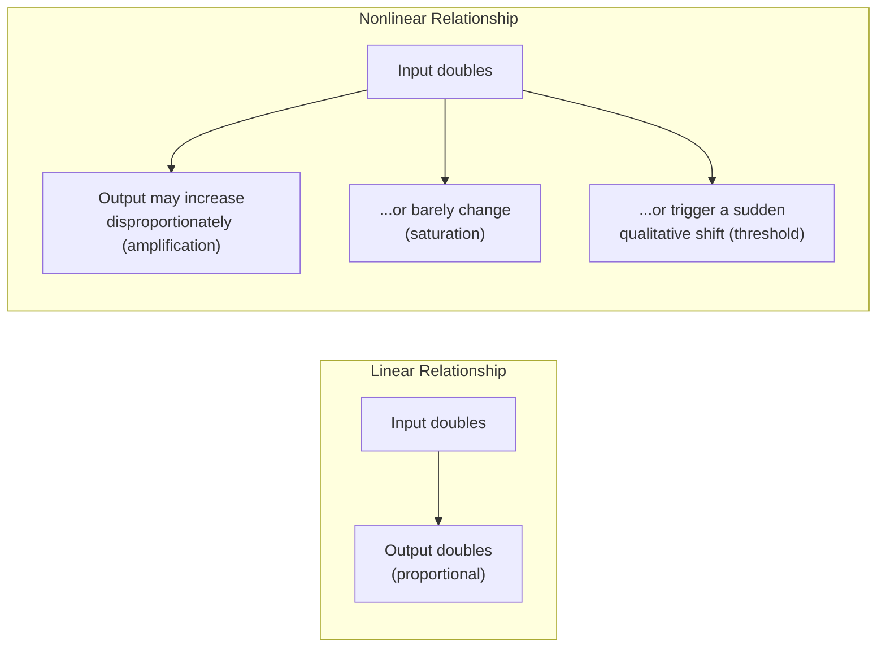

## Linear versus Nonlinear Systems

### Definition and Scope

**Linear versus Nonlinear Systems** is a foundational classification in systems thinking and dynamical systems theory that distinguishes systems based on the mathematical and behavioral relationship between their inputs (causes) and outputs (effects). A **linear system** is one in which output is directly proportional to input, and effects combine additively. A **nonlinear system** is one in which this proportionality breaks down: outputs can be disproportionate to inputs, small causes can produce large effects (or vice versa), and the combined effect of multiple inputs is not simply the sum of their individual effects. This distinction underlies much of why complex systems (see "Simple, Complicated, and Complex Systems") behave in ways that resist intuitive, proportional reasoning, and it is central to understanding phenomena such as feedback loop amplification, tipping points, and chaotic dynamics.

### Linear Systems

**Key Points**

- Satisfy the mathematical properties of **superposition** (the response to multiple combined inputs equals the sum of the responses to each input individually) and **homogeneity** (scaling an input by a factor scales the output by the same factor)
- Formally, a system is linear if it can be described by a function $f$ such that $f(a \cdot x_1 + b \cdot x_2) = a \cdot f(x_1) + b \cdot f(x_2)$ for constants $a$ and $b$
- Output changes proportionally and predictably with input changes; doubling an input doubles the corresponding output
- Graphically, the relationship between input and output, when plotted, forms a straight line (or a linear combination of straight-line relationships in multiple dimensions)
- Small changes produce small effects, and the system's behavior at one operating point reliably predicts its behavior at nearby operating points

**Example**

The relationship between the number of hours worked at a fixed hourly wage and total pay earned is linear: working twice as many hours at the same rate produces exactly twice the pay, and there is no interaction effect between different work sessions that changes the per-hour rate.

$$\text{Pay} = w \cdot h$$

where $w$ is the fixed hourly wage and $h$ is hours worked.

### Nonlinear Systems

**Key Points**

- Do not satisfy superposition or homogeneity; the relationship between input and output involves multiplicative interactions, thresholds, exponents, or feedback that break simple proportionality
- Small changes in input can produce disproportionately large changes in output (amplification), or large changes in input can produce negligible output change (saturation), depending on where the system currently sits
- The combined effect of multiple simultaneous inputs is often not simply the sum of their individual effects; inputs can interact multiplicatively or in ways that depend on each other's current values
- Frequently exhibit **thresholds** or **tipping points**: a system can appear stable across a wide range of input values, then change qualitatively and abruptly once a critical threshold is crossed
- Behavior observed at one operating point does not reliably predict behavior at a different operating point, since the system's local relationship between cause and effect can itself change across its range

**Example**

Population growth under resource constraints follows a nonlinear logistic pattern: growth is roughly proportional to population size when resources are abundant, but growth rate declines and eventually reverses as the population approaches the environment's carrying capacity, producing an S-shaped curve rather than the straight line a linear model would predict.

$$\frac{dP}{dt} = rP\left(1 - \frac{P}{K}\right)$$

where $P$ is population size, $r$ is the intrinsic growth rate, and $K$ is the carrying capacity. Note that the growth rate $\frac{dP}{dt}$ depends multiplicatively on both $P$ and the term $(1 - P/K)$, which itself changes as $P$ changes — precisely the kind of interaction that makes this relationship nonlinear.

### Diagram: Linear vs. Nonlinear Input-Output Relationships

### Comparative Table: Core Distinctions

| Dimension | Linear System | Nonlinear System |
| --- | --- | --- |
| Proportionality | Output proportional to input | Output disproportionate to input |
| Superposition | Holds (effects simply add) | Does not hold (effects can interact) |
| Predictability across range | Consistent throughout | Can change qualitatively at different operating points |
| Small-input sensitivity | Small input, small effect | Small input can trigger large effect (or none) |
| Graphical shape | Straight line | Curved, S-shaped, exponential, threshold, or chaotic |
| Common in | Simple mechanical systems, fixed-rate processes | Feedback loops, ecosystems, social systems, financial markets, epidemics |

### Nonlinearity and Feedback Loops

**Key Points**

- Feedback loops are a primary mechanism by which real-world systems become nonlinear: a reinforcing feedback loop causes a variable's own current level to influence its future rate of change, producing exponential rather than linear growth or decline
- A balancing feedback loop introduces a self-correcting nonlinearity, where the system's response strength depends on its current distance from a goal state, rather than remaining constant
- This is why systems dominated by strong feedback loops (see "Recognizing How Structure Generates Behavior") are characteristically nonlinear, and why linear extrapolation from recent trend data frequently fails to predict their future behavior

**Example**

Early in an epidemic, the reinforcing loop between infected individuals and new infections produces classic exponential (nonlinear) growth, where the rate of new cases depends multiplicatively on the current number of infected individuals — a pattern a linear model (assuming a constant number of new cases per day) would fail to capture even qualitatively.

### Tipping Points and Thresholds

**Key Points**

- A hallmark of nonlinear systems is the existence of **critical thresholds**, past which the system's qualitative behavior changes abruptly, sometimes irreversibly
- Below a threshold, a system may appear robust and largely insensitive to a given stressor; incremental increases in that stressor produce only small, easily overlooked effects, until the threshold is crossed and a disproportionate, sometimes sudden, shift occurs
- This underlies the risk of extrapolating "it has been fine so far" reasoning in nonlinear systems, since past stability near a threshold provides limited assurance about behavior once the threshold is crossed

**Example**

A lake ecosystem's water clarity can remain relatively stable across a range of nutrient (fertilizer runoff) input levels, appearing resilient to gradually increasing pollution, until a critical nutrient threshold is crossed, at which point the lake can shift abruptly into a turbid, algae-dominated state that resists easy reversal even if nutrient inputs are subsequently reduced — a nonlinear phenomenon sometimes termed **hysteresis**, where the system does not simply retrace its path back to the original state when the input is reversed.

### Worked Example: Contrasting Linear and Nonlinear Forecasting

**Scenario**: A company forecasting customer growth based on the last three months of data, during which growth has been roughly 100 new customers per month.

**Linear forecasting approach**: Assumes the trend will continue at the same constant rate, projecting 100 additional customers each subsequent month, producing a straight-line projection.

**Nonlinear consideration**: If customer growth is being driven substantially by word-of-mouth referrals (a reinforcing feedback loop, where each new customer increases the rate at which further customers are acquired), the actual near-term trajectory may be closer to exponential than linear, and the linear forecast would significantly underestimate near-term growth. Conversely, if the company is approaching market saturation in its current target segment (a resource-constraint nonlinearity, similar in form to the logistic growth model above), the linear forecast would significantly overestimate growth as the rate naturally slows and levels off.

**Conclusion**: Correctly identifying which nonlinear dynamic (reinforcing amplification vs. saturation) is dominant is necessary to produce a forecast substantially better than the naive linear extrapolation; the appropriate response also differs sharply between the two cases (invest further to accelerate a reinforcing loop, versus prepare for plateauing to plan for or address a saturation constraint).

[Inference] This worked example is constructed to illustrate the forecasting divergence between linear and nonlinear assumptions; the specific mechanism actually driving any real company's growth (referral effects, saturation, or another dynamic entirely) would need to be established through data analysis rather than assumed.

### Common Pitfalls

**Key Points**

- **Linear extrapolation of nonlinear trends**: projecting a recent trend forward using a constant rate of change, when the underlying system is governed by feedback loops or thresholds that will cause the actual rate to accelerate, decelerate, or reverse
- **Assuming proportional intervention effects**: expecting that doubling the size or intensity of an intervention will double its effect, when the system's actual response may saturate (diminishing returns) or amplify (disproportionate effect) depending on where the system currently sits relative to any thresholds
- **Underestimating tipping-point risk**: treating a system's apparent stability under moderate stress as evidence that it will remain stable under further, incrementally increased stress, when a nearby unobserved threshold may exist
- **Overestimating reversibility**: assuming that reducing an input back to its original level will simply reverse a nonlinear system back to its original state, when hysteresis effects can leave a system durably altered even after the triggering input is removed

### Recognizing Nonlinearity in Data

| Signal in Observed Data | Suggests |
| --- | --- |
| Behavior-over-time graph shows a curve rather than a straight line | Nonlinear relationship, possibly exponential, logistic, or threshold-based |
| Small perturbations sometimes produce large, disproportionate responses | Sensitivity near a threshold or strong reinforcing feedback |
| The same-sized intervention produces very different effects at different times | System operating point has shifted, changing the local input-output relationship |
| A trend that reverses abruptly after a period of apparent stability | Possible threshold or tipping point crossed |
| A system does not return to its original state after a disturbance is removed | Possible hysteresis |

### Diagram: Threshold and Hysteresis Behavior (svg_diagram)

<svg xmlns="http://www.w3.org/2000/svg" viewBox="0 0 900 380" font-family="Arial, sans-serif">
<text x="450" y="28" text-anchor="middle" font-size="17" font-weight="bold" fill="#1a1a1a">Nonlinear Threshold and Hysteresis (svg_diagram)</text>
<line x1="80" y1="320" x2="820" y2="320" stroke="#333" stroke-width="2" />
<text x="450" y="350" text-anchor="middle" font-size="13" fill="#1a1a1a">Input (e.g., nutrient load)</text>
<line x1="80" y1="320" x2="80" y2="60" stroke="#333" stroke-width="2" />
<text x="55" y="190" text-anchor="middle" font-size="13" fill="#1a1a1a" transform="rotate(-90 55 190)">System State</text>
<path d="M100,300 L400,290 C450,285 480,150 520,100 L780,80" stroke="#2980b9" stroke-width="3" fill="none" />
<text x="250" y="270" font-size="11" fill="#2980b9">Increasing input</text>
<path d="M780,90 L520,110 C480,160 450,270 400,280 L100,290" stroke="#c0392b" stroke-width="3" fill="none" stroke-dasharray="5,3" />
<text x="550" y="230" font-size="11" fill="#c0392b">Decreasing input</text>
<text x="550" y="245" font-size="11" fill="#c0392b">(does not retrace path)</text>
<line x1="480" y1="60" x2="480" y2="320" stroke="#7f8c8d" stroke-width="1" stroke-dasharray="3,3" />
<text x="480" y="55" text-anchor="middle" font-size="11" fill="#7f8c8d">Threshold</text>
</svg>

### Relationship to Other Systems-Thinking Concepts

| Related Concept | Connection |
| --- | --- |
| Feedback Loops: Reinforcing vs. Balancing | The primary structural mechanism producing nonlinearity in real systems |
| Simple, Complicated, and Complex Systems | Nonlinearity is a defining mathematical characteristic underlying the unpredictability of Complex systems |
| Systems Archetypes | Several archetypes (e.g., "Limits to Growth") depict specific nonlinear dynamics (saturation) in causal-loop form |
| Time Delays in Cause-and-Effect Relationships | Delays frequently interact with nonlinear feedback to produce oscillation or overshoot, rather than smooth convergence |

### Practical Exercise

**Steps**

1. Select a variable you have been tracking or forecasting using a simple, constant-rate (linear) assumption.
2. Identify whether any reinforcing or balancing feedback loops plausibly affect that variable's rate of change.
3. Sketch, even roughly, what the behavior-over-time curve would look like if a relevant nonlinear dynamic (exponential growth, saturation, or a threshold effect) were dominant, rather than assuming a straight-line trend.
4. Identify what evidence in your existing data could help you distinguish whether the actual trend better resembles a linear, exponential, or logistic (S-shaped) pattern.
5. Consider whether the system might be approaching an unobserved threshold, and what early warning signal (see "Recognizing Nonlinearity in Data" table) might indicate that risk before the threshold is actually crossed.

### Related Topics

- Feedback Loops: Reinforcing vs. Balancing
- Simple, Complicated, and Complex Systems
- Systems Archetypes: Limits to Growth
- Stocks and Flows
- Time Delays in Cause-and-Effect Relationships
- Chaos Theory and Sensitivity to Initial Conditions
- Tipping Points and Hysteresis in Ecological Systems
- Exponential and Logistic Growth Models