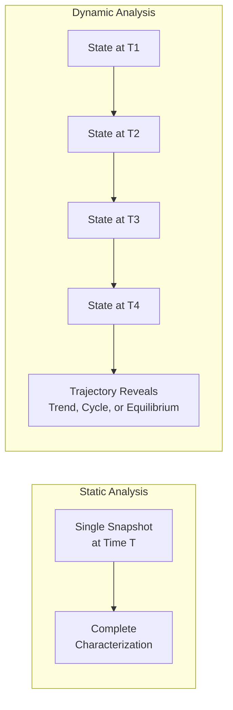

## Static versus Dynamic Systems

### Definition and Scope

**Static versus Dynamic Systems** is a foundational classification in systems thinking that distinguishes systems according to whether their state changes over time. A **static system** is one whose relevant state variables remain fixed or are treated as fixed for analytical purposes, with no meaningful time-dependent behavior under consideration. A **dynamic system** is one whose state variables change over time as a function of internal structure (stocks, flows, feedback loops) and external influences, such that understanding the system requires understanding its trajectory through time, not merely its condition at a single instant. This distinction determines whether a snapshot analysis is sufficient or whether a time-based, trajectory-oriented analysis (such as a behavior-over-time graph or a simulation model) is required to understand the system's true behavior.

### Static Systems

**Key Points**

- State variables are fixed, unchanging, or treated as constant within the scope and timeframe of the analysis
- A single measurement or snapshot is sufficient to fully characterize the system's relevant properties for the purpose at hand
- Static analysis is appropriate when the system's rate of change is negligible relative to the timescale of the decision being made, or when the system has reached and will remain at equilibrium
- Structural or architectural properties of a system (its components and their fixed configuration) are often treated statically even when the system as a whole exhibits dynamic behavior over time

**Example**

The floor plan of a building — the fixed arrangement of rooms, walls, and doors — is a static system for most everyday analytical purposes: describing how the building is laid out does not require any reference to time, since the arrangement does not change during normal use.

### Dynamic Systems

**Key Points**

- State variables evolve over time according to the system's internal structure, including stocks (accumulations), flows (rates of change), feedback loops, and time delays
- A single snapshot is insufficient and can be actively misleading, since a dynamic system's current state depends on its history and continues to change going forward
- Understanding a dynamic system requires observing or modeling its **behavior over time**: trends, cycles, oscillations, growth, decay, or equilibrium-seeking patterns
- Dynamic systems are the primary subject of **system dynamics**, the modeling discipline (originated by Jay Forrester) that represents systems using stocks, flows, and feedback loops specifically to simulate and analyze their time-based behavior

**Example**

A company's cash reserves are a dynamic system: the current balance depends on the accumulated history of revenue inflows and expense outflows over time, and understanding whether the company is financially healthy requires tracking the balance's trajectory (is it growing, shrinking, or oscillating with a seasonal pattern), not merely observing its value on a single day.

### Diagram: Static Snapshot vs. Dynamic Trajectory

### Comparative Table: Core Distinctions

| Dimension | Static System | Dynamic System |
| --- | --- | --- |
| State over time | Fixed / unchanging | Evolving / changing |
| Sufficient data for understanding | Single snapshot | Time series / trajectory |
| Key structural elements | Fixed components and their arrangement | Stocks, flows, feedback loops, delays |
| Typical modeling approach | Structural diagrams, static maps | Behavior-over-time graphs, simulation models |
| Risk of snapshot analysis | Low (system does not change) | High (snapshot can misrepresent trend direction or momentum) |
| Example | A building's floor plan | A company's cash reserves over a fiscal year |

### The Relativity of the Static-Dynamic Distinction

**Key Points**

- Whether a system is treated as static or dynamic often depends on the timescale of analysis relevant to the observer's purpose, rather than being an absolute property of the system itself
- A system that is dynamic over a long timescale can be reasonably treated as static over a much shorter analytical window, if its rate of change is negligible within that window
- Conversely, a system typically treated as static can reveal important dynamic behavior when examined over a sufficiently long timescale

**Example**

A mountain range is treated as a static system for the purposes of planning a hiking trail this year, since its shape will not perceptibly change within that timeframe. Over geological timescales, however, the same mountain range is a dynamic system, its elevation and shape changing gradually due to tectonic uplift and erosion — a set of dynamics entirely invisible at the human planning timescale but essential to a geologist's analysis.

[Inference] This relativity principle is a widely accepted general framing in systems-thinking and dynamical-systems pedagogy; the specific threshold at which a system should be reclassified from static to dynamic analysis depends on the purpose of the analysis and is a judgment call rather than a fixed, universal rule.

### Why Treating a Dynamic System as Static Is a Common and Consequential Error

**Key Points**

- Organizations and individuals frequently make decisions based on a single current measurement (a static snapshot) of a variable that is, in fact, dynamically trending, which can lead to systematically mistimed or misdirected interventions
- This error is closely related to the "Distinguishing Events, Patterns, and Structures" habit: treating a single data point (an event, effectively a static snapshot) as sufficient, when a pattern (the dynamic trajectory) tells a materially different story
- A dynamic system captured only via a static snapshot loses all information about **momentum** (the current rate and direction of change) and about whether the system is near an inflection point, both of which are often more decision-relevant than the current level itself

**Example**

A retailer observing "current inventory levels are healthy" based on a single point-in-time inventory count (a static view) may miss that inventory has been declining rapidly for the past six weeks and is on track to run out well before the next scheduled shipment (the dynamic view) — a difference invisible in the static snapshot alone.

### Worked Example: Static vs. Dynamic Analysis of the Same System

**Scenario**: Evaluating the health of a nonprofit organization's donor base.

**Static analysis**: "The organization currently has 5,000 active donors." This single figure provides a snapshot but no information about direction or momentum.

**Dynamic analysis**: Plotting the donor count monthly over the past two years reveals that the donor base grew steadily for the first year, plateaued, and has been declining by approximately 3% per month for the last six months, driven by a reinforcing loop in which declining donor engagement reduces event attendance, which in turn reduces new-donor referral opportunities.

**Conclusion**: The static figure of "5,000 active donors" alone gives no indication of the organization's actual trajectory or the underlying reinforcing loop driving it; only the dynamic analysis reveals both the trend and its likely structural cause, which is necessary information for deciding whether and how urgently to intervene.

[Inference] This worked example is constructed for illustrative purposes to demonstrate the difference between static and dynamic analytical framing; the specific donor-engagement mechanism described is a plausible, commonly observed nonprofit dynamic but is not drawn from a specific documented organization's data.

### Static and Dynamic Elements Within the Same System

**Key Points**

- Most real-world systems contain both static and dynamic elements simultaneously; correctly identifying which is which is itself an important analytical step, since misclassifying a genuinely dynamic element as static (or vice versa) leads to a mismatched analytical approach
- Structural elements (an organization's official reporting hierarchy, a building's layout, a piece of software's core architecture) are often the most static components, while flow-based and behavioral elements (revenue, morale, market share, code complexity accumulating as technical debt) are typically the dynamic components operating within or around that static structure

**Example**

An organization's official org chart (structure) may remain static for a year, while the actual information flow, morale, and productivity occurring within that fixed structure are highly dynamic, changing week to week in response to workload, feedback loops, and external pressures — meaning that a static org-chart-only analysis would miss the dynamic behavior that a stocks-and-flows or behavior-over-time analysis would reveal.

### Common Pitfalls

**Key Points**

- **Static bias in decision-making**: relying on the most recent single data point to make a decision about a fundamentally dynamic variable, ignoring its trend, rate of change, and momentum
- **Over-dynamizing genuinely static elements**: applying elaborate time-series analysis or simulation modeling to elements of a system that are, for practical purposes, fixed within the relevant decision timescale, wasting analytical effort
- **Ignoring timescale relativity**: treating a system's static-or-dynamic classification as a fixed, universal property rather than recognizing it depends on the timescale relevant to the specific question being asked
- **Confusing structural stability with dynamic stability**: assuming that because a system's structure (its stocks, flows, and feedback loop architecture) is static and unchanging, its behavior must also be static, when a fixed structure with active feedback loops can still produce highly dynamic behavior (growth, decline, oscillation) over time

### Diagram: Choosing Static vs. Dynamic Analysis (svg_diagram)

<svg xmlns="http://www.w3.org/2000/svg" viewBox="0 0 900 340" font-family="Arial, sans-serif">
<text x="450" y="28" text-anchor="middle" font-size="17" font-weight="bold" fill="#1a1a1a">Choosing Static or Dynamic Analysis (svg_diagram)</text>
<rect x="340" y="55" width="220" height="55" rx="10" fill="#2c3e50" />
<text x="450" y="88" text-anchor="middle" font-size="12" fill="#ffffff">Identify the Variable</text>
<polygon points="450,130 590,190 450,250 310,190" fill="#f39c12" />
<text x="450" y="185" text-anchor="middle" font-size="10" fill="#1a1a1a">Meaningful change</text>
<text x="450" y="200" text-anchor="middle" font-size="10" fill="#1a1a1a">within decision timescale?</text>
<rect x="620" y="160" width="200" height="60" rx="10" fill="#2980b9" />
<text x="720" y="185" text-anchor="middle" font-size="12" fill="#ffffff">Treat as STATIC</text>
<text x="720" y="203" text-anchor="middle" font-size="11" fill="#ffffff">Snapshot analysis</text>
<rect x="80" y="270" width="220" height="60" rx="10" fill="#c0392b" />
<text x="190" y="295" text-anchor="middle" font-size="12" fill="#ffffff">Treat as DYNAMIC</text>
<text x="190" y="313" text-anchor="middle" font-size="11" fill="#ffffff">Behavior-over-time analysis</text>
<line x1="450" y1="110" x2="450" y2="130" stroke="#555" stroke-width="2" marker-end="url(#a6)" />
<line x1="560" y1="190" x2="620" y2="190" stroke="#555" stroke-width="2" marker-end="url(#a6)" />
<text x="590" y="180" font-size="11" fill="#1a1a1a">No</text>
<line x1="380" y1="230" x2="220" y2="270" stroke="#555" stroke-width="2" marker-end="url(#a6)" />
<text x="270" y="255" font-size="11" fill="#1a1a1a">Yes</text>
</svg>

### Relationship to Other Systems-Thinking Concepts

| Related Concept | Connection |
| --- | --- |
| Distinguishing Events, Patterns, and Structures | An "Event" is effectively a static snapshot; a "Pattern" requires dynamic, time-based observation |
| Stocks and Flows | The core modeling constructs used specifically to represent dynamic system behavior |
| System Dynamics (Jay Forrester) | The formal simulation-modeling discipline built around representing and analyzing dynamic systems |
| Linear versus Nonlinear Systems | Dynamic systems can exhibit either linear or nonlinear time-based behavior; the two classifications are independent but frequently discussed together |
| Behavior-Over-Time Graphs (BOTGs) | The primary visualization tool for characterizing a dynamic system's trajectory |

### Practical Exercise

**Steps**

1. Choose a variable currently being tracked in your work or personal life using only its most recent value (a static snapshot).
2. Gather or reconstruct at least five to ten historical values for that variable across a relevant recent period.
3. Plot a rough behavior-over-time graph and identify whether the variable is trending up, down, cycling, or holding steady.
4. Compare the conclusion you would have drawn from the static snapshot alone against the conclusion suggested by the dynamic trajectory.
5. Identify whether any feedback loop plausibly explains the observed dynamic pattern, and consider what this implies for the appropriate timing and nature of any intervention.

### Related Topics

- Stocks and Flows
- Behavior-Over-Time Graphs (BOTGs)
- System Dynamics Modeling (Jay Forrester)
- Distinguishing Events, Patterns, and Structures
- Linear versus Nonlinear Systems
- Feedback Loops: Reinforcing vs. Balancing
- Equilibrium and Steady-State Analysis
- Time Delays in Cause-and-Effect Relationships