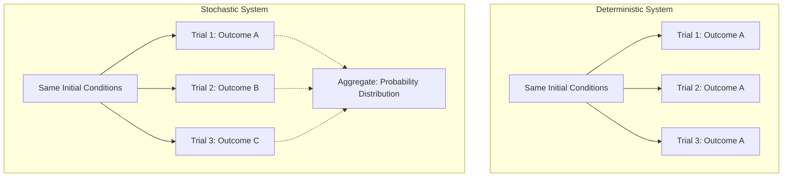

## Deterministic versus Stochastic Systems

### Definition and Scope

**Deterministic versus Stochastic Systems** is a foundational classification in systems thinking and modeling that distinguishes systems according to whether their future state is fully determined by their current state and inputs, or whether their future state involves inherent randomness or probabilistic variation. A **deterministic system** produces exactly the same output every time it is run from the same initial conditions and inputs. A **stochastic system** incorporates randomness such that even identical initial conditions and inputs can produce different outcomes across repeated instances, and its behavior must be described in terms of probability distributions rather than single, exact predictions.

### Deterministic Systems

**Key Points**

- Future states are fully and uniquely determined by the current state and a fixed set of governing rules or equations; no randomness is present in the system's own generative process
- Given complete knowledge of the initial conditions and the governing rules, the system's entire future trajectory can, in principle, be calculated exactly
- Repeating an experiment or simulation under identical initial conditions produces identical results every time
- Note carefully: **deterministic does not necessarily mean predictable in practice**. Nonlinear deterministic systems can exhibit chaotic behavior, in which extreme sensitivity to initial conditions makes long-term prediction practically impossible even though the system is, strictly speaking, fully deterministic

**Example**

The trajectory of a ball thrown under idealized physics (ignoring air resistance and other minor real-world factors) is deterministic: given the exact initial velocity, angle, and starting position, Newtonian mechanics fully determines its exact path, and repeating the throw with identical initial conditions yields an identical trajectory.

$$y(t) = y_0 + v_0 \sin(\theta) \cdot t - \frac{1}{2}g t^2$$

where $y_0$ is initial height, $v_0$ is initial speed, $\theta$ is launch angle, $g$ is gravitational acceleration, and $t$ is time. Given fixed values for all these terms, $y(t)$ is exactly determined for any time $t$.

### Stochastic Systems

**Key Points**

- Future states depend partly on random or probabilistic processes, such that even identical starting conditions can produce different specific outcomes across repeated trials
- The system's behavior is best described using probability distributions (expected values, variance, likelihood of different outcomes) rather than a single exact prediction
- Randomness can arise from genuinely random underlying processes (as modeled in physics or as a simplifying modeling choice for practical purposes), from the aggregate effect of many small, unmodeled influences, or from fundamental uncertainty about hidden variables
- Stochastic models are typically validated and analyzed through repeated simulation (e.g., Monte Carlo methods), statistical distributions, and confidence intervals rather than single deterministic runs

**Example**

The number of customers arriving at a retail store within a given hour is commonly modeled as a stochastic process (frequently using a Poisson distribution): even under identical average conditions (same day of week, same weather, same promotions), the exact number of arrivals will vary from hour to hour and cannot be predicted exactly in advance, only characterized by an expected value and a range of likely outcomes.

$$P(X = k) = \frac{\lambda^k e^{-\lambda}}{k!}$$

where $X$ is the number of arrivals, $k$ is a specific count, and $\lambda$ is the average arrival rate. This formula gives the *probability* of observing exactly $k$ arrivals, not a single deterministic prediction of how many will arrive.

### Diagram: Deterministic vs. Stochastic Outcomes Across Repeated Trials

### Comparative Table: Core Distinctions

| Dimension | Deterministic System | Stochastic System |
| --- | --- | --- |
| Repeatability under identical conditions | Identical outcome every time | Outcome varies across trials |
| Description of behavior | Single exact trajectory or value | Probability distribution (mean, variance, range) |
| Modeling approach | Closed-form equations, exact simulation | Probabilistic models, Monte Carlo simulation, statistical inference |
| Source of unpredictability (if any) | Only from incomplete knowledge or chaotic sensitivity, not the model's own structure | Built into the model's generative structure |
| Typical validation method | Direct comparison of predicted vs. actual single outcome | Comparison of predicted vs. observed distributions over many trials |
| Example | Idealized projectile motion | Customer arrival counts; genetic inheritance outcomes; stock price movements |

### The Critical Distinction: Deterministic Does Not Mean Predictable

**Key Points**

- A system can be fully deterministic in its governing equations while still being practically unpredictable over any meaningful time horizon, if it exhibits **chaotic dynamics** (extreme sensitivity to initial conditions, sometimes called the "butterfly effect")
- In chaotic deterministic systems, arbitrarily small differences in initial conditions — differences too small to measure with any real-world instrument — diverge exponentially over time, making long-term prediction practically impossible even though no randomness exists in the underlying equations
- This distinguishes **practical unpredictability due to chaos** (a deterministic phenomenon) from **practical unpredictability due to genuine randomness** (a stochastic phenomenon); both look similarly "unpredictable" from the outside but arise from fundamentally different mechanisms

**Example**

Weather systems are governed by deterministic physical equations (fluid dynamics, thermodynamics), yet weather forecasting accuracy degrades rapidly beyond roughly one to two weeks specifically because of chaotic sensitivity to initial atmospheric conditions, not because the underlying physics involves randomness; this is the historical origin of the "butterfly effect" concept, associated with meteorologist Edward Lorenz's work on deterministic nonlinear systems.

[Inference] The specific numerical limits of weather predictability (commonly cited as roughly one to two weeks) reflect general findings in atmospheric-science literature regarding chaotic error growth in weather models; exact predictability horizons vary by forecast variable, region, and the specific model used, so this figure should be read as an illustrative order of magnitude rather than a precise universal limit.

### Mixed and Hybrid Systems in Practice

**Key Points**

- Many real-world systems combine deterministic structural elements with stochastic components, and effective modeling often requires representing both simultaneously
- A common modeling pattern is a deterministic core structure (feedback loops, stocks and flows, governing rules) subject to stochastic external inputs or disturbances (random demand fluctuations, weather events, individual behavioral variation)
- Distinguishing which parts of a system are deterministic and which are stochastic is itself an important analytical step, since it determines which parts can be precisely engineered or forecast and which parts require probabilistic risk management instead

**Example**

A manufacturing production line's core process flow (how many units move from station to station given a fixed processing time) can be modeled deterministically, while machine breakdowns, defect rates, and worker absenteeism are typically modeled stochastically; a complete simulation of the production line's overall output combines both, since the exact daily output depends on the deterministic process structure interacting with random disruption events.

### Worked Example: A Complete Hybrid Analysis

**Scenario**: A hospital modeling emergency department bed availability.

**Deterministic elements**: The number of physical beds available, standard staffing schedules, and fixed protocol steps for admission and discharge processing can be modeled deterministically, since these follow fixed, known rules under normal operation.

**Stochastic elements**: The number and severity of patients arriving in any given hour, and the exact length of time each patient will occupy a bed, are best modeled stochastically, since they vary unpredictably even under otherwise identical conditions (same day of week, same season).

**Combined model implication**: Because arrival and length-of-stay are stochastic, even a hospital with a deterministically fixed and theoretically "sufficient" average number of beds can experience periods of bed shortage due to random clustering of high patient volume or unusually long individual stays — a risk that a purely deterministic, average-based capacity calculation ("average daily patients times average length of stay equals beds needed") would significantly underestimate, since it ignores the variance and clustering effects inherent in the stochastic arrival and duration processes.

[Inference] This worked example illustrates a well-established general pattern in healthcare operations-research literature regarding the risk of average-based capacity planning under stochastic demand; specific bed-shortage probabilities for any real hospital would require queuing-theory or simulation analysis using that hospital's actual arrival and length-of-stay data rather than the generic illustration given here.

### Common Pitfalls

**Key Points**

- **Treating stochastic systems as deterministic**: relying on a single average-case prediction (e.g., "average daily demand is X, so X units of capacity will suffice") while ignoring variance, which frequently leads to underestimating the risk of shortfalls or overloads that arise specifically from the randomness the average obscures
- **Mistaking chaos for randomness (or vice versa)**: attributing a deterministic chaotic system's unpredictability to "inherent randomness," when in fact better initial-condition measurement (within physical limits) could in principle improve short-term prediction, unlike a genuinely stochastic process where no amount of additional initial-condition precision would remove the outcome variability
- **Overconfidence in deterministic models applied to inherently stochastic phenomena**: presenting a single deterministic forecast (e.g., "sales will be exactly X next quarter") for a process that is genuinely stochastic, giving a false impression of precision that a probabilistic range or confidence interval would more honestly convey
- **Ignoring rare, high-impact stochastic events ("tail risk")**: focusing analysis on the most likely (central) outcomes of a stochastic process while underweighting the probability and consequences of rare but severe outcomes in the distribution's tails

### Diagram: Deterministic and Stochastic Elements in a Hybrid System (svg_diagram)

<svg xmlns="http://www.w3.org/2000/svg" viewBox="0 0 900 360" font-family="Arial, sans-serif">
<text x="450" y="28" text-anchor="middle" font-size="17" font-weight="bold" fill="#1a1a1a">Hybrid System: Deterministic Core, Stochastic Inputs (svg_diagram)</text>
<rect x="330" y="140" width="240" height="100" rx="12" fill="#2c3e50" />
<text x="450" y="175" text-anchor="middle" font-size="13" fill="#ffffff">Deterministic Core</text>
<text x="450" y="195" text-anchor="middle" font-size="11" fill="#ffffff">(fixed rules, capacity,</text>
<text x="450" y="212" text-anchor="middle" font-size="11" fill="#ffffff">process structure)</text>
<circle cx="120" cy="100" r="60" fill="#c0392b" opacity="0.85" />
<text x="120" y="95" text-anchor="middle" font-size="11" fill="#ffffff">Stochastic</text>
<text x="120" y="112" text-anchor="middle" font-size="11" fill="#ffffff">Arrivals</text>
<circle cx="120" cy="280" r="60" fill="#c0392b" opacity="0.85" />
<text x="120" y="275" text-anchor="middle" font-size="11" fill="#ffffff">Stochastic</text>
<text x="120" y="292" text-anchor="middle" font-size="11" fill="#ffffff">Duration</text>
<circle cx="780" cy="190" r="70" fill="#27ae60" opacity="0.9" />
<text x="780" y="185" text-anchor="middle" font-size="11" fill="#ffffff">Output:</text>
<text x="780" y="202" text-anchor="middle" font-size="11" fill="#ffffff">Probability Distribution</text>
<line x1="180" y1="120" x2="330" y2="170" stroke="#7f8c8d" stroke-width="2" />
<line x1="180" y1="260" x2="330" y2="210" stroke="#7f8c8d" stroke-width="2" />
<line x1="570" y1="190" x2="710" y2="190" stroke="#7f8c8d" stroke-width="2" />
</svg>

### Relationship to Other Systems-Thinking Concepts

| Related Concept | Connection |
| --- | --- |
| Linear versus Nonlinear Systems | Chaotic deterministic behavior specifically requires nonlinearity; linear deterministic systems do not produce chaos |
| Static versus Dynamic Systems | Both deterministic and stochastic systems can be either static or dynamic; the classifications are independent dimensions |
| Simple, Complicated, and Complex Systems | Complex systems frequently combine nonlinear deterministic feedback with stochastic agent behavior, compounding unpredictability from both sources |
| Considering Short-Term and Long-Term Consequences | Stochastic variability means short-term outcomes can differ substantially from long-term expected trends, complicating consequence evaluation |

### Practical Exercise

**Steps**

1. Select a system or process you regularly predict or plan around (e.g., project completion time, monthly expenses, customer demand).
2. Determine whether you have been treating it as deterministic (a single expected value) or have been explicitly accounting for its stochastic variability (a range or distribution).
3. If treated as deterministic, gather historical data and estimate the actual variability (e.g., minimum, maximum, and typical spread) around the expected value.
4. Consider what decisions or safety margins might change if you explicitly planned for the range of stochastic outcomes rather than only the average case.
5. Separately, consider whether any part of the system exhibits chaotic-style unpredictability (sensitive dependence on small initial differences) rather than genuine randomness, and reflect on how the appropriate response might differ between the two.

### Related Topics

- Linear versus Nonlinear Systems
- Chaos Theory and Sensitivity to Initial Conditions
- Static versus Dynamic Systems
- Monte Carlo Simulation and Probabilistic Modeling
- Queuing Theory
- Stocks and Flows
- Simple, Complicated, and Complex Systems
- Risk Analysis and Tail-Risk Assessment