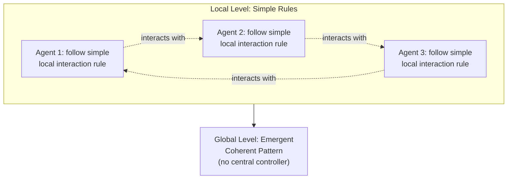
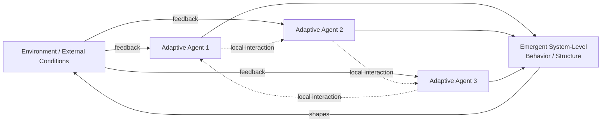

## Adaptive and Self-Organizing Systems

### Definition and Scope

**Adaptive and Self-Organizing Systems** describes a class of systems in which order, structure, or improved fit to the environment emerges from the local interactions of a system's components, without central control or an external designer imposing that order from above. These two closely related concepts are frequently discussed together: **adaptation** refers to a system's or its components' capacity to change behavior in response to feedback from the environment, typically improving fit or performance over time; **self-organization** refers to the spontaneous emergence of coherent, often complex, global structure or pattern from decentralized local interactions among components following relatively simple rules. Together they form the conceptual core of **Complex Adaptive Systems (CAS)**, a major branch of complexity science with direct relevance to ecology, economics, organizational behavior, and biology.

### Self-Organization

**Key Points**

- Global order or pattern emerges from local interactions among components, each typically following simple rules and possessing only local information, with no central controller directing the overall pattern
- The resulting global pattern is often more coherent, efficient, or complex than any individual component's local rule would suggest in isolation — a hallmark of **emergence**
- Self-organizing systems are typically robust to the loss or failure of individual components, since no single component holds unique, indispensable control over the global pattern
- Requires an ongoing flow of energy or resources through the system (in thermodynamic terms, self-organization typically occurs in systems that are not in equilibrium, sometimes termed "dissipative structures")

**Example**

A flock of starlings forming a coherent, fluid, and stunningly coordinated aerial pattern (a "murmuration") arises purely from each individual bird following simple local rules (matching the speed and direction of nearby neighbors, maintaining a minimum separation distance) — no lead bird directs the overall shape, yet a complex, adaptive global pattern emerges that helps the flock evade predators.

### Adaptation

**Key Points**

- A system or its components adjust their behavior, structure, or strategy in response to feedback from the environment, typically (though not always) improving performance or fit over successive iterations
- Adaptation can occur at the level of individual agents (learning), at the level of a population (natural selection across generations), or at the level of an organization (strategic and structural change in response to market feedback)
- Requires a feedback mechanism connecting outcomes back to the components whose behavior is being adjusted; without this feedback loop, no adaptation can occur, regardless of how much the environment itself changes

**Example**

A retail company adapts its product assortment over successive seasons based on sales feedback: products that sell well are expanded, and products that underperform are discontinued, gradually shifting the company's offering to better fit customer demand without any single upfront master plan having specified the final assortment.

### Diagram: Self-Organization from Local Rules

### Complex Adaptive Systems (CAS): Where the Two Concepts Combine

**Key Points**

- A **Complex Adaptive System** is a system composed of many interacting, adaptive agents whose individual and collective adaptation produces emergent, self-organizing, system-level behavior that is not centrally directed and often cannot be fully predicted from knowledge of the individual agents alone
- Commonly cited defining features include: distributed control (no single agent or authority fully directs the system), adaptive agents capable of changing their behavior based on experience, nonlinearity in the relationships between agents, and emergent system-level properties arising from these interactions
- CAS concepts are widely applied to ecosystems, immune systems, financial markets, ant colonies, cities, and organizations, and connect directly to the "Complex" category in the "Simple, Complicated, and Complex Systems" classification

**Example**

An ant colony exhibits classic CAS characteristics: individual ants follow simple local rules (following pheromone trail concentrations left by other ants), no single ant or "queen directive" centrally plans foraging routes, yet the colony as a whole self-organizes highly efficient foraging paths and adapts its collective foraging strategy as food sources and environmental conditions change over time.

### Diagram: Complex Adaptive System Structure

### Distinguishing Self-Organization from Designed Order

| Aspect | Designed (Top-Down) Order | Self-Organized (Bottom-Up) Order |
| --- | --- | --- |
| Source of pattern | Central authority or designer specifies the structure | Emerges from local interactions among components |
| Flexibility to change | Requires the designer to redesign the structure | Can adapt continuously as local conditions change |
| Robustness to component failure | Often depends heavily on key designed elements | Often robust, since no single component is uniquely essential |
| Example | A corporate org chart drawn up by leadership | Informal communication networks that actually route information through an organization |
| Predictability | High, since the designer specifies the outcome | Lower, since the emergent global pattern is not directly specified |

### Worked Example: Self-Organization and Adaptation in an Organizational Setting

**Scenario**: A software company notices that despite its formal, top-down project-approval process, most day-to-day technical decisions are actually being resolved through an informal network of engineers who consult each other based on demonstrated expertise rather than official title or team assignment.

**Self-organization observed**: This informal expertise network was never designed by management; it emerged from repeated local interactions (engineers asking each other for help, referrals accumulating around certain individuals) that produced a coherent, functional structure for routing technical questions more efficiently than the official hierarchy does.

**Adaptation observed**: As certain engineers gain more experience in specific subsystems, the informal network's structure shifts over time, with consultation patterns updating to reflect current expertise rather than remaining fixed, demonstrating an ongoing feedback-driven adjustment process.

**Management implication**: Attempting to replace this self-organized network with a rigid, formally designed knowledge-routing system risks destroying the emergent efficiency it currently provides; a more effective intervention might instead focus on providing better tools and incentives that support and slightly nudge the self-organizing process (e.g., a lightweight expertise-tagging system) rather than attempting to fully centralize and control it.

[Inference] This worked example illustrates a well-documented general pattern in organizational-network research regarding informal versus formal information flow; it is constructed for pedagogical purposes rather than drawn from a specific documented company case study.

### Conditions That Favor Self-Organization

**Key Points**

- **Diversity among agents**: some variation in agent behavior, strategy, or perspective, which provides raw material for adaptive selection and prevents the system from becoming rigidly locked into a single suboptimal pattern
- **Local interaction and feedback**: agents must be able to sense and respond to their immediate environment or neighbors, since self-organization arises from local, not global, information processing
- **Sufficient connectivity**: enough interaction between agents for local adjustments to propagate and aggregate into a coherent global pattern, without so much connectivity that the system becomes rigidly synchronized and loses adaptive flexibility
- **A continuing flow of energy, resources, or information**: self-organizing structures typically require ongoing input to maintain their organized state; removing this flow (e.g., cutting off resource inputs) typically causes the emergent structure to degrade

### Common Pitfalls

**Key Points**

- **Assuming self-organization always produces desirable outcomes**: self-organizing processes can just as readily produce dysfunctional emergent patterns (e.g., a self-organizing rumor network that amplifies misinformation, or informal power structures that entrench inequitable access to resources) as beneficial ones; the process itself is value-neutral
- **Over-designing systems intended to be adaptive**: imposing excessive top-down control on a system explicitly intended to be adaptive or self-organizing (e.g., an innovation team) can suppress the local variation and interaction needed for genuine adaptation to occur
- **Under-designing systems that need some structure**: assuming self-organization alone will reliably produce a desired outcome without providing any of the conditions (diversity, connectivity, feedback channels) that actually favor it, mistaking the absence of central control for a guarantee of beneficial emergent order
- **Confusing adaptation with mere reaction**: labeling any change in response to the environment as "adaptation," when genuine adaptation implies a feedback-driven adjustment that tends to improve fit or performance over time, rather than a one-off, non-learning reaction

### Diagram: Conditions Favoring Self-Organization (svg_diagram)

<svg xmlns="http://www.w3.org/2000/svg" viewBox="0 0 900 380" font-family="Arial, sans-serif">
<text x="450" y="28" text-anchor="middle" font-size="17" font-weight="bold" fill="#1a1a1a">Conditions Favoring Self-Organization (svg_diagram)</text>
<circle cx="450" cy="220" r="80" fill="#2c3e50" />
<text x="450" y="215" text-anchor="middle" font-size="12" fill="#ffffff" font-weight="bold">Self-</text>
<text x="450" y="233" text-anchor="middle" font-size="12" fill="#ffffff" font-weight="bold">Organization</text>
<circle cx="220" cy="100" r="70" fill="#2980b9" opacity="0.9" />
<text x="220" y="95" text-anchor="middle" font-size="11" fill="#ffffff">Diversity</text>
<text x="220" y="112" text-anchor="middle" font-size="11" fill="#ffffff">Among Agents</text>
<circle cx="680" cy="100" r="70" fill="#27ae60" opacity="0.9" />
<text x="680" y="95" text-anchor="middle" font-size="11" fill="#ffffff">Local Interaction</text>
<text x="680" y="112" text-anchor="middle" font-size="11" fill="#ffffff">and Feedback</text>
<circle cx="220" cy="340" r="70" fill="#c0392b" opacity="0.9" />
<text x="220" y="335" text-anchor="middle" font-size="11" fill="#ffffff">Sufficient</text>
<text x="220" y="352" text-anchor="middle" font-size="11" fill="#ffffff">Connectivity</text>
<circle cx="680" cy="340" r="70" fill="#8e44ad" opacity="0.9" />
<text x="680" y="335" text-anchor="middle" font-size="11" fill="#ffffff">Continuing Flow of</text>
<text x="680" y="352" text-anchor="middle" font-size="11" fill="#ffffff">Energy/Resources</text>
<line x1="450" y1="220" x2="220" y2="100" stroke="#7f8c8d" stroke-width="2" />
<line x1="450" y1="220" x2="680" y2="100" stroke="#7f8c8d" stroke-width="2" />
<line x1="450" y1="220" x2="220" y2="340" stroke="#7f8c8d" stroke-width="2" />
<line x1="450" y1="220" x2="680" y2="340" stroke="#7f8c8d" stroke-width="2" />
</svg>

### Relationship to Other Systems-Thinking Concepts

| Related Concept | Connection |
| --- | --- |
| Simple, Complicated, and Complex Systems | Adaptive agents and emergent self-organization are defining features specifically of Complex systems |
| Feedback Loops: Reinforcing vs. Balancing | Adaptation depends fundamentally on feedback loops connecting outcomes back to the adapting agents |
| Recognizing How Structure Generates Behavior | Self-organized structure is a special case where the generating "structure" is itself an emergent, bottom-up product rather than a designed one |
| The Cynefin Framework for Sensemaking | The Complex domain's Probe-Sense-Respond protocol is specifically suited to working with self-organizing, adaptive systems |

### Practical Exercise

**Steps**

1. Identify an emergent, informal structure or pattern in an organization or community you are familiar with — one that was not formally designed but arose from repeated local interactions (an informal social group, a de facto workflow, a community norm).
2. Describe the simple local rules or behaviors that individual participants seem to be following that give rise to this pattern.
3. Assess whether this self-organized pattern is currently helping or hindering the system's overall goals.
4. Identify whether the four conditions favoring self-organization (diversity, local interaction/feedback, sufficient connectivity, continuing resource flow) are present, and which, if any, are notably weak or absent.
5. Consider what a light-touch intervention (rather than a full top-down redesign) might look like if you wanted to nudge this self-organizing pattern toward a more beneficial emergent outcome.

### Related Topics

- Complex Adaptive Systems (CAS)
- Simple, Complicated, and Complex Systems
- Emergence in Complex Systems
- The Cynefin Framework for Sensemaking
- Feedback Loops: Reinforcing vs. Balancing
- Swarm Intelligence and Stigmergy
- Recognizing How Structure Generates Behavior
- Dissipative Structures (Ilya Prigogine)