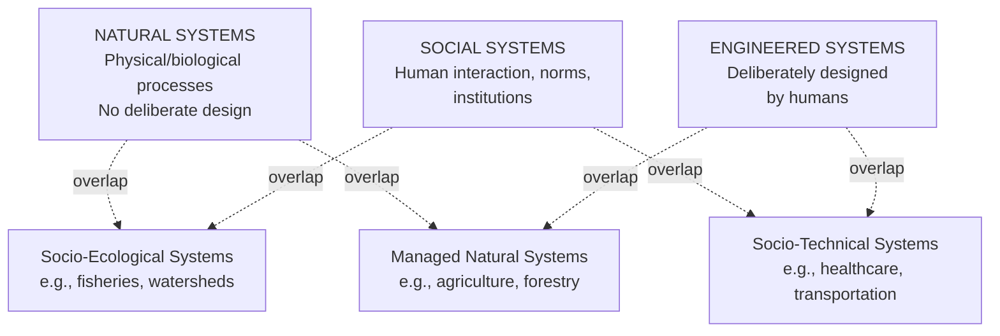

## Natural, Social, and Engineered Systems

### Definition and Scope

**Natural, Social, and Engineered Systems** is a foundational classification in systems thinking that categorizes systems according to their origin and the nature of the agents and processes that constitute and govern them. A **natural system** arises and operates through physical, chemical, and biological processes without deliberate human design. A **social system** consists of interacting human beings whose relationships, norms, and institutions shape collective behavior. An **engineered system** is deliberately designed and constructed by humans to achieve specified functions or purposes. This classification matters because each type differs systematically in how it responds to intervention, how predictable and controllable it is, and what forms of expertise are appropriate for understanding it — and many real-world systems of interest (cities, healthcare systems, supply chains) are **socio-technical** or **socio-ecological** hybrids spanning more than one category simultaneously.

### Natural Systems

**Key Points**

- Governed by physical, chemical, biological, and ecological processes that operate independently of human intention or design
- Exhibit long evolutionary or geological histories, often producing highly optimized, resilient, and interdependent structures shaped by selection pressures over extended timescales
- Frequently exhibit strong feedback loops, nonlinearity, and emergent self-organization (see "Adaptive and Self-Organizing Systems"), since natural systems are rarely centrally controlled
- Human understanding of natural systems is typically incomplete and evolving, requiring ongoing empirical observation rather than access to an original "design specification," since none exists

**Example**

A forest ecosystem is a natural system: the interactions among trees, soil microorganisms, insects, and larger fauna, along with nutrient and water cycles, have developed through long-term ecological and evolutionary processes rather than deliberate design, and the system continues to self-regulate through feedback loops (e.g., predator-prey population dynamics) without external management.

### Social Systems

**Key Points**

- Composed of interacting human beings whose behavior is shaped by shared norms, institutions, culture, incentive structures, and mental models, in addition to individual psychology
- Exhibit adaptive, often self-organizing dynamics (see "Adaptive and Self-Organizing Systems"), since human agents actively interpret, communicate, and adjust their behavior in response to the system and to each other
- Governed partly by formal, explicit rules (laws, organizational policies) and partly by informal, often unwritten norms and expectations that can be equally or more influential on actual behavior
- Particularly susceptible to the dynamics described in "Recognizing How Structure Generates Behavior," since social structures (incentives, communication patterns, power relationships) strongly shape recurring behavioral patterns among the humans within them

**Example**

A neighborhood community is a social system: informal norms about noise, shared spaces, and mutual assistance emerge and evolve through ongoing interaction among residents, shaped by demographic shifts, local history, and communication patterns, without any single central authority fully controlling how residents relate to one another.

### Engineered Systems

**Key Points**

- Deliberately designed and constructed by humans to fulfill specific, intended functions, typically according to explicit specifications, blueprints, or requirements
- Generally exhibit the properties of "Complicated" rather than "Complex" systems (see "Simple, Complicated, and Complex Systems"): their components and relationships, while potentially numerous and intricate, are knowable through engineering analysis, since a human designer intentionally specified them
- Behavior is generally more predictable and controllable than natural or social systems, precisely because the components do not independently adapt or reinterpret their function the way biological organisms or human agents do
- Can still exhibit genuine complexity and emergent behavior, particularly in large-scale software systems, infrastructure networks, or systems with significant human-in-the-loop interaction, where unintended interactions between components can produce behavior the original designers did not fully anticipate

**Example**

An electrical power grid is an engineered system: its components (generators, transformers, transmission lines, switching equipment) were deliberately designed and installed according to specific engineering standards, and its normal operation follows well-understood physical and electrical engineering principles that allow for reliable prediction and control under most conditions.

### Comparative Table: Core Distinctions

| Dimension | Natural System | Social System | Engineered System |
| --- | --- | --- | --- |
| Origin | Emerges through physical/biological/evolutionary processes | Emerges through human interaction, culture, and institutions | Deliberately designed and built by humans |
| Governing mechanism | Physical/chemical/ecological laws | Norms, institutions, incentives, mental models | Explicit engineering specifications and physical laws |
| Typical Cynefin/complexity classification | Often Complex | Often Complex | Often Complicated (though can shift toward Complex) |
| Adaptive agents present | Yes (biological organisms) | Yes (human beings) | Generally no (unless humans are deeply embedded in operation) |
| Predictability | Moderate to low, depending on scale | Often low, due to adaptive human behavior | Generally high, within designed operating parameters |
| Primary analytical approach | Empirical observation, ecological/biological science | Social science, organizational behavior, anthropology | Engineering analysis, systems engineering |

### Diagram: The Three Categories and Their Overlaps

### Hybrid Systems: Where Real-World Complexity Concentrates

**Key Points**

- **Socio-technical systems**: combine engineered technical infrastructure with the human social systems that operate, maintain, and use it; a technically well-engineered system can still fail or behave unpredictably due to the adaptive, social dynamics of the humans embedded within it
- **Socio-ecological systems**: combine natural ecological processes with human social and economic institutions that interact with and depend on those natural processes; management of such systems (e.g., a shared fishery) requires understanding both the biological dynamics and the social/economic incentive structures governing human use
- Most consequential real-world systems of practical interest — healthcare systems, transportation networks, food systems, financial markets, climate policy — are hybrid systems spanning at least two, and often all three, of these categories simultaneously, which is precisely why they tend to resist purely engineering-style or purely natural-science-style analysis alone

**Example**

A public transit system is a socio-technical hybrid: the trains, tracks, and signaling infrastructure are engineered components with predictable mechanical behavior, but the system's actual overall performance also depends heavily on adaptive human behavior — rider choices about when and how to travel, operator decisions, maintenance-crew priorities, and political decisions about funding — all of which introduce social-system dynamics (adaptive agents, informal norms, incentive-driven behavior) that a purely engineering analysis of the physical infrastructure alone would miss.

### Worked Example: Diagnosing a Hybrid System Failure

**Scenario**: A hospital's electronic health record (EHR) system experiences persistent user complaints and workarounds despite passing all technical engineering benchmarks (uptime, data integrity, response time).

**Engineered-system analysis (necessary but insufficient)**: The system's technical architecture, database performance, and interface response times all meet or exceed specified engineering requirements — from a purely engineered-system perspective, the system is functioning correctly.

**Social-system analysis (the missing piece)**: Clinicians have developed informal workarounds (e.g., keeping paper notes alongside the digital system) because the EHR's designed workflow does not match the actual, evolved social workflow of clinical teams — a mismatch between the engineered system's assumptions and the adaptive, norm-driven behavior of the social system using it.

**Synthesis**: The system's practical failure is not an engineering failure in the traditional sense, but a socio-technical mismatch: an engineered system, however well-built, cannot succeed in practice without accounting for the adaptive social system that must actually use it, meaning a durable fix likely requires redesigning the human workflow and the technical system jointly, rather than further optimizing either one in isolation.

[Inference] This worked example illustrates a well-documented general pattern in health-informatics and socio-technical-systems research regarding EHR adoption challenges; it is constructed for pedagogical purposes rather than drawn from a specific documented hospital's case data.

### Common Pitfalls

**Key Points**

- **Applying engineering-style predictability assumptions to social or natural systems**: assuming that because a social or ecological system can be described with models and diagrams, it will behave as predictably and controllably as a deliberately engineered system, when adaptive agents and emergent dynamics routinely violate this assumption
- **Ignoring the social system embedded within an engineered system**: focusing exclusively on the technical performance of an engineered system's components while neglecting the human behavior, incentives, and workflows that determine how the system is actually used in practice
- **Treating natural systems as infinitely resilient or infinitely fragile**: both overestimating natural systems' capacity to absorb human-driven change without consequence, and underestimating their genuine resilience and self-organizing recovery capacity, are common errors; accurate assessment requires case-specific ecological understanding rather than a generic assumption in either direction
- **Assuming a single expert discipline suffices for hybrid systems**: relying solely on engineers to solve a socio-technical problem, or solely on social scientists to address a system with substantial engineered infrastructure, when hybrid systems typically require genuinely interdisciplinary analysis

### Diagram: Classifying a System Across the Three Categories (svg_diagram)

<svg xmlns="http://www.w3.org/2000/svg" viewBox="0 0 900 400" font-family="Arial, sans-serif">
<text x="450" y="28" text-anchor="middle" font-size="17" font-weight="bold" fill="#1a1a1a">Natural, Social, Engineered: Classification Space (svg_diagram)</text>
<circle cx="280" cy="180" r="140" fill="#27ae60" opacity="0.55" />
<text x="200" y="100" text-anchor="middle" font-size="13" fill="#1a1a1a" font-weight="bold">NATURAL</text>
<circle cx="450" cy="280" r="140" fill="#2980b9" opacity="0.55" />
<text x="450" y="380" text-anchor="middle" font-size="13" fill="#1a1a1a" font-weight="bold">SOCIAL</text>
<circle cx="620" cy="180" r="140" fill="#c0392b" opacity="0.55" />
<text x="700" y="100" text-anchor="middle" font-size="13" fill="#1a1a1a" font-weight="bold">ENGINEERED</text>

<text x="330" y="220" text-anchor="middle" font-size="10" fill="`#1a1a1a`">Socio-Ecological</text>

<text x="330" y="234" text-anchor="middle" font-size="10" fill="`#1a1a1a`">(e.g., fisheries)</text>

<text x="570" y="220" text-anchor="middle" font-size="10" fill="`#1a1a1a`">Socio-Technical</text>

<text x="570" y="234" text-anchor="middle" font-size="10" fill="`#1a1a1a`">(e.g., transit systems)</text>

<text x="450" y="150" text-anchor="middle" font-size="10" fill="`#1a1a1a`">Managed Natural</text>

<text x="450" y="164" text-anchor="middle" font-size="10" fill="`#1a1a1a`">(e.g., agriculture)</text>

</svg>

### Relationship to Other Systems-Thinking Concepts

| Related Concept | Connection |
| --- | --- |
| Simple, Complicated, and Complex Systems | Engineered systems tend toward Complicated; natural and social systems tend toward Complex, due to adaptive agents |
| Adaptive and Self-Organizing Systems | Natural and social systems both commonly exhibit self-organization and adaptation; engineered systems typically do not, unless deliberately designed to (e.g., adaptive control systems) |
| Recognizing How Structure Generates Behavior | Applies across all three categories, but the "structure" in each case differs: physical/ecological laws, social norms and institutions, or engineering design specifications |
| Deterministic versus Stochastic Systems | Engineered systems are often deliberately designed to be as close to deterministic as possible; natural and social systems more commonly exhibit significant stochastic variability |

### Practical Exercise

**Steps**

1. Select a system you regularly interact with or are analyzing (a workplace, a piece of technology, an ecosystem you are familiar with).
2. Determine which of the three categories — Natural, Social, or Engineered — best describes its origin and primary governing mechanism, or identify it as a hybrid spanning two or more categories.
3. If hybrid, explicitly separate which components are engineered (and thus more predictable/controllable) from which are social or natural (and thus more adaptive/emergent).
4. Identify a recent problem or failure within this system, and assess whether the problem stemmed primarily from a technical/engineering mismatch, a social/behavioral mismatch, a natural/ecological factor, or an interaction between them.
5. Consider what disciplinary expertise (engineering, social science, ecology, or some combination) would be most appropriate to address the identified problem.

### Related Topics

- Socio-Technical Systems
- Socio-Ecological Systems and Common-Pool Resource Management
- Simple, Complicated, and Complex Systems
- Adaptive and Self-Organizing Systems
- Recognizing How Structure Generates Behavior
- Complex Adaptive Systems (CAS)
- Systems Engineering
- Institutional and Organizational Theory