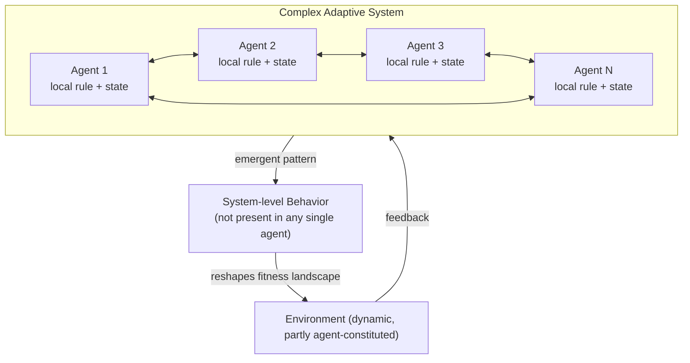

## Complex Adaptive Systems

### Definition and Core Concept

A Complex Adaptive System (CAS) is a system composed of many heterogeneous, interconnected components (agents) that interact according to local rules, adapt their behavior based on experience or environmental feedback, and collectively give rise to emergent, system-level behavior that cannot be predicted from or reduced to the properties of the individual agents alone.

CAS theory sits at the intersection of systems thinking, complexity science, cybernetics, and evolutionary theory. It was formalized substantially through work at the Santa Fe Institute (John Holland, Murray Gell-Mann, Stuart Kauffman) in the late 1980s and 1990s.

The term is deliberately compound:

- **Complex**: behavior arises from many interacting parts, not from a single controlling mechanism
- **Adaptive**: agents and/or the system as a whole change their behavior in response to feedback
- **System**: the components form a bounded, interdependent whole distinguishable from its environment

### Distinguishing CAS from Other System Types

| Property | Simple System | Complicated System | Complex Adaptive System |
| --- | --- | --- | --- |
| Component count | Few | Many | Many |
| Component behavior | Fixed, deterministic | Fixed, deterministic | Variable, adaptive |
| Predictability | High | High (given full knowledge) | Low; probabilistic at best |
| Decomposability | Fully decomposable | Decomposable with effort | Not fully decomposable |
| Cause-effect relationship | Linear, proportional | Linear, traceable | Nonlinear, disproportionate |
| Example | A pendulum | A jet engine | An ant colony, an economy |

A jet engine is complicated (thousands of parts, but behavior is fully specified by design) but not complex-adaptive, because its parts do not independently learn or change strategy. An ant colony is far simpler at the component level but is a CAS because ants adapt pheromone-following behavior based on local conditions, producing colony-level outcomes no single ant "decides."

### Core Properties

**Agents and heterogeneity**

CAS are composed of agents (cells, organisms, people, firms, software processes) that differ from one another and act based on local, incomplete information rather than global knowledge.

**Self-organization**

Order emerges from local interactions without centralized control or a blueprint. No agent has, or needs, a view of the whole system.

**Emergence**

System-level patterns (flocking, market prices, traffic jams, immune response) arise from agent interactions and exist only at the aggregate level; they are not properties of any individual agent. Emergent behavior is generally non-decomposable — you cannot fully explain it by summing individual agent behaviors.

**Nonlinearity**

Small changes in initial conditions or inputs can produce disproportionately large effects (sensitive dependence), while large perturbations sometimes produce negligible effects. This breaks the additive assumption ($output \propto input$) that holds in linear systems.

**Feedback loops**

CAS are regulated by reinforcing (positive) and balancing (negative) feedback loops. Reinforcing loops amplify deviations (e.g., viral adoption); balancing loops stabilize the system around an attractor (e.g., predator-prey population cycles).

**Coevolution**

Agents adapt partly in response to other adapting agents, so the "fitness landscape" for any one agent is continuously reshaped by the adaptation of others. This is distinct from simple adaptation to a static environment.

**Path dependence and history**

The current state of a CAS depends on its specific trajectory, not only on current conditions. Early events can lock in structures (e.g., QWERTY keyboard layout, technology standards) that persist even when no longer optimal.

**Edge of chaos**

CAS tend to operate in a regime between rigid order and pure randomness. Too much order (over-constrained rules) suppresses adaptability; too much disorder prevents stable structure from forming. Kauffman and Packard described this as the region where complex computation and evolvability are maximized.

**Openness**

CAS are typically open systems, exchanging energy, matter, or information with their environment, which is necessary to avoid entropic decay (see thermodynamic framing of living systems).

### Mechanisms of Adaptation

Three principal mechanisms allow agents or the system to adapt:

1. **Selection**: agents or strategies that perform well relative to some fitness criterion persist or propagate; poorly performing ones are removed or replaced. This is the core mechanism in biological evolution and market competition.
2. **Learning**: individual agents modify their own behavior based on feedback from outcomes (reinforcement learning is a direct computational analog).
3. **Variation**: mutation, recombination, or experimentation introduces novel strategies into the population, providing raw material for selection to act on.

$$\text{Adaptation} = f(\text{Variation}, \text{Selection}, \text{Retention})$$

This is the same variation-selection-retention (VSR) triad found in Universal Darwinism, applied generally beyond biological genetics to ideas, strategies, and institutional practices.

### Structural Model: Agents, Rules, and Landscape

A minimal formal description of a CAS involves:

- **Agent set** $A = \{a_1, a_2, ..., a_n\}$
- **State space** for each agent, $S_i$, describing possible internal configurations
- **Local interaction rules** $R$, governing how an agent's next state depends on its own state and the states of its neighbors
- **Fitness/payoff function** $F$, evaluating agent performance in context
- **Environment** $E$, which may itself be dynamic and partly constituted by the other agents (this is what produces coevolution)

The system state at time $t+1$ is a function of local, not global, computation:

$$s_i(t+1) = R(s_i(t), \{s_j(t) : j \in N(i)\}, E(t))$$

where $N(i)$ is the neighborhood of agent $i$. Global behavior is the aggregate trajectory of all $s_i(t)$ over time — it is observed, not directly specified.

### Illustrative Example: Ant Colony Foraging

**Example**

Individual ants follow a simple local rule: lay pheromone while returning from a food source, and probabilistically follow paths with stronger pheromone concentration, discounted by evaporation over time.

No ant knows the shortest path to food. Yet because shorter paths are traversed more frequently per unit time (shorter round-trip), pheromone accumulates faster on shorter paths, more ants are recruited to them, and evaporation prunes longer/unused paths. The colony converges on a near-optimal path — an emergent, colony-level optimization performed with zero centralized planning, zero global path knowledge, and only local sensing.

This mechanism is the direct inspiration for Ant Colony Optimization (ACO) algorithms used computationally to solve routing and combinatorial optimization problems.

### Illustrative Example: Market Price Formation

**Example**

Individual traders act on local, incomplete information (their own beliefs, risk tolerance, available capital) and adapt strategies based on profit/loss feedback. No trader sets the market price. Price emerges from the aggregate of decentralized buy/sell decisions clearing through the order book.

Feedback loops operate in both directions: rising prices can attract momentum buyers (reinforcing loop, producing bubbles) while also triggering profit-taking sellers (balancing loop). The interaction of these loops, plus coevolving strategies (as one trading strategy becomes common, its edge erodes, pushing agents to adapt further), produces the nonlinear, regime-shifting behavior characteristic of financial markets — a canonical CAS studied extensively by the Santa Fe Institute's economics program.

### CAS Diagram: Structure and Feedback

### Vector Field Illustration: Attractor Basin (svg_diagram)

<svg xmlns="http://www.w3.org/2000/svg" viewBox="0 0 500 320">
<title>Attractor Basin in a Complex Adaptive System (svg_diagram)</title>
<rect x="0" y="0" width="500" height="320" fill="#ffffff" />
<text x="250" y="24" font-size="15" text-anchor="middle" font-family="sans-serif" fill="#222">System Trajectories Converging on an Attractor (svg_diagram)</text>
<ellipse cx="250" cy="180" rx="200" ry="100" fill="#eef3fb" stroke="#9fb8dd" stroke-width="1.5" />
<circle cx="250" cy="180" r="10" fill="#2b5fad" />
<text x="250" y="205" font-size="12" text-anchor="middle" font-family="sans-serif" fill="#2b5fad">Attractor state</text>
<path d="M70,80 C120,120 160,150 240,175" fill="none" stroke="#555" stroke-width="1.5" marker-end="url(#arrow)" />
<path d="M430,90 C380,130 320,155 260,175" fill="none" stroke="#555" stroke-width="1.5" marker-end="url(#arrow)" />
<path d="M90,270 C140,240 190,210 240,185" fill="none" stroke="#555" stroke-width="1.5" marker-end="url(#arrow)" />
<path d="M420,260 C370,230 320,205 262,185" fill="none" stroke="#555" stroke-width="1.5" marker-end="url(#arrow)" />
<circle cx="70" cy="80" r="4" fill="#c0392b" />
<circle cx="430" cy="90" r="4" fill="#c0392b" />
<circle cx="90" cy="270" r="4" fill="#c0392b" />
<circle cx="420" cy="260" r="4" fill="#c0392b" />
<text x="40" y="70" font-size="11" font-family="sans-serif" fill="#c0392b">Initial state A</text>
<text x="400" y="80" font-size="11" font-family="sans-serif" fill="#c0392b">Initial state B</text>
<text x="60" y="290" font-size="11" font-family="sans-serif" fill="#c0392b">Initial state C</text>
<text x="360" y="280" font-size="11" font-family="sans-serif" fill="#c0392b">Initial state D</text>

<text x="250" y="310" font-size="11" text-anchor="middle" font-family="sans-serif" fill="#555">Different starting conditions converge toward a shared emergent stable state (basin of attraction)</text>

</svg>

### Computational Modeling Approaches

**Agent-Based Modeling (ABM)**

The dominant simulation technique for CAS. Each agent is instantiated as a discrete computational object with its own state and behavior rules; the model is run forward and aggregate patterns are observed. Common frameworks: NetLogo, Mesa (Python), Repast.

**Cellular Automata (CA)**

A restricted, grid-based special case where agents are cells with a finite set of states updated synchronously based on neighbor states. Conway's Game of Life is the canonical minimal CAS-like CA: four simple rules produce gliders, oscillators, and unbounded emergent complexity.

**Genetic Algorithms (GA)**

Directly operationalize the variation-selection-retention triad computationally: a population of candidate solutions is mutated/recombined (variation), evaluated against a fitness function (selection), and the fittest are retained into the next generation.

**Network/graph-based models**

Represent agents as nodes and interactions as edges, allowing analysis of how topology (small-world, scale-free) affects propagation of information, disease, or influence through the system.

### Applications Across Domains

| Domain | CAS Instance | Emergent Phenomenon |
| --- | --- | --- |
| Biology | Immune system | Adaptive antibody response to novel pathogens |
| Ecology | Ecosystem/food web | Population equilibria, trophic cascades |
| Economics | Market/economy | Price formation, business cycles, bubbles |
| Urban planning | City traffic network | Congestion patterns, phantom traffic jams |
| Organizations | Firm/institution | Organizational culture, informal power structures |
| Technology | Internet/distributed systems | Traffic routing, cascading failures |
| Social systems | Social networks | Opinion polarization, information cascades, meme propagation |
| Climate | Earth's climate system | Tipping points, regime shifts |

### Managerial and Design Implications

Because CAS cannot be fully controlled top-down, intervention strategy differs fundamentally from complicated-system engineering:

- **Cannot command outcomes directly**: leaders/designers can only shape boundary conditions, incentive structures, and interaction rules — not dictate emergent results.
- **Simple rules over detailed plans**: interventions that specify a few robust local rules (as in Netlogo/Boids-style flocking: separation, alignment, cohesion) are typically more effective and resilient than attempts at exhaustive centralized specification.
- **Probe-Sense-Respond**: the Cynefin framework (Snowden) prescribes running small, safe-to-fail experiments (probes), sensing the emergent response, and amplifying or dampening based on outcome — rather than analyze-then-plan, which assumes predictability that CAS do not offer.
- **Manage for resilience, not just efficiency**: over-optimizing a CAS for short-term efficiency (removing redundancy, tightening coupling) frequently reduces its adaptive capacity and increases fragility to shocks — a tension formalized in Panarchy and resilience theory (Holling).
- **Expect nonlinear, delayed responses**: due to feedback loops and delays, interventions often produce effects that are disproportionate, delayed, or counterintuitive relative to their intended, linear-cause-effect design.

### Common Misconceptions

- **[Inference]** "Complex" does not mean "complicated" — complicated systems can, in principle, be fully mapped and controlled with enough engineering effort; CAS resist full specification even in principle because emergent behavior is not reducible to component behavior.
- Self-organization does not mean "no structure" — CAS often display highly ordered, statistically predictable patterns (power-law size distributions, stable population ratios) despite lacking centralized control.
- Adaptation does not imply "improvement" in an absolute sense — adaptation is relative to a fitness landscape that itself shifts (coevolution), so a CAS can adapt into a locally stable but globally poor configuration (a local optimum / evolutionary trap).
- **[Unverified]** Practical predictions about the specific timing or magnitude of emergent regime shifts (e.g., exact market crash timing, exact epidemic peak) are generally not reliable even with accurate agent-level models, due to sensitivity to initial conditions; this is a standard caveat in complexity science but the precise predictive limits are actively debated.

### Related Theoretical Connections

- **Chaos theory**: shares sensitive dependence on initial conditions, but chaos theory typically studies deterministic low-dimensional systems, while CAS emphasizes high-dimensional, heterogeneous agent populations.
- **Cybernetics**: contributes the feedback-loop vocabulary (first-order and second-order feedback) foundational to CAS regulation.
- **Dissipative structures (Prigogine)**: thermodynamic framing of how open systems maintain organized structure far from equilibrium by dissipating entropy to their environment — directly relevant to why CAS require openness.
- **Panarchy (Holling, Gunderson)**: models CAS as passing through adaptive cycles (exploitation → conservation → release → reorganization) across nested scales.

**Related Topics**

- Emergence and Self-Organization
- Feedback Loops (Reinforcing and Balancing)
- Agent-Based Modeling
- Edge of Chaos and Criticality
- Cellular Automata
- Panarchy and Adaptive Cycles
- Network Theory and Graph-Based Systems Analysis
- Cynefin Framework and Decision-Making Under Complexity
- Resilience Theory
- Evolutionary Game Theory