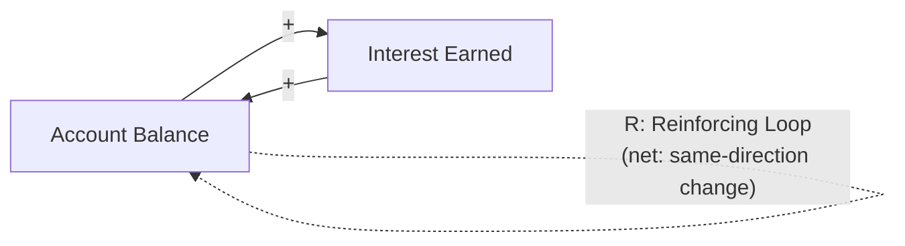
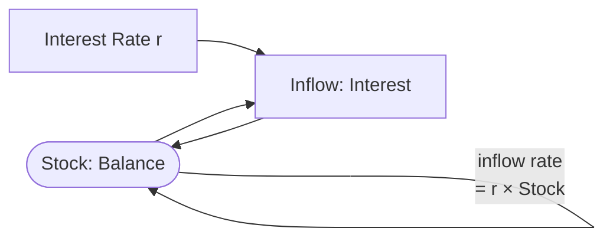

## Reinforcing Feedback Loops

### Definition and Core Concept

A reinforcing feedback loop (also called a positive feedback loop) is a causal loop structure in which an initial change in a system variable propagates through a chain of cause-effect relationships and returns to amplify the original change in the same direction. The loop reinforces deviation rather than correcting it: an increase produces further increase, and a decrease produces further decrease.

Reinforcing loops are one of the two fundamental feedback archetypes in systems thinking (the other being balancing/negative feedback loops). They are the structural source of exponential growth, exponential decline, virtuous cycles, vicious cycles, and runaway/collapse dynamics in systems.

The term "positive" refers strictly to the *sign* of the loop's net effect on the original variable (deviation-amplifying), not to a value judgment — a reinforcing loop can drive a system toward highly undesirable outcomes (e.g., a bank run, an arms race, ecosystem collapse) just as readily as toward desirable ones (e.g., compounding savings, network adoption).

### Structural Definition: Loop Polarity

A causal loop is classified by counting the number of negative (inverse) causal links in the loop:

$$\text{Loop polarity} = (-1)^{n}$$

where $n$ is the number of negative links in the loop. If $n$ is even (including zero), the loop is reinforcing (net positive polarity). If $n$ is odd, the loop is balancing (net negative polarity).

Each causal link in the loop is labeled with a polarity:

- A **positive link** ($+$) means the cause and effect move in the same direction (increase in A causes increase in B; decrease in A causes decrease in B).
- A **negative link** ($-$) means the cause and effect move in opposite directions (increase in A causes decrease in B).

### Canonical Example: Compound Interest

**Example**

Consider a savings account with principal $P$, balance $B$, and interest rate $r$ credited periodically.

$$B_{t+1} = B_t + r \cdot B_t = B_t(1 + r)$$

The causal loop: higher balance → more interest earned (positive link) → higher balance (positive link). Two positive links, $n = 0$ negative links, so the loop is reinforcing. The result is exponential growth:

$$B_t = P(1 + r)^t$$

This is the simplest possible reinforcing loop and the reason reinforcing loops are structurally associated with exponential — not linear — trajectories.

### Canonical Example: Population Growth (Unconstrained)

**Example**

Population size $N$ → births per period (proportional to $N$, positive link) → increase in $N$ (positive link). This is the same two-positive-link structure as compound interest, and it produces the same exponential form:

$$\frac{dN}{dt} = rN \implies N(t) = N_0 e^{rt}$$

This is the Malthusian growth model. In real ecological systems this reinforcing loop is nearly always coupled to a balancing loop (resource depletion, predation, disease) that eventually dominates — see the "Related Topics" note on loop dominance below.

### Causal Loop Diagram Notation

The convention in formal systems-thinking causal loop diagrams (CLDs) is to mark the loop's interior with an "R" (reinforcing) or a snowball icon, alongside "+"/"-" labels on each individual causal arrow. A common shorthand alternative uses only the letter inside a loop arrow, as shown above.

### Illustrative Example: Network Effects / Viral Adoption

**Example**

Number of platform users $U$ → value of the platform to each user (Metcalfe's-law-style, positive link, since value scales with the number of others to interact with) → rate of new user acquisition (positive link) → increase in $U$ (positive link).

$$U_{t+1} = U_t + \beta \cdot U_t \cdot (1 - U_t/K)$$

This is a logistic-form reinforcing loop (the classic "S-curve" adoption model), where $\beta$ is an adoption rate constant and $K$ is a carrying capacity introduced by a coupled balancing loop (market saturation). In the early phase, when $U_t \ll K$, the $(1 - U_t/K)$ term is close to 1 and the dynamics are dominated by the reinforcing loop, producing near-exponential early growth before the balancing loop takes over.

### Illustrative Example: Vicious Cycle — Bank Run

**Example**

Depositor withdrawals → perceived bank instability (positive link: more withdrawals signal distress) → depositor fear (positive link) → more withdrawals (positive link). Three positive links, $n=0$ negative links, reinforcing. This loop can drive a solvent institution into an actual liquidity crisis purely through the self-fulfilling dynamics of the loop itself — a structurally important case because the reinforcing loop's damage is caused by the *feedback dynamics*, not by any change in underlying fundamentals.

### Illustrative Example: Vicious Cycle — Poverty Trap

**Example**

Low income → limited access to education/healthcare/capital (negative link: less income causes less access) → low productivity (positive link: less access causes less productivity) → low income (positive link). Count negative links: $n = 1$. By the parity rule this loop is *balancing*, not reinforcing — worth noting explicitly, because this is a commonly mislabeled case: colloquial "vicious cycle" language does not always correspond to a reinforcing loop in the formal CLD sense. The formal classification depends strictly on counting negative links, not on whether the outcome "feels" self-perpetuating in a bad direction.

To construct a genuinely reinforcing poverty-trap loop requires an even number of negative links, e.g.: low income → (negative link) low savings → (negative link) low investment in productive assets → (positive link) low future income. Here $n=2$, net reinforcing.

### Reinforcing vs. Balancing Loops: Comparative Table

| Property | Reinforcing (Positive) Loop | Balancing (Negative) Loop |
| --- | --- | --- |
| Number of negative links | Even (0, 2, 4, ...) | Odd (1, 3, 5, ...) |
| Effect on initial deviation | Amplifies | Counteracts, seeks equilibrium |
| Typical trajectory shape | Exponential growth/decline | Goal-seeking, oscillation, or convergence to setpoint |
| System behavior without external limit | Runaway/explosive or collapse | Stabilizes at equilibrium |
| Common icon in CLDs | Snowball / "R" | Scale / "B" |
| Example | Compound interest, viral spread, arms race | Thermostat, predator-prey equilibrium, market supply-demand |

### Why Reinforcing Loops Cannot Sustain Unbounded Growth

**[Inference]** No real-world reinforcing loop produces unbounded exponential growth indefinitely, because physical, resource, or informational constraints eventually introduce a coupled balancing loop that dominates the system's behavior. This is a structural inference from conservation laws and finite carrying capacity, not a property provable purely from loop-counting rules.

The general pattern in real systems is:

$$\text{Observed trajectory} = \text{Reinforcing loop dynamics (early)} \rightarrow \text{Balancing loop dominance (later)}$$

This produces the S-curve (logistic) shape ubiquitous in population ecology, technology adoption curves, and epidemic spread (e.g., the SIR model's initial exponential phase before susceptible-population depletion imposes balancing dynamics).

### Reinforcing Loops in Stock-and-Flow Structure

In formal system dynamics notation (Forrester), a reinforcing loop is typically represented as a stock (accumulation) whose outflow or inflow rate is itself a function of the stock level:

This stock-flow-with-self-referencing-rate pattern is the generic template for identifying a reinforcing loop in any system dynamics model: whenever a flow into (or out of) a stock is calculated as a positive function of that same stock's current level, a reinforcing loop is present.

### Identifying Reinforcing Loops in Practice

1. **Trace the causal chain**: starting from a variable of interest, follow "if this increases, then..." statements around the full loop back to the starting variable.
2. **Assign polarity to each link**: label each arrow $+$ (same direction) or $-$ (opposite direction).
3. **Count negative links**: an even count (including zero) identifies a reinforcing loop.
4. **Check for coupled balancing loops**: real systems rarely contain isolated reinforcing loops; identify what eventually constrains the reinforcing dynamic (resource limits, market saturation, regulatory intervention, physical capacity).
5. **Assess current loop dominance**: **[Inference]** determining which loop (reinforcing or balancing) currently dominates observed system behavior generally requires either simulation or examination of the relative magnitude of the loop gains, since dominance can shift over time even within a fixed causal structure.

### Leverage Point Implications

**Key Points**

- Reinforcing loops are high-leverage intervention points precisely because their effects compound: a small change to loop gain (e.g., interest rate $r$, viral coefficient $\beta$) produces disproportionately large long-run effects due to the exponential relationship.
- Donella Meadows' leverage-points framework ranks the ability to add, remove, or alter the strength of reinforcing feedback loops among the more powerful (though harder-to-execute) system interventions, above simple parameter tweaks like adjusting buffer sizes or numerical constants.
- Conversely, an *unrecognized* reinforcing loop is a common root cause of policy resistance and unintended runaway outcomes, because interventions that ignore the loop's self-reinforcing structure fail to address the actual driver of the trend.

### Common Pitfalls in Identification

- **Confusing "positive" with "good"**: loop polarity is a mathematical/structural property, unrelated to whether the outcome is desirable.
- **Miscounting delayed links**: a causal link's polarity is independent of time delay; a delay changes *when* the effect appears, not the $+/-$ sign of the relationship. Long delays in reinforcing loops are particularly dangerous because the compounding effect can become large before it is detected (e.g., climate feedback loops such as ice-albedo feedback, where warming reduces ice cover, reducing surface reflectivity, increasing heat absorption, causing further warming).
- **Treating one iteration as the whole loop**: a single pass through a causal chain shows correlation; confirming a true feedback loop requires establishing that the chain returns to and affects its own starting variable.
- **[Unverified]** Some real-world systems exhibit apparent reinforcing behavior that is actually the result of an external driving trend rather than an internal feedback loop; distinguishing genuine endogenous feedback from a coincidentally correlated exogenous trend generally requires intervention or time-series analysis beyond simple observation, and the specific diagnostic threshold varies by domain.

**Related Topics**

- Balancing (Negative) Feedback Loops
- Causal Loop Diagrams and Loop Polarity Analysis
- Stock and Flow Diagrams
- System Dynamics and Simulation (e.g., Forrester models)
- Loop Dominance and Regime Shifts
- S-Curve / Logistic Growth Models
- Leverage Points (Donella Meadows)
- Delays in Feedback Systems
- Policy Resistance