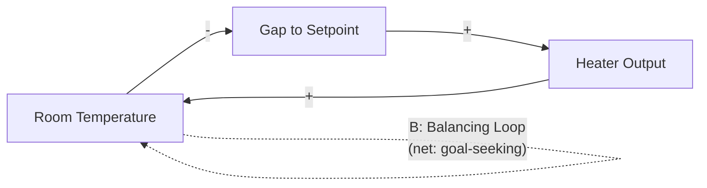
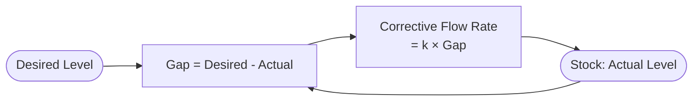

## Balancing Feedback Loops

### Definition and Core Concept

A balancing feedback loop (also called a negative feedback loop) is a causal loop structure in which an initial change in a system variable propagates through a chain of cause-effect relationships and returns to counteract the original change, driving the system toward a goal state, equilibrium, or setpoint. Where reinforcing loops amplify deviation, balancing loops suppress it.

Balancing loops are the structural source of goal-seeking behavior, equilibrium-maintenance, oscillation, and homeostasis in systems. They are one of the two fundamental feedback archetypes in systems thinking, alongside reinforcing (positive) feedback loops.

The term "negative" refers to the *sign* of the loop's net effect on the original variable (deviation-correcting), not to a value judgment. A balancing loop can maintain a desirable steady state (body temperature regulation) or trap a system in an undesirable one (a chronic underperformance equilibrium that resists improvement efforts).

### Structural Definition: Loop Polarity

As with reinforcing loops, a causal loop's classification depends on counting the negative (inverse) causal links in the loop:

$$\text{Loop polarity} = (-1)^{n}$$

where $n$ is the number of negative links in the loop. If $n$ is odd, the loop is balancing (net negative polarity). If $n$ is even (including zero), the loop is reinforcing.

Each link is labeled with polarity:

- A **positive link** ($+$): cause and effect move in the same direction.
- A **negative link** ($-$): cause and effect move in opposite directions.

A balancing loop requires at least one negative link somewhere in its causal chain — this is what allows the loop to "reverse" the direction of the original disturbance by the time the causal chain returns to the starting variable.

### Canonical Example: Thermostat

**Example**

Room temperature $T$ → gap between $T$ and setpoint $T_{set}$ (this gap drives heater output; when $T$ rises, the gap $T_{set} - T$ shrinks — negative link) → heater output (positive link: smaller gap → less heating output) → room temperature $T$ (positive link: more heating → higher $T$).

Count negative links: $n = 1$ (odd) → balancing. The system seeks and holds the setpoint $T_{set}$:

$$\frac{dT}{dt} = k(T_{set} - T)$$

Solving this first-order linear ODE gives exponential *convergence* toward the goal, not exponential growth:

$$T(t) = T_{set} + (T_0 - T_{set})e^{-kt}$$

This negative-exponential convergence form is the mathematical signature of a balancing loop, in contrast to the positive-exponential ($e^{+rt}$) signature of a reinforcing loop.

### Causal Loop Diagram Notation

The formal systems-thinking convention marks the loop interior with a "B" (balancing) label or a scale icon, alongside $+/-$ labels on each causal arrow — the mirror convention to the "R"/snowball marking used for reinforcing loops.

### Illustrative Example: Predator-Prey Regulation

**Example**

Prey population $N$ → predator population growth (positive link: more prey supports more predators) → predation pressure (positive link: more predators → more predation) → prey population $N$ (negative link: more predation reduces prey).

Count negative links: $n = 1$ → balancing. This is the stabilizing loop embedded in the classic Lotka-Volterra system:

$$\frac{dN}{dt} = \alpha N - \beta N P, \qquad \frac{dP}{dt} = \delta N P - \gamma P$$

where $N$ is prey, $P$ is predator, and the $-\beta NP$ and $+\delta NP$ cross-terms encode the balancing coupling between the two populations. Note that this particular balancing loop produces sustained oscillation rather than smooth convergence, because the two-population structure and the specific gain values place the system at a center point rather than a stable node — a reminder that "balancing" describes loop polarity, not the *shape* of the resulting trajectory.

### Illustrative Example: Market Supply and Demand

**Example**

Price $P$ → quantity supplied $Q_s$ (positive link: higher price incentivizes more supply) → excess supply relative to demand (positive link) → downward pressure on price (negative link: excess supply pushes price down) → price $P$.

Count negative links: $n = 1$ → balancing. This loop is the classical mechanism by which competitive markets are theorized to converge toward a market-clearing equilibrium price, absent external shocks or structural reinforcing loops (such as speculative momentum trading) that could dominate and override it.

### Illustrative Example: Goal-Seeking in Organizations — Budget Control

**Example**

Actual spending → gap versus budgeted spending (negative link: higher actual spend shrinks the *remaining* budget gap) → corrective management action, e.g. spending freezes (positive link: larger negative gap triggers stronger corrective action) → actual spending (negative link: corrective action reduces spending).

Count negative links: $n = 2$. **[Inference]** By the parity rule this loop as stated is technically reinforcing, which illustrates a frequent construction error: intuitively "corrective" loops are not automatically balancing in the formal sense — the specific direction of each link must be traced explicitly rather than assumed from the colloquial framing of "correction." A correctly balancing version requires an odd total: actual spending → (negative link, since more spending reduces remaining budget) budget gap → (positive link, larger gap causes more urgent cost-cutting) → actual spending decrease. Re-tracing with the outcome variable as *spending itself* (not the freeze) and one negative link cleanly returns $n=1$, balancing.

### Reinforcing vs. Balancing Loops: Comparative Table

| Property | Balancing (Negative) Loop | Reinforcing (Positive) Loop |
| --- | --- | --- |
| Number of negative links | Odd (1, 3, 5, ...) | Even (0, 2, 4, ...) |
| Effect on initial deviation | Counteracts, seeks equilibrium | Amplifies |
| Typical trajectory shape | Goal-seeking convergence, or oscillation | Exponential growth/decline |
| Requires a goal/setpoint? | Yes, implicitly or explicitly | No |
| Common icon in CLDs | Scale / "B" | Snowball / "R" |
| Example | Thermostat, predator-prey, market equilibrium | Compound interest, viral spread |

### Stock-and-Flow Structure of Balancing Loops

In system dynamics (Forrester) notation, a balancing loop is characterized by a stock whose flow rate is a function of the *gap* between the stock's current level and a desired/reference level:

This "stock, compared against a goal, driving a corrective flow back into the stock" template is the generic signature for locating a balancing loop in any system dynamics model — structurally the mirror image of the self-referencing-rate template used to identify reinforcing loops.

### Oscillation and the Role of Delay

**[Inference]** A balancing loop does not always produce smooth, monotonic convergence to its goal; when the loop contains a significant time delay between corrective action and its measurable effect, the loop tends to overshoot the goal, then correct in the opposite direction, producing oscillation around the setpoint rather than direct convergence. This is a well-established structural tendency in system dynamics (e.g., Forrester's work on oscillatory behavior in supply chains, the "bullwhip effect"), though the precise oscillation amplitude and whether it damps, sustains, or grows depends on the specific gain and delay parameters of the loop, which is why it is flagged here as an inference rather than a universal law.

A generic delayed balancing loop can be modeled as a second-order system:

$$\frac{d^2y}{dt^2} + 2\zeta\omega_n\frac{dy}{dt} + \omega_n^2 y = \omega_n^2 y_{goal}$$

where $\zeta$ (damping ratio) governs whether the approach to $y_{goal}$ is overdamped (smooth), critically damped, underdamped (oscillating but converging), or undamped (sustained oscillation) — the same mathematical framework used in control theory for PID controller tuning, which is itself a direct engineering application of balancing-loop design.

### Identifying Balancing Loops in Practice

1. **Trace the causal chain** from the variable of interest around the full loop back to itself.
2. **Assign polarity to each link.**
3. **Count negative links**: an odd count identifies a balancing loop.
4. **Identify the implicit or explicit goal**: every balancing loop is "trying" to hold some variable at, or move it toward, a reference value — even when no explicit goal-setting agent exists (e.g., a market's "goal" of clearing price is not set by any single actor, but emerges from the loop structure).
5. **Check for delay**: assess whether time lags between cause and corrective effect are large relative to the loop's natural adjustment speed, since this materially changes the trajectory shape (smooth convergence vs. oscillation vs. instability).

### Leverage Point and Diagnostic Implications

**Key Points**

- Balancing loops are the primary source of **policy resistance**: an intervention designed to shift a system variable is often counteracted by a pre-existing balancing loop that was maintaining the prior equilibrium, causing the system to drift back toward its original state once the intervention's pressure eases or the loop's corrective capacity is exceeded.
- Distinguishing "the system won't move because a balancing loop is holding it in place" from "the system won't move because there's no relevant force at all" is a core systems-thinking diagnostic skill, since the appropriate intervention differs: the former requires addressing or repositioning the goal/setpoint driving the loop, not simply pushing harder against it.
- Multiple balancing loops with different goals can conflict, producing effective system behavior that satisfies neither goal cleanly — a common root cause of chronic organizational underperformance despite active corrective effort on multiple fronts.

### Common Pitfalls in Identification

- **Assuming "corrective-sounding" language guarantees balancing polarity**: as shown in the budget example above, colloquial descriptions of "correction" or "control" do not reliably indicate loop polarity; each link must be traced and signed explicitly.
- **Ignoring the goal variable**: a balancing loop analysis is incomplete without identifying what reference value or setpoint the loop is implicitly regulating toward.
- **Treating oscillation as loop malfunction**: oscillation is an expected outcome of a delayed balancing loop, not evidence that the loop is failing to balance — the loop is still net deviation-correcting on average even while a specific instantaneous trajectory temporarily overshoots.
- **[Unverified]** Assuming a balancing loop's setpoint is fixed: in some real systems, the reference/goal value that a balancing loop targets is itself variable or renegotiated over time (e.g., "acceptable" inflation targets, shifting social norms), which can be mistaken for the loop failing to balance when in fact the target has moved; confirming which is occurring generally requires examining whether the loop's corrective mechanism itself has degraded or whether only the setpoint has changed.

**Related Topics**

- Reinforcing (Positive) Feedback Loops
- Causal Loop Diagrams and Loop Polarity Analysis
- Stock and Flow Diagrams
- Delays in Feedback Systems and the Bullwhip Effect
- Oscillation, Damping, and Control Theory (PID Controllers)
- Policy Resistance
- Loop Dominance and Regime Shifts
- Homeostasis and Cybernetic Regulation
- Leverage Points (Donella Meadows)