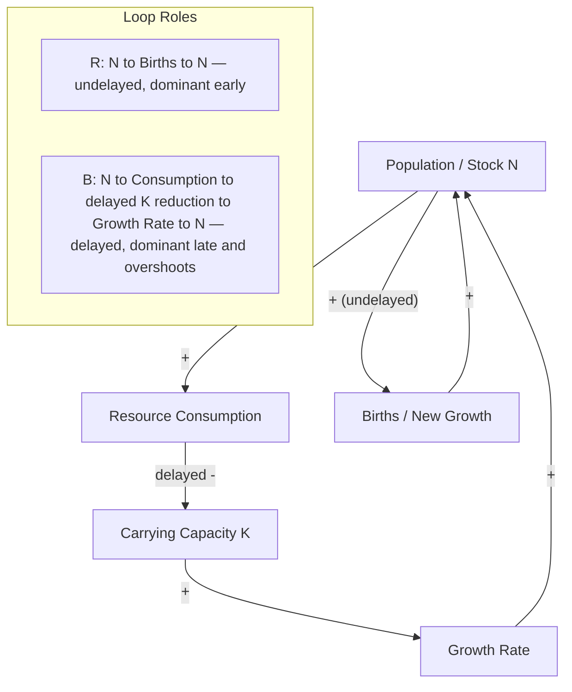

## Feedback Loop Dominance and Shifts Over Time

### Definition and Core Concept

Feedback loop dominance refers to the condition in which one feedback loop (or a subset of loops) exerts a substantially larger effect on a system's aggregate behavior than the other loops present in the same causal structure, at a given point in time. A loop-dominance shift occurs when the relative strength of loops changes as the system evolves, so that the loop governing observable behavior at one stage of the trajectory is different from the loop governing behavior at a later stage — even though the underlying causal structure (which loops exist, and their polarities) has not changed.

This concept is central to system dynamics because most real systems contain multiple coexisting reinforcing and balancing loops simultaneously. The system's fixed structure does not by itself determine its behavior; behavior emerges from which loop currently has the largest effective "gain" relative to the others. Loop dominance analysis explains why systems with unchanged structure can nonetheless produce qualitatively different behavior patterns — exponential growth, S-curve leveling, overshoot-and-collapse, oscillation — at different points in their history.

### Why Dominance Shifts Occur

**Key Points**

- Loop strength is generally not constant; it depends on the current values of the stocks and variables that determine each loop's effective gain.
- A reinforcing loop's gain often depends on a resource or capacity variable that itself depletes as the loop operates (e.g., available new adopters, available uncommitted capital, unexploited habitat).
- A balancing loop's gain often depends on the size of the gap between current state and a goal/limit; this gap tends to grow as a reinforcing loop drives the system further from its starting point, increasing the balancing loop's corrective force over time.
- As the reinforcing loop's driving variable shrinks and the balancing loop's gap grows, there is generally a crossover point at which the balancing loop's effect exceeds the reinforcing loop's effect, and observable system behavior changes character even though no new causal links have been added or removed.

### Canonical Example: Logistic (S-Curve) Growth

**Example**

Population or adoption count $N$ is governed by two coexisting loops sharing the same stock:

**Reinforcing loop (R):** $N$ → births/new adopters (positive link, proportional to $N$) → increase in $N$ (positive link).

**Balancing loop (B):** $N$ → resource/capacity consumption or market saturation (positive link) → gap to carrying capacity $K$ shrinks (negative link) → growth rate slows (positive link) → $N$.

The combined dynamic is the logistic equation:

$$\frac{dN}{dt} = rN\left(1 - \frac{N}{K}\right)$$

Decomposing the right-hand side into the two loop contributions:

$$\underbrace{rN}_{\text{R-loop term}} \; - \; \underbrace{\frac{r}{K}N^2}_{\text{B-loop term}}$$

When $N \ll K$, the term $N^2/K$ is negligible relative to $N$, so the R-loop term dominates and growth is approximately exponential: $N(t) \approx N_0 e^{rt}$. As $N$ approaches $K$, the $N^2/K$ term grows quadratically while the R-loop term grows only linearly, so the B-loop term comes to dominate, growth rate approaches zero, and $N$ asymptotically levels at $K$. The inflection point of the S-curve, at $N = K/2$, is the precise point where the two loop terms are equal in magnitude — the formal definition of the crossover between R-dominance and B-dominance in this system.

### Canonical Example: Overshoot and Collapse

**Example**

Overshoot-and-collapse behavior arises from a specific loop-dominance shift pattern: a reinforcing loop dominates initially and drives the stock past its sustainable carrying capacity *before* the corresponding balancing loop can take effect, typically because of a delay in the balancing loop's feedback signal.

Structure: population $N$, resource stock $S$ (e.g., soil fertility, fish stock, aquifer level).

**Reinforcing loop:** $N$ → consumption of $S$ (positive link) → (with delay) erosion of $S$'s regenerative capacity → reduced future carrying capacity $K$.

Because the reduction in $K$ lags behind the growth in $N$, the R-loop continues to dominate past the point where $N$ has already exceeded the *true* (now-degraded) carrying capacity. Once the delayed balancing signal finally registers, the B-loop dominance is severe (large gap, degraded capacity) and drives a collapse in $N$ well below the original carrying capacity — rather than a smooth logistic leveling. This is the classic system dynamics explanation for boom-bust patterns in fisheries, rangeland grazing systems, and speculative asset bubbles: the delay is what converts a benign dominance shift (logistic leveling) into a destructive one (overshoot and collapse).

### Illustrative Example: Product Adoption and Market Saturation

**Example**

Early smartphone-category adoption is dominated by a word-of-mouth/network-effect reinforcing loop: existing users → increased visibility and social proof → new adoption → more existing users. As the addressable market becomes saturated, a balancing loop dominates instead: remaining non-adopters → shrinking pool of easily-convertible prospects → declining marginal adoption rate → slower growth in existing users. The same underlying causal structure (word-of-mouth loop plus a finite total market) produces near-exponential early sales growth followed by decelerating growth and eventual plateau, without any change to the causal diagram itself — purely a consequence of the loop-dominance shift as the "addressable non-adopter" stock depletes.

### Illustrative Example: Epidemic Spread (SIR Dynamics)

**Example**

In the SIR (Susceptible-Infected-Recovered) compartmental model:

$$\frac{dS}{dt} = -\beta SI, \qquad \frac{dI}{dt} = \beta SI - \gamma I, \qquad \frac{dR}{dt} = \gamma I$$

The infected population $I$ is driven by a reinforcing loop ($\beta SI$ term: more infected → more transmission → more infected) opposed by a balancing loop ($-\gamma I$ term: recovery/removal reduces infected count). Early in an outbreak, $S \approx S_0$ (nearly the whole population is susceptible), so the reinforcing term $\beta S I$ is large relative to $\gamma I$, and infections grow exponentially. As $S$ depletes (susceptibles are consumed by the epidemic itself), the reinforcing term shrinks proportionally to the shrinking $S$, while the balancing recovery term $\gamma I$ is structurally unaffected by $S$. The epidemic peaks precisely when the two loop terms are equal — $\beta S I = \gamma I$, i.e., when $S = \gamma/\beta = 1/R_0$ — the formal threshold condition (herd immunity threshold) at which loop dominance flips from reinforcing to balancing.

### Diagnostic Framework: Identifying the Currently Dominant Loop

1. **Enumerate all loops** touching the variable of interest and classify each as reinforcing or balancing via the negative-link-parity rule.
2. **Identify each loop's gain-determining variable** — the quantity whose current magnitude controls how strongly that loop is currently acting (e.g., remaining susceptible population, remaining market headroom, size of the gap to a goal).
3. **Track the gain-determining variables over the simulation or observation period**, not just the primary stock, since dominance shifts are driven by changes in these secondary variables.
4. **Locate crossover conditions** algebraically or numerically — the point(s) at which competing loop terms are approximately equal in magnitude — since behavior pattern changes (inflection points, peaks, regime shifts) typically occur at or near these crossovers.
5. **Check for delay in any candidate dominant loop**: a delayed balancing loop can allow a reinforcing loop to remain apparently dominant well past the point where the "instantaneous" gain comparison would suggest a shift should already have occurred — this is the specific mechanism behind overshoot behavior.

### Behavior Pattern Signatures by Dominance Pattern

| Dominance Pattern Over Time | Resulting Behavior | Representative Case |
| --- | --- | --- |
| R dominant throughout (no countervailing B loop, or B loop too weak) | Sustained exponential growth/decline | Unchecked compounding, runaway chain reaction |
| R dominant early, B dominant late, no significant delay | S-curve / logistic leveling | Product adoption, bounded population growth |
| R dominant early, B dominant late, with significant delay | Overshoot and collapse (oscillation possible) | Fishery collapse, asset bubble and crash |
| B dominant throughout | Goal-seeking convergence or homeostasis | Thermostatic control, stable market equilibrium |
| Alternating R/B dominance with delay | Sustained or growing oscillation | Predator-prey cycles, supply chain bullwhip effect |
| Multiple B loops with conflicting goals, comparable gain | Chronic tension, gridlock, damped oscillation around a compromise point | Organizational conflict between competing incentive systems |

### Formal Treatment: Loop Gain and Eigenvalue Analysis

**[Inference]** For systems expressible as coupled linear (or linearized) differential equations, the currently dominant loop corresponds to the eigenvalue of the system's Jacobian matrix with the largest real part at the current operating point; a positive real part indicates reinforcing (growing) dominance, a negative real part indicates balancing (decaying) dominance, and a nonzero imaginary part indicates oscillatory behavior superimposed on the growth/decay trend. This eigenvalue-based characterization is standard in linear systems and control theory, but for genuinely nonlinear systems (which most real-world CAS-adjacent structures are), the "dominant loop" concept is only exactly formalizable locally, via linearization at a given operating point — dominance can and often does shift as the operating point moves, which is precisely why global system behavior is generally not derivable from a single fixed dominance assessment.

### Practical and Policy Implications

**Key Points**

- A policy or intervention calibrated against the *currently* dominant loop can fail or backfire once dominance shifts — a frequent cause of policy resistance and delayed, counterintuitive intervention outcomes.
- Recognizing an impending dominance shift *before* it occurs (e.g., anticipating market saturation before growth visibly slows, or anticipating resource depletion before a collapse becomes evident) is one of the higher-leverage forms of systems insight, since it allows preemptive adjustment of the loop structure itself (e.g., building in an earlier or stronger balancing mechanism) rather than reactive correction after the shift has already produced adverse behavior.
- **[Unverified]** In organizational and social systems specifically, the point at which loop dominance will shift is often difficult to forecast precisely in advance, because the gain-determining variables (public sentiment, competitive response, regulatory reaction) are less directly measurable than physical quantities like susceptible population or carrying capacity; the general framework for *identifying that a shift is structurally possible* is well established, but *predicting its exact timing* in such systems carries materially higher uncertainty than in physical or epidemiological systems.

**Related Topics**

- Reinforcing (Positive) Feedback Loops
- Balancing (Negative) Feedback Loops
- S-Curve / Logistic Growth Models
- Overshoot and Collapse Archetype
- Delays in Feedback Systems and the Bullwhip Effect
- System Dynamics Simulation and Stock-Flow Modeling
- Policy Resistance
- Systems Archetypes (Limits to Growth, Tragedy of the Commons)
- Eigenvalue and Stability Analysis in Dynamical Systems