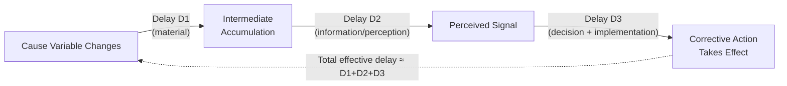

## Delays and Their Effects on System Behavior

### Definition and Core Concept

A delay in systems thinking is the elapsed time between a cause acting on a system variable and the point at which its effect is fully realized and observable elsewhere in the system. Delays are structural properties of the causal links themselves, distinct from the polarity ($+/-$) of the link — a link can be positive or negative, undelayed or delayed, independently of each other.

Delays are among the most consequential structural features in dynamic systems because they decouple the *timing* of an action from the *timing* of its feedback signal. A decision-maker or control mechanism acting on outdated information (because the true current state has not yet propagated back through the delay) is a root structural cause of oscillation, overshoot, and instability that would not occur in an otherwise identical system with instantaneous feedback.

### Taxonomy of Delay Types

**Material delays**

Time required for a physical quantity to move through a pipeline, process, or accumulation stage — e.g., the time for a shipped order to arrive, the time for a planted crop to mature, the time for a hired employee to reach full productivity.

**Information delays**

Time required for information about a system's true state to be measured, reported, and become available to decision-makers — e.g., quarterly financial reporting lag, delayed epidemiological case counts due to testing and reporting infrastructure.

**Perception delays**

Time required for decision-makers to notice, believe, and internalize a change in available information, even after that information is technically accessible — e.g., persistent underestimation of an emerging trend due to anchoring on prior expectations.

**Decision/response delays**

Time required to decide on and initiate a corrective action once a discrepancy has been perceived — e.g., organizational approval processes, procurement cycles, legislative timelines.

**Action/implementation delays**

Time required for an initiated action to be fully executed and begin producing its intended physical or behavioral effect — e.g., construction lead time for new capacity, time for a new policy to be operationalized on the ground.

Most real-world feedback loops contain several of these delay types stacked in series, and the loop's *total effective delay* is the sum (or, for parallel/distributed processes, a more complex convolution) of the individual stage delays.

### Formal Representation: First-Order Exponential Delay

The simplest mathematical representation of a delay in system dynamics is the first-order exponential (information) delay, modeled as an intermediate stock that smooths a rapidly changing input into a lagged output:

$$\frac{dP}{dt} = \frac{I(t) - P(t)}{D}$$

where $I(t)$ is the instantaneous input signal, $P(t)$ is the perceived/delayed output, and $D$ is the average delay time (time constant). For a step change in $I$, $P(t)$ approaches the new value of $I$ asymptotically:

$$P(t) = I_0 + (P_0 - I_0)(1 - e^{-t/D})$$

**Higher-order delays** (third-order material delays are common in system dynamics practice, e.g., Forrester's standard "DELAY3" construct) chain several first-order stages in series, producing an S-shaped response to a step input rather than the single-stage exponential approach — a materially different and generally more realistic representation of pipeline/material delays than the first-order form.

### Delay Diagram Notation

### Why Delays Cause Oscillation in Balancing Loops

**Key Points**

- A balancing loop with negligible delay corrects smoothly toward its goal, following a decaying exponential trajectory with no overshoot (see the balancing-loop reference material for the base thermostat case).
- When a significant delay is introduced between the corrective action and its measurable effect on the controlled variable, the controller (human or automated) continues issuing correction based on a gap that no longer reflects the system's true current state — it is reacting to where the system *was*, not where it currently *is*.
- This produces overcorrection: the corrective action continues (or is reinforced) past the point where it is actually still needed, causing the controlled variable to overshoot the goal in the opposite direction, at which point the same delayed-feedback mechanism drives a corrective overshoot back the other way.
- The result is sustained or growing oscillation around the goal, rather than smooth convergence, even though the loop's underlying polarity is still balancing (net negative) — delay changes the *trajectory shape*, not the loop's fundamental sign classification.

### Canonical Example: Shower Temperature Control

**Example**

A person adjusts a shower's hot-water valve in response to perceived water temperature, but there is a delay (often several seconds, depending on pipe length) between the valve adjustment and the temperature change actually reaching the person. Perceiving the water as too cold, they turn the valve further toward hot; before the effect of that adjustment arrives, they perceive still-cold water and turn it further still. When the delayed hot water finally arrives, it is now much hotter than intended (having been over-adjusted during the delay window), prompting an overcorrection toward cold — producing the familiar oscillating "too cold, too hot, too cold" shower experience. This is a widely used teaching example in system dynamics precisely because it is a directly experienced, intuitive instance of delay-induced oscillation in an otherwise simple balancing loop.

### Canonical Example: The Bullwhip Effect in Supply Chains

**Example**

In a multi-tier supply chain (retailer → distributor → manufacturer → raw-material supplier), each tier orders inventory based on a delayed perception of downstream demand plus its own order-processing and shipping lead time. A modest, transient increase in end-consumer demand is observed by the retailer with a reporting delay; the retailer overorders to rebuild safety stock; this amplified order arrives at the distributor after a further shipping delay, who in turn overorders relative to the (already amplified) signal to rebuild their own safety stock; the amplification compounds at each tier.

$$\text{Order variance at tier } n \; > \; \text{Order variance at tier } n-1$$

This is the formally documented **bullwhip effect** (Forrester, later Lee/Padmanabhan/Whang): each tier's delay-induced overcorrection is passed upstream and amplified by the next tier's own delay, producing large inventory oscillations upstream from a comparatively small and transient demand fluctuation downstream. **[Inference]** The severity of amplification generally increases with the number of tiers and the length of each tier's order/lead-time delay, though the exact amplification factor depends on the specific ordering policy (e.g., order-up-to-level rules) used at each tier, which varies by firm and industry.

### Canonical Example: Overshoot and Collapse (Delayed Balancing Loop Against a Growth Loop)

**Example**

As detailed in the loop-dominance material, overshoot-and-collapse dynamics in resource systems (fisheries, rangeland, groundwater aquifers) arise specifically because the balancing loop that would otherwise cap growth at a sustainable carrying capacity is delayed — often because resource degradation is not immediately visible or measurable (e.g., aquifer depletion is not apparent until wells begin failing, well past the point of unsustainable extraction). The reinforcing growth loop, facing no *timely* balancing counter-signal, continues to dominate and drives the system's stock past the level the (now-degraded) environment can actually sustain. The delay is the specific structural feature that converts what would otherwise be benign logistic leveling into destructive overshoot.

### Formal Stability Analysis: Delay and the Nyquist/Routh-Hurwitz Criteria

**[Inference]** In linear control theory, increasing the pure time delay $\tau$ in a closed feedback loop reduces the system's phase margin at a given gain, and beyond a critical delay threshold the closed-loop system transitions from stable (converging) to unstable (growing oscillation), for a fixed loop gain $K$. This relationship is formalized via the Nyquist stability criterion applied to systems with a delay term $e^{-\tau s}$ in their transfer function, or via the Routh-Hurwitz criterion for a Padé-approximated rational transfer function. The general qualitative conclusion — that longer delays reduce the maximum loop gain compatible with stable behavior — is a standard, well-established result in control engineering; the specific numeric stability threshold for any given system depends on that system's particular gain and delay parameters and must be computed rather than assumed.

$$\text{Stability requires: } K < K_{critical}(\tau), \quad \text{where } K_{critical} \text{ decreases as } \tau \text{ increases}$$

### Delay Length vs. Loop Adjustment Time: A Diagnostic Ratio

A useful practical heuristic for anticipating oscillatory risk is the ratio of total loop delay $\tau$ to the natural adjustment/response time of the controlled process $T_{adj}$:

$$\text{Oscillation risk} \sim \frac{\tau}{T_{adj}}$$

**[Inference]** When this ratio is small (delay is short relative to the process's natural response speed), the system generally behaves close to the idealized undelayed balancing case (smooth convergence). As the ratio approaches and exceeds roughly 1 (delay comparable to or longer than the natural adjustment time), oscillatory or overshoot behavior becomes increasingly likely. This is offered as a qualitative heuristic consistent with standard control-theory delay-margin results rather than a precise universal threshold, since the exact critical ratio depends on the specific loop's order and gain structure.

### Managing Systems with Significant Delays

**Key Points**

- **Reduce the delay itself where feasible**: shortening reporting cycles, reducing shipping lead times, or improving measurement/sensing latency directly reduces oscillatory risk without requiring any change to loop gain or goal.
- **Reduce loop gain (respond less aggressively) when delay cannot be shortened**: a smaller, more gradual corrective response reduces the amplitude of overshoot for a given delay length — this is the core insight behind advice such as "don't overreact to a single data point" in domains with substantial reporting lag.
- **Use leading indicators instead of lagging indicators**: substituting a variable that predicts the true state earlier (before the full delay elapses) for the delayed direct measurement can functionally shorten the effective information delay without changing the physical/material delay.
- **Add explicit forecasting or anticipation to the control policy**: model-based control approaches that predict the delayed effect of a current action (rather than reacting only to currently observed error) can compensate for known delays — the system dynamics and control-theory analog of a Smith predictor in classical control engineering.
- **Build buffers/safety stock to absorb delay-induced fluctuation**: in material-flow systems, deliberately sized buffer stocks can decouple upstream and downstream tiers, reducing the propagation of delay-induced oscillation (a standard bullwhip-mitigation strategy alongside information-sharing across supply chain tiers).

### Common Pitfalls in Delay Analysis

- **Ignoring delay when tracing causal loop polarity**: as noted in the balancing-loop material, delay does not change a link's $+/-$ sign, but omitting delay from the causal loop diagram (or from the corresponding stock-flow model) will cause a simulation or qualitative analysis to systematically miss the oscillatory or overshoot behavior that the delay actually produces.
- **Treating all delays as equivalent regardless of order**: a first-order delay and a higher-order (e.g., third-order pipeline) delay of the same *average* length produce different response shapes to a step input — the higher-order delay produces a more pronounced S-shaped, initially-flat response, which changes the qualitative fit to observed data.
- **Attributing oscillation to the wrong loop**: in systems with both a reinforcing and a balancing loop, oscillation is a signature specifically of *delayed balancing* dynamics; if a reinforcing loop is misidentified as the oscillation's source, corrective interventions aimed at reducing reinforcing-loop gain will fail to address the actual delay-driven mechanism.
- **[Unverified]** Assuming delay length is fixed and unchangeable: in many organizational and information-system contexts, a substantial fraction of total loop delay is attributable to process design (approval chains, reporting cadence) rather than physical necessity, and can potentially be reduced through redesign; however, the specific fraction of delay that is "structural/physical" versus "process/organizational" in any given case requires direct investigation rather than a general assumption either way.

**Related Topics**

- Balancing (Negative) Feedback Loops
- Reinforcing (Positive) Feedback Loops
- Feedback Loop Dominance and Shifts Over Time
- Overshoot and Collapse Archetype
- The Bullwhip Effect in Supply Chains
- Stock and Flow Diagrams
- Control Theory: Stability, Phase Margin, and PID Tuning
- System Dynamics Simulation Software (e.g., Vensim, Stella)
- Systems Archetypes (Limits to Growth, Shifting the Burden)