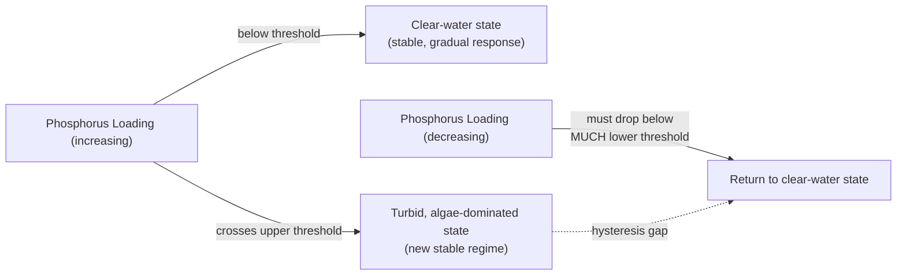

## Nonlinearity and Threshold Effects

### Definition and Core Concept

Nonlinearity describes a relationship between a system's inputs (or internal state) and its outputs in which the effect is not proportional to the cause — doubling an input does not double the output, and the relationship between cause and effect can change in kind, not just in magnitude, across the input's range. This stands in contrast to linear relationships, which satisfy both additivity and homogeneity:

$$f(x_1 + x_2) = f(x_1) + f(x_2), \qquad f(cx) = cf(x)$$

A nonlinear function $f$ violates one or both of these properties. Nonlinearity is the mathematical property that underlies most of the behaviors treated elsewhere in systems thinking as distinctive of complex systems — emergence, disproportionate cause-effect, sensitive dependence on initial conditions, and the qualitative regime changes discussed here as threshold effects.

A threshold effect (also called a tipping point, critical transition, or bifurcation, depending on the disciplinary context) is a specific and especially consequential manifestation of nonlinearity: a critical value of a system variable at which the system's qualitative behavior changes abruptly, rather than continuing along its prior smooth trend. Below the threshold, incremental changes to the driving variable produce only incremental, and often barely perceptible, effects; at the threshold, a comparably small additional change produces a disproportionately large, qualitatively different, and frequently irreversible shift in system state.

### Why Systems Thinking Treats Nonlinearity as Foundational

**Key Points**

- Linear cause-effect reasoning — assuming that twice the effort produces twice the result, or that a policy which worked at small scale will work identically at large scale — is the single most common source of misdiagnosis and mismanagement in complex systems, because it implicitly denies the possibility of nonlinearity.
- Reinforcing feedback loops (see the corresponding reference material) are inherently nonlinear even in their simplest form: the compound-interest relationship $B(t) = P(1+r)^t$ is exponential, not linear, in $t$.
- Many real system relationships that appear locally linear over a limited observed range are in fact only a small segment of a globally nonlinear curve (e.g., a logistic S-curve looks approximately linear near its inflection point); extrapolating a locally linear fit beyond the range in which it was observed is a common and consequential analytical error.
- Threshold effects specifically explain why systems can appear stable and resilient under a stressor for an extended period, then fail abruptly and without proportionate additional warning — a pattern poorly explained by linear models but well explained by nonlinear dynamics with a critical threshold.

### Mathematical Forms of Nonlinearity

**Polynomial/power-law nonlinearity**: $y = x^n$ for $n \neq 1$. Quadratic and higher-order terms are the source of the accelerating-then-saturating shape seen in the logistic growth equation's $N^2$ term (see the loop-dominance reference material).

**Exponential nonlinearity**: $y = a e^{bx}$. Characteristic of unconstrained reinforcing loops; the defining property is that the *rate of change* is itself proportional to the current value, $dy/dx = by$.

**Sigmoidal (logistic) nonlinearity**: $y = \dfrac{K}{1 + e^{-k(x - x_0)}}$. Combines an initial near-exponential phase with a saturating phase, producing the S-curve; the steepness parameter $k$ controls how sharply the transition around the inflection point $x_0$ resembles a threshold versus a gradual continuous change.

**Discontinuous/step nonlinearity**: $y = 0$ for $x < x_c$, $y = y_{max}$ for $x \geq x_c$. The idealized limiting case of a threshold effect, where the transition is instantaneous at the critical value $x_c$. Most real threshold effects are steep sigmoids approximating, but not perfectly achieving, this idealized step form.

**Bistability / hysteresis**: a system with two distinct stable states for the same range of an input parameter, where which state the system occupies depends on its history (path dependence), not solely on the current input value — see the hysteresis loop example below.

### Threshold Effects vs. Ordinary Nonlinear Response

| Property | Ordinary Nonlinear (Smooth) Response | Threshold / Tipping Point Effect |
| --- | --- | --- |
| Rate of change with input | Varies smoothly and continuously | Changes abruptly near a critical value |
| Reversibility | Generally reversible by reversing the input | Often irreversible or requires a much larger reverse-input to undo (hysteresis) |
| Warning signals before change | May be visible in a gradually steepening trend | Often minimal until the threshold is crossed ("catastrophic" onset) |
| Post-threshold state | Continuous extension of prior trend | Often a qualitatively different regime/attractor |
| Example | Diminishing returns curve, logistic saturation | Ecosystem regime shift, structural failure, market crash |

### Canonical Example: Lake Eutrophication (Ecological Regime Shift)

**Example**

A freshwater lake subjected to gradually increasing phosphorus loading (from agricultural runoff) can remain in a clear, oxygen-rich state across a wide range of loading levels, with water quality degrading only gradually as loading increases. Beyond a critical phosphorus threshold, however, the lake can shift abruptly to a turbid, algae-dominated, oxygen-depleted state — not because the phosphorus input crossed the threshold by a large increment, but because the *lake's own internal feedback structure* changes character at that point: algae blooms block sunlight to bottom-dwelling plants that had been stabilizing sediment and competing with algae for nutrients, removing a balancing loop and allowing a reinforcing loop (more algae → more light blockage → less competition → more algae) to take over.

Critically, this transition typically exhibits **hysteresis**: reducing phosphorus loading back below the original tipping threshold is generally insufficient to restore the clear-water state, because the new turbid-state feedback structure is now self-sustaining at a lower phosphorus level than the one that originally triggered the shift. Loading must typically be reduced substantially further below the original threshold to trigger a reverse shift back to the clear state. This asymmetry between the forward and reverse threshold is the defining signature of hysteresis in a bistable system.

### Illustrative Example: Structural Failure (Material Fatigue)

**Example**

A structural beam under cyclic loading accumulates microscopic fatigue damage in a manner that is often only weakly correlated with visible deformation for the majority of its service life — deflection under load remains within a narrow, seemingly stable range across thousands of loading cycles. Failure, when it occurs, is characteristically sudden: the accumulated microscopic damage reaches a critical crack-propagation threshold, after which crack growth transitions from a slow, stable regime to a rapid, unstable regime governed by fracture mechanics — often completing catastrophic failure within a small fraction of the time the structure had already been in service. This is a widely cited engineering example of why "no visible degradation" is not equivalent to "no accumulating risk of threshold failure" — the visible/measured variable (deflection) and the actual state variable driving the threshold (accumulated fatigue damage) can decouple substantially before the threshold is reached.

### Illustrative Example: Social/Political Tipping Points — Critical Mass in Norm Change

**Example**

Empirical and modeled work on social norm change (e.g., Centola et al.'s experimental studies on committed minorities) has found that a social convention can remain stable and dominant even as a committed minority holding an alternative view grows steadily, until that minority reaches a critical proportion of the population — after which the alternative view can rapidly become the new majority norm within a comparatively short period. **[Inference]** The specific critical proportion at which such a tipping point occurs is highly sensitive to network structure, the strength of individual commitment, and the specific social context, so while the qualitative existence of a threshold in networked opinion dynamics is well-supported by both theoretical models (e.g., threshold models of collective behavior, Granovetter 1978) and experimental work, quoting a single universal numeric threshold (such as "25%") as broadly applicable across all social contexts would overstate the precision of current evidence.

### Bifurcation: The Formal Dynamical-Systems Treatment of Thresholds

In dynamical systems terms, a threshold effect frequently corresponds to a **bifurcation** — a qualitative change in the number or stability of a system's equilibria (attractors) as a control parameter crosses a critical value. A canonical minimal example is the **saddle-node bifurcation**, characteristic of many ecological and climate tipping points:

$$\frac{dx}{dt} = r + x^2$$

For $r < 0$, this system has two equilibria (one stable, one unstable). As $r$ increases toward $0$, the two equilibria approach each other and merge at $r=0$ (the bifurcation point); for $r > 0$, no equilibrium exists in this local region at all, and $x$ diverges rapidly — the mathematical signature of a system "falling off" a stability shelf once a threshold is crossed. This structure is the formal underpinning of "early warning signal" research (e.g., critical slowing down: as a system approaches a bifurcation, its recovery rate from small perturbations measurably slows, in principle providing a detectable precursor before the tipping point is reached, even without knowing the threshold's exact location in advance).

### Diagnosing Nonlinearity and Thresholds in Practice

1. **Test proportionality directly**: compare the effect of a small input change at different points along the input's range; if the ratio of effect to input change varies substantially, the relationship is nonlinear at that scale.
2. **Look for accelerating or decelerating trends in time-series data** rather than assuming a constant rate; a visibly steepening or flattening curve is a signature of approaching a threshold or saturation region, respectively.
3. **Distinguish a smooth saturating curve from a true discontinuous threshold** by examining the local slope near the suspected critical point — an abrupt, near-vertical change in slope over a very narrow input range is more consistent with a genuine threshold/bifurcation than a broad, gradually flattening sigmoid.
4. **Test for hysteresis explicitly**: if reversing the driving variable does not retrace the same path back through the same states, the system is exhibiting path-dependent bistability rather than a simple reversible nonlinear response.
5. **[Inference]** Monitor for early-warning indicators associated with approaching bifurcations (increasing variance, increasing autocorrelation, slower recovery from perturbation) where applicable — this is an active and generally well-regarded research area in ecology and climate science, though its reliability as a *practical, real-time predictive tool* (as opposed to a retrospective explanatory framework) varies by system and is still an area of ongoing methodological development.

### Practical and Policy Implications

**Key Points**

- Absence of visible degradation under a linear-extrapolation mental model provides weak assurance in systems suspected of harboring an unknown or approaching threshold; the appropriate response to threshold-risk situations is often precautionary margin-building rather than waiting for direct evidence of decline.
- Because threshold-crossing transitions are frequently far more costly to reverse (or irreversible) than to prevent, the asymmetry between preventive cost and remediation cost is a standard argument for erring toward earlier and larger safety margins in systems where a hysteresis-type threshold is plausible (ecological tipping points, financial system stability, structural safety margins).
- Interventions calibrated using a linear model of system response can be badly miscalibrated once the true nonlinear or threshold structure is accounted for — either drastically under-responding while below a threshold (mistaking apparent stability for safety) or over-responding after a threshold has already been crossed (mistaking a new stable regime for a temporary deviation that will self-correct).

**Related Topics**

- Reinforcing (Positive) Feedback Loops
- Feedback Loop Dominance and Shifts Over Time
- Delays and Their Effects on System Behavior
- Bifurcation Theory and Dynamical Systems Stability
- Hysteresis and Path Dependence
- Resilience Theory and Regime Shifts (Holling, Panarchy)
- Critical Slowing Down and Early Warning Signals
- Systems Archetypes (Limits to Growth, Eroding Goals)