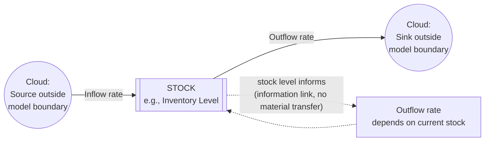

## Stocks and Flows as Building Blocks

### Definition and Core Concept

Stocks and flows are the two fundamental structural elements from which all system dynamics models — and, by extension, all feedback loop structures — are constructed. A **stock** (also called a level or state variable) is an accumulation: a quantity that exists at a point in time and represents the current state of some part of a system, measured in physical or logical units (people, dollars, units of inventory, degrees of temperature, tons of pollutant). A **flow** (also called a rate) is the speed at which a stock increases or decreases, measured in units per time period (people per year, dollars per month).

The relationship between a stock and its flows is formalized by integration/differentiation:

$$\text{Stock}(t) = \text{Stock}(t_0) + \int_{t_0}^{t} \left[\text{Inflow}(\tau) - \text{Outflow}(\tau)\right] d\tau$$

Equivalently, in differential form:

$$\frac{d(\text{Stock})}{dt} = \text{Inflow rate} - \text{Outflow rate}$$

This stock-flow structure is the mathematical substrate underlying every causal loop diagram discussed elsewhere in this material: a reinforcing or balancing loop is, at its core, a claim about how a flow's rate depends on the level of a stock (its own, or another stock's), and the loop closes precisely through this stock-to-flow-to-stock dependency.

### Why Stocks and Flows Matter Distinctly from Causal Loop Diagrams

**Key Points**

- Causal loop diagrams (CLDs) show *what influences what* and the *direction* of influence, but do not by themselves specify *accumulation* — they can obscure the critical distinction between a quantity that changes instantaneously and one that only changes gradually through the buildup or drawdown of a stock.
- Stocks are the source of a system's **memory**: a stock's current value depends on its entire history of inflows and outflows, not on the current flow rates alone. Two systems with identical current flow rates can be in completely different states if their stocks have accumulated differently over time.
- Stocks are the source of **delay** and **inertia** in dynamic behavior: because a stock changes only at the rate its flows permit, it cannot instantaneously track a change in its governing flow rate — this decoupling of a flow's rate from a stock's realized level is precisely what allows systems to exhibit smooth trajectories, overshoot, and oscillation rather than instantaneous jumps between states.
- Correctly distinguishing a stock from a flow when modeling a system is often the single most consequential modeling decision, because it determines whether the model can correctly represent accumulation, delay, and disequilibrium dynamics at all. A frequent modeling error is treating an accumulating quantity (a stock) as though it were a rate (a flow), which structurally eliminates the possibility of representing buildup, depletion, or the delays these produce.

### Identifying Stocks vs. Flows: The Bathtub Test

The standard heuristic (attributed to Meadows and widely used in system dynamics pedagogy) is the bathtub analogy:

- The **water level in the tub** is the stock — it exists at every instant, can be measured by "pausing time" and looking, and is what remains even if both faucet and drain are shut off.
- The **rate of water flowing in from the faucet** is the inflow.
- The **rate of water draining out** is the outflow.
- The water level rises when inflow exceeds outflow, falls when outflow exceeds inflow, and remains constant (**dynamic equilibrium**) when inflow equals outflow — even though water is still actively flowing through the system in that equilibrium state.

A reliable test: if a quantity can be sensibly described as accumulating or depleting over time and retains a value even if all activity stopped, it is a stock. If a quantity only exists as a rate of change per unit time and has no meaning as an instantaneous, frozen-in-time snapshot, it is a flow.

| Quantity | Stock or Flow? | Reasoning |
| --- | --- | --- |
| Bank account balance | Stock | Exists and has a value at any frozen instant |
| Monthly deposits | Flow | Only meaningful as an amount per time period |
| Population of a country | Stock | Accumulates births minus deaths minus net emigration over time |
| Birth rate | Flow | Rate per time period governing the population stock's inflow |
| Water in a reservoir | Stock | Measurable at any instant |
| River discharge rate | Flow | Volume per unit time |
| Employee headcount | Stock | A snapshot count at any given moment |
| Hiring rate, attrition rate | Flow | Rate of change per period affecting the headcount stock |
| Knowledge/skill level of a worker | Stock | Accumulates through a flow of learning/training over time |
| Trust between organizations | Stock | Builds or erodes gradually through a flow of trust-building or trust-eroding interactions |

### Stock and Flow Diagram Notation

The standard system dynamics diagramming convention (originating with Forrester) uses a rectangle for a stock, a valve/pipe icon for a flow, and a cloud symbol for sources/sinks outside the model boundary:

The distinction between a **solid arrow** (material/quantity flow, subject to conservation) and a **dashed arrow** (information link, no physical transfer, can be duplicated without depleting anything) is a foundational convention: a stock's level can inform multiple flow-rate decisions simultaneously via information links without those uses competing for or depleting the stock, whereas the material inflow/outflow arrows represent actual conserved transfers into and out of the stock.

### The Stock-Flow Basis of Reinforcing and Balancing Loops

**Example**

The compound-interest reinforcing loop (from the corresponding reference material) is, in stock-flow terms: Balance is the stock; Interest Earned is the inflow; the inflow rate is calculated as a positive function of the current stock level ($\text{Inflow} = r \times \text{Balance}$), which is what creates the self-referencing, deviation-amplifying loop.

**Example**

The thermostat balancing loop is, in stock-flow terms: Room Temperature is the stock; Heat Added is the inflow (and ambient heat loss is typically a coupled outflow); the inflow rate is calculated as a positive function of the *gap* between the stock's current level and a goal/setpoint ($\text{Inflow} = k \times (T_{set} - T)$), which is what creates the goal-seeking, deviation-correcting loop.

This confirms a general principle: **every feedback loop discussed in causal-loop terms can be re-expressed as a stock whose governing flow rate depends on that stock's own current level (directly for reinforcing loops, or via a gap-to-goal for balancing loops)** — the stock-flow representation is the more fundamentally rigorous underlying structure, of which the causal loop diagram is a simplified, non-quantitative summary.

### Types of Stocks

**Physical/material stocks**: tangible accumulations — inventory, population, water volume, capital equipment.

**Financial stocks**: monetary accumulations — cash balance, debt outstanding, accumulated savings.

**Information/perception stocks**: less tangible but still genuinely accumulating quantities — perceived quality reputation, accumulated organizational knowledge, public trust or goodwill, brand equity. **[Inference]** These "soft" stocks obey the same integration logic as physical stocks (they change only gradually, retain memory of history, and cannot be instantaneously reset), but they are generally harder to measure precisely and their governing inflow/outflow rates are typically estimated or proxied rather than directly metered, which is a standard caveat in soft-variable system dynamics modeling.

**Structural/capacity stocks**: accumulated infrastructure or capability — installed production capacity, trained workforce size, built housing stock — which typically change only through comparatively slow investment (inflow) and depreciation/attrition (outflow) flows, contributing significant inertia to systems that depend on them.

### Types of Flows

**Biflows**: flows that can move in either direction depending on conditions (e.g., net migration, which can be positive or negative).

**Unidirectional flows**: flows constrained to move only one way (e.g., a birth rate cannot be negative; deaths cannot "unhappen").

**Co-flows**: a secondary flow that moves in lockstep with a primary flow, tracking an associated attribute (e.g., a flow of "average product quality" that moves alongside a physical unit-production flow).

### Equilibrium, Disequilibrium, and the Net Flow Concept

A stock is in **dynamic equilibrium** when its net flow is zero — inflow exactly equals outflow — even though the flows themselves may be large and continuously active. This is a critical distinction from a genuinely static, inactive system: a lake with equal inflow and outflow rivers maintains a constant water level (equilibrium stock) while enormous quantities of water are continuously flowing through it.

$$\text{Net flow} = \text{Inflow} - \text{Outflow}$$

$$\text{Equilibrium condition: Net flow} = 0 \iff \frac{d(\text{Stock})}{dt} = 0$$

A stock is **growing** when net flow is positive and **depleting** when net flow is negative, regardless of the absolute magnitude of either individual flow — a stock can be shrinking even while its inflow is large, if outflow is larger still.

### Illustrative Example: Multi-Stock Coupled System — Simple Supply Chain

**Example**

A minimal two-stock supply chain model: **Factory Inventory** (stock 1) has inflow "Production Rate" and outflow "Shipping Rate"; **Retail Inventory** (stock 2) has inflow equal to the Shipping Rate from stock 1 (the outflow of one stock becomes the inflow of the next — a direct chain) and outflow "Sales Rate" to customers. This chained stock-flow structure is the generic template for representing any multi-stage pipeline (supply chains, epidemiological compartments like SIR, population age-cohort models, or a hiring-to-productivity employee pipeline), and it is precisely the structure that produces the multi-stage, higher-order delays discussed in the corresponding delay reference material — each stock in the chain adds an additional stage of accumulation and lag between an upstream change and its fully realized downstream effect.

### Common Pitfalls in Stock-Flow Identification

- **Modeling a stock as if it were a flow**: e.g., representing "customer satisfaction" as a variable that resets each period based only on current-period service quality, rather than as an accumulating stock that carries over prior satisfaction levels and changes only gradually — this eliminates the possibility of representing reputational momentum, slow trust erosion, or delayed recovery from a service failure.
- **Confusing a flow's *rate* with its *cumulative effect***: e.g., treating "3% monthly growth rate" (a flow-defining parameter) as directly comparable in magnitude to a stock's absolute level, rather than recognizing that the *cumulative* effect of a rate over time depends on both the rate and the duration and current stock level over which it has compounded.
- **Omitting a necessary outflow**: modeling only how a stock grows (inflow) while neglecting a structurally important depletion mechanism (outflow) — e.g., modeling hiring without attrition, or modeling adoption without churn — produces a structurally reinforcing-only model that cannot represent the balancing dynamics (and resulting equilibrium or saturation) that the omitted outflow would introduce.
- **Double-counting via improperly duplicated material flows**: unlike information links (dashed, freely reusable), a solid material/quantity flow arrow represents an actual conserved transfer; incorrectly routing the same physical quantity into two separate stock inflows without an intervening split/allocation structure violates the conservation principle underlying stock-flow accounting.

**Related Topics**

- Reinforcing (Positive) Feedback Loops
- Balancing (Negative) Feedback Loops
- Delays and Their Effects on System Behavior
- Feedback Loop Dominance and Shifts Over Time
- System Dynamics Simulation Software (e.g., Vensim, Stella)
- Causal Loop Diagrams
- Multi-Stage Pipeline and Compartmental Models (e.g., SIR)
- Equilibrium and Dynamic Equilibrium in Complex Systems