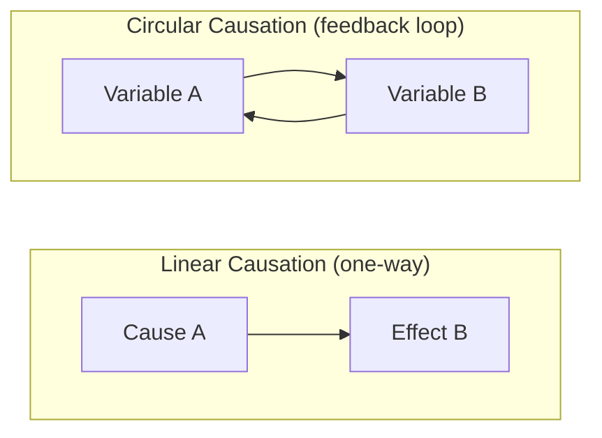

## Correlation, Causation, and Circular Causality

### Definition and Core Concept

This topic addresses three distinct but frequently conflated relationships between variables: **correlation** (a statistical association, with no inherent directional or mechanistic claim), **causation** (a directional claim that a change in one variable produces a change in another via some mechanism), and **circular causality** (a structural pattern in which two or more variables cause each other, forming a closed loop rather than a one-way chain).

Systems thinking treats circular causality as foundational precisely because it is the structural basis of every feedback loop discussed elsewhere in this material: a reinforcing or balancing loop is, definitionally, a claim of circular causation — A causes B, and B in turn causes A (possibly through several intermediate variables), such that neither variable can be correctly designated as *the* sole originating cause. This directly conflicts with the linear, unidirectional cause-effect framing ($A \rightarrow B$, full stop) that dominates ordinary statistical and everyday reasoning, and reconciling these two framings is a core systems-thinking skill.

### Correlation: Definition and Limits

Correlation is a measure of statistical association between two variables, typically quantified by the Pearson correlation coefficient:

$$r = \frac{\sum (x_i - \bar{x})(y_i - \bar{y})}{\sqrt{\sum (x_i - \bar{x})^2 \sum (y_i - \bar{y})^2}}$$

where $r \in [-1, 1]$, with $|r|$ closer to 1 indicating stronger linear association. Correlation is symmetric ($\text{corr}(X,Y) = \text{corr}(Y,X)$) and makes no claim about mechanism or direction. A correlation between $X$ and $Y$ is consistent with at least four distinct underlying structures:

1. $X$ causes $Y$
2. $Y$ causes $X$
3. A third variable $Z$ causes both $X$ and $Y$ (confounding)
4. $X$ and $Y$ mutually cause each other (circular causality / feedback)

**[Inference]** Correlational data alone, without additional structural assumptions, temporal information, or experimental intervention, cannot in general distinguish among these four possibilities — this is the standard "correlation does not imply causation" caveat, but the systems-thinking elaboration of it is that the fourth possibility (mutual/circular causation) is frequently overlooked entirely, with analysts typically defaulting to considering only options 1, 2, or 3.

### Canonical Example: Confounding vs. Circular Causality

**Example**

Ice cream sales and drowning incidents are strongly positively correlated across months. This is a textbook confounding case (option 3 above): a third variable, ambient temperature/season, drives both — warmer weather increases both ice cream consumption and swimming activity (and therefore drowning risk). Neither ice cream sales nor drowning incidents cause each other.

Contrast this with self-esteem and social engagement, which are also positively correlated. Here, the more plausible structure is circular causality (option 4): higher self-esteem tends to encourage more social engagement, and successful social engagement tends to reinforce self-esteem — each variable is plausibly both a cause and an effect of the other, operating as a feedback loop rather than requiring an external confounding third variable to explain the association at all. Distinguishing these two cases requires domain knowledge about plausible mechanisms, since the raw correlation coefficient looks structurally identical in both.

### Circular Causality: Formal Structure

Circular causality is formally the same structure documented in the reinforcing- and balancing-loop reference material: a closed causal chain in which following the arrows from any starting variable eventually leads back to that same variable.

$$A \rightarrow B \rightarrow C \rightarrow \cdots \rightarrow A$$

The key conceptual shift circular causality requires, relative to linear causal reasoning, is abandoning the question "what is the root cause?" in favor of "what is the loop structure, and what parameter or condition currently governs its behavior?" In a genuine closed loop, asking "does A cause B, or does B cause A?" is a category error — both are true simultaneously, and the more useful question is about the loop's polarity, gain, and current dominance (see the corresponding reference material on loop dominance).

### Illustrative Example: Chicken-and-Egg Framing in Organizational Dysfunction

**Example**

Consider the empirically observed correlation between low employee morale and high staff turnover. A linear-causation framing forces an either/or diagnosis: "does low morale cause people to quit, or does high turnover (loss of colleagues, disruption) cause remaining employees' morale to drop?" Both mechanisms are typically operating simultaneously in real organizations, forming a reinforcing loop: low morale → increased quitting (positive link) → turnover disrupts remaining teams and increases workload (positive link) → further morale decline (positive link). Net polarity: zero negative links, reinforcing — a genuine vicious cycle. Framing this as "we must find the single root cause" (only morale, or only turnover) misrepresents the actual causal structure and typically leads to interventions that address only one entry point of the loop, which the still-intact remainder of the loop can then undermine.

### Distinguishing True Circular Causality from Reciprocal Causation with Lag

**[Inference]** Not every case of mutual influence between two variables constitutes a *tight, real-time* feedback loop in the system dynamics sense; some apparent circular causality is more accurately described as two separate, lagged, unidirectional causal effects operating over different timescales (A causes a later change in B; separately and independently, B causes a later change in A on a different cycle) rather than a single continuously-closed loop. Distinguishing a genuine tightly-coupled feedback structure from two temporally-offset unidirectional effects generally requires examining the time structure of the data (e.g., cross-correlation at different lags, Granger causality testing in both directions) rather than relying on a single aggregate correlation coefficient, and the appropriate test depends on the specific temporal resolution and domain.

### Statistical and Methodological Tools for Distinguishing Structures

**Granger causality**: tests whether past values of $X$ improve the prediction of current $Y$ beyond what past values of $Y$ alone provide, and vice versa. Testing in both directions simultaneously can reveal evidence consistent with bidirectional (circular) causal structure if both directions show statistically significant predictive improvement — though Granger causality is a predictive/temporal-precedence test, not proof of a true underlying causal mechanism.

**Instrumental variables and natural experiments**: exploit a variable that affects $X$ but has no direct effect on $Y$ except through $X$, allowing the causal effect of $X$ on $Y$ to be isolated from confounding and from reverse causation — a standard econometric technique for breaking a suspected feedback loop apart into its directional components for measurement purposes.

**Structural equation modeling (SEM) and directed acyclic graphs (DAGs)**: Pearl's causal inference framework formalizes causal structure using DAGs, but by construction a DAG cannot represent a true cycle; feedback loops in Pearl's framework are typically handled by "unrolling" the loop over discrete time steps into a longer acyclic chain ($A_{t} \rightarrow B_{t} \rightarrow A_{t+1} \rightarrow B_{t+1} \rightarrow \cdots$), which is mathematically equivalent to the continuous circular causal structure but represented as an unfolded sequence rather than a literal cycle — a useful reconciliation between the graph-theoretic causal inference tradition and the systems-dynamics feedback-loop tradition.

**Randomized controlled experiments**: remain the strongest tool for establishing a specific directional causal effect ($X \rightarrow Y$) by exogenously manipulating $X$ and observing $Y$, but a single experiment establishing that $X$ affects $Y$ does not rule out that $Y$ also affects $X$ under naturally occurring (non-experimental) conditions — establishing the *existence* of a full circular structure generally requires separate directional evidence for each leg of the loop.

### Why Misattributing Circular Causality as Linear Causes Poor Interventions

**Key Points**

- If a genuinely circular structure is misdiagnosed as a simple linear one (assuming $A \rightarrow B$ only, when in fact $A \leftrightarrow B$), an intervention targeting only $A$ can be undermined by the unaddressed $B \rightarrow A$ leg of the loop continuing to regenerate the original condition — a structural explanation for a class of interventions that appear to work briefly and then fail, matching the corresponding systems archetype of policy resistance.
- Conversely, treating a genuinely one-way causal relationship as though it were circular can lead to unnecessary or wasted intervention effort on the (non-existent) reverse leg, diluting resources that would be better concentrated on the actual single direction of causal leverage.
- Because reinforcing loops built on circular causality compound over time, correctly identifying a circular structure early — rather than after a vicious cycle has run for an extended period — generally allows a much smaller intervention to be effective, consistent with the broader leverage-points principle that early, well-targeted structural intervention outperforms later, larger, purely parametric correction.

### Diagnostic Checklist for Suspected Circular Causality

1. **Ask whether a plausible mechanism exists for causation running in each direction separately** — not merely whether the two variables are associated, but whether $A \rightarrow B$ is mechanistically plausible AND $B \rightarrow A$ is independently mechanistically plausible.
2. **Check for a third-variable confounding explanation first** — a confound (option 3 above) is often a simpler and equally sufficient explanation for an observed correlation, and should not be dismissed prematurely in favor of a circular-causality narrative.
3. **Examine temporal structure**: does $A$ measurably move before $B$ moves, and does $B$ subsequently and independently move before a later movement in $A$? Consistent alternating precedence in both directions across multiple cycles is more supportive of true circular causality than a single-instance temporal pattern.
4. **Trace the full loop, not just the pairwise relationship**: as with reinforcing/balancing loop analysis generally, identify every intermediate variable in the suspected loop and assign polarity to each link, rather than treating $A$ and $B$ as directly linked without the mediating structure.
5. **[Unverified]** Consider whether removing or experimentally suppressing one leg of the suspected loop (where ethically and practically feasible) changes the system's dynamic behavior in the way the circular-causality hypothesis predicts; this kind of structural intervention test is a strong form of evidence but is often infeasible in real organizational, social, or ecological systems, so its applicability is case-dependent rather than universal.

**Related Topics**

- Reinforcing (Positive) Feedback Loops
- Balancing (Negative) Feedback Loops
- Feedback Loop Dominance and Shifts Over Time
- Causal Loop Diagrams
- Policy Resistance
- Granger Causality and Time-Series Causal Inference
- Directed Acyclic Graphs and Pearl's Causal Inference Framework
- Confounding Variables and Spurious Correlation
- Systems Archetypes (Shifting the Burden, Fixes That Fail)