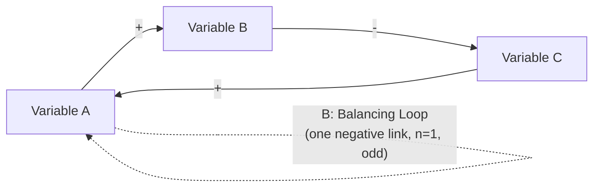

## Purpose and Uses of Causal Loop Diagrams

### Definition and Core Concept

A Causal Loop Diagram (CLD) is a qualitative mapping tool used in systems thinking to represent the causal relationships between variables in a system, showing how those relationships close into feedback loops. A CLD consists of variables (nodes) connected by labeled causal links (arrows), each link marked with a polarity ($+$ or $-$) indicating whether the cause and effect move in the same or opposite direction, and closed cycles of links marked as either reinforcing (R) or balancing (B) loops according to the parity rule detailed in the corresponding reinforcing- and balancing-loop reference material.

CLDs are deliberately qualitative and non-quantitative: they specify the *structure and direction* of influence among variables, not the *magnitude* of effects, the specific functional form of any relationship, or numerical simulation output. This distinguishes CLDs from stock-and-flow diagrams and system dynamics simulation models, which add quantitative rigor (see the corresponding stock-and-flow reference material) but require substantially more effort and data to construct. CLDs occupy a specific and deliberate position in the systems-thinking toolkit: sufhttp://ficiently rigorous to expose feedback structure and challenge linear-causal assumptions, while remaining fast enough to construct collaboratively in a workshop or meeting setting without requiring quantitative modeling expertise.

### Primary Purposes of CLDs

**Key Points**

- **Externalizing mental models**: CLDs make an individual's or group's implicit assumptions about how a system works explicit and inspectable, converting tacit beliefs about cause and effect into a shared, debatable artifact rather than leaving them as unstated, potentially conflicting assumptions held privately by different stakeholders.
- **Revealing feedback structure invisible in linear narratives**: verbal or written descriptions of a situation are typically organized as linear narratives ("A happened, which led to B, which led to C"); a CLD forces the explicit question of whether the narrative's endpoint loops back to influence its own starting point, surfacing reinforcing and balancing loops that a linear story structurally cannot represent.
- **Diagnosing the structural source of problematic behavior**: rather than treating a recurring problem as a series of isolated incidents requiring separate fixes, a CLD reframes the problem as the observable output of an underlying loop structure, redirecting attention toward the structure itself as the appropriate target for intervention.
- **Facilitating shared understanding across stakeholders with different perspectives**: because different individuals or departments in a complex situation typically observe and interact with different parts of the same underlying system, a CLD constructed collaboratively can integrate these partial views into a single structure that reveals interdependencies invisible to any single participant.
- **Identifying leverage points**: once a system's loop structure is visible, the diagram itself becomes a tool for reasoning about where a comparatively small structural intervention (adding, removing, weakening, or strengthening a specific link or loop) could produce large systemic effects, consistent with the leverage-points principle referenced throughout this material.
- **Anticipating unintended consequences and policy resistance before acting**: tracing a proposed intervention's effects around the full diagram, including loops the intervention was not specifically targeting, surfaces side effects and counteracting balancing loops that a narrower, linear analysis of the intervention's *intended* effect alone would miss.

### Standard Notation and Conventions

- **Nodes** are variables stated as quantities capable of increasing or decreasing (e.g., "Employee Morale," not "Employee Happy" — the node label should be a noun phrase that can sensibly take "increases" or "decreases," not an adjective or a fixed state).
- **Links** are arrows from cause to effect, each labeled $+$ (same direction) or $-$ (opposite direction), per the polarity conventions established in the reinforcing/balancing loop reference material.
- **Loop identifiers**: each closed cycle is labeled R (reinforcing) or B (balancing), typically with a small curved arrow or icon (snowball for R, scale for B) placed inside the loop, alongside a short descriptive loop name (e.g., "R1: Growth Engine," "B1: Capacity Constraint") to aid discussion and reference in accompanying narrative.
- **Delay marks**: a double hash mark (‖) or explicit "delay" label across a link indicates a significant time lag on that specific causal connection, connecting directly to the delay concepts in the corresponding reference material.

### Illustrative Example: Constructing a CLD from a Verbal Problem Statement

**Example**

Given the verbal description: "When our product quality drops, customers complain more, which increases support team workload, which causes rushed bug fixes, which further reduces product quality" — the systems-thinking task is to convert this narrative into explicit variables and linked polarities:

Product Quality → (negative link: lower quality causes more complaints) → Customer Complaints → (positive link: more complaints increase workload) → Support Team Workload → (positive link: higher workload causes rushed fixes) → Rushed Bug Fixes → (negative link: rushed fixes reduce quality) → Product Quality.

Counting negative links: $n=2$ (even) → this closes as a **reinforcing** loop, despite every individual step in the narrative reading as "bad causing more bad" — a useful illustration that reinforcing polarity is a purely structural, parity-based property, not synonymous with monotonically "declining" quality in every step of the chain. This CLD immediately surfaces that the recurring quality problem is not a series of unrelated incidents but a single self-reinforcing structural loop, redirecting attention toward breaking the loop (e.g., temporarily adding support capacity to remove the "rushed fixes" pressure) rather than repeatedly firefighting individual complaint incidents.

### CLDs as Communication and Facilitation Tools

**[Inference]** Group-constructed CLDs (a practice sometimes called "group model building") are widely used in organizational and policy settings specifically because the *process* of jointly constructing the diagram — debating which variables belong, what the correct polarity of each link is, and where loops close — tends to surface disagreements about the underlying system that would otherwise remain implicit and unexamined; this facilitation value is a well-established rationale for CLD use in practice, distinct from and additional to the diagram's value as a finished analytical artifact. The specific magnitude of this facilitation benefit relative to other group-diagnostic techniques is not something that can be stated as a precise, universal figure, since it depends heavily on group composition and facilitation quality.

### CLDs vs. Other Systems-Thinking Diagram Types

| Diagram Type | Shows | Quantitative? | Typical Use Case |
| --- | --- | --- | --- |
| Causal Loop Diagram (CLD) | Variables, causal direction, link polarity, loop identification | No | Rapid diagnosis, mental model externalization, workshop facilitation |
| Stock and Flow Diagram | Accumulations, rates, and the specific mathematical relationships governing them | Partially (structural, pre-simulation) | Preparing for quantitative simulation; representing accumulation/delay explicitly |
| System Dynamics Simulation Model | Full quantitative behavior over time, derived from stock-flow equations | Yes | Policy testing, scenario forecasting, quantitative "what-if" analysis |
| Systems Archetype Template | A named, recurring generic loop pattern (e.g., Limits to Growth) applied to a specific case | No | Rapid pattern-matching against known structural failure modes |

**Key Points**

- CLDs are typically the *first* diagramming step in a systems analysis, used to establish qualitative structure and achieve stakeholder consensus on "what causes what" before investing in the substantially higher effort required to build a quantitative stock-flow simulation model.
- Not every systems analysis needs to proceed to full quantitative simulation — for many organizational and diagnostic purposes, a well-constructed CLD alone is sufficient to identify the loop structure responsible for observed behavior and to reason qualitatively about candidate interventions, without requiring numerical calibration.
- **[Unverified]** Deciding when a CLD's qualitative analysis is sufficient versus when the situation warrants investing in full quantitative simulation is a judgment call that depends on the stakes of the decision, the availability of reliable data to calibrate a quantitative model, and the extent to which stakeholders trust qualitative versus quantitative arguments — there is no universal threshold rule for this decision, and it varies substantially by field and organizational context.

### Common Uses in Practice

- **Root-cause and recurring-problem analysis**: identifying why a problem keeps recurring despite repeated point fixes, by exposing the reinforcing loop that regenerates the problem after each fix.
- **Policy and intervention design**: mapping the full causal context of a proposed policy change before implementation, to anticipate both the intended balancing effect and any unintended reinforcing side loops the policy might activate.
- **Cross-functional alignment**: building a single shared CLD across departments (e.g., sales, operations, finance) that each hold a partial view of a shared underlying system, to surface interdependencies that siloed departmental views would miss.
- **Teaching and onboarding**: using a CLD of a known system (e.g., a company's growth engine, an ecosystem, a supply chain) as a teaching artifact to build shared vocabulary and structural intuition among new team members or students.
- **Precursor to simulation modeling**: establishing the qualitative loop structure and stakeholder-validated variable set that a subsequent quantitative system dynamics model will formalize into stock-flow equations.
- **Archetype pattern-matching**: comparing a newly constructed CLD against known systems archetypes (Limits to Growth, Shifting the Burden, Tragedy of the Commons, Fixes That Fail) to quickly identify whether the situation matches a well-studied generic structure with known intervention strategies.

### Limitations of CLDs

- CLDs do not capture magnitude, so two links both marked "+" may represent vastly different strengths of influence, and the diagram alone cannot indicate which loop is currently dominant (see the loop-dominance reference material) — this generally requires either quantitative simulation or qualitative judgment supplementing the diagram.
- CLDs do not capture delay length explicitly (beyond a binary "delay present" mark), so two structurally identical CLDs can produce very different real-world behavior (smooth convergence vs. severe oscillation) depending on delay magnitudes not visible in the diagram itself.
- **[Inference]** Because CLD construction is qualitative and often collaborative, the resulting diagram reflects the causal beliefs and mental models of its constructors, which may not correspond to the system's actual empirical structure; a CLD is most reliably treated as a hypothesis about system structure requiring further validation (through data, quantitative modeling, or field testing) rather than a proven, ground-truth description, particularly for contested or poorly understood systems.
- Large CLDs (many variables and loops) can become visually cluttered and difficult to communicate, a common practical limitation that has driven the development of hierarchical or modular CLD conventions (e.g., isolating one loop at a time in "loop cards," or grouping tightly related variables into a single higher-level node for a more zoomed-out view).

**Related Topics**

- Reinforcing (Positive) Feedback Loops
- Balancing (Negative) Feedback Loops
- Feedback Loop Dominance and Shifts Over Time
- Stocks and Flows as Building Blocks
- Systems Archetypes (Limits to Growth, Shifting the Burden, Tragedy of the Commons)
- Group Model Building and Facilitation
- Delays and Their Effects on System Behavior
- System Dynamics Simulation Software (e.g., Vensim, Stella)