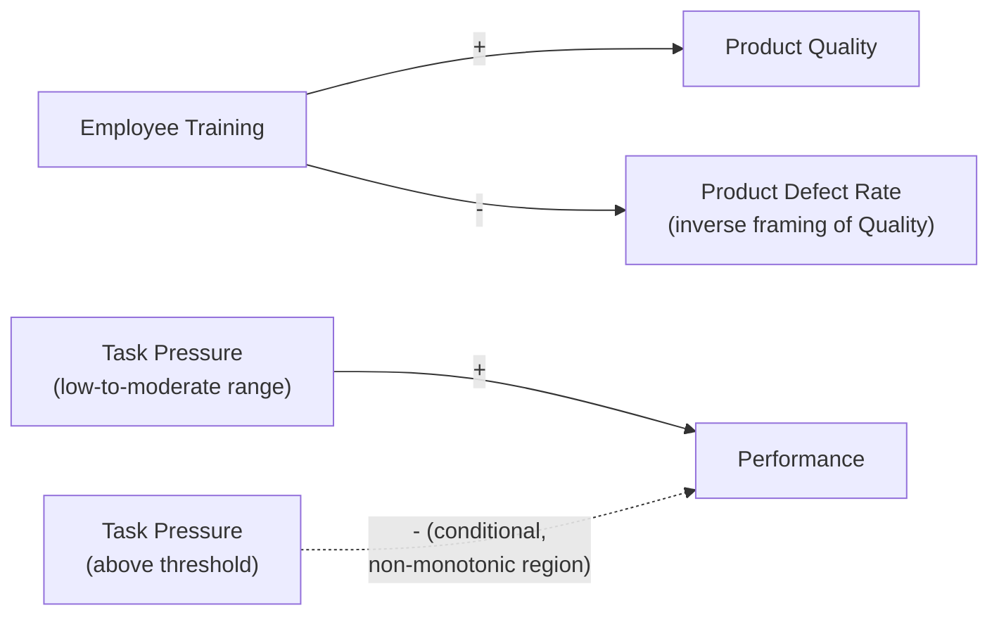

## Labeling Link Polarity

### Definition and Core Concept

Labeling link polarity is the specific step in Causal Loop Diagram (CLD) construction of assigning a $+$ or $-$ sign to each individual causal arrow, indicating whether the cause and effect variables move in the **same direction** (positive/$+$) or **opposite directions** (negative/$-$). Polarity labeling is the mechanism by which a CLD becomes a formally analyzable structure rather than merely a network diagram of associations: correct polarity assignment on every link in a closed loop is the sole input to the parity rule that classifies the loop as reinforcing (R) or balancing (B), as established in the corresponding reference materials on reinforcing and balancing loops.

This topic addresses polarity labeling as a discrete, disciplined skill distinct from the broader task of variable and link identification (covered separately): given that a causal link between two already-identified variables exists, how should its specific sign be determined and how should ambiguous, conditional, or history-dependent cases be handled.

### Formal Definition of Positive and Negative Polarity

$$\text{Link } (A \rightarrow B) \text{ has polarity } + \iff \frac{\partial B}{\partial A} > 0, \qquad \text{polarity } - \iff \frac{\partial B}{\partial A} < 0$$

expressed qualitatively rather than with an actual measured derivative: a positive link means that, all else held constant, an increase in $A$ produces an increase in $B$ (and, symmetrically, a decrease in $A$ produces a decrease in $B$). A negative link means an increase in $A$ produces a decrease in $B$ (and a decrease in $A$ produces an increase in $B$).

A critical and frequently misunderstood point: polarity describes the direction of the **effect relative to the direction of the cause's own change**, not whether the absolute values involved are increasing, or whether the relationship "feels good or bad." A negative link can just as easily describe a beneficial relationship (increased Exercise → decreased Body Fat Percentage, an arguably desirable negative link) as a harmful one (increased Predation → decreased Prey Population, a negative link with a neutral ecological valence) — polarity is a purely structural/mathematical property, not a value judgment about desirability.

### The Ceteris Paribus Method (Standard Procedure)

The standard and most reliable method for assigning polarity, established more fully in the variable/link identification reference material, is the ceteris paribus ("all else held constant") test:

1. **Hold every other variable in the diagram fixed** at its current value.
2. **Ask: if the cause variable increases, what happens to the effect variable?**
3. **Assign $+$ if the effect increases, $-$ if the effect decreases.**
4. **Verify by testing the reverse direction**: confirm that if the cause variable instead *decreases*, the effect responds in the direction consistent with the assigned polarity (a genuinely symmetric $+$ or $-$ relationship should hold for decreases in the cause just as for increases, not merely for one direction of change).

**Example**

For the link "Marketing Spend → Brand Awareness": holding all else constant, does increased marketing spend increase or decrease brand awareness? It increases it — positive link. Testing the reverse: does decreased marketing spend decrease brand awareness? Under typical assumptions, yes — confirming the positive polarity is symmetric and not an artifact of only examining the increasing direction.

### Quick Reference: Common Polarity Patterns

| Relationship Pattern | Polarity | Reasoning |
| --- | --- | --- |
| "More X leads to more Y" | + | Same direction |
| "More X leads to less Y" | − | Opposite direction |
| "X depletes Y" / "X consumes Y" | − | Consumption/depletion relationships are typically negative |
| "X reinforces Y" / "X builds Y" / "X supports Y" | + | Building/supporting relationships are typically positive |
| "The gap between X and a goal" as an intermediate variable | − (from the stock feeding the gap) | As the stock rises toward the goal, the gap shrinks — see the balancing-loop reference material |
| "X limits/constrains Y" | − | Constraining relationships are typically negative |
| Rate variables that are literally the derivative of a stock | + (from rate to stock) | An inflow rate always positively affects its stock; an outflow rate always negatively affects its stock |

### Illustrative Example: Distinguishing True Polarity from Surface Wording

**Example**

Consider two superficially similar statements: "Increased Regulation Reduces Pollution" and "Increased Regulation Reduces Business Flexibility." Both use the word "reduces," but the correct polarity label depends entirely on the direction of the *effect variable's own change*, which is unambiguous once each is checked individually: "Regulation → Pollution" is a negative link (regulation up, pollution down). "Regulation → Business Flexibility" is also a negative link (regulation up, flexibility down) — in this case the surface wording ("reduces") happens to match the polarity directly for both, but this is coincidental to the specific phrasing chosen, not a reliable general rule. The correct test is always the ceteris paribus direction-of-effect question, not pattern-matching against words like "increases/reduces/causes/limits" in the stakeholder's original phrasing, since natural language does not consistently map surface vocabulary onto formal $+/-$ polarity.

### Handling Inverted (Negatively Framed) Variables

A subtle but important labeling consideration: the polarity of a link changes if either connected variable is reframed in its inverse sense. Consider the pair "Product Quality" vs. "Product Defect Rate," which are inversely related to each other.

- "Employee Training → Product Quality": positive link (more training, higher quality).
- "Employee Training → Product Defect Rate": negative link (more training, fewer defects) — describing the *same underlying causal mechanism*, but with opposite polarity, purely because the effect variable was framed in its inverted sense.

**Key Points**

- This means that **loop classification (reinforcing vs. balancing) can appear to change purely due to variable framing choices**, unless framing is handled consistently: flipping any single variable in a closed loop to its inverse framing flips the polarity of both links touching that variable, which changes the total negative-link count by either $0$ or $2$ (both links touching the flipped variable change sign together) — and a change of $0$ or $2$ **preserves loop classification**, since it does not change the parity (odd/even) of the total negative-link count.
- **[Inference]** This parity-preservation property is a useful internal consistency check: if reframing a single variable to its logical inverse appears to change a loop's classification from reinforcing to balancing (a parity change of exactly $1$, not $0$ or $2$), this generally indicates a polarity-labeling error somewhere in the loop that should be re-examined, rather than a genuine reclassification, since a single-variable inversion should mathematically always preserve or exactly double-flip parity, never shift it by an odd amount.

### Ambiguous and Conditional Polarity Cases

Not every real-world relationship has a fixed, universally valid polarity across its entire range — some relationships are genuinely conditional, which requires explicit handling rather than forcing a single label.

**Non-monotonic relationships**: some relationships are positive over part of their range and negative over another (e.g., "Task Pressure → Performance" is often described as following an inverted-U shape — moderate pressure improves performance, but pressure beyond a certain point degrades it). **[Inference]** For genuinely non-monotonic relationships, a single fixed $+/-$ label applied to the entire diagram can misrepresent the system's actual behavior at different operating points; standard practice is either to restrict the CLD's scope to the specific operating region under analysis (where the polarity is locally consistent) or to explicitly annotate the link as conditional/non-monotonic in accompanying narrative, since the basic CLD notation does not have a native symbol for a sign-changing relationship.

**Threshold-dependent polarity**: as discussed in the nonlinearity and threshold-effects reference material, some relationships have negligible effect below a critical threshold and a strong effect above it; the *sign* of the relationship may remain constant across the threshold even while its *magnitude* changes dramatically — in this case the polarity label itself remains valid and unchanged, but the diagram's static notation cannot convey that the same-signed relationship is far stronger past the threshold, which is a known and generally accepted limitation of qualitative CLD notation (see the corresponding limitations discussion in the purpose-and-uses reference material).

**Context-dependent or contested polarity**: in group model-building settings, different stakeholders sometimes propose opposite polarities for the same link based on differing beliefs about mechanism (e.g., "Does increased oversight increase or decrease employee productivity?" — some argue oversight improves accountability, positive; others argue oversight undermines autonomy and morale, negative). **[Unverified]** Resolving genuinely contested polarity claims generally requires either empirical investigation specific to the context in question or explicit acknowledgment in the diagram (sometimes via a documented dual-hypothesis branch) that the link's sign is disputed, rather than a general rule for which side is more often correct, since the answer plausibly varies by organizational culture and context in ways not resolvable by systems-thinking method alone.

### Polarity Labeling Diagram

### Verification Techniques for Polarity Assignment

1. **The symmetric-reversal check**: confirm that the assigned polarity holds correctly for a *decrease* in the cause, not only for an increase — a link that only makes sense as stated for the increasing direction may indicate a mislabeled or genuinely asymmetric (and therefore more complex than simple $+/-$ notation can capture) relationship.
2. **The inversion-consistency check**: if uncertain about a polarity assignment, try reframing the effect variable to its logical inverse and confirm the polarity flips as expected — arriving at an internally inconsistent result on this check usually indicates the original assignment (or the variable framing itself) needs review.
3. **The mechanism-restatement check**: verbally restate the link as "an increase in [cause] causes a[n] [increase/decrease] in [effect], because [mechanism]" — if the mechanism cannot be stated coherently, the polarity (or the link's existence at all) should be reconsidered.
4. **Cross-reference against known rate-to-stock conventions**: as noted in the quick-reference table, a link from any inflow rate to its governing stock is definitionally positive, and any outflow rate to its governing stock is definitionally negative — these structural conventions from stock-and-flow modeling (see the corresponding reference material) provide a reliable default for the specific and very common case of rate-affecting-stock links.

### Common Pitfalls

- **Pattern-matching on surface vocabulary** ("increases," "reduces," "limits") rather than performing the ceteris paribus direction-of-effect test explicitly, as shown in the regulation example above where two different link types happened to share the same surface verb.
- **Failing to track framing consistency**, leading to spurious apparent loop-classification changes when different analysts frame the same variable differently (Quality vs. Defect Rate) without recognizing the parity-preservation property that should govern such reframings.
- **Forcing a single polarity label onto a genuinely non-monotonic or threshold-dependent relationship** without noting the conditionality, producing a diagram that is only valid within an implicit and undocumented operating range.
- **Confusing polarity with desirability or value judgment**, mistakenly treating "negative link" as synonymous with "bad outcome" or "positive link" as synonymous with "good outcome," when polarity is a purely structural sign property unrelated to normative evaluation.
- **Skipping the reverse-direction symmetry check**, accepting a polarity assignment based only on reasoning through the increasing-cause direction without confirming the decreasing-cause direction behaves consistently.

**Related Topics**

- Identifying Variables and Causal Links
- Reinforcing (Positive) Feedback Loops
- Balancing (Negative) Feedback Loops
- Purpose and Uses of Causal Loop Diagrams
- Nonlinearity and Threshold Effects
- Stocks and Flows as Building Blocks
- Correlation, Causation, and Circular Causality
- Group Model Building and Facilitation