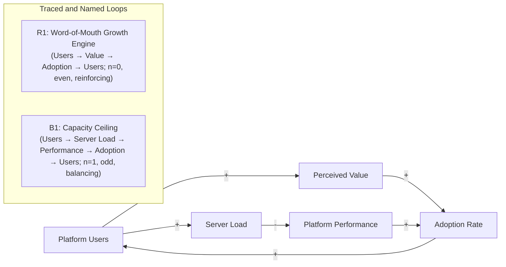

## Tracing and Naming Feedback Loops

### Definition and Core Concept

Tracing and naming feedback loops is the CLD construction step that follows variable identification and polarity labeling (covered in the corresponding reference materials): systematically walking each closed causal path in a diagram to confirm it genuinely returns to its starting variable, classifying it as reinforcing (R) or balancing (B) via the polarity-parity rule, and assigning it a short, memorable, meaning-bearing name that supports communication and reasoning about the diagram.

This step converts a CLD from a raw network of labeled arrows into an organized inventory of named, classified structural elements — the loops — which become the primary units of analysis for subsequent work such as loop-dominance assessment, leverage-point identification, and archetype pattern-matching (all covered in their respective reference materials).

### Step 1: Systematic Loop Tracing

**Procedure**

1. **Select a starting variable** and follow outgoing causal arrows in the direction of causation (never against the arrow direction).
2. **Continue following arrows** through intermediate variables, recording the sequence of variables and each traversed link's polarity.
3. **Confirm closure**: a genuine loop exists only when the path returns to the exact starting variable, not merely to a variable that resembles it or is related to it. A path that peters out at a variable with no further outgoing links, or that reaches a different variable than the one it started from, is not a closed loop and should not be labeled as one.
4. **Record the full traversed link sequence**, since this sequence — not just the set of variables involved — is what determines the loop's polarity count and is needed to correctly attribute delay or dominance properties to the loop as a whole (see the corresponding delay and loop-dominance reference materials).
5. **Repeat from each variable with outgoing links not yet fully explored**, since diagrams commonly contain multiple loops, including loops that share some but not all of their variables (see "Overlapping Loops" below).

**[Inference]** For diagrams with more than a handful of variables, exhaustively tracing every possible closed path by hand becomes increasingly error-prone and time-consuming as the variable count grows, since the number of potential distinct cycles in a densely connected graph can grow combinatorially; in practice, most CLD practitioners trace the small number of loops that are of direct diagnostic interest to the specific question being analyzed, rather than attempting to exhaustively enumerate every mathematically possible cycle in a large diagram, though dedicated system dynamics software can algorithmically enumerate all closed cycles in a given diagram's underlying directed graph structure.

### Step 2: Classifying the Loop (Parity Rule Recap)

Once a closed path is confirmed, apply the polarity-parity rule established in the reinforcing and balancing loop reference materials:

$$\text{Loop polarity} = (-1)^{n}, \quad n = \text{count of negative (}-\text{) links in the traversed sequence}$$

- $n$ even (including zero) → **Reinforcing (R)**
- $n$ odd → **Balancing (B)**

**Key Points**

- The count must include every link in the traced sequence exactly once, in the order traversed; a link should not be double-counted or omitted, and a loop traced in the reverse direction around the same cycle yields the identical classification (parity is direction-of-traversal-invariant, since reversing traversal direction does not change which individual links are negative).
- If tracing produces an odd link count on a first pass but an even count when re-traced, this discrepancy indicates a **tracing or polarity-labeling error** (a link's polarity was mislabeled, or a link was skipped or duplicated), not a genuinely ambiguous loop classification — a properly labeled, correctly traced loop has one and only one correct classification.

### Step 3: Naming the Loop

A well-chosen loop name serves as a compact, memorable handle for referring to the loop in discussion, in accompanying narrative, and when reasoning about intervention points — it is a communication device, not a formal analytical requirement, but a well-named loop substantially improves a CLD's usability in group and organizational settings.

**Key Points for Effective Loop Naming**

- **Name the loop's overall dynamic or "story," not merely the variables it contains.** "R1: Word-of-Mouth Growth Engine" is more useful than "R1: Users-Visibility-Adoption Loop," because the former communicates *what the loop does* at a glance, while the latter merely restates the diagram's contents.
- **Keep names short** (typically two to five words) so they can be referenced fluently in discussion and fit within the loop-icon label space on the diagram itself.
- **Distinguish structurally similar loops with distinct, specific names** rather than generic labels like "Loop 1" and "Loop 2," particularly in diagrams with multiple reinforcing or multiple balancing loops, where numeric-only labels (R1, R2, B1, B2) provide unique identifiers but do not by themselves convey meaning without an accompanying descriptive name.
- **Use valence-neutral or context-appropriate framing consistent with the loop's actual behavior**: a reinforcing loop driving desirable growth might be named "Virtuous Cycle" or given a positive descriptive name, while a reinforcing loop driving a problem might be named to reflect its detrimental "vicious cycle" character (e.g., "Death Spiral," "Burnout Loop") — but the name should always accurately reflect the loop's actual traced dynamic, never a hoped-for or intuitively-assumed one, given the documented cases (in the balancing- and reinforcing-loop reference materials) where intuitive labeling and the actual traced polarity diverge.

### Standard Naming and Numbering Convention

The widely used convention numbers loops separately within each polarity category: **R1, R2, R3...** for reinforcing loops and **B1, B2, B3...** for balancing loops, each paired with a short descriptive name, typically displayed together in the diagram as, for example, "R1: Growth Engine" or "B1: Capacity Ceiling." This numbering is primarily for cross-reference convenience in accompanying documentation and discussion, not a claim about relative importance or the order in which loops were discovered.

### Illustrative Example: Tracing a Loop from a Larger Diagram

**Example**

Given a diagram with variables {Marketing Spend, Brand Awareness, New Customer Acquisition, Revenue, Marketing Budget Allocation} and links: Marketing Spend →(+)→ Brand Awareness →(+)→ New Customer Acquisition →(+)→ Revenue →(+)→ Marketing Budget Allocation →(+)→ Marketing Spend.

**Tracing**: starting at Marketing Spend and following the five links in sequence returns exactly to Marketing Spend, confirming closure. **Classifying**: all five links are positive, so $n=0$ (even) → reinforcing. **Naming**: this loop's "story" is that marketing investment generates revenue that is partly reinvested into further marketing — an appropriate name is "R1: Marketing Reinvestment Engine" or "R1: Self-Funding Growth Loop," both of which communicate the loop's substantive dynamic rather than simply restating its five constituent variable names.

### Overlapping and Nested Loops

**[Inference]** Real-world CLDs frequently contain multiple loops that share one or more variables or links — for example, two reinforcing loops that both pass through a shared "Brand Reputation" variable but diverge afterward into different downstream paths. When loops overlap, each distinct closed cycle should generally still be traced and named separately (since each represents a mathematically distinct feedback path with its own polarity classification), even though they share structural elements; collapsing overlapping loops into a single combined analysis risks obscuring that the shared variable may participate in loops of different polarity simultaneously (one reinforcing path and one balancing path both running through the same node), which is itself often diagnostically important information about why a system's behavior at that shared variable can be difficult to predict from a single loop's dynamics alone.

### Verifying Loop Independence vs. Redundant Tracing

A practical check when tracing multiple loops in a diagram: two traced paths that visit the exact same set of links (even if the tracing began at different starting variables within the cycle) represent the **same loop**, not two independent loops, and should be recorded and named once, not duplicated under two different names. Genuinely distinct loops must differ in at least one link or in the specific variables traversed, not merely in which variable was chosen as the arbitrary starting point for the trace.

### Common Pitfalls in Tracing and Naming

- **Declaring closure prematurely**: mistaking a path that reaches a variable *similar to* or *related to* the starting variable (but not the identical node) for a genuinely closed loop — closure requires returning to the exact same node.
- **Losing track of the traversed link sequence**, leading to miscounting negative links, especially in longer loops (five or more links) where manual tracking by memory alone is error-prone; explicitly writing out the full sequence of links and their individual polarities before counting is a more reliable practice than attempting the parity count purely by inspection of the diagram.
- **Naming a loop purely descriptively (restating its variables) rather than narratively (describing its dynamic)**, which produces technically accurate but practically unmemorable and unhelpfully redundant labels.
- **Assuming a loop's colloquial or intuitive name matches its actual traced classification** without performing the explicit parity count — as demonstrated in the training-budget and quality-decline examples in the related reference materials, a loop that reads narratively as a "vicious cycle" or a "corrective mechanism" can have a classification opposite to the one the narrative framing suggests, and only explicit tracing and counting resolves this reliably.
- **Treating loops that share variables as a single merged loop** rather than tracing and classifying each distinct closed cycle separately, which can mask the coexistence of loops with different polarities at a shared node.

**Related Topics**

- Identifying Variables and Causal Links
- Labeling Link Polarity
- Reinforcing (Positive) Feedback Loops
- Balancing (Negative) Feedback Loops
- Feedback Loop Dominance and Shifts Over Time
- Purpose and Uses of Causal Loop Diagrams
- Systems Archetypes (Limits to Growth, Shifting the Burden, Tragedy of the Commons)
- Group Model Building and Facilitation