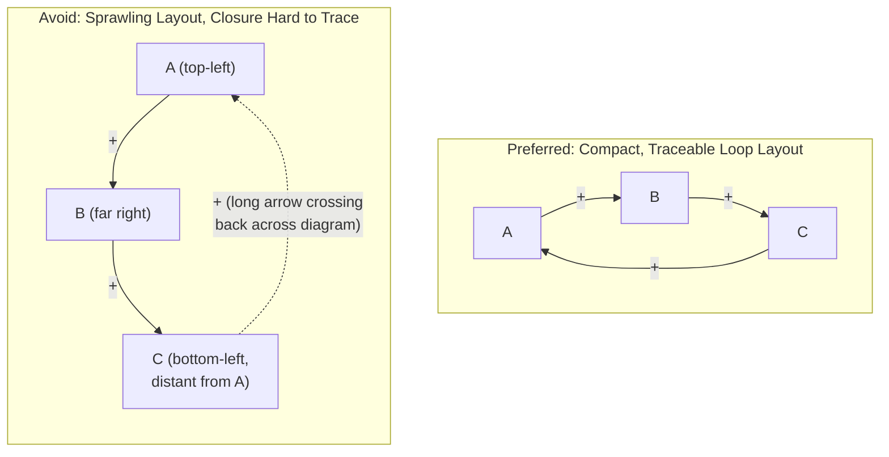

## Common Diagramming Conventions and Pitfalls

### Definition and Core Concept

This topic consolidates the standard notational conventions governing Causal Loop Diagram (CLD) construction and catalogs the recurring practical errors that compromise CLD validity, readability, or usefulness. Where the preceding reference materials (variable/link identification, polarity labeling, loop tracing and naming) each address a single construction step in depth, this material addresses the diagram as a completed, integrated artifact — the conventions that govern its overall visual and structural presentation, and the failure modes that most commonly undermine a finished CLD's diagnostic value.

### Core Notational Conventions Recap

**Key Points**

- **Nodes**: variable names as neutral, direction-capable noun phrases (see the identifying-variables reference material); no boxes or shapes are strictly required around node text in most CLD conventions, distinguishing CLD notation from the boxed-stock convention used in stock-and-flow diagrams.
- **Links**: solid arrows from cause to effect, each labeled with $+$ or $-$ polarity per the ceteris paribus method (see the labeling-polarity reference material).
- **Loop identifiers**: a curved arrow, snowball icon, or simple "R"/"B" letter placed at the approximate center of each closed loop, generally paired with a short descriptive name (see the tracing-and-naming reference material) such as "R1: Growth Engine."
- **Delay marks**: two short parallel hash marks (‖) drawn across a link to indicate a significant time lag specifically on that link, connecting to the delay concepts covered in the corresponding reference material — this is the standard way a fundamentally non-quantitative CLD notation still flags where delay-driven oscillation risk may exist without requiring a full quantitative delay-length estimate.
- **Goal/setpoint markers**: some conventions use a small flag, target icon, or explicit "goal" node to indicate a variable a balancing loop is regulating toward, making the loop's implicit purpose visible on the diagram itself rather than requiring inference from the loop's structure alone.

### Convention: Consistent Variable Framing Direction

As established in the polarity-labeling reference material, flipping a variable to its inverse framing (Quality vs. Defect Rate) flips the polarity of every link touching it. Best practice is to establish a **consistent framing direction across the whole diagram** before finalizing polarity labels — typically choosing the framing where "more is generally the driving/active-growth direction" (e.g., preferring "Product Quality" over "Product Defect Rate," "Customer Retention" over "Customer Churn") — since consistent framing substantially reduces sign-tracking errors during subsequent loop tracing and reduces cognitive friction for a reader scanning the diagram.

### Convention: Visual Layout for Loop Legibility

**[Inference]** While no single visual layout is formally mandated by CLD notation, common practice favors laying out loops so that each closed cycle is visually compact and roughly circular or oval in the diagram's spatial arrangement, rather than sprawling across the page in a way that makes the closure of the cycle difficult for a reader to visually trace — this is a practical readability convention rather than a rule affecting the diagram's formal correctness, but poor spatial layout is a frequently cited reason well-constructed CLDs are nonetheless difficult for an audience to follow in a presentation setting.

### Pitfall: Confusing CLD Notation with Stock-and-Flow Notation

A frequent error, particularly among analysts newly transitioning between the two diagram types, is mixing stock-and-flow-specific symbols (rectangle stocks, valve-icon flows, cloud sources/sinks) into what is intended to be a pure CLD, or conversely using plain CLD-style arrows-and-signs where a stock-flow diagram's explicit accumulation structure is actually needed. As detailed in the stocks-and-flows reference material, these are related but formally distinct diagram types serving different purposes (qualitative structure-mapping vs. quantitative accumulation modeling), and mixing their conventions within a single diagram produces an artifact that is ambiguous about whether it is meant to be simulated quantitatively or read only qualitatively.

### Pitfall: Omitting Polarity Labels Entirely

Some informally drawn "causal diagrams" omit $+/-$ polarity labels altogether, showing only undirected or unsigned causal arrows. **[Inference]** Without polarity labels, a diagram cannot be formally classified into reinforcing or balancing loops via the parity rule, which eliminates the primary analytical value the CLD format is specifically designed to provide; an unsigned causal diagram is a strictly weaker artifact than a fully polarity-labeled CLD; and given that assigning polarity is a comparatively low-cost addition to an already-drawn causal arrow, there is little practical justification for omitting it once the causal links themselves have already been identified.

### Pitfall: Overly Large, Monolithic Diagrams

Attempting to represent an entire complex system in a single, fully detailed CLD frequently produces a diagram so visually dense that its loop structure becomes difficult to discern — the specific readability limitation flagged in the purpose-and-uses reference material. Common mitigation practices include:

- **Modularizing into sub-diagrams**, each focused on one particular loop or a small cluster of closely related loops, with a small number of shared "interface" variables connecting the sub-diagrams.
- **Producing a simplified "loops-only" overview diagram** (showing only the named loops and their high-level interconnections, without every constituent variable) alongside more detailed per-loop diagrams for deeper inspection.
- **Using progressive disclosure in presentation settings** — introducing one loop at a time to an audience, building up the full diagram incrementally, rather than presenting the complete, dense final diagram all at once.

### Pitfall: Treating the Diagram as Complete or Final

**[Inference]** Because CLD construction is generally a qualitative, judgment-based, and often iterative group process (as discussed in the purpose-and-uses and identifying-variables reference materials), treating a first-draft CLD as a finished, authoritative representation of the system — rather than as a working hypothesis subject to revision as new information, stakeholder input, or evidence emerges — is a common and consequential pitfall. Best practice generally favors explicitly versioning CLDs and revisiting them as understanding of the system develops, rather than anchoring decisions permanently on an early draft's specific structure.

### Pitfall: Inconsistent Aggregation Level Within One Diagram

As detailed in the identifying-variables reference material, mixing highly aggregated variables ("Company Performance") with highly granular ones ("Q3 Support Ticket Response Time") within the same diagram produces links of very different conceptual scope that are difficult to compare, reason about jointly, or classify consistently. This pitfall is listed here again specifically as a diagram-level (not merely single-variable) quality issue: even if every individual variable is well-formed in isolation, a diagram that lacks a globally consistent aggregation level throughout is harder to validate and communicate as a whole.

### Pitfall: Unlabeled or Ambiguous Loop Numbering

Diagrams with multiple loops that use inconsistent, missing, or duplicate loop labels (e.g., two different loops both informally referred to as "the growth loop" in accompanying discussion, or loops left entirely unlabeled) create ambiguity in subsequent discussion, especially in group settings or written analysis referencing "R1" or "the reinforcing loop" without a clear, unique referent. The tracing-and-naming reference material's R1/R2/B1/B2 convention exists specifically to prevent this ambiguity, and skipping it — particularly once a diagram contains more than one or two loops — is a common source of confused or talking-past-each-other discussion in later analysis sessions.

### Pitfall: Diagram-Reality Drift (Failing to Revisit After Initial Construction)

**[Unverified]** A CLD constructed at one point in time reflects the causal beliefs and system structure understood at that time; if the underlying system evolves (new processes, new market conditions, structural changes) or if the diagram's original mental-model assumptions are later found to be incorrect, but the diagram itself is not revisited or updated, decisions continuing to rely on the stale diagram risk being based on an inaccurate representation. How frequently a given CLD should be revisited is context-dependent (a diagram of a fast-changing startup's growth dynamics likely needs more frequent revision than one of a stable, mature institutional process), and there is no universal revision-interval rule; the general practice recommendation is simply that CLDs should be treated as living documents subject to periodic review rather than one-time deliverables, with the specific cadence left to practitioner judgment given the system's actual rate of change.

### Consolidated Conventions and Pitfalls Reference Table

| Category | Convention (Do This) | Pitfall (Avoid This) |
| --- | --- | --- |
| Variable naming | Neutral, direction-capable noun phrases | Value-laden, fixed-state, or causally-loaded variable names |
| Link polarity | Explicit $+/-$ on every link, ceteris paribus tested | Omitted polarity labels; surface-vocabulary pattern-matching |
| Variable framing | Consistent "more is the active direction" framing throughout | Mixed framing causing spurious apparent loop-classification shifts |
| Loop identification | Explicit tracing, parity counting, unique R/B numbering with descriptive names | Assuming a loop's classification from its narrative "feel" |
| Delay representation | Explicit delay marks (‖) on links with significant lag | Omitting delay marks, obscuring oscillation/overshoot risk |
| Diagram scope | Modular sub-diagrams or loops-only overviews for complex systems | Single monolithic diagram attempting full system detail |
| Aggregation level | Consistent granularity throughout one diagram | Mixing highly aggregated and highly granular variables together |
| Diagram lifecycle | Versioned, periodically revisited as a living hypothesis | Treated as a one-time, permanently authoritative final artifact |

**Related Topics**

- Identifying Variables and Causal Links
- Labeling Link Polarity
- Tracing and Naming Feedback Loops
- Purpose and Uses of Causal Loop Diagrams
- Stocks and Flows as Building Blocks
- Delays and Their Effects on System Behavior
- Group Model Building and Facilitation
- Systems Archetypes (Limits to Growth, Shifting the Burden, Fixes That Fail)