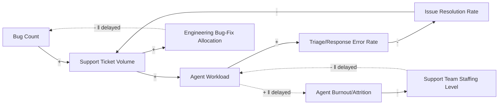

## Building a Causal Loop Diagram from a Narrative

### Definition and Core Concept

Building a Causal Loop Diagram (CLD) from a narrative is the end-to-end applied workflow that integrates every preceding CLD construction skill — variable identification, link determination, polarity labeling, loop tracing and naming, and adherence to standard conventions — into a single, repeatable process for converting an unstructured verbal account of a situation into a complete, validated diagram. Where the prior reference materials each isolate one discrete skill, this material demonstrates the full sequential procedure applied to a realistic, moderately complex narrative from start to finish.

### The End-to-End Procedure

**Key Points**

1. **Read the full narrative first without extracting anything**, to obtain an overall sense of the situation before committing to specific variables — premature extraction from only the first portion of a narrative risks missing variables or feedback paths only revealed later in the account.
2. **Extract candidate variables**, applying the well-formedness criteria from the identifying-variables reference material (neutral, direction-capable noun phrases; avoid embedding causal claims or value judgments in variable names).
3. **Extract candidate causal links** between the identified variables, checking each against the necessary conditions for link existence (mechanistic plausibility, defensible directionality, not better explained by confounding) from the same reference material.
4. **Assign polarity to every link** using the ceteris paribus method from the labeling-polarity reference material, verifying each with the symmetric-reversal check.
5. **Trace all closed paths**, confirm genuine closure at the identical starting variable, and classify each via the negative-link parity rule, per the tracing-and-naming reference material.
6. **Name each identified loop** with a short, dynamic-descriptive (not merely variable-restating) name, and assign standard R/B numbering.
7. **Review the completed diagram against the conventions and pitfalls checklist** (consistent variable framing, consistent aggregation level, appropriate scope, explicit delay marks where relevant) from the corresponding reference material, revising as needed.
8. **Validate the diagram against the original narrative**, confirming every stated causal claim in the source narrative is represented somewhere in the diagram, and that the diagram introduces no causal claims the narrative did not support (or, where an inference beyond the literal narrative was necessary, that this is flagged rather than silently assumed).

### Worked Example: Full Narrative

**Example**

Source narrative (a composite, realistic organizational account): *"Our support team has been struggling. When our software has more bugs, customers file more support tickets. As ticket volume rises, our support agents get overloaded, and overloaded agents make more mistakes when triaging and responding to tickets, which means customers often don't get their issues properly resolved. Unresolved issues lead to repeat tickets from the same customers, adding even more to the ticket queue. Separately, when agents are overloaded for a long stretch, they start burning out and leaving the team, and it takes months to hire and train replacements, so during that gap the remaining agents are even more overloaded. On the product side, when our engineering team sees rising bug-related ticket volume, they usually respond by allocating more engineering time to bug fixes, which over a few sprints brings the bug count back down."*

### Step-by-Step Application

**Extracting variables**: Bug Count, Support Ticket Volume, Agent Workload, Triage/Response Error Rate, Issue Resolution Rate (or its inverse, Unresolved Issue Rate), Agent Burnout/Attrition, Support Team Staffing Level, Engineering Bug-Fix Allocation.

**Extracting links and assigning polarity** (ceteris paribus tested for each):

- Bug Count → Support Ticket Volume: **+** (more bugs cause more tickets)
- Support Ticket Volume → Agent Workload: **+** (more tickets increase workload)
- Agent Workload → Triage/Response Error Rate: **+** (more overload increases mistakes)
- Triage/Response Error Rate → Issue Resolution Rate: **−** (more errors reduce successful resolution)
- Issue Resolution Rate → Support Ticket Volume: **−** (better resolution reduces repeat tickets; equivalently, framed as Unresolved Issue Rate → Support Ticket Volume would be **+** — see the framing-consistency point below)
- Agent Workload → Agent Burnout/Attrition: **+** (sustained overload increases attrition), marked with a delay mark (‖) since the narrative specifies this effect operates "over a long stretch"
- Agent Burnout/Attrition → Support Team Staffing Level: **−** (attrition reduces staffing)
- Support Team Staffing Level → Agent Workload: **−** (more staff reduces per-agent workload, holding ticket volume constant), also marked with a delay mark since the narrative specifies a multi-month hiring/training gap
- Support Ticket Volume → Engineering Bug-Fix Allocation: **+** (rising bug-related tickets prompt more engineering allocation to fixes)
- Engineering Bug-Fix Allocation → Bug Count: **−** (more fix allocation reduces bug count), also delay-marked ("over a few sprints")

**Tracing and classifying loops**:

*Loop 1 (Support Quality Spiral):* Support Ticket Volume →(+)→ Agent Workload →(+)→ Triage/Response Error Rate →(−)→ Issue Resolution Rate →(−)→ Support Ticket Volume. Negative link count: $n=2$ (even) → **Reinforcing**. Named **R1: Support Quality Spiral** — this is the structural driver of a self-worsening ticket backlog, where overload degrades resolution quality, which itself generates more tickets.

*Loop 2 (Burnout-Staffing Trap):* Agent Workload →(+, delayed)→ Agent Burnout/Attrition →(−)→ Support Team Staffing Level →(−, delayed)→ Agent Workload. Negative link count: $n=2$ (even) → **Reinforcing**. Named **R2: Burnout-Staffing Trap** — a distinct reinforcing loop, sharing the "Agent Workload" node with Loop 1 but otherwise structurally independent, illustrating the overlapping-loops case discussed in the tracing-and-naming reference material.

*Loop 3 (Engineering Bug-Fix Response):* Bug Count →(+)→ Support Ticket Volume →(+)→ Engineering Bug-Fix Allocation →(−, delayed)→ Bug Count. Negative link count: $n=1$ (odd) → **Balancing**. Named **B1: Engineering Bug-Fix Response** — the system's built-in corrective mechanism, counteracting bug-driven ticket growth, though delayed by several sprints per the narrative.

### Completed Diagram

### Validating the Diagram Against the Source Narrative

**Key Points**

- Every causal statement made in the narrative maps to at least one link in the completed diagram: bugs-to-tickets, tickets-to-workload, workload-to-errors, errors-to-unresolved-issues, unresolved-issues-to-repeat-tickets, workload-to-burnout (with the narrative's own stated delay condition), burnout-to-staffing-gap, staffing-gap-to-workload (with the narrative's own stated multi-month delay), tickets-to-engineering-response, and engineering-response-to-bug-reduction (with the narrative's own stated multi-sprint delay).
- No link was added to the diagram that the narrative did not support — for example, no direct link was drawn from "Bug Count" straight to "Agent Burnout," since the narrative only supports that connection indirectly, through the traced chain via ticket volume and workload; adding an unsupported shortcut link would misrepresent the narrative's actual claimed causal structure.
- The narrative's explicit mention of a distinct, separate dynamic ("Separately, when agents are overloaded...") was correctly represented as a genuinely separate loop (R2) rather than folded into the first loop, honoring the narrative's own structural distinction between the ticket-quality dynamic and the burnout-staffing dynamic.

### Key Insights Surfaced by the Completed Diagram

- The diagram reveals that the support team's struggles are driven by **two independent reinforcing loops (R1 and R2) sharing a common node (Agent Workload)**, meaning an intervention addressing only one loop (e.g., hiring more staff to address R2) may still leave R1 fully intact and continuing to degrade resolution quality, unless the intervention specifically also addresses the triage-error-to-resolution-rate link.
- The organization's existing corrective mechanism (B1) is present but **delayed by several sprints**, meaning it will not prevent an acute short-term bug-driven surge from cascading into R1 and R2 before the engineering response takes effect — consistent with the general principle from the delays reference material that a delayed balancing loop cannot substitute for a properly-sized short-term buffer against a fast-moving reinforcing loop.
- Because R1 and R2 are both reinforcing and share a node, a targeted intervention that reduces Agent Workload directly (e.g., temporary contractor support, ticket-volume triage automation) would weaken both loops simultaneously at their shared point of leverage — illustrating how identifying shared nodes across multiple loops (as flagged in the tracing-and-naming reference material's overlapping-loops discussion) can reveal higher-leverage intervention points than addressing each loop's more distal variables separately.

### Common Pitfalls Specific to the Narrative-to-Diagram Workflow

- **Extracting variables in narrative reading order and drawing links only sequentially**, which risks missing loop closure entirely if the narrative's final sentence loops back to an early variable — as in this example, where "Engineering Bug-Fix Allocation" (introduced near the end of the narrative) closes back to "Bug Count" (introduced at the very beginning), a connection easily missed without deliberately checking every variable for undiscovered outgoing links after the first full read-through.
- **Treating narrative delay language ("over a long stretch," "it takes months," "over a few sprints") as optional color rather than diagram-relevant information**, when in fact such phrases are direct textual evidence that a delay mark belongs on the corresponding link, materially affecting the diagram's later use for anticipating oscillation or overshoot risk.
- **Silently merging the narrative's two explicitly distinguished dynamics into one loop**, losing the diagnostic value of recognizing them as separate, independently-actionable reinforcing structures sharing a common node.
- **Failing to re-validate the finished diagram against the source text**, skipping the final verification step and risking either an unsupported inferred link or an omitted narrative claim going unnoticed in the finished artifact.

**Related Topics**

- Identifying Variables and Causal Links
- Labeling Link Polarity
- Tracing and Naming Feedback Loops
- Common Diagramming Conventions and Pitfalls
- Delays and Their Effects on System Behavior
- Purpose and Uses of Causal Loop Diagrams
- Systems Archetypes (Limits to Growth, Shifting the Burden, Fixes That Fail)
- Group Model Building and Facilitation