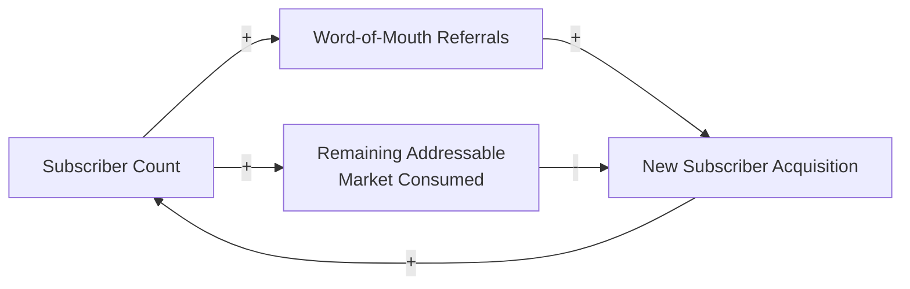
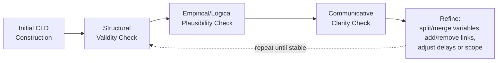

## Validating and Refining Causal Loop Diagrams

### Definition and Core Concept

Validating and refining a Causal Loop Diagram (CLD) is the quality-assurance stage that follows initial construction (whether built from a narrative, elicited from stakeholders, or drafted from an analyst's own domain knowledge): systematically testing a completed diagram's structural correctness, empirical plausibility, and communicative clarity, then revising it in response to identified weaknesses. Where the construction-focused reference materials (variable/link identification, polarity labeling, loop tracing, conventions, narrative-to-diagram workflow) address *building* a CLD, this material addresses *scrutinizing and improving* one that already exists in draft form.

Validation and refinement are treated as a distinct, necessary stage rather than an optional afterthought because CLD construction is inherently a judgment-based, often provisional process (as established in the purpose-and-uses reference material) — a first-draft diagram should be treated as a testable hypothesis about system structure, not a finished deliverable, until it has been through deliberate validation.

### Dimension 1: Structural Validity

**Key Points**

- **Re-verify every loop's closure and classification independently**, rather than trusting the original tracing — re-tracing each loop from scratch (ideally by someone other than the diagram's original author, or after enough time has passed for fresh eyes) is a standard check against the tracing errors documented in the tracing-and-naming reference material.
- **Check for orphaned variables**: a variable with only incoming links and no outgoing links (or vice versa) cannot participate in any loop; this may be intentional (a genuine external driver or a pure terminal outcome sink) or may indicate an incompletely elicited part of the diagram where a plausible further effect or upstream cause was simply not yet captured.
- **Check polarity-framing consistency across the whole diagram**, applying the inversion-consistency check from the labeling-polarity reference material to confirm no spurious loop-classification artifacts have crept in from inconsistent variable framing.
- **Confirm aggregation-level consistency**, checking that no single diagram mixes drastically different variable granularities in a way that undermines comparability, per the aggregation-level discussion in the identifying-variables reference material.
- **Confirm every diagrammed link traces back to an identifiable source or rationale** — data, a specific stakeholder's stated belief, established domain theory, or the analyst's own explicit judgment — since an untraceable link (one nobody can explain the basis for, on review) is a strong candidate for removal or, at minimum, explicit annotation as uncertain.

### Dimension 2: Empirical and Logical Plausibility

**[Inference]** Beyond checking that the diagram is internally well-formed, validation should also test whether the diagram's claims are plausible given available evidence and domain knowledge, since a structurally well-formed CLD can still misrepresent the actual system if its constituent causal claims are simply wrong; this is generally the harder and more time-consuming validation dimension, because it requires domain expertise or data access beyond what diagramming technique alone provides.

**Practical techniques:**

- **Cross-check against available quantitative data** where it exists: if historical data shows two variables moving independently of each other over an extended period, a diagrammed direct link between them warrants re-examination (though absence of correlation does not definitively rule out a genuine but currently-dominated-by-other-factors causal link — see the loop-dominance reference material's discussion of how a real structural relationship can be masked by another loop's current dominance).
- **Test extreme-case reasoning**: mentally push a variable to an extreme value and check whether the diagram's chain of implied effects remains plausible at that extreme, or whether it predicts an implausible runaway or contradiction — extreme-case testing often surfaces missing balancing loops or mis-scoped links that are not obvious when reasoning only about small, typical-range changes.
- **Compare the diagram's predicted dynamic pattern against observed historical behavior**: if the diagram implies a reinforcing loop should be driving continuous exponential growth in some variable, but the observed historical data shows that variable has been roughly flat for years, this discrepancy suggests either a missing balancing loop currently dominating (see loop-dominance reference material), an incorrect polarity somewhere in the traced reinforcing loop, or a variable/link that does not actually operate as diagrammed.
- **Seek disconfirming stakeholder input deliberately**, not merely confirming input: explicitly asking "who would disagree with this link, and why?" surfaces contested assumptions (as discussed in the polarity-labeling reference material's treatment of context-dependent or contested polarity) that a validation process relying only on the diagram's original constructors would not surface.

### Dimension 3: Communicative Clarity

- **Test the diagram against a reader unfamiliar with the situation**: can someone without prior context follow the loop closures, understand each loop's name and dynamic, and correctly restate the diagram's key implications after a single walkthrough? Difficulty at this stage typically indicates a scope, layout, or naming problem (see the common-conventions-and-pitfalls reference material) rather than a structural or empirical one.
- **Check loop naming against the "restates variables vs. tells the story" standard** established in the tracing-and-naming reference material — refine any loop name that merely lists its variables into one that communicates the loop's actual dynamic.
- **Assess visual density and layout**, applying the compact-traceable-layout convention and the modularization strategies from the common-conventions reference material if the diagram has become too visually dense to follow.

### Illustrative Example: Validation Surfacing a Missing Balancing Loop

**Example**

A draft CLD for a subscription business includes only a reinforcing loop: Subscriber Count →(+)→ Word-of-Mouth Referrals →(+)→ New Subscriber Acquisition →(+)→ Subscriber Count. Applying extreme-case reasoning: pushing Subscriber Count toward an extreme (e.g., "what happens as Subscriber Count approaches the entire addressable market?") reveals the diagram, as drawn, implies unbounded continued growth at the same rate indefinitely — an implausible prediction inconsistent with the well-established saturation dynamics discussed in the nonlinearity and threshold-effects reference material. This extreme-case test surfaces a missing balancing loop: Subscriber Count →(+)→ Remaining Addressable Market Consumed (or equivalently, the shrinking pool of non-subscribers) →(−)→ New Subscriber Acquisition Rate →(+)→ Subscriber Count, $n=1$ (odd), balancing. The validation process, not the original construction process, is what surfaced this necessary structural addition — illustrating why extreme-case reasoning is a standard and valuable refinement technique rather than a redundant re-check of already-established structure.

### Refinement Techniques

**Key Points**

- **Splitting an overloaded variable**: if validation reveals that a single variable is implicated in causal claims that pull in different directions or operate through genuinely distinct mechanisms (e.g., "Employee Morale" found to separately drive both a compensation-related loop and a management-relationship-related loop with different dynamics), splitting it into more granular sub-variables — as discussed in the aggregation-level guidance in the identifying-variables reference material — is a standard refinement response.
- **Merging redundant variables**: conversely, if two separately named variables are found during validation to always move together for the same underlying reason (rather than being genuinely causally distinct), merging them into a single variable simplifies the diagram without loss of analytical content.
- **Adding delay marks discovered during plausibility testing**: if comparing the diagram's implied dynamic against observed historical behavior reveals oscillation or lagged response not represented in the original diagram, adding delay marks (per the delays reference material) to the relevant links, rather than altering the links' polarity, is usually the correct refinement — delay and polarity are independent properties, and a plausibility mismatch caused by unrepresented delay should not be "fixed" by incorrectly changing a link's sign.
- **Removing unsupported or untraceable links**, per the structural-validity checklist above, rather than retaining a link on the basis that it "seems like it should be there" without an identifiable rationale.
- **Re-scoping the diagram's boundary**: if validation reveals that a variable treated as an external, undiagrammed input is, on reflection, meaningfully influenced by variables already inside the diagram (i.e., it should actually be inside the diagram's boundary and participating in a loop, rather than treated as an exogenous driver), expanding the diagram's boundary to include it is a standard and often high-value refinement, since incorrectly treating an endogenous variable as exogenous is a common way a genuine feedback loop is missed entirely.

### Validation and Refinement as an Iterative Cycle

**[Inference]** Validation and refinement are not generally a single pass-through checklist but an iterative cycle: each refinement (splitting a variable, adding a balancing loop, adjusting framing) can itself introduce new candidate links or loops that then require their own validation, so practitioners typically expect to cycle through structural, empirical, and clarity checks multiple times before converging on a stable draft, with the number of iterations needed depending on the situation's complexity and the availability of good disconfirming evidence — there is no fixed number of iterations that generally applies across all cases.

### Common Pitfalls in Validation and Refinement

- **Validating only the loops the original author already believes in**, rather than deliberately seeking disconfirming evidence or dissenting stakeholder perspectives — a validation process run entirely by the diagram's original constructor, with no external check, is structurally prone to confirming pre-existing assumptions rather than genuinely testing them.
- **Treating a single successful validation pass as sufficient**, rather than recognizing validation and refinement as an iterative cycle that may need to repeat as refinements introduce new elements requiring their own checks.
- **Confusing a plausibility mismatch caused by delay with a polarity error**, incorrectly flipping a link's sign to make the diagram's implied dynamic match observed historical behavior, when adding a previously-missing delay mark would have been the structurally correct refinement (see the illustrative distinction drawn in the refinement-techniques section above).
- **Over-refining into excessive complexity**: continuing to split variables and add links in pursuit of ever-greater empirical precision can eventually reintroduce the visual-density and clarity problems the refinement process was partly meant to resolve; refinement should be balanced against the diagram's intended purpose and audience, not pursued as an open-ended goal of maximal detail.
- **Failing to re-run the extreme-case and historical-comparison plausibility tests after a refinement**, assuming that because the diagram was refined it is now automatically correct, rather than re-validating the refined version against the same standards applied to the original draft.

**Related Topics**

- Building a Causal Loop Diagram from a Narrative
- Identifying Variables and Causal Links
- Labeling Link Polarity
- Tracing and Naming Feedback Loops
- Common Diagramming Conventions and Pitfalls
- Feedback Loop Dominance and Shifts Over Time
- Delays and Their Effects on System Behavior
- Nonlinearity and Threshold Effects
- Group Model Building and Facilitation