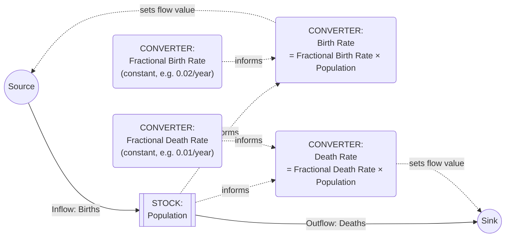

## Stocks, Flows, and Converters

### Definition and Core Concept

Stocks, Flows, and Converters are the three primitive building-block types used to construct quantitative System Dynamics simulation models, formalized in software environments such as Stella, Vensim, and Forrester's original DYNAMO/industrial dynamics framework. Where the corresponding stocks-and-flows reference material (in the feedback-loops chapter) introduced stocks and flows conceptually as the structural basis of accumulation and feedback, this material extends that foundation into the third primitive — the **converter** — and treats all three together as the complete minimal vocabulary needed to build a runnable, quantitatively simulatable system dynamics model, rather than a purely qualitative causal loop diagram.

This distinction matters because a CLD (see the corresponding chapter) specifies structure and direction only; a stock-flow-converter model specifies enough additional quantitative detail — explicit initial values, explicit mathematical functions governing each flow, and explicit auxiliary calculations — to actually be run forward in simulated time and produce numerical output.

### The Three Primitives Defined

**Stocks** (levels/accumulations): quantities that exist at an instant, accumulate over time via integration of their net flow, and represent the system's state and memory, exactly as established in the corresponding stocks-and-flows reference material. Notated as a rectangle in standard system dynamics diagramming software.

**Flows** (rates): the speed of change of a stock, measured per unit time, representing inflows (additions) or outflows (subtractions) to a stock. Notated as a pipe-and-valve icon connecting either a cloud (system boundary) or another stock to the target stock.

**Converters** (auxiliary variables/constants): the third primitive, representing intermediate calculations, constants, and lookup/graphical relationships that translate stock levels and other inputs into the values flows need to compute their rates. A converter does not itself accumulate anything and has no memory — its value is recalculated at every simulation time step purely as a function of its current inputs, with no dependence on its own prior value. Notated as a circle in standard system dynamics diagramming software.

### Why Converters Are a Necessary Third Primitive

**Key Points**

- A flow's rate is very rarely a simple, direct function of a single stock's level; it typically depends on ratios, lookup relationships, constants, or combinations of several stocks and external parameters — converters are the modeling element that computes these intermediate quantities so that flow equations remain readable and modular rather than becoming single enormous, unreadable expressions.
- Converters allow **named, reusable, and independently inspectable intermediate calculations** — e.g., a "Fractional Growth Rate" converter can be referenced by multiple flows across a model, and its own governing formula can be inspected, adjusted, or replaced with a lookup table without needing to edit every flow that depends on it.
- Converters are the natural home for **constants and exogenous parameters** (e.g., a fixed interest rate, a policy-set target value, a physical constant) that do not change as a function of the model's own internal dynamics, distinguishing genuinely exogenous inputs from the model's endogenously computed structure.
- The **stock-vs.-converter distinction directly parallels the stock-vs.-flow distinction** established in the corresponding reference material: the bathtub test (does this quantity retain a value with no memory-erasing recalculation if you "pause time," or is it recalculated fresh at every instant from current inputs?) applies equally to distinguishing a converter from a stock — a converter has no persistent memory of its own past values, while a stock's defining property is exactly that persistent memory.

### Formal Relationships

For a stock $S$ with inflow $I$ and outflow $O$:

$$\frac{dS}{dt} = I(t) - O(t)$$

A flow's rate is typically expressed as a function of one or more converters $C_1, C_2, ..., C_k$ and possibly the stock itself:

$$I(t) = f(S(t), C_1(t), C_2(t), ..., C_k(t))$$

A converter's value is, in turn, computed from its own inputs (which may include stocks, other converters, or fixed constants), with no integration or memory:

$$C_j(t) = g_j(S(t), \text{other converters}, \text{constants})$$

This three-tier dependency structure (stocks accumulate; converters compute instantaneous auxiliary values; flows use converters and stocks to determine the rate at which stocks change) is the standard architecture of every system dynamics model, regardless of size or domain.

### Diagram Notation

Note the convention: solid arrows represent actual material/quantity flow into and out of the stock (subject to conservation), while dashed arrows represent information links (a converter or stock's value being *read* by another element, without any transfer or depletion) — the same solid/dashed distinction established in the corresponding stocks-and-flows reference material, now extended to show converters supplying the computed values that determine flow magnitudes.

### Illustrative Example: Converter Types in a Single Model

**Example**

A simple product-inventory model illustrates the range of converter roles:

- **Constant converter**: "Target Inventory Coverage" = 30 days — a fixed policy parameter that does not change endogenously within the simulation.
- **Simple arithmetic converter**: "Desired Inventory" = Target Inventory Coverage × Average Daily Sales Rate — combines a constant and another converter (or a stock-derived rate) into an intermediate quantity.
- **Ratio/gap converter**: "Inventory Gap" = Desired Inventory − Current Inventory (the stock) — a converter that directly reads the stock's current value to compute a discrepancy, exactly analogous to the "gap to setpoint" construct in the balancing-loop reference material.
- **Lookup/graphical function converter**: "Production Adjustment Fraction" = a nonlinear lookup table mapping Inventory Gap to a fractional adjustment rate (e.g., small gaps produce a gentle adjustment, very large gaps produce a capped maximum adjustment reflecting real capacity constraints) — this converter type is specifically how system dynamics software represents empirically observed nonlinear relationships (see the nonlinearity reference material) that do not have a clean closed-form equation, without requiring the modeler to force-fit an artificial formula to match observed data.

The "Production Rate" flow then reads the Production Adjustment Fraction converter (among other inputs) to determine how many units per period are added to the Inventory stock — illustrating a chain of several converters feeding into a single flow's calculation, none of which themselves accumulate anything.

### Converters and Delay Representation

As detailed in the delays reference material, first-order and higher-order delays are themselves typically implemented in system dynamics software using an intermediate **stock** (to hold the accumulating, smoothed/delayed quantity) paired with a converter computing the adjustment rate — e.g., a "Perceived Sales Rate" delay is modeled as a stock whose inflow is a converter-computed function of the gap between actual and perceived sales, divided by an "Averaging Time" constant converter. This confirms that the delay constructs discussed conceptually in the delays reference material are, at the implementation level, built from exactly the same three primitives (stocks, flows, converters) described here, rather than requiring any additional primitive type.

### Distinguishing a Converter from a Disguised Stock (Common Error)

**Key Points**

- A frequent modeling error, extending the "modeling a stock as if it were a flow" pitfall documented in the stocks-and-flows reference material, is the reverse error: modeling a genuinely accumulating quantity as a converter (recalculated fresh each time step from current inputs only) when it actually has memory and should be a stock.
- **The diagnostic test**: does this quantity's current value depend on its own value one time-step prior, plus some net rate of change? If yes, it is a stock (even if it feels like "just a calculation," such as accumulated organizational trust, cumulative fatigue damage, or a rolling average requiring genuine persistence across time steps) and must be represented with a stock-and-flow pair, not a converter — a converter recalculated fresh at each time step cannot represent path-dependent accumulation, since by definition it has no access to its own prior state.
- **[Inference]** This error is particularly easy to make with "soft" quantities like accumulated skill, reputation, or trust, precisely because they are less obviously physical than an inventory count or a bank balance, but the underlying test (does it accumulate a history, or is it fully determined by current inputs alone?) applies identically regardless of whether the quantity is physical or perceptual.

### Practical Model-Building Guidance

1. **Identify all stocks first**, using the bathtub test from the corresponding reference material, before specifying any flows or converters — getting the stock inventory right is the foundational step, since flows and converters are defined relative to the stocks they affect.
2. **For each stock, identify its inflows and outflows explicitly**, ensuring no structurally important accumulation or depletion mechanism is omitted (per the "omitting a necessary outflow" pitfall in the stocks-and-flows reference material).
3. **Decompose each flow's governing equation into named converters** rather than writing one large, opaque formula directly on the flow — this improves both the model's inspectability and its capacity for later refinement (e.g., swapping a constant converter for a lookup-function converter as better data becomes available, without restructuring the flow itself).
4. **Explicitly separate genuinely exogenous constants from endogenously computed converters**, since this distinction determines which quantities are legitimate candidates for policy/scenario testing (adjusting a constant converter) versus which are outputs of the model's own internal structure that should not be arbitrarily overridden.
5. **Apply the stock-vs.-converter diagnostic test to every "soft" or perceptual quantity** in the model, to avoid the disguised-stock error detailed above.

### Common Pitfalls

- **Writing an overly complex, unreadable flow equation** directly rather than decomposing it into intermediate, individually named and inspectable converters.
- **Modeling a genuinely path-dependent, accumulating quantity as a converter**, silently eliminating the model's ability to represent that quantity's memory and history-dependence (the disguised-stock error detailed above).
- **Failing to distinguish exogenous constants from endogenous converters**, obscuring which model inputs are legitimate policy levers versus which are internally-computed results that should not be independently manipulated.
- **Force-fitting a clean closed-form equation to an empirically nonlinear relationship** rather than using a lookup/graphical function converter, which can misrepresent genuinely nonlinear or threshold-like relationships (see the nonlinearity reference material) with an inappropriately smooth or monotonic formula.
- **[Unverified]** Neglecting units consistency across stocks, flows, and converters — since flows must have units of "stock units per time unit" and converters feeding into flows must resolve to consistent units through the calculation chain, unit-tracking errors are a commonly cited source of otherwise-hard-to-detect model errors in practice, though the specific frequency of this error type across real-world modeling projects is not something available data can quantify precisely.

**Related Topics**

- Stocks and Flows as Building Blocks
- Delays and Their Effects on System Behavior
- Purpose and Uses of Causal Loop Diagrams
- Nonlinearity and Threshold Effects
- Feedback Loop Dominance and Shifts Over Time
- System Dynamics Simulation Software (e.g., Vensim, Stella)
- Reinforcing (Positive) Feedback Loops
- Balancing (Negative) Feedback Loops