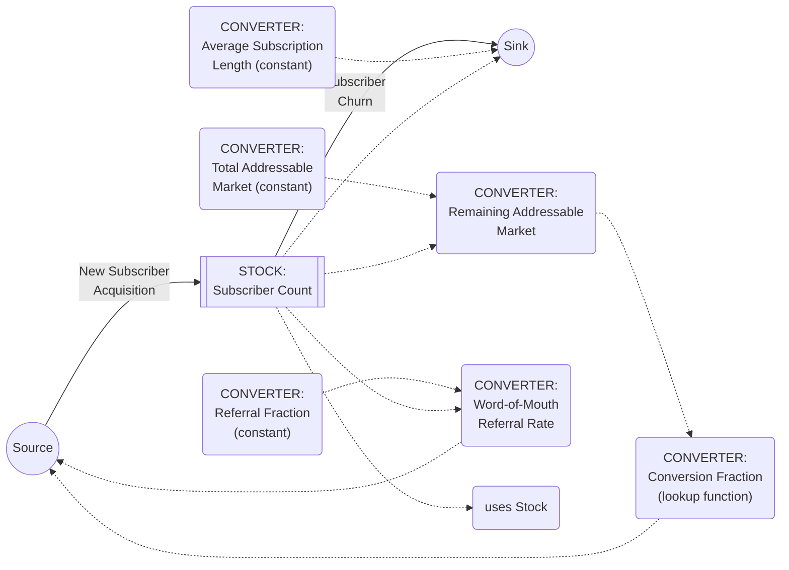

## Building Stock and Flow Diagrams

### Definition and Core Concept

Building a Stock and Flow Diagram (SFD) is the applied modeling workflow that converts a system's identified stocks, flows, and converters (the three primitives established in the corresponding reference material) into a complete, structurally coherent diagram capable of supporting quantitative simulation. Where the causal loop diagramming chapter's narrative-to-diagram workflow produces a qualitative structure diagram, this workflow produces the more rigorous quantitative counterpart: a diagram with explicit stocks, explicitly directed material flows with defined units, and converters supplying every value a flow equation requires — sufficiently complete and well-formed that it could, in principle, be entered into system dynamics software (e.g., Stella, Vensim) and run.

This topic addresses the practical, step-by-step construction process, extending the primitive definitions from the corresponding reference material into a repeatable procedure, and addresses the specific structural rules (unit consistency, conservation, boundary definition) that a valid SFD must satisfy but that a purely qualitative CLD does not need to enforce.

### The End-to-End SFD Construction Procedure

**Key Points**

1. **Define the model boundary**: explicitly decide which variables are endogenous (computed by the model's own internal structure) versus exogenous (fixed inputs or parameters supplied from outside the model boundary, represented as constant converters or as clouds at the ends of boundary-crossing flows). This boundary decision determines what the model can and cannot explain internally, and is among the most consequential early modeling choices.
2. **Identify all stocks** using the bathtub test from the stocks-and-flows reference material — the accumulating quantities whose current levels constitute the system's state and memory.
3. **Identify every inflow and outflow for each stock**, ensuring no structurally important accumulation or depletion mechanism is omitted (the "omitting a necessary outflow" pitfall documented in that same reference material).
4. **Determine units for every stock and flow explicitly**: a stock's units and its flows' units must satisfy $[\text{flow units}] = [\text{stock units}] / [\text{time unit}]$ — this unit-consistency requirement, introduced in the stocks-flows-converters reference material, should be checked at this construction stage rather than deferred to later debugging.
5. **Write the governing equation for each flow**, decomposing it into named, individually inspectable converters per the converter-decomposition guidance in the corresponding reference material, rather than embedding one large opaque formula directly in the flow.
6. **Add converters for every constant, exogenous parameter, and intermediate calculation** the flow equations require, explicitly distinguishing genuinely fixed constants from values that should themselves be computed from other model elements.
7. **Draw information links (dashed arrows)** from every stock or converter to every other converter or flow that reads its value, being careful to preserve the solid/dashed distinction (material transfer vs. information reference) established in the stocks-and-flows reference material.
8. **Trace the diagram's implied feedback loops** by following the closed paths formed by material flows plus their information-link dependencies back to the stocks that determine them — confirming that the SFD's structure reproduces the loop structure identified in any preceding qualitative CLD analysis of the same system, per the tracing-and-naming reference material's classification method.
9. **Validate against a simplified reference-behavior test** — before formal simulation, reason qualitatively about whether the diagram's structure would plausibly produce behavior consistent with known or expected system behavior, applying the extreme-case and historical-comparison techniques from the validating-and-refining reference material.

### Worked Example: From a Validated CLD to a Complete SFD

**Example**

Building on the subscription-business CLD developed in the validating-and-refining reference material (Subscriber Count, Word-of-Mouth Referrals, New Subscriber Acquisition, Remaining Addressable Market Consumed), the SFD construction process specifies the quantitative structure underlying that qualitative diagram:

**Boundary decision**: Total Addressable Market is treated as an exogenous constant converter (assumed fixed for the simulation's time horizon) rather than an endogenously modeled quantity.

**Stock**: Subscriber Count (units: subscribers).

**Flows**: "New Subscriber Acquisition" (inflow, units: subscribers/month); "Subscriber Churn" (outflow, units: subscribers/month) — note that churn was implicit but not fully specified in the earlier qualitative CLD, and its explicit inclusion here is a direct consequence of the unit-consistency and completeness discipline the SFD construction process enforces (a stock with only an inflow and no outflow at all is a common early-draft gap the more rigorous SFD process tends to surface).

**Converters**:

- "Total Addressable Market" (constant, e.g., 2,000,000 potential subscribers)
- "Remaining Addressable Market" = Total Addressable Market − Subscriber Count
- "Word-of-Mouth Referral Rate" = Referral Fraction × Subscriber Count, where "Referral Fraction" is a constant converter (e.g., 0.05/month)
- "Conversion Fraction" = a lookup-function converter mapping Remaining Addressable Market (as a fraction of Total Addressable Market) to a conversion likelihood, capturing the saturation nonlinearity discussed in the nonlinearity reference material without forcing a specific closed-form equation
- "New Subscriber Acquisition" (the inflow itself) = Word-of-Mouth Referral Rate × Conversion Fraction
- "Average Subscription Length" (constant converter, e.g., 24 months)
- "Subscriber Churn" (the outflow itself) = Subscriber Count / Average Subscription Length

### Ensuring Conservation and Structural Integrity

**Key Points**

- **Material flows are subject to conservation**: a solid-arrow inflow to one stock that represents a transfer *from* another stock (rather than from an external cloud/source) must correspondingly appear as an outflow from that source stock, so that the same physical or logical quantity is not created or destroyed without an accounted-for source or sink — this is the SFD-specific enforcement of the general conservation principle flagged as a common pitfall ("double-counting via improperly duplicated material flows") in the stocks-and-flows reference material.
- **Information links carry no conservation obligation**: because dashed information links represent a *reading* of a value rather than a *transfer* of quantity, the same stock's value can validly inform any number of different converters or flows simultaneously without any conservation concern — a single stock's current level can legitimately drive many separate downstream calculations at once.
- **Clouds represent the model boundary, not literal infinite reservoirs**: a cloud at the start of an inflow or end of an outflow signifies that the corresponding source or sink lies outside the model's defined scope (per the boundary decision made in step 1 of the construction procedure), not a physically infinite supply or absorption capacity — this is a modeling simplification appropriate when the source/sink's own dynamics are not of interest for the questions the model is meant to answer, but should be revisited if boundary-crossing effects later prove material to the analysis.

### Multi-Stock Chains and Structural Patterns

As introduced in the corresponding stocks-and-flows reference material, many real systems require **chained stocks**, where one stock's outflow becomes the next stock's inflow — the generic template for pipeline, compartmental, and multi-stage delay structures. When building an SFD for such a system, each stage's boundary and units must be independently verified using the same procedure (steps 2 through 4 above) applied stock-by-stock, since an error introduced at any single stage (e.g., a units mismatch between one stock's outflow and the next stock's corresponding inflow) will propagate incorrect values through the entire downstream chain during simulation.

**Example**

A three-stage hiring pipeline — Applicants in Review (stock 1) → Offers Extended (stock 2) → Onboarded Employees (stock 3) — requires three separate stock-flow pairs, each with its own governing converters (e.g., "Review-to-Offer Conversion Rate," "Offer Acceptance Rate," "Onboarding Completion Rate"), chained so that the outflow rate from each stage becomes the inflow rate to the next. Building this correctly as an SFD, rather than treating the overall hiring process as a single aggregated flow, is what allows the model to represent the multi-stage delay and the possibility of a bottleneck emerging at any one specific stage — detail that a single-stock aggregation would structurally be unable to reveal.

### Checking Diagram Completeness Before Simulation

1. **Every stock has at least one defined inflow or outflow** (a stock with neither can never change and is likely either mis-scoped or missing a necessary flow).
2. **Every flow has a fully specified governing equation**, expressed only in terms of stocks, converters, and constants already present in the diagram — a flow whose equation references an undefined or unlabeled quantity is incomplete.
3. **Every converter's own equation is similarly fully specified**, with no circular converter-to-converter dependency that lacks a stock or a genuine constant to anchor the calculation (a converter cannot depend, even indirectly through other converters, solely on other converters in an unbroken cycle with no stock or true constant breaking the cycle, since converters have no memory to resolve such a cycle over time).
4. **Units are consistent throughout the calculation chain** from constants and stocks through every converter to each flow's final rate.
5. **The diagram's implied feedback loops, when traced, are consistent with any prior qualitative CLD analysis of the same system** — a discrepancy here (a loop present in the CLD but not reproducible in the SFD, or vice versa) indicates that either the CLD's qualitative structure or the SFD's quantitative structure needs re-examination and reconciliation.

### Common Pitfalls

- **Omitting necessary outflows during the transition from a qualitative CLD to a quantitative SFD**, as illustrated in the worked subscription-business example above, where the more rigorous unit- and completeness-focused SFD process surfaced a churn outflow that the earlier qualitative diagram had left implicit.
- **Violating conservation by routing the same material flow into two stocks without an intervening split structure**, effectively double-counting a single physical or logical quantity.
- **Leaving a flow's governing equation partially unspecified or referencing an undefined converter**, producing a diagram that looks complete visually but cannot actually be simulated without further specification.
- **Creating a converter-only circular dependency with no stock or genuine constant anchoring it**, which cannot be resolved by a system with no memory and indicates a modeling error rather than a legitimate simultaneous-equation structure.
- **Neglecting to reconcile the SFD's structure against a previously validated qualitative CLD of the same system**, risking a quantitative model that inadvertently omits or contradicts a feedback loop the qualitative analysis had already established as structurally important.

**Related Topics**

- Stocks, Flows, and Converters
- Stocks and Flows as Building Blocks
- Delays and Their Effects on System Behavior
- Validating and Refining Causal Loop Diagrams
- Feedback Loop Dominance and Shifts Over Time
- Nonlinearity and Threshold Effects
- System Dynamics Simulation Software (e.g., Vensim, Stella)
- Multi-Stage Pipeline and Compartmental Models (e.g., SIR)