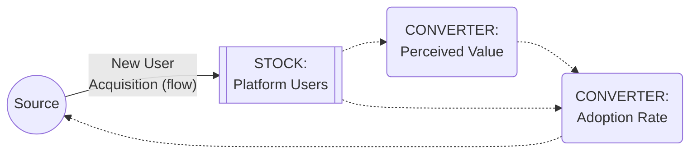

## Translating Causal Loops into Stock and Flow Structures

### Definition and Core Concept

Translating causal loops into stock and flow structures is the formal bridging discipline connecting the qualitative Causal Loop Diagram (CLD) chapter to the quantitative Stock and Flow Diagram (SFD) chapter: the systematic procedure for taking an already-validated CLD — with its identified variables, labeled polarities, traced and named loops — and re-expressing it as a complete stock-flow-converter structure capable of numerical simulation. This translation is necessary precisely because a CLD, by design, omits the information (which variables accumulate, what the specific functional form of each relationship is, what units apply) that a runnable simulation model requires, as established across the corresponding CLD-chapter and stocks-flows-converters reference materials.

This topic treats translation as a distinct, rule-governed skill rather than an informal redrawing exercise, because a naive or careless translation can silently alter a diagram's loop structure, introduce unit inconsistencies, or misclassify a variable's stock-vs-converter status — errors that would not be visible in the qualitative CLD but would produce an invalid or misleading quantitative model.

### Step 1: Classify Every CLD Variable as a Stock or a Converter

**Key Points**

- Apply the bathtub test (from the stocks-and-flows reference material) to every variable in the source CLD: does this variable's current value depend on its own value at a prior instant, accumulated via some net rate of change? If yes, it is a **stock**. If its value is instead fully determined at every instant by other current variables with no dependence on its own past, it is a **converter**.
- **A useful shortcut**: variables that were the *target* of a link whose narrative or mechanism description involves gradual buildup, depletion, "accumulating," "eroding," or persisting over time even if the driving activity stopped, are strong stock candidates. Variables that are ratios, rates, fractions, or instantaneously computed comparisons (a "gap," a "fraction of," a "rate of") are strong converter candidates.
- **[Inference]** Because the CLD notation itself does not formally distinguish stocks from converters (both simply appear as plain nodes with $+/-$ links), this classification step is where a translator's domain judgment is most consequential, and disagreement about a specific variable's classification (particularly for "soft" quantities like trust, morale, or reputation — see the corresponding discussion in the stocks-flows-converters reference material) is common and should generally be resolved by explicit reference to the bathtub test rather than by convention or intuition alone.

### Step 2: Convert Every Reinforcing/Balancing Loop's Constituent Links into Flow and Converter Relationships

**Key Points**

- For each stock identified in Step 1, identify which of its incoming/outgoing CLD links represent an actual **material or logical transfer into or out of that stock** (these become flows) versus which represent an **informational dependency** used to compute a flow's rate or a converter's value (these become dashed information links to converters).
- A CLD link that runs *directly into* a stock variable (per Step 1's classification) from another stock or an external source becomes, or is mediated by, a **flow**. A CLD link that runs into a *converter* variable, or that represents a stock's value being read to help compute some other quantity, becomes an **information link**.
- The **polarity of the original CLD link constrains, but does not by itself fully specify, the corresponding flow or converter equation** — a positive CLD link ($+$) requires that the resulting quantitative relationship's partial derivative be positive at the CLD's assumed operating range, but the translator must still supply an actual functional form (a proportional relationship, a lookup function, a fixed increment) consistent with that required sign, since the CLD alone never specified the functional form.

### Worked Example: Translating the Reinforcing Loop "R1: Word-of-Mouth Growth Engine"

**Example**

Recall the CLD reinforcing loop from the purpose-and-uses reference material: Platform Users →(+)→ Perceived Value →(+)→ Adoption Rate →(+)→ Platform Users.

**Step 1 classification**: "Platform Users" is a clear stock (accumulates via the bathtub test — it persists and only changes through hiring/churn-like additions and removals). "Perceived Value" and "Adoption Rate" are converters — Perceived Value is an instantaneous function of current Platform Users (no independent memory of its own beyond what Platform Users already encodes), and Adoption Rate is a computed rate, not itself an accumulation.

**Step 2 translation**:

- Platform Users (**stock**), inflow = New User Acquisition (this is the flow corresponding to the original CLD link "Adoption Rate →(+)→ Platform Users," now made explicit as a material inflow rather than an abstract CLD arrow).
- "Perceived Value" (**converter**) = some increasing function of Platform Users (e.g., Perceived Value = Network Value Coefficient × ln(Platform Users), reflecting a diminishing-returns network-value assumption *not stated in the original CLD*, and therefore an assumption the translator must make explicit and flag as an addition beyond what the qualitative diagram specified).
- "Adoption Rate" (**converter**, feeding the flow) = Perceived Value × Adoption Sensitivity Constant.
- New User Acquisition (**flow**) = Adoption Rate × Platform Users (or some similarly specified functional combination — again, a translator-supplied functional form consistent with, but not uniquely determined by, the original CLD's simple $+$ polarity label).

This worked translation makes explicit a critical general point: **the CLD's simple three-link reinforcing loop required the translator to introduce a specific, non-trivial functional form (a logarithmic network-value assumption) that the original qualitative diagram never specified**, illustrating that translation is not a mechanical relabeling exercise but an act of additional, explicit modeling judgment layered on top of the CLD's more limited qualitative claims.

### Step 3: Verify Loop Preservation

**Key Points**

- After translating every variable and link, **re-trace the resulting SFD's implied feedback loops** (following material flows and their information-link dependencies back to the governing stocks, per the loop-tracing method in the tracing-and-naming reference material) and confirm the same set of loops, with the same reinforcing/balancing classifications, is reproduced as in the original CLD.
- **A mismatch here is diagnostic, not merely inconvenient**: if the translated SFD does not reproduce a loop present in the original CLD, this typically indicates either an incorrect stock/converter classification in Step 1 (e.g., a variable that should have been a stock was instead modeled as a memoryless converter, structurally breaking the loop's ability to close over time) or a dropped/misdirected link during Step 2's flow-vs-information-link assignment.
- Conversely, if the translated SFD produces an *additional* loop not present in the original CLD, this may indicate the translator inadvertently introduced an unintended dependency (e.g., a converter accidentally referencing a stock it should not have been connected to) that should be reviewed and likely removed, unless it reflects a deliberate, explicitly-flagged extension of the original qualitative model.

### Handling Balancing Loops in Translation: The Gap-to-Goal Pattern

**Example**

Translating the thermostat balancing loop (Room Temperature →(-)→ Gap to Setpoint →(+)→ Heater Output →(+)→ Room Temperature, from the balancing-loop reference material) follows the standard **gap-to-goal converter pattern** introduced in the stocks-flows-converters reference material: Room Temperature is the stock; "Gap to Setpoint" becomes a converter computed as Setpoint (a constant converter) minus Room Temperature (read via an information link from the stock); "Heater Output" becomes a converter (or the flow itself) computed as a function of the Gap converter, typically proportional (Heater Output = Gap × Responsiveness Constant) for a simple proportional-control translation, though a more sophisticated translation could use a lookup-function converter to represent a nonlinear or capacity-capped heater response. This gap-to-goal converter pattern is the standard, broadly reusable translation template for any balancing loop whose CLD structure follows the "stock, compared to a goal, driving a corrective flow" narrative — which, per the balancing-loop reference material, is the generic structure underlying essentially all balancing loops.

### Handling Delays During Translation

As established in the delays reference material, a delay mark (‖) on a CLD link signals that the corresponding translated structure should include an explicit intermediate stock representing the delayed/smoothed quantity, rather than a direct memoryless converter — per the standard first-order or higher-order exponential delay implementation detailed in the stocks-flows-converters reference material. **Failing to introduce this intermediate stock during translation — instead directly wiring the delayed CLD link as an undelayed converter dependency — silently removes the delay from the resulting quantitative model**, which per the delays reference material can eliminate the very oscillatory or overshoot behavior the original CLD's delay mark was specifically intended to flag as a risk. This is among the most consequential translation errors precisely because it produces a structurally plausible-looking SFD that nonetheless fails to reproduce a dynamically important feature of the source diagram.

### Translation Checklist

1. Every CLD variable has been explicitly classified as a stock or a converter using the bathtub test, with disagreements resolved by explicit reference to that test rather than intuition.
2. Every stock has at least one explicitly specified flow (material inflow or outflow) — not merely an information link — consistent with the completeness check in the building-SFDs reference material.
3. Every converter's governing equation is fully specified, using only stocks, other converters, and genuine constants already present in the model, per the same completeness check.
4. Every CLD link marked with a delay (‖) has been translated into an explicit intermediate stock representing that delay, not a direct memoryless converter dependency.
5. The translated SFD's traced feedback loops match the original CLD's loops in both structure and reinforcing/balancing classification; any discrepancy has been investigated and resolved.
6. Any functional form, lookup relationship, or specific equation introduced during translation that was not explicitly specified in the original CLD has been flagged as a translator-added assumption, per the epistemic-labeling discipline of distinguishing what the source diagram actually specified from what the translator supplied to make simulation possible.

### Common Pitfalls

- **Misclassifying a stock as a converter**, which structurally eliminates that variable's memory and can silently break a loop's ability to close and produce feedback dynamics over simulated time, even though the loop still visually appears connected in the diagram.
- **Silently dropping a delay mark during translation**, producing a quantitative model that fails to reproduce oscillatory or overshoot dynamics the original qualitative CLD had specifically flagged as a risk.
- **Treating the CLD's simple $+/-$ polarity as sufficient specification for the translated equation**, when in fact the translator must supply an actual functional form and should explicitly flag this as an added assumption rather than presenting it as though it were already fully determined by the qualitative diagram.
- **Failing to re-verify loop preservation after translation**, missing either a broken loop (from a stock/converter misclassification) or an unintended new loop (from an inadvertent converter dependency) introduced during the translation process.
- **Under-specifying balancing loops by omitting the explicit gap-to-goal converter structure**, instead directly and opaquely wiring the corrective flow to the stock without making the implicit goal/setpoint an explicit, inspectable converter — reducing the resulting model's transparency relative to the standard gap-to-goal translation template.

**Related Topics**

- Stocks, Flows, and Converters
- Building Stock and Flow Diagrams
- Tracing and Naming Feedback Loops
- Delays and Their Effects on System Behavior
- Reinforcing (Positive) Feedback Loops
- Balancing (Negative) Feedback Loops
- Validating and Refining Causal Loop Diagrams
- Purpose and Uses of Causal Loop Diagrams