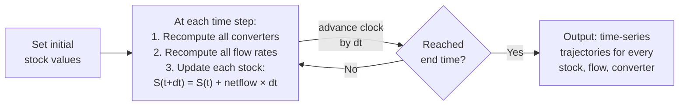

## Simulation and Time-Based Behavior

### Definition and Core Concept

Simulation and time-based behavior refers to the process of numerically executing a completed Stock and Flow Diagram (SFD) — advancing its stocks, flows, and converters forward through discrete or continuous time steps according to their defined equations — and analyzing the resulting quantitative trajectories. Where the preceding reference materials (stocks/flows/converters, building SFDs, translating causal loops into SFDs) address *constructing* a valid, complete quantitative model, this material addresses *running* that model and correctly interpreting what its time-based output reveals, including the numerical-methods considerations that determine whether a simulation's output can be trusted.

Simulation is the step at which a system dynamics model transitions from a static structural specification into an actual dynamic behavior — the numerical trajectories of every stock, flow, and converter over a defined simulation time horizon, from a specified initial condition.

### The Simulation Algorithm: Numerical Integration

A stock's governing equation, $\frac{dS}{dt} = I(t) - O(t)$, is a differential equation; system dynamics software solves it numerically rather than analytically (except in the simplest textbook cases), by discretizing time into small steps $\Delta t$ and repeatedly updating each stock's value.

**Euler's method** (the simplest and historically original approach, used in Forrester's DYNAMO):

$$S(t + \Delta t) = S(t) + \left[I(t) - O(t)\right] \times \Delta t$$

At each time step, every converter and flow is recalculated based on the current stock values, then every stock is updated using its net flow multiplied by the time-step size, and the simulation clock advances by $\Delta t$, repeating until the specified end time is reached.

**Higher-order integration methods** (e.g., **Runge-Kutta 4th order**, commonly available in modern system dynamics software such as Vensim and Stella) achieve substantially greater numerical accuracy for a given step size by evaluating the rate of change at several intermediate points within each time step and combining them in a weighted average, rather than using only the single rate value at the start of the interval as Euler's method does.

### Why Time-Step Size (dt) Matters

**Key Points**

- **Too large a time step** can produce numerically inaccurate results, particularly in systems with fast dynamics, short delays, or strong nonlinear feedback, because the simulation effectively "freezes" the flow rate for the entire step interval even as the true underlying rate is changing continuously within that interval — this can produce spurious oscillation, instability, or inaccurate magnitude in the simulated output that is a numerical artifact rather than a genuine property of the model's structure.
- **[Inference]** A common practical guideline is to set the time step to a small fraction (often cited informally as one-quarter to one-tenth) of the shortest time constant or delay present anywhere in the model, since the numerical error of Euler-style integration methods generally scales with the ratio of the time step to the system's fastest characteristic timescale; the specific safe fraction depends on the chosen integration method's own accuracy properties and the model's particular structure, so this is offered as a general practical heuristic rather than a universally precise rule.
- **Too small a time step** does not introduce structural error but increases computational cost and, in some software implementations, floating-point rounding accumulation over a very large number of steps — a comparatively minor concern relative to the risk of an excessively large step size, and the standard practical guidance is to err toward a smaller step size and verify results are stable (unchanged) under further step-size reduction, a standard numerical-methods good practice sometimes called a step-size convergence check.
- **Testing step-size sensitivity directly** — halving $\Delta t$ and confirming the simulation's output does not meaningfully change — is a standard and low-cost validation step that should be performed before trusting a simulation's quantitative output, particularly for any model containing short delays or strong reinforcing loops with large gains.

### Illustrative Example: Time-Step Sensitivity in a Delayed Balancing Loop

**Example**

Recall the shower-temperature and thermostat delayed-balancing-loop examples from the delays reference material, where a sufficiently long delay relative to the loop's natural adjustment time produces oscillation. **[Inference]** If a simulation's chosen time step $\Delta t$ is itself a large fraction of that same delay time, the simulation can produce oscillation, or oscillation of an incorrect amplitude, purely as a numerical artifact of the discretization — independent of whether the underlying continuous-time model, if solved exactly, would itself genuinely oscillate. This is precisely why a step-size convergence check (re-running with a smaller $\Delta t$ and confirming the output does not change) is essential before attributing observed oscillatory behavior in a simulation's output to the model's actual feedback structure rather than to a numerical integration artifact — conflating the two is a documented pitfall in applied system dynamics practice.

### Reading and Interpreting Time-Based Output

**Key Points**

- **Trajectory shape as the primary diagnostic**: the shape of a stock's plotted value over simulated time — exponential growth, S-curve leveling, overshoot-and-decline, damped oscillation, sustained oscillation, or smooth convergence to equilibrium — is the direct simulated confirmation (or disconfirmation) of the qualitative behavior predicted by the loop-dominance analysis covered in the corresponding reference material.
- **Comparing simulated behavior against the loop-dominance prediction**: if a model contains both a reinforcing and a balancing loop expected to trade dominance over time (per the loop-dominance reference material), the simulation should show early near-exponential growth transitioning to a leveling or declining phase at approximately the point the two loops' algebraic gain terms become comparable — a simulated trajectory that does not show this expected transition suggests either a translation error (see the corresponding reference material) or a genuine and informative discovery that the loops' relative strengths differ from the qualitative expectation.
- **Sensitivity analysis**: systematically varying a single constant converter's value across a plausible range and re-running the simulation for each value reveals how sensitive the model's overall behavior is to that specific parameter, which is standard practice for identifying which converters most strongly determine a model's qualitative behavior pattern (a high-leverage parameter, in the terms of the leverage-points principle) versus which have comparatively little effect on the overall trajectory shape.
- **Equilibrium and steady-state identification**: a simulation reaching a state where all stocks' net flows are zero (or oscillating around a fixed mean with no net long-run drift) identifies the model's dynamic equilibrium, per the equilibrium concept established in the stocks-and-flows reference material — comparing this simulated equilibrium value against any known real-world reference value for the same system is a standard model-validation technique.

### Behavior Pattern Recognition in Simulation Output

| Simulated Trajectory Shape | Likely Underlying Structure | Cross-Reference |
| --- | --- | --- |
| Smooth, accelerating growth with no leveling | Reinforcing loop dominant, no significant countervailing balancing loop in the simulated time horizon | Reinforcing Feedback Loops |
| Growth that decelerates and levels at a ceiling | Reinforcing loop dominant early, balancing loop (approaching a limit/capacity) dominant late | Feedback Loop Dominance and Shifts Over Time |
| Growth that overshoots a ceiling, then declines sharply | Delayed balancing loop failed to constrain a reinforcing loop before the true limit was exceeded | Delays and Their Effects on System Behavior |
| Smooth, non-oscillating convergence to a setpoint | Balancing loop with negligible delay relative to the loop's adjustment time | Balancing Feedback Loops |
| Oscillation converging (damping) toward a setpoint over time | Balancing loop with moderate delay relative to adjustment time | Delays and Their Effects on System Behavior |
| Sustained or growing oscillation with no convergence | Balancing loop with delay large relative to adjustment time, or insufficiently damped coupled stock-pair (e.g., predator-prey) | Delays and Their Effects on System Behavior |

### Distinguishing Genuine Model Behavior from Simulation Artifacts

**[Unverified]** Beyond time-step sensitivity, other simulation artifacts practitioners should rule out before interpreting output as a genuine finding include: initial-condition sensitivity (re-running with slightly perturbed starting stock values to check whether the qualitative behavior pattern is robust, or whether it depends on an arbitrarily chosen initial value in a way that should be flagged); integration-method sensitivity (comparing Euler-method output against a higher-order method like Runge-Kutta 4 for the same model and step size, to rule out method-specific artifacts, particularly in models with strong nonlinearity or stiff dynamics); and unit or scaling errors that happen to produce a plausible-looking but quantitatively meaningless trajectory. **The general practice recommendation is that no single simulation run, on its own, should be treated as a validated finding** — some combination of step-size convergence checking, sensitivity analysis, and comparison against the qualitative loop-dominance and CLD-stage expectations is standard due diligence before drawing substantive conclusions, though the specific combination and rigor of checks considered sufficient varies by field, by the stakes of the decision the model is meant to inform, and by practitioner convention.

### Practical Workflow for Running and Interpreting a Simulation

1. **Set initial stock values** based on the best available real-world reference data, or, for purely illustrative/exploratory models, a clearly documented and explicitly flagged assumed starting point.
2. **Select an appropriate time step**, informed by the shortest delay or fastest dynamic present in the model, and confirm via a step-size convergence check that the chosen value is small enough to avoid numerical artifacts.
3. **Run the simulation across a time horizon long enough to reveal the full behavior pattern of interest** — a horizon too short may cut off a slower-developing balancing loop's eventual dominance, misleadingly suggesting unconstrained growth continues indefinitely.
4. **Plot every relevant stock, and key flows/converters, over time**, not only the single "headline" variable of primary interest, since examining the supporting converters and flows is often what reveals *why* a given trajectory shape emerged.
5. **Compare the resulting trajectory shapes against the pattern-recognition table above** and against the qualitative loop-dominance expectations established during the model's construction, investigating any discrepancy as a potential translation error, numerical artifact, or genuine and informative finding.
6. **Conduct sensitivity analysis on key constant converters** to identify which parameters most strongly drive the model's qualitative behavior, supporting subsequent leverage-point and policy-intervention reasoning.

### Common Pitfalls

- **Accepting a single simulation run's output as validated without a step-size convergence check**, risking that an observed oscillation, overshoot, or instability is a numerical artifact of an excessively large time step rather than a genuine property of the modeled system's structure.
- **Running the simulation over too short a time horizon**, missing a slower balancing loop's eventual dominance and mistakenly concluding the modeled system exhibits unconstrained growth.
- **Interpreting a single simulation run under one set of initial conditions or parameter values as fully representative**, without sensitivity or initial-condition-perturbation testing to check the robustness of the observed qualitative pattern.
- **Failing to cross-check simulated behavior against the qualitative loop-dominance and CLD-stage predictions** established earlier in the modeling process, missing an opportunity to catch a translation error (per the corresponding reference material) before drawing conclusions from the simulation's output.
- **Treating quantitatively precise-looking simulation output as more certain than the underlying model's assumptions warrant**, particularly for converters whose functional form was a translator-supplied assumption (per the translating-causal-loops reference material) rather than an empirically well-established relationship.

**Related Topics**

- Stocks, Flows, and Converters
- Building Stock and Flow Diagrams
- Translating Causal Loops into Stock and Flow Structures
- Feedback Loop Dominance and Shifts Over Time
- Delays and Their Effects on System Behavior
- Nonlinearity and Threshold Effects
- System Dynamics Simulation Software (e.g., Vensim, Stella)
- Sensitivity Analysis and Model Validation