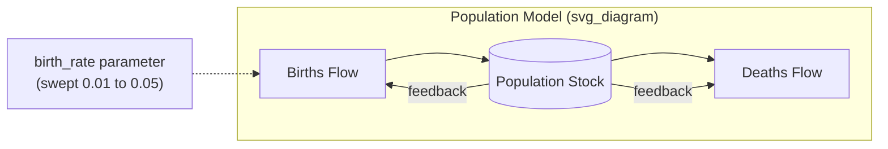
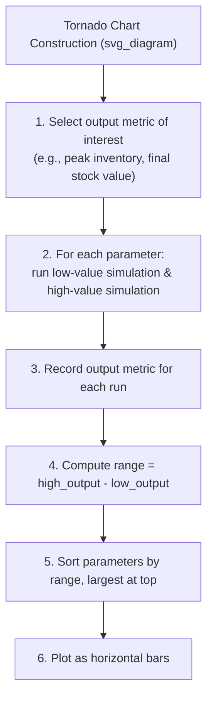
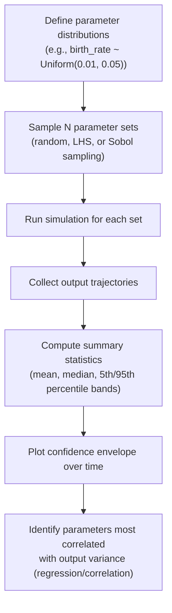
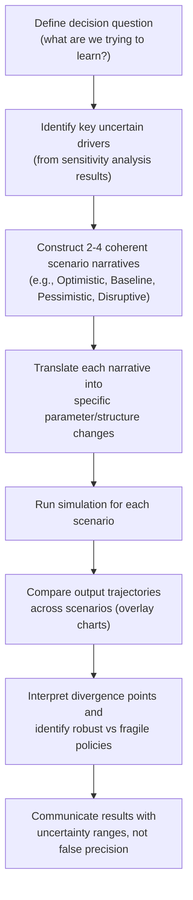
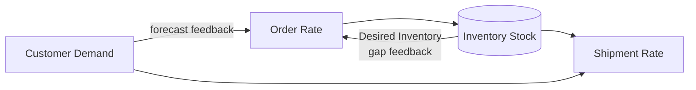

## Sensitivity Analysis and Scenario Testing

### Overview

Sensitivity analysis and scenario testing are complementary validation and exploration techniques used within System Dynamics (SD) modeling to understand how a stock-and-flow model's behavior responds to changes in parameters, initial conditions, and structural assumptions. Sensitivity analysis asks "how much does the output change when an input changes?" while scenario testing asks "what happens under this specific, internally consistent set of conditions?" Together they transform a stock-and-flow model from a fixed simulation into a tool for exploring uncertainty, robustness, and policy design.

### Why This Matters in System Dynamics

Stock-and-flow models accumulate values over time through feedback loops, so small parameter changes can produce disproportionate effects due to nonlinearities, delays, and loop dominance shifts. Unlike static models, SD models can exhibit threshold behavior, oscillation, or regime change when a parameter crosses a critical value. Sensitivity analysis and scenario testing are therefore not optional add-ons but core parts of the modeling lifecycle, used to:

- Identify which parameters most strongly drive model behavior (leverage points)
- Reveal structural weaknesses or unrealistic assumptions
- Build confidence in model validity before using it for policy analysis
- Communicate uncertainty to decision-makers instead of presenting false precision
- Detect tipping points where loop dominance shifts (e.g., reinforcing loop overtaking a balancing loop)

### Distinguishing Sensitivity Analysis from Scenario Testing

| Aspect | Sensitivity Analysis | Scenario Testing |
| --- | --- | --- |
| Question asked | How does output respond to a parameter change? | What happens under a specific plausible future? |
| Number of parameters varied | Usually one or a few, systematically | Multiple parameters varied together, coherently |
| Purpose | Model validation, identifying leverage points | Policy design, strategic planning, storytelling |
| Typical output | Sensitivity curves, tornado charts, elasticity values | Comparative time-series trajectories across scenarios |
| Underlying logic | Statistical/numerical exploration | Narrative-driven, internally consistent parameter sets |

### Types of Sensitivity Analysis

**1. Numerical (Parameter) Sensitivity**

Varying a single numeric parameter (e.g., a growth rate, delay time, or table function value) across a plausible range while holding all else constant, then observing changes in key output variables over time.

**2. Structural Sensitivity**

Testing whether changing the model's structure itself (adding/removing a feedback loop, changing a delay from first-order to third-order, switching a linear relationship to a nonlinear one) changes the qualitative behavior mode (e.g., from growth to oscillation).

**3. Behavioral (Mode) Sensitivity**

Checking whether the *pattern* of behavior (exponential growth, S-shaped growth, overshoot-and-collapse, oscillation) changes, not just the *magnitude* of the output. This is often more important than numerical sensitivity in SD because policy conclusions frequently hinge on behavior mode, not exact values.

**4. One-at-a-Time (OAT) Sensitivity**

Each parameter is varied independently while others are held at baseline (nominal) values. Simple to interpret but cannot detect interaction effects between parameters.

**5. Multivariate / Combinatorial Sensitivity**

Multiple parameters are varied simultaneously, often via Monte Carlo sampling, Latin Hypercube Sampling (LHS), or full factorial design, to capture interaction effects and joint uncertainty.

### Core Techniques

#### 1. Univariate Sensitivity Sweeps

The simplest method: run the simulation repeatedly across a range of values for one parameter, and plot the resulting output trajectories overlaid on a single chart ("sensitivity fan" or "confidence bounds" chart).

**Example (pseudocode logic for a simple population stock-flow model):**

For a stock defined as:

$$\frac{dP}{dt} = b \cdot P - d \cdot P$$

where $b$ is the birth rate and $d$ is the death rate, a sensitivity sweep would run the simulation for $b \in \{0.01, 0.02, 0.03, 0.04, 0.05\}$ while holding $d$ constant, then compare the resulting $P(t)$ trajectories.

**Interpretation guide:**

- If trajectories fan out slowly and stay ordered → low-to-moderate sensitivity
- If trajectories cross or reorder → possible loop dominance switch
- If small parameter changes cause qualitatively different end-states → high structural sensitivity, a red flag for model robustness

#### 2. Tornado Diagrams

Used to rank parameters by the magnitude of their effect on a single output metric (e.g., peak value, final value, time-to-threshold). Each parameter is varied independently across its plausible min/max range (often ±10-20% or based on empirical uncertainty), and the resulting change in the output metric is plotted as a horizontal bar, sorted by effect size.

**Key Points**

- Tornado diagrams assume independence between parameters (no interaction effects captured)
- Best used early in model validation to identify which 3-5 parameters deserve deeper investigation
- Does not show *how* the output varies (linear, threshold, oscillatory) — only the *range*

#### 3. Elasticity Analysis

Quantifies sensitivity as a normalized, unit-free measure, allowing comparison across parameters with different units and scales.

$$E_{x,p} = \frac{\partial x / x}{\partial p / p} \approx \frac{(\Delta x / x)}{(\Delta p / p)}$$

where $E_{x,p}$ is the elasticity of output $x$ with respect to parameter $p$. An elasticity of 1.0 means a 1% change in the parameter produces a 1% change in the output; values greater than 1 indicate amplification (often a sign of reinforcing loop dominance), values near zero indicate the output is buffered (often a sign of balancing loop dominance or a saturating nonlinearity).

#### 4. Monte Carlo Sensitivity Analysis

Parameters are assigned probability distributions (uniform, normal, triangular, etc.) reflecting genuine uncertainty, and the model is run hundreds or thousands of times with randomly sampled parameter combinations. Outputs are then summarized as distributions (mean, percentiles, confidence bands) rather than single trajectories.

**Latin Hypercube Sampling (LHS)** is commonly preferred over pure random (Monte Carlo) sampling because it stratifies the parameter space, achieving good coverage with fewer runs — an efficiency gain that is well-documented and standard practice in SD software such as Vensim, Stella, and AnyLogic.

#### 5. Sobol / Variance-Based Global Sensitivity Analysis

A more rigorous multivariate technique that decomposes output variance into contributions from each parameter individually (first-order index) and from parameter interactions (total-order index). More computationally expensive but captures nonlinear interaction effects that OAT and tornado methods miss entirely.

$$S_i = \frac{\text{Var}[E(Y|X_i)]}{\text{Var}(Y)}$$

where $S_i$ is the first-order sensitivity index for parameter $X_i$, and $Y$ is the model output. [Unverified] The exact computational cost scales with the specific Sobol estimator implementation and number of parameters, so practical run counts should be confirmed against the chosen software's documentation.

### Scenario Testing

#### Purpose and Philosophy

While sensitivity analysis is largely a numerical exercise, scenario testing is a narrative-driven exercise: it constructs internally consistent "stories" about the future (or about alternative pasts) and tests how the system behaves under each. Scenarios typically bundle multiple parameter and structural changes together in a way that reflects a coherent real-world condition, rather than isolating one variable at a time.

#### Common Scenario Types in SD

**1. Baseline / Business-as-Usual (BAU) Scenario**

The reference trajectory assuming current trends, policies, and relationships continue unchanged. Serves as the comparison point for all other scenarios.

**2. Extreme Condition Tests**

Setting a parameter or stock to a boundary or physically extreme value (e.g., zero, infinity-approximation, or an implausibly high number) to verify the model behaves sensibly. This is a core model-validation technique in SD (originating from Forrester and Barlow-style validation protocols).

**Example extreme condition test:**

If "Workforce" is a stock and "Hiring Rate" depends on "Available Budget," setting Available Budget to zero should drive Hiring Rate to zero — not negative, and not undefined. If the model produces a negative workforce or a division-by-zero error, this reveals a structural flaw (commonly a missing `MAX()`/`MIN()` clamp or an unguarded division).

**3. Policy Scenarios**

Testing the effect of a proposed intervention (a new policy, investment, regulation, or operational change) by altering the relevant parameters, table functions, or structure that represent that policy, then comparing against baseline.

**4. Structural (What-If) Scenarios**

More radical than policy scenarios — these test alternative causal structures entirely (e.g., "what if customers' word-of-mouth adoption is replaced by advertising-driven adoption?"), often requiring rewiring the causal loop diagram itself.

**5. Combined/Compound Scenarios**

Bundling multiple simultaneous changes (e.g., "recession + supply shock + policy response") to explore compounding or offsetting effects — closer to real-world complexity than single-variable tests.

#### Scenario Construction Workflow

**Key Points**

- Good scenario sets typically span a small number (2-5) of clearly differentiated, plausible futures — too many scenarios dilute decision clarity
- Scenarios should be internally consistent: don't combine "high economic growth" with "collapsing consumer demand" unless a specific causal argument justifies it
- Scenario testing works best when informed by prior sensitivity analysis — sensitivity findings tell you *which* parameters are worth building scenarios around

### Worked Example: Inventory-Supply Chain Model

Consider a simplified stock-and-flow structure:

**Base equations:**

$$\text{Inventory}(t) = \text{Inventory}(t-1) + (\text{Order Rate} - \text{Shipment Rate}) \cdot \Delta t$$

$$\text{Order Rate} = \text{Expected Demand} + \frac{(\text{Desired Inventory} - \text{Inventory})}{\text{Adjustment Time}}$$

**Sensitivity analysis applied:** Sweep `Adjustment Time` from 2 to 12 weeks.

- Short adjustment times (2-4 weeks) → aggressive correction → risk of oscillation (the classic "bullwhip effect")
- Long adjustment times (10-12 weeks) → sluggish correction → sustained stockouts or overstock during demand shifts
- **Output:** A tornado-style comparison would likely show `Adjustment Time` as a top driver of inventory volatility (amplitude of oscillation), while `Expected Demand` forecast error might dominate average inventory *level* deviation. [Inference] The relative ranking depends on the specific numeric ranges and demand pattern used, so this ordering should be confirmed via simulation, not assumed from structure alone.

**Scenario testing applied:**

| Scenario | Demand Pattern | Adjustment Time | Supplier Lead Time |
| --- | --- | --- | --- |
| Baseline | Stable, seasonal | 6 weeks | 4 weeks |
| Demand Surge | +40% step increase | 6 weeks | 4 weeks |
| Supply Disruption | Stable | 6 weeks | 12 weeks |
| Compound Shock | +40% step increase | 6 weeks | 12 weeks |

Running all four scenarios and overlaying the Inventory stock trajectory reveals whether the system can absorb a demand surge alone, a supply disruption alone, or whether the *combination* produces disproportionate (nonlinear) stockouts — a classic system dynamics insight that would be invisible from sensitivity analysis alone, since sensitivity analysis typically isolates variables one at a time.

### Illustrative Sensitivity Fan Chart (Conceptual)

<svg xmlns="http://www.w3.org/2000/svg" viewBox="0 0 640 360">
<text x="20" y="24" font-size="16" font-weight="bold" fill="#222">Inventory Sensitivity Fan across Adjustment Time (svg_diagram)</text>
<line x1="60" y1="300" x2="600" y2="300" stroke="#333" stroke-width="2" />
<line x1="60" y1="300" x2="60" y2="40" stroke="#333" stroke-width="2" />
<text x="300" y="330" font-size="13" fill="#333">Time (weeks)</text>
<text x="15" y="170" font-size="13" fill="#333" transform="rotate(-90 15,170)">Inventory Level</text>
<path d="M60,260 Q200,60 340,220 T600,200" fill="none" stroke="#c0392b" stroke-width="2" />
<path d="M60,260 Q200,140 340,230 T600,235" fill="none" stroke="#e67e22" stroke-width="2" />
<path d="M60,260 Q200,220 340,245 T600,250" fill="none" stroke="#2980b9" stroke-width="2" />
<path d="M60,260 Q200,250 340,255 T600,260" fill="none" stroke="#27ae60" stroke-width="2" />
<line x1="450" y1="60" x2="470" y2="60" stroke="#c0392b" stroke-width="3" />
<text x="475" y="64" font-size="12" fill="#333">Adjustment Time = 2 wks (oscillatory)</text>
<line x1="450" y1="80" x2="470" y2="80" stroke="#e67e22" stroke-width="3" />
<text x="475" y="84" font-size="12" fill="#333">Adjustment Time = 4 wks</text>
<line x1="450" y1="100" x2="470" y2="100" stroke="#2980b9" stroke-width="3" />
<text x="475" y="104" font-size="12" fill="#333">Adjustment Time = 8 wks</text>
<line x1="450" y1="120" x2="470" y2="120" stroke="#27ae60" stroke-width="3" />
<text x="475" y="124" font-size="12" fill="#333">Adjustment Time = 12 wks (sluggish)</text>
</svg>

### Software and Tooling Notes

Most dedicated SD environments (Vensim, Stella/iThink, AnyLogic, Powersim, and the open-source PySD library) provide built-in sensitivity analysis tools:

- **Vensim**: `SyntheSim` mode for real-time slider-based sensitivity, plus formal Monte Carlo sensitivity via "Sensitivity Simulation Setup" (`.vsc` files), producing confidence bound plots directly.
- **Stella/iThink**: Sensitivity Specs dialog allows parameter ranges and step counts; supports batch runs with automatic comparative graphing.
- **AnyLogic**: Supports parameter variation experiments and Monte Carlo experiments as built-in experiment types, plus optimization experiments that can be adapted for sensitivity exploration.
- **PySD (Python)**: Since PySD translates Vensim/Stella models into Python, standard Python scientific stacks (NumPy, pandas, SALib for Sobol/Morris analysis) can be used for arbitrarily sophisticated global sensitivity analysis. [Unverified] Specific API signatures should be checked against the current PySD and SALib documentation, as these libraries evolve.

### Common Pitfalls

**Key Points**

- **Confusing parameter sensitivity with policy relevance**: A highly sensitive parameter isn't automatically a good leverage point if it's not controllable in reality (e.g., "global birth rate" is sensitive but not a policy lever for a single firm's model)
- **OAT blindness to interactions**: One-at-a-time sensitivity can completely miss cases where two parameters together produce emergent behavior that neither produces alone
- **Overfitting scenario narratives to desired conclusions**: Constructing scenarios that are designed to prove a predetermined point rather than genuinely explore uncertainty
- **Ignoring behavior-mode sensitivity**: Focusing only on numeric sensitivity of endpoint values while missing that the underlying behavior mode (e.g., growth vs. collapse) flips somewhere in the tested range
- **Excessive scenario proliferation**: Running dozens of scenarios without a clear decision framework, producing analysis paralysis rather than clarity
- **Treating single deterministic runs as forecasts**: SD models are best understood as tools for exploring structural dynamics and relative policy comparisons, not as precise point-forecasting instruments; behavior may vary substantially with model boundary and calibration choices, so avoid presenting sensitivity/scenario outputs as guaranteed real-world outcomes

### Best Practices Checklist

1. Run extreme condition tests before trusting any sensitivity results — a model that breaks at boundaries invalidates interior sensitivity findings too
2. Prioritize behavior-mode sensitivity checks alongside numeric sensitivity
3. Use tornado diagrams for quick screening, then follow up high-impact parameters with full-range sweeps
4. Prefer Latin Hypercube or Sobol sampling over pure random Monte Carlo when computational budget allows, for better parameter-space coverage
5. Build scenarios around findings from sensitivity analysis, not independently of them
6. Always present outputs as ranges/bands or comparative trajectories rather than single-point predictions
7. Document the plausible range and justification for every parameter varied, to make the analysis auditable and reproducible

**Related Topics**

- Model Validation and Verification Techniques in System Dynamics
- Extreme Condition Testing and Boundary Adequacy Tests
- Loop Dominance Analysis and Eigenvalue Elasticity Analysis
- Monte Carlo Simulation and Latin Hypercube Sampling
- Policy Design and Leverage Point Identification (Meadows' Framework)
- Structural Validity Testing vs. Behavioral Validity Testing
- Table Functions and Nonlinear Relationship Calibration
- PySD and SALib for Python-Based Sensitivity Analysis
- Bullwhip Effect in Supply Chain System Dynamics Models
- Confidence Bound Visualization and Uncertainty Communication