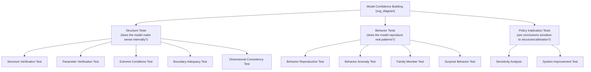
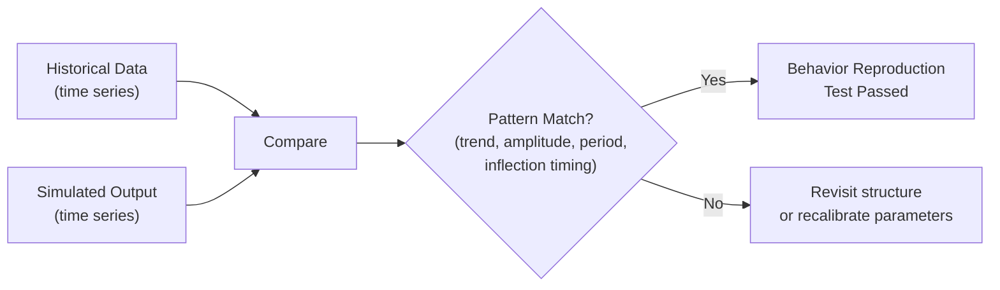
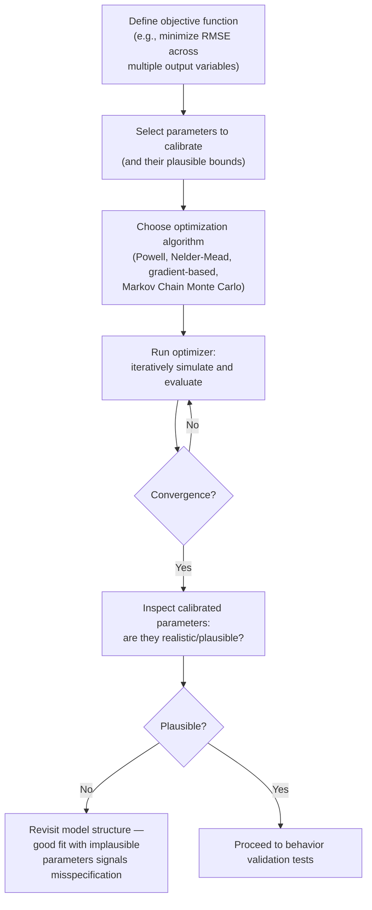
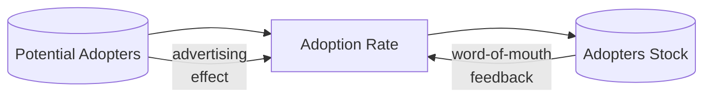

## Model Validation and Calibration

### Overview

Model validation and calibration are the disciplined processes by which a stock-and-flow System Dynamics (SD) model is tested for structural soundness and tuned so its numerical outputs align with observed or expected reality. Validation asks "is this model an adequate representation of the system for its intended purpose?" while calibration asks "what parameter values make this model's behavior best match empirical data?" In SD, validation is not a single pass/fail test but an ongoing, iterative confidence-building process, since no model can be proven "true" — only judged fit for a given purpose.

### Validation vs. Calibration: Conceptual Distinction

| Aspect | Validation | Calibration |
| --- | --- | --- |
| Core question | Is the model structurally and behaviorally credible? | What parameter values best fit the data? |
| Nature | Qualitative and quantitative tests of confidence | Primarily numerical optimization/estimation |
| Timing | Continuous, throughout model lifecycle | Typically after structure is validated |
| Failure mode if skipped | Structurally wrong model used for policy | Right structure, wrong numbers, misleading magnitudes |
| Typical tools | Structure tests, extreme conditions, behavior reproduction | Least-squares fitting, optimization, Kalman filtering |

### The Forrester–Senge Validation Philosophy

System Dynamics validation, following Forrester and Senge's foundational framework, rejects the idea of a single confirmatory test. Instead, confidence is built cumulatively through many partial tests, each targeting a different potential source of model inadequacy. A model is never "validated" in an absolute sense — it is judged "adequate for purpose" after surviving a battery of structural and behavioral tests.

### Structure-Oriented Validation Tests

#### 1. Structure Verification Test

Checks that the model's structure (stocks, flows, feedback loops, causal links) corresponds to the best available knowledge of the real system's structure — verified against domain expertise, field observation, or documented mechanisms, not just statistical fit to output data.

**Key Points**

- A model can fit historical data perfectly ("curve-fitting") while having completely wrong internal structure — this is the central danger structure verification guards against
- Requires collaboration with domain experts who understand the real causal mechanisms, not just modelers

#### 2. Parameter Verification Test

Confirms that each parameter corresponds to a real, identifiable, and (ideally) measurable concept, and that its numeric value and units are consistent with real-world data, expert judgment, or established literature — as opposed to being a purely "fitted" abstract constant with no referent in reality.

**Example:** If a model includes a parameter called `Average Employee Tenure`, parameter verification asks: does this correspond to a measurable HR statistic? Is the value used (e.g., 3.5 years) consistent with the organization's actual attrition data, or was it arbitrarily chosen to make the simulation output look right?

#### 3. Dimensional Consistency Test

Every equation in the model must balance dimensionally — the units on both sides of every equation must match. Most SD software (Vensim, Stella) includes automated unit-checking utilities that flag inconsistencies.

**Example:**

$$\text{Hiring Rate} \left[\frac{\text{people}}{\text{month}}\right] = \frac{\text{Vacancy Gap} \left[\text{people}\right]}{\text{Time to Fill Vacancy} \left[\text{month}\right]}$$

If a modeler accidentally divides by a dimensionless fraction instead of a time constant, the units fail to resolve to a rate, signaling a structural bug — often before any simulation is even run.

#### 4. Extreme Conditions Test

Sets input parameters or stock initial values to extreme, boundary, or physically implausible values (zero, very large, or negative-adjacent) to verify the model still produces sensible, boundable behavior. This test operates at the structural level and is a prerequisite for trusting any subsequent calibration.

**Example:** In an inventory model, if `Customer Demand` is set to zero, `Shipment Rate` should fall to zero — not go negative, and `Inventory` should not become undefined. Failure here typically reveals an unguarded division or a missing `MAX(0, ...)` clamp.

#### 5. Boundary Adequacy Test

Evaluates whether the model includes all structure necessary to address the stated purpose — i.e., whether important feedback loops or exogenous-vs-endogenous treatment choices have been wrongly excluded. A model that treats a critical driver as a fixed exogenous input when it is actually influenced by the system's own output ("endogenous" in reality) will systematically miss important dynamics such as delayed feedback or policy resistance.

**Example:** A market-growth model that treats "competitor response" as a fixed constant, when in reality competitors adjust pricing in response to the modeled firm's growth, has a boundary adequacy problem — it excludes a real feedback loop.

### Behavior-Oriented Validation Tests

#### 1. Behavior Reproduction Test

Compares simulated output trajectories against historical/observed data for key variables, checking not just point-by-point numerical fit but whether the model reproduces the *characteristic pattern* of behavior (growth, decline, oscillation, S-curve, overshoot).

#### 2. Behavior Anomaly Test

Deliberately removes or disables a structural component (e.g., a feedback loop or delay) to check whether the model then produces implausible or absurd behavior — confirming that the removed structure was necessary and functioning correctly, not incidental.

#### 3. Family Member Test

Assesses whether the model, with only parameter changes (not structural changes), can reproduce the behavior of other members of the same "family" of systems — e.g., a generic supply chain oscillation model should be able to represent multiple different companies' inventory dynamics by adjusting parameters alone, without needing structural rewrites.

#### 4. Surprise Behavior Test

Occurs when a model — while being explored for other purposes — produces previously unanticipated behavior that, upon investigation, turns out to correspond to real, previously unrecognized or unexplained system behavior. This strengthens confidence in the model's structural validity, since the behavior was not "built in" intentionally.

#### 5. Statistical/Time-Series Fit Metrics

While pure numerical fit is never sufficient alone, quantitative agreement is still useful evidence when combined with the qualitative tests above. Common metrics:

$$\text{RMSE} = \sqrt{\frac{1}{n}\sum_{t=1}^{n} (Y_{sim,t} - Y_{obs,t})^2}$$

$$\text{MAPE} = \frac{100\%}{n}\sum_{t=1}^{n} \left| \frac{Y_{obs,t} - Y_{sim,t}}{Y_{obs,t}} \right|$$

**Theil's Inequality Statistics** decompose overall mean-square error into three components, which is particularly valuable in SD because it separates *systematic* error from *random* error:

$$U^M = \frac{(\bar{Y}_{sim} - \bar{Y}_{obs})^2}{\frac{1}{n}\sum(Y_{sim,t}-Y_{obs,t})^2} \quad \text{(bias proportion)}$$

$$U^S = \frac{(S_{sim} - S_{obs})^2}{\frac{1}{n}\sum(Y_{sim,t}-Y_{obs,t})^2} \quad \text{(unequal variation proportion)}$$

$$U^C = \frac{2(1-r)S_{sim}S_{obs}}{\frac{1}{n}\sum(Y_{sim,t}-Y_{obs,t})^2} \quad \text{(unequal covariation proportion)}$$

where $U^M + U^S + U^C = 1$. A high bias proportion ($U^M$) indicates a systematic structural problem (the model is consistently off in one direction), which is a more serious concern than random covariation error, since it points to a specifiable flaw rather than noise.

### Calibration Methodology

#### 1. Manual (Judgmental) Calibration

The modeler iteratively adjusts parameters by hand, guided by domain knowledge and visual comparison against reference data, favored in early-stage SD modeling because it keeps the modeler engaged with *why* a parameter changes behavior, not just *that* it improves fit.

#### 2. Formal Optimization-Based Calibration

Parameters are estimated by minimizing an objective (loss) function — typically sum-of-squared-errors or a Theil-statistic-based composite — between simulated and observed data, using numerical optimization algorithms.

**Key Points**

- Vensim's built-in calibration uses Powell's method or Markov Chain Monte Carlo (MCMC) for multi-parameter optimization with payoff (objective) definitions per variable
- Optimization-based calibration can produce a good numerical fit with implausible parameter values — this is a warning sign, not a success, and should trigger a return to structural verification (see Parameter Verification Test above)
- Multiple parameter combinations can sometimes produce near-identical fits ("equifinality" or parameter non-identifiability), especially in models with compensating feedback loops — sensitivity analysis and confidence intervals on estimated parameters help detect this

#### 3. Bayesian Calibration

Treats parameters as random variables with prior distributions (reflecting existing knowledge/uncertainty), updates them using observed data via Bayes' theorem, producing posterior distributions rather than single point estimates.

$$P(\theta \mid D) = \frac{P(D \mid \theta) \, P(\theta)}{P(D)}$$

where $\theta$ represents the model parameters and $D$ is the observed data. This approach naturally produces calibrated uncertainty ranges alongside best-fit values, which pairs well with the sensitivity/scenario analysis techniques used elsewhere in SD.

#### 4. Kalman Filtering / State Estimation

For models where both parameters and unobserved state variables (stock values) need continuous estimation as new data arrives, Kalman filtering (or its nonlinear extensions, the Extended or Unscented Kalman Filter) provides a recursive estimation framework. [Unverified] Application of Kalman filtering to nonlinear SD models typically requires linearization or the Unscented variant, and specific implementation details should be verified against the modeling software's current capabilities, since native support varies across SD platforms.

### Worked Example: Calibrating a Diffusion (Bass) Model

Consider the classic Bass Diffusion structure for new product adoption:

**Adoption Rate equation:**

$$\text{Adoption Rate} = \left(p + q \cdot \frac{\text{Adopters}}{\text{Total Population}}\right) \cdot \text{Potential Adopters}$$

where $p$ is the coefficient of innovation (advertising-driven adoption) and $q$ is the coefficient of imitation (word-of-mouth adoption).

**Calibration workflow:**

1. Gather historical adoption data (e.g., quarterly sales/subscriptions)
2. Define objective function: minimize sum-of-squared errors between simulated and actual cumulative adopters
3. Set plausible bounds: $p \in [0.001, 0.03]$, $q \in [0.1, 0.6]$ (typical empirical ranges reported in diffusion literature) [Unverified — exact bounds vary by product category and should be checked against the specific empirical study being referenced]
4. Run optimizer (e.g., Nelder-Mead) to find best-fit $p, q$
5. **Validate**, not just calibrate: check whether the fitted $p$ and $q$ are plausible for the product category (a $q$ value implausibly higher than any comparable historical product should trigger scrutiny, not blind acceptance)
6. Run extreme conditions test: set Potential Adopters to zero — Adoption Rate should correctly fall to zero

**Output:** A fitted curve overlay comparing simulated cumulative adopters against actual historical adoption, accompanied by RMSE/MAPE metrics and a Theil decomposition to check whether residual error is systematic (bias) or random (noise).

### Illustrative Calibration Fit Chart (Conceptual)

<svg xmlns="http://www.w3.org/2000/svg" viewBox="0 0 640 340">
<text x="20" y="24" font-size="16" font-weight="bold" fill="#222">Calibrated vs Observed Adoption Curve (svg_diagram)</text>
<line x1="60" y1="280" x2="600" y2="280" stroke="#333" stroke-width="2" />
<line x1="60" y1="280" x2="60" y2="40" stroke="#333" stroke-width="2" />
<text x="290" y="310" font-size="13" fill="#333">Time (quarters)</text>
<text x="15" y="170" font-size="13" fill="#333" transform="rotate(-90 15,170)">Cumulative Adopters</text>
<circle cx="100" cy="260" r="4" fill="#333" />
<circle cx="160" cy="230" r="4" fill="#333" />
<circle cx="220" cy="185" r="4" fill="#333" />
<circle cx="280" cy="140" r="4" fill="#333" />
<circle cx="340" cy="110" r="4" fill="#333" />
<circle cx="400" cy="90" r="4" fill="#333" />
<circle cx="460" cy="78" r="4" fill="#333" />
<circle cx="520" cy="72" r="4" fill="#333" />
<path d="M100,262 C160,232 220,180 280,138 C340,108 400,88 520,74" fill="none" stroke="#2980b9" stroke-width="2.5" />
<line x1="420" y1="60" x2="440" y2="60" stroke="#2980b9" stroke-width="3" />
<text x="445" y="64" font-size="12" fill="#333">Simulated (calibrated)</text>
<circle cx="430" cy="80" r="4" fill="#333" />
<text x="445" y="84" font-size="12" fill="#333">Observed data points</text>
</svg>

### Common Pitfalls

**Key Points**

- **Curve-fitting fallacy**: Achieving low RMSE without structural verification is the single most common validation failure in SD practice — a wrong-structure model can be tuned to fit historical data yet make wildly wrong policy predictions
- **Parameter non-identifiability (equifinality)**: When multiple parameter combinations yield near-identical historical fit, calibration alone cannot distinguish between them; requires additional data, structural tests, or Bayesian priors to resolve
- **Overfitting to noisy historical data**: Especially with many free parameters relative to data points, calibration can chase noise rather than signal — cross-validation (fitting on part of the data, testing on held-out periods) helps detect this
- **Validating only the base case**: A model can pass all behavior tests on historical (baseline) data yet still fail under policy or scenario conditions never observed in the data — this is why validation must be paired with sensitivity analysis and extreme condition tests, not treated as a one-time historical-fit exercise
- **Treating calibration as the finish line**: Calibration tunes numbers; it does not confirm the *structure* is right — structural verification tests must precede and accompany calibration, not follow it as an afterthought
- [Inference] The specific choice of objective function (RMSE vs. MAPE vs. Theil-based composite) can materially change which parameter values are selected as "best fit," so this choice should be documented and justified for the model's specific purpose rather than defaulted to without consideration

### Best Practices Checklist

1. Complete structural tests (verification, extreme conditions, boundary adequacy, dimensional consistency) before investing in formal calibration
2. Never rely on numerical fit alone — always pair with domain-expert review of parameter plausibility
3. Use multiple behavior tests (reproduction, anomaly, family member) rather than a single historical-fit check
4. Document parameter sources (measured data, expert estimate, literature value, or free calibration) transparently for every parameter
5. Check for equifinality by testing whether alternate parameter sets produce comparably good fits
6. Validate against out-of-sample or held-out data where possible, not only the data used for calibration
7. Re-run extreme condition and behavior tests after every calibration pass, since parameter changes can alter model robustness
8. Treat validation as continuous and cumulative — revisit it whenever the model's purpose, boundary, or intended policy application changes

**Related Topics**

- Sensitivity Analysis and Scenario Testing (leverage points feeding calibration priorities)
- Extreme Condition Testing and Boundary Adequacy Tests
- Bass Diffusion Model and Innovation Adoption Dynamics
- Loop Dominance Analysis and Eigenvalue Elasticity Analysis
- Bayesian Parameter Estimation in Dynamic Systems
- Kalman Filtering and State-Space Estimation Methods
- Theil's Inequality Statistics and Time-Series Fit Diagnostics
- Equifinality and Parameter Non-Identifiability in Simulation Models
- PySD, Vensim, and Stella Calibration Toolchains
- Policy Resistance and Structural Validity in System Dynamics