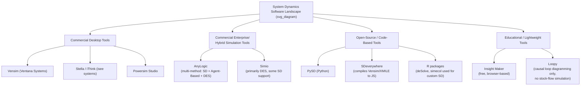
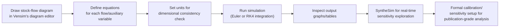
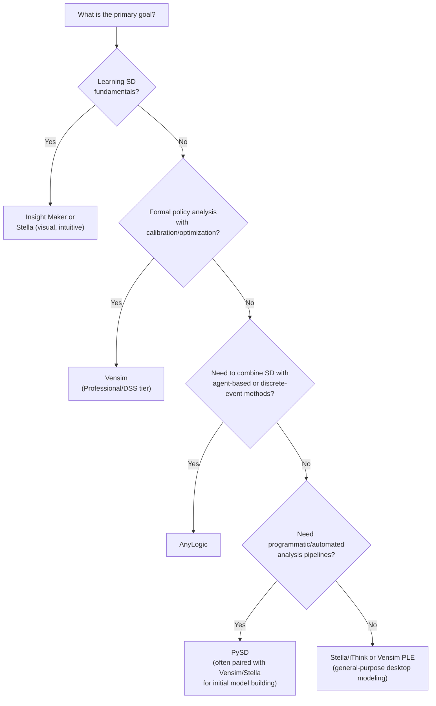

## Introduction to System Dynamics Simulation Software


### Overview

System Dynamics (SD) simulation software provides the computational environment for building stock-and-flow diagrams, defining mathematical relationships between model elements, running time-based simulations, and analyzing results. While SD's conceptual foundations (stocks, flows, feedback loops, delays) are software-agnostic, practical modeling requires a tool that can integrate systems of differential/difference equations over time, visualize causal structure, and support the validation, sensitivity, and calibration workflows used throughout the discipline.

### Why Dedicated SD Software Matters

Stock-and-flow models are fundamentally systems of coupled first-order differential (or difference) equations. While these can technically be solved with general-purpose tools (spreadsheets, Python, MATLAB), dedicated SD software offers advantages specific to the discipline:

- Visual stock-flow diagramming that mirrors the conceptual model directly, reducing translation errors between diagram and equations
- Built-in numerical integration methods (Euler, Runge-Kutta) tuned for SD's typical equation structures
- Native support for delays, table functions (graphical nonlinear relationships), and smoothing functions common in SD
- Automated unit/dimensional consistency checking
- Purpose-built sensitivity analysis, calibration, and optimization tooling (as covered in the "Sensitivity Analysis and Scenario Testing" and "Model Validation and Calibration" topics)
- A modeling paradigm that keeps structure and behavior visually and cognitively linked, supporting the qualitative validation tests central to SD practice

### Landscape of SD Software



### Core Feature Comparison

| Tool | Type | Diagramming | Language/Interface | Sensitivity/Calibration | Best Fit For |
| --- | --- | --- | --- | --- | --- |
| Vensim | Commercial (PLE free tier available) | Stock-flow, causal loop | Proprietary equation editor | Strong: Monte Carlo, MCMC calibration, SyntheSim | Academic research, policy modeling |
| Stella/iThink | Commercial (free trial) | Stock-flow (highly visual) | Built-in expression builder | Sensitivity Specs, batch runs | Education, business process modeling |
| Powersim Studio | Commercial | Stock-flow | Proprietary | Moderate | Corporate/financial simulation |
| AnyLogic | Commercial (free Personal Learning Edition) | Stock-flow + Agent-Based + DES (multi-method) | Java-based | Parameter variation, optimization experiments | Hybrid models combining SD with agent-based or discrete-event simulation |
| PySD | Open-source | None native (imports Vensim/XMILE models) | Python | Full Python ecosystem (SALib, scipy, pandas) | Programmatic/automated analysis, integration with data science pipelines |
| Insight Maker | Free, browser-based | Stock-flow, causal loop, agent-based | Built-in, simplified | Basic sensitivity sweeps | Teaching, quick prototyping, no-install accessibility |

### Vensim (Ventana Systems)

Vensim is one of the most widely used tools in academic and professional SD practice, particularly favored for policy analysis and formal model validation due to its statistical and optimization capabilities.

**Key Points**

- Offers a free "PLE" (Personal Learning Edition) with core stock-flow modeling, and paid tiers (Standard, Professional, DSS) adding optimization, calibration, and Monte Carlo sensitivity
- `SyntheSim` mode allows real-time interactive sensitivity exploration via sliders while the simulation runs continuously in the background
- Native support for formal model calibration using Powell's method or Markov Chain Monte Carlo (MCMC), directly supporting the calibration workflows discussed in model validation practice
- Uses `.mdl` (legacy) and increasingly the open **XMILE** standard for model interchange
- Strong automated documentation and unit-checking features aimed at supporting the structural validation tests central to SD methodology

**Typical Workflow:**



### Stella / iThink (isee systems)

Stella (and its sibling product iThink, aimed more at business process applications) is known for an especially intuitive, highly visual stock-flow interface, making it a common choice in SD education and introductory coursework.

**Key Points**

- Visual metaphor closely mirrors the conceptual stock-flow diagram (tanks for stocks, pipes/valves for flows), lowering the learning curve for newcomers
- Built-in "Sensitivity Specs" dialog allows parameter ranges and step counts to be defined, with automatic batch-run comparison graphs
- Supports hierarchical model structure via "sectors" and modules, aiding large model organization
- Exports to the XMILE open standard, enabling interoperability with other XMILE-compliant tools (including PySD)
- Strong support for graphical/table functions used to represent empirically-derived nonlinear relationships

### AnyLogic

AnyLogic is distinctive as a genuinely multi-method simulation platform: it natively supports System Dynamics, Discrete-Event Simulation (DES), and Agent-Based Modeling (ABM) within a single environment, and — critically — allows these paradigms to be combined in a single hybrid model.

**Key Points**

- SD stock-flow diagrams can directly interact with agent-based populations (e.g., an SD-level "market awareness" stock influencing individual agent purchase decisions)
- Free Personal Learning Edition (PLE) available; commercial licenses required for larger/professional models and cloud deployment
- Built on Java, allowing custom Java code to extend model logic beyond the built-in diagramming primitives
- Parameter Variation and Monte Carlo experiment types built in, alongside optimization experiments (using OptQuest) suitable for both sensitivity analysis and calibration
- Particularly well-suited when a system has both aggregate, continuous dynamics (best captured with stocks/flows) and discrete, heterogeneous entities (best captured with agents) — e.g., epidemiological models combining population-level SD compartments with individual agent contact networks

### PySD: Python-Based SD Modeling

PySD is an open-source Python library that translates System Dynamics models built in Vensim (`.mdl`) or the XMILE standard (`.xmile`, produced by Stella and other compliant tools) into executable Python code, enabling models to run within the broader Python data science ecosystem.

**Key Points**

- Does not provide native visual diagramming — models are typically built in Vensim or Stella first, then imported into PySD for programmatic analysis
- Enables integration with pandas (data handling), NumPy/SciPy (numerical methods), SALib (Sobol/Morris global sensitivity analysis), and matplotlib/Plotly (visualization)
- Well suited for automating large-scale sensitivity analyses, Monte Carlo experiments, and calibration routines that would be cumbersome through a GUI alone
- Facilitates reproducible research workflows (version-controlled model code, scripted analysis pipelines) that align with open-science practices

**Example PySD workflow (illustrative Python usage):**

```python
import pysd
import pandas as pd

# Load a model built in Vensim or Stella (XMILE format)
model = pysd.read_vensim('inventory_model.mdl')

# Run baseline simulation
results = model.run()

# Run with modified parameter for sensitivity analysis
results_sensitivity = model.run(
    params={'adjustment_time': 4},
    return_columns=['Inventory', 'Order Rate']
)

# Combine results for comparison
comparison = pd.concat(
    [results['Inventory'], results_sensitivity['Inventory']],
    axis=1,
    keys=['baseline', 'adj_time_4']
)
```

[Unverified] Exact function names and parameters (e.g., `read_vensim`, `run`, `params`) reflect PySD's general documented interface as of recent releases; the current PySD documentation should be consulted directly before production use, since open-source APIs evolve between versions.

### The XMILE Open Standard

XMILE (XML for Model Interchange Language) is an open, XML-based standard developed to allow SD models to be exchanged between different software tools without vendor lock-in, maintained under OASIS.

**Key Points**

- Supported (to varying degrees) by Stella/iThink, Insight Maker, and importable by PySD
- Aims to standardize representation of stocks, flows, auxiliary variables, graphical (table) functions, and model documentation across tools
- Adoption is uneven across the SD software ecosystem; [Unverified] the degree of full round-trip compatibility (exporting from one tool and re-importing into another without loss) varies by tool and version, and should be verified for any specific interoperability use case before relying on it

### Insight Maker and Lightweight/Educational Tools

Insight Maker is a free, browser-based modeling tool supporting stock-flow diagrams, causal loop diagrams, and even basic agent-based modeling, requiring no installation.

**Key Points**

- Zero-cost, no-installation barrier makes it popular for introductory SD courses and quick conceptual prototyping
- Supports basic sensitivity sweeps and Monte Carlo-style "SimBlocks" for uncertainty exploration
- Not typically used for large-scale professional or publication-grade policy models, due to more limited calibration/optimization tooling compared to Vensim or AnyLogic

**Loopy** (a separate, simpler tool) supports only causal loop diagrams with qualitative simulation (nodes increasing/decreasing based on link polarity) — it is not a full stock-flow quantitative simulator, but is valuable for early-stage conceptual modeling and teaching feedback loop intuition before moving to quantitative tools.

### Choosing a Tool: Decision Framework



### Illustrative Software Capability Map

<svg xmlns="http://www.w3.org/2000/svg" viewBox="0 0 640 380">
<text x="20" y="24" font-size="16" font-weight="bold" fill="#222">SD Software Capability Map (svg_diagram)</text>
<line x1="80" y1="320" x2="580" y2="320" stroke="#333" stroke-width="2" />
<line x1="80" y1="320" x2="80" y2="50" stroke="#333" stroke-width="2" />
<text x="280" y="350" font-size="13" fill="#333">Ease of Use →</text>
<text x="20" y="190" font-size="13" fill="#333" transform="rotate(-90 20,190)">Analytical Power →</text>
<circle cx="150" cy="270" r="9" fill="#27ae60" />
<text x="165" y="274" font-size="12" fill="#333">Insight Maker</text>
<circle cx="220" cy="180" r="9" fill="#2980b9" />
<text x="235" y="184" font-size="12" fill="#333">Stella / iThink</text>
<circle cx="380" cy="110" r="9" fill="#c0392b" />
<text x="395" y="114" font-size="12" fill="#333">Vensim (Pro/DSS)</text>
<circle cx="480" cy="90" r="9" fill="#8e44ad" />
<text x="495" y="94" font-size="12" fill="#333">AnyLogic</text>
<circle cx="520" cy="70" r="9" fill="#d35400" />
<text x="360" y="60" font-size="12" fill="#333">PySD (code-based, max flexibility)</text>
</svg>

### Setup Considerations for New Modelers

**Key Points**

- Begin with a free-tier tool (Vensim PLE, Stella trial, or Insight Maker) to learn stock-flow diagramming and equation-writing conventions before investing in commercial licenses
- Confirm whether the intended analysis requires formal calibration/optimization (favoring Vensim Professional/DSS) or hybrid multi-method simulation (favoring AnyLogic) before committing to a toolchain, since migrating a large model between tools later is costly
- If programmatic, reproducible, or large-scale automated sensitivity analysis is a priority, plan for a two-stage workflow: build/diagram in a GUI tool (Vensim or Stella), then export via XMILE or `.mdl` into PySD for scripted analysis
- Verify unit-checking and dimensional consistency features are enabled/used from the start of model-building, as retrofitting unit consistency into a large existing model is considerably more effort than establishing it from the outset

### Common Pitfalls

**Key Points**

- **Tool lock-in before requirements are clear**: Committing to an expensive commercial license before establishing whether the project needs calibration, hybrid modeling, or programmatic analysis capabilities
- **Treating diagram aesthetics as a substitute for structural rigor**: A visually polished stock-flow diagram in Stella or Vensim does not itself guarantee structural validity — the validation tests covered separately still apply regardless of tool
- **Assuming full interoperability via XMILE**: [Inference] Round-trip fidelity between tools varies, so models intended for cross-tool workflows should be tested early for import/export losses rather than assumed compatible
- **Underusing built-in sensitivity/calibration tooling**: Manually re-running simulations and recording results in a spreadsheet when the software already provides batch sensitivity runs, Monte Carlo experiments, or calibration modules
- **Skipping the free/educational tier**: Purchasing full commercial licenses before confirming SD stock-flow modeling fits the intended use case, when a free tier (Vensim PLE, Insight Maker) would validate the approach at no cost

**Next Steps**

- Install a free-tier tool (Vensim PLE, Stella trial, or Insight Maker) and rebuild a simple stock-flow model (e.g., a bathtub or population model) to compare diagramming interfaces firsthand
- Explore XMILE export/import between two tools to evaluate practical interoperability for your use case
- If Python integration is anticipated, install PySD and practice importing a simple Vensim or Stella model into a Python analysis script
- Proceed to hands-on practice with the "Sensitivity Analysis and Scenario Testing" and "Model Validation and Calibration" techniques within the chosen software's specific tooling

**Related Topics**

- Sensitivity Analysis and Scenario Testing
- Model Validation and Calibration
- XMILE Open Standard and Model Interchange
- Multi-Method Simulation: Combining SD with Agent-Based and Discrete-Event Modeling
- Table Functions and Graphical Relationship Editors
- PySD Integration with Data Science Workflows (pandas, SALib, SciPy)
- Vensim SyntheSim and Real-Time Interactive Sensitivity Exploration
- Model Documentation and Reproducibility Practices in System Dynamics