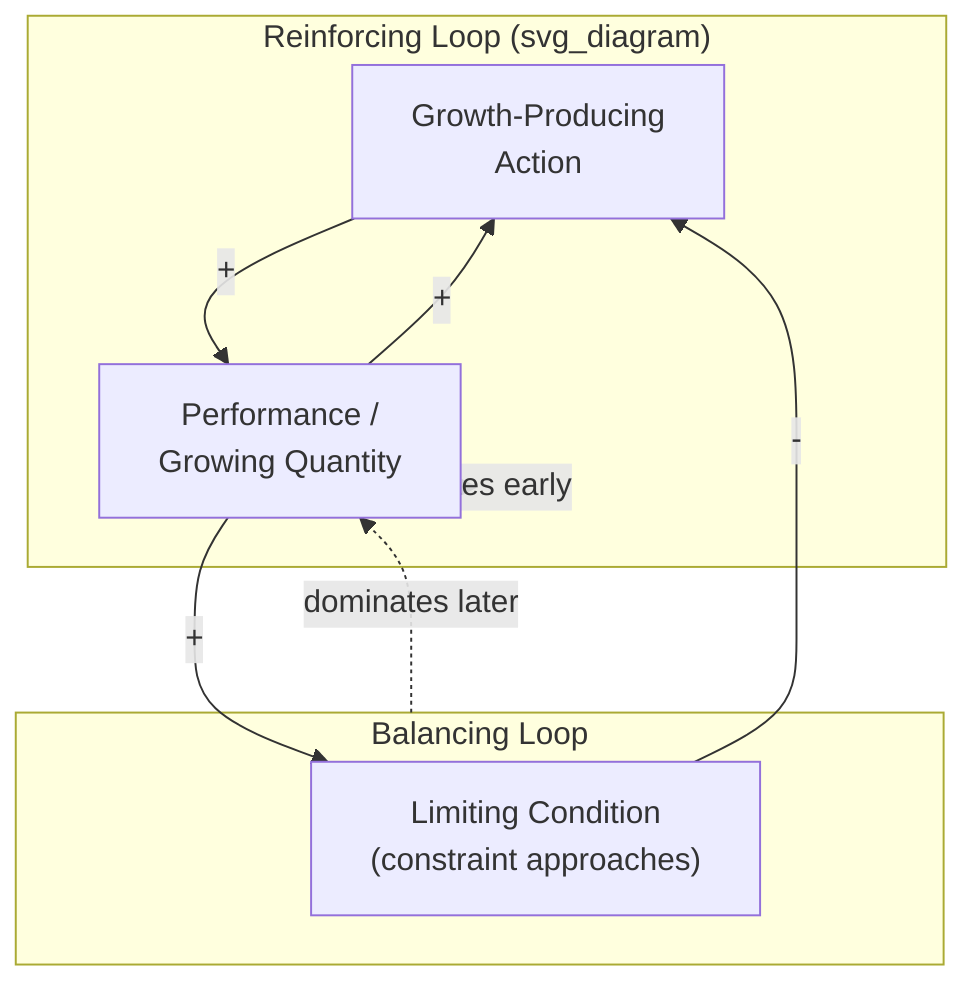
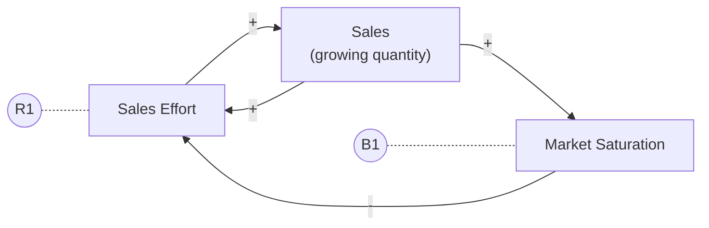
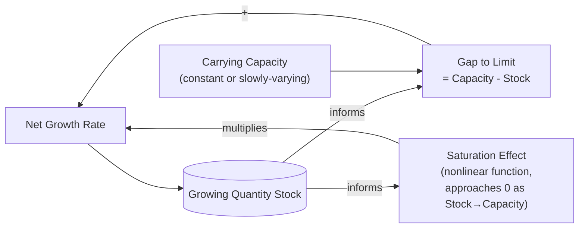
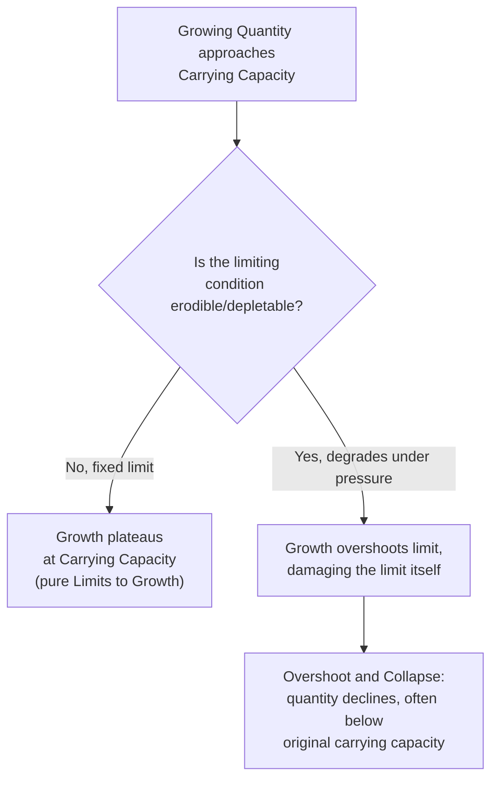

## Limits to Growth Archetype

### Overview

The Limits to Growth archetype describes a systems pattern in which a reinforcing (growth-producing) feedback loop drives a process to expand rapidly, until it encounters a balancing (constraining) feedback loop that slows, halts, or reverses that growth as the system approaches some limiting condition. It is one of the most fundamental and frequently observed archetypes in systems thinking, explaining why virtually no real-world growth process — biological, organizational, technological, or ecological — continues indefinitely at a constant rate.

### Structural Definition

The archetype consists of exactly two interacting feedback loops:

1. **A reinforcing loop (R)** — the "engine" of growth, where an initial action or condition produces more of itself, compounding over time
2. **A balancing loop (B)** — the "governor" or constraint, which becomes active as the growing quantity approaches a limiting condition, and acts to slow or stop further growth

Critically, the balancing loop is often *not visible or dominant early on* — it exists in the system's structure from the start, but its effect is negligible while the growing quantity is far from the limit. As the quantity increases, the balancing loop's influence strengthens, eventually overtaking the reinforcing loop in dominance — a phenomenon known as **loop dominance shift**.

### Causal Loop Diagram Notation

In standard causal loop diagram (CLD) notation, the Limits to Growth archetype is drawn with two loops sharing a common variable (the growing quantity):

- The **R1** loop label denotes the reinforcing loop: more Sales Effort → more Sales → more resources/motivation for Sales Effort
- The **B1** loop label denotes the balancing loop: more Sales → higher Market Saturation → less room for further Sales Effort to be effective, dampening the reinforcing loop's power

### Mathematical Representation

The archetype's canonical behavior is captured by the **logistic growth equation**, which combines unconstrained exponential growth with a self-limiting term as the quantity approaches a carrying capacity:

$$\frac{dP}{dt} = rP\left(1 - \frac{P}{K}\right)$$

where:

- $P$ is the growing quantity (population, sales, adoption, etc.)
- $r$ is the intrinsic (unconstrained) growth rate — the strength of the reinforcing loop
- $K$ is the carrying capacity or limiting condition — the ceiling imposed by the balancing loop

**Behavioral interpretation of the equation:**

- When $P \ll K$, the term $\left(1 - \frac{P}{K}\right) \approx 1$, so $\frac{dP}{dt} \approx rP$ — nearly pure exponential growth, reinforcing loop dominant
- As $P \to K$, the term $\left(1 - \frac{P}{K}\right) \to 0$, so $\frac{dP}{dt} \to 0$ — growth halts, balancing loop dominant
- The inflection point (maximum growth rate) occurs at $P = K/2$, marking the approximate transition of loop dominance from reinforcing to balancing

This produces the characteristic **S-shaped (sigmoid) curve**:

<svg xmlns="http://www.w3.org/2000/svg" viewBox="0 0 640 340">
<text x="20" y="24" font-size="16" font-weight="bold" fill="#222">Limits to Growth: S-Shaped Behavior (svg_diagram)</text>
<line x1="60" y1="280" x2="600" y2="280" stroke="#333" stroke-width="2" />
<line x1="60" y1="280" x2="60" y2="40" stroke="#333" stroke-width="2" />
<text x="300" y="310" font-size="13" fill="#333">Time</text>
<text x="15" y="170" font-size="13" fill="#333" transform="rotate(-90 15,170)">Growing Quantity (P)</text>
<line x1="60" y1="80" x2="600" y2="80" stroke="#999" stroke-dasharray="4,4" />
<text x="500" y="72" font-size="12" fill="#666">Carrying Capacity (K)</text>
<path d="M60,270 C150,265 220,250 280,200 C340,130 380,90 460,82 C520,79 560,78 600,78" fill="none" stroke="#2980b9" stroke-width="3" />
<circle cx="280" cy="175" r="5" fill="#c0392b" />
<text x="290" y="170" font-size="12" fill="#c0392b">Inflection point (P=K/2):</text>
<text x="290" y="186" font-size="12" fill="#c0392b">loop dominance shifts R→B</text>
<text x="90" y="255" font-size="12" fill="#2980b9">R-dominant</text>
<text x="480" y="100" font-size="12" fill="#2980b9">B-dominant</text>
</svg>

### Stock-and-Flow Representation

Translating the CLD into a stock-and-flow structure makes the mechanism explicit:

**Key equation set (discrete-time formulation):**

$$\text{Net Growth Rate}_t = r \cdot \text{Stock}_t \cdot \left(1 - \frac{\text{Stock}_t}{\text{Capacity}}\right)$$

$$\text{Stock}_{t+1} = \text{Stock}_t + \text{Net Growth Rate}_t \cdot \Delta t$$

### Real-World Examples

#### 1. Business Growth and Market Saturation

A company's sales force expands rapidly (reinforcing loop: more sales → more revenue → more hires → more sales), but eventually the addressable market becomes saturated (balancing loop: more sales → fewer remaining prospective customers → diminishing returns on each new salesperson).

#### 2. Population Growth and Carrying Capacity

A biological population grows reinforcing-loop-style (more organisms → more reproduction → more organisms) until food, space, or resource availability constrains further growth (balancing loop: more organisms → resource scarcity → higher mortality/lower birth rate).

#### 3. Product Adoption (Bass Diffusion)

New product adoption grows via word-of-mouth (reinforcing loop: more adopters → more word-of-mouth influence → more adoption), but slows as the pool of non-adopters shrinks (balancing loop: fewer remaining potential adopters → declining adoption rate) — this is the same structure underlying the Bass Diffusion model referenced in calibration practice.

#### 4. Organizational Learning Curve

A team's productivity improves rapidly early in a new process (reinforcing loop: learning → efficiency → more capacity to learn), but improvement rates taper as the team approaches the practical limits of the process design itself (balancing loop: approaching process limits → diminishing marginal returns on further learning).

#### 5. Server/Infrastructure Scaling

A growing user base drives increased server demand (reinforcing loop: more users → more engagement → more referrals → more users), until infrastructure capacity constraints (balancing loop: approaching capacity limits → degraded performance → user churn) cap further growth until additional capacity is provisioned.

### Diagnostic Signals

**Key Points**

- **Early warning sign**: A previously reliable growth strategy or intervention that "used to work" begins producing diminishing returns despite consistent or increased effort
- **Behavioral signature**: An S-shaped (logistic) growth curve, or — if the limiting variable itself degrades over time (e.g., resource depletion) — an overshoot-and-decline pattern rather than a stable plateau
- **Common management error**: Responding to slowing growth by *increasing* the reinforcing loop's driving action (e.g., more aggressive sales push, more aggressive resource extraction) without identifying or addressing the balancing loop's limiting condition — this typically worsens outcomes rather than restoring growth
- **The real leverage point** is usually not the reinforcing loop (which is already working as designed) but the *limiting condition* itself — removing or raising the constraint (e.g., expanding the addressable market, increasing carrying capacity, adding infrastructure capacity) is what restores growth, not pushing harder on the original driver

### Related Archetype Variant: Overshoot and Collapse

When the limiting condition is itself erodible (e.g., a renewable resource that can be depleted faster than it regenerates, or an ecosystem's carrying capacity that shrinks due to accumulated damage), the Limits to Growth archetype extends into the more severe **Overshoot and Collapse** pattern: the growing quantity does not stabilize at the limit but overshoots it, degrading the limit itself, and then declines — sometimes sharply, sometimes to a lower stable level than the original carrying capacity.

[Inference] Whether a given real-world system exhibits a stable Limits to Growth plateau versus an Overshoot and Collapse trajectory depends on whether feedback delays allow the growing quantity to detect and respond to the approaching limit before overshooting it — a delay-sensitive distinction that should be assessed case by case rather than assumed from the archetype label alone.

### Delays and Their Role

The severity of overshoot in this archetype is strongly influenced by delays in the balancing loop's information or response path. If there is a significant delay between the growing quantity approaching the limit and the balancing loop's corrective effect taking hold, the system is more prone to overshoot even when the limiting condition is not permanently erodible.

$$\text{Net Growth Rate}_t = r \cdot \text{Stock}_t \cdot \left(1 - \frac{\text{Stock}_{t-\tau}}{\text{Capacity}}\right)$$

where $\tau$ represents a perception or response delay. Larger $\tau$ values increase the likelihood of oscillation or overshoot around the carrying capacity rather than smooth convergence, since the system continues growing based on outdated (pre-limit) information.

### Intervention Strategies

**Key Points**

- **Identify the true limiting condition** before intervening — misdiagnosing which balancing loop is constraining growth leads to ineffective or counterproductive responses
- **Address the constraint directly** (expand capacity, open new markets, secure additional resources) rather than intensifying the original reinforcing action
- **Reduce response delays** in the balancing loop where possible, since shorter delays generally produce smoother approaches to the limit and reduce overshoot risk
- **Anticipate the archetype proactively**: since Limits to Growth is so structurally common, planning for eventual saturation (e.g., diversifying markets, planning capacity expansion before it's urgently needed) is more effective than reactive crisis management once growth has already stalled
- **Distinguish diminishing returns from total limits**: sometimes what looks like the system's absolute constraint is only the current best-available lever reaching its own limit — a broader search for alternative reinforcing mechanisms may reveal room for renewed growth via a different path

### Common Pitfalls

**Key Points**

- **"Push harder" fallacy**: Doubling down on the reinforcing loop's driving action when growth stalls, rather than investigating whether a balancing loop has become dominant
- **Conflating this archetype with simple decline**: Limits to Growth describes deceleration and plateauing, not the same as archetypes involving active erosion of a goal or standard (e.g., Eroding Goals) — the mechanisms and appropriate interventions differ
- **Ignoring delay effects**: Assuming the system will smoothly plateau at the limit when significant delays in the balancing loop's feedback path make oscillation or overshoot more likely
- **Treating the carrying capacity as fixed when it is not**: Applying static Limits to Growth thinking to a situation that is actually Overshoot and Collapse (an erodible limit), leading to underestimation of downside risk
- Behavior of any specific real-world system may deviate from the idealized logistic curve due to external shocks, multiple interacting limits, or nonlinearities not captured in the simplified model — the S-curve is a strong structural pattern, not a guaranteed precise predictor of any individual case's exact trajectory

**Related Topics**

- Overshoot and Collapse Archetype
- Reinforcing and Balancing Feedback Loop Fundamentals
- Bass Diffusion Model and Innovation Adoption Dynamics
- Delays in Feedback Loops and Their Effect on System Stability
- Eroding Goals Archetype
- Tragedy of the Commons Archetype
- Sensitivity Analysis and Scenario Testing (for exploring capacity/limit assumptions)
- Model Validation and Calibration (for fitting logistic/S-curve parameters to real data)