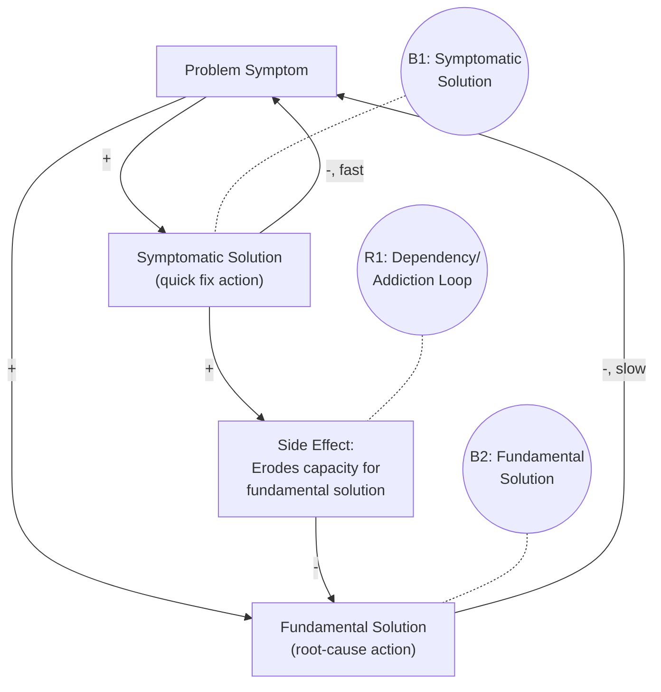
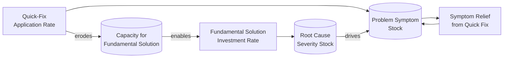
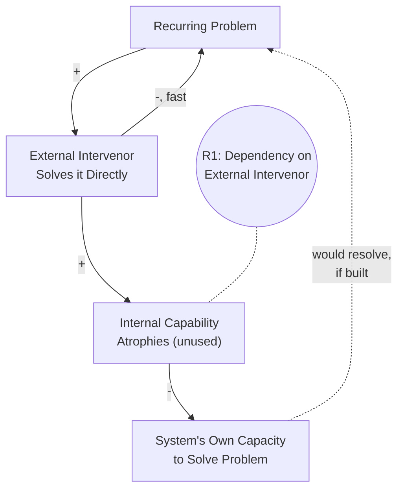

## Shifting the Burden Archetype

### Overview

Shifting the Burden describes a systems pattern in which a problem symptom is addressed through a quick, easy "symptomatic solution" that provides short-term relief, while the underlying root cause remains unaddressed and often worsens. Over time, reliance on the symptomatic solution grows, the capacity or motivation to pursue the more effective "fundamental solution" atrophies, and the system becomes progressively more dependent on the quick fix — even as the underlying problem deepens. It is among the most consequential archetypes in systems thinking because it explains why organizations, individuals, and societies often persist with counterproductive coping mechanisms despite their long-term costs.

### Structural Definition

The archetype consists of three interacting feedback loops sharing a common problem symptom:

1. **Balancing Loop 1 (Symptomatic Solution)** — a quick fix reduces the visible problem symptom rapidly, providing fast relief
2. **Balancing Loop 2 (Fundamental Solution)** — a slower, more effortful intervention that addresses the actual root cause, providing durable but delayed relief
3. **Reinforcing Loop (Side Effect / Dependency)** — the symptomatic solution produces a side effect that undermines the capacity or motivation to pursue the fundamental solution, creating a self-reinforcing dependency on the quick fix

**Key Points**

- **B1 (symptomatic solution loop)** acts quickly but does not resolve the underlying cause — it only suppresses the visible symptom temporarily
- **B2 (fundamental solution loop)** acts more slowly (often due to inherent delay in root-cause interventions) but produces lasting resolution
- **R1 (the reinforcing "shifting the burden" loop)** is the defining, most dangerous element: it is what causes escalating dependency, since the side effect of repeatedly using the quick fix actively weakens the system's ability or willingness to invest in the fundamental solution

### Why the Reinforcing Loop Is Decisive

The presence of two balancing loops alone (B1 and B2) would simply represent two alternative ways to solve the same problem — not inherently problematic. What makes this archetype distinct and dangerous is the **reinforcing side-effect loop (R1)**, which creates a vicious cycle: every use of the symptomatic solution makes the fundamental solution *less* likely to be pursued in the future, not merely equally likely. This asymmetry compounds over time, explaining why systems trapped in this archetype tend to drift progressively further from the root-cause resolution rather than randomly oscillating between the two approaches.

### Mathematical/Stock-Flow Representation

**Illustrative equations:**

$$\text{Symptom}_{t+1} = \text{Symptom}_t + (\text{RootCauseSeverity}_t - \text{QuickFixRelief}_t) \cdot \Delta t$$

$$\text{Capacity for Fundamental Solution}_{t+1} = \text{Capacity}_t - (k \cdot \text{QuickFixRate}_t) \cdot \Delta t$$

$$\text{FundFixRate}_t = f(\text{Capacity}_t) \quad \text{(fundamental solution effectiveness declines as Capacity erodes)}$$

where $k$ represents the erosion coefficient — how strongly each application of the quick fix degrades the system's capacity to pursue the root-cause remedy. A higher $k$ produces faster, more severe dependency dynamics.

### Behavioral Signature

<svg xmlns="http://www.w3.org/2000/svg" viewBox="0 0 640 360">
<text x="20" y="24" font-size="15" font-weight="bold" fill="#222">Shifting the Burden: Behavior Over Time (svg_diagram)</text>
<line x1="60" y1="300" x2="600" y2="300" stroke="#333" stroke-width="2" />
<line x1="60" y1="300" x2="60" y2="40" stroke="#333" stroke-width="2" />
<text x="290" y="330" font-size="13" fill="#333">Time</text>
<text x="15" y="180" font-size="13" fill="#333" transform="rotate(-90 15,180)">Magnitude</text>
<path d="M60,220 Q120,120 180,220 Q240,130 300,225 Q360,140 420,230 Q480,150 540,235 Q570,160 600,238" fill="none" stroke="#c0392b" stroke-width="2.5" />
<path d="M60,260 L600,120" fill="none" stroke="#2980b9" stroke-width="2.5" stroke-dasharray="6,3" />
<line x1="420" y1="60" x2="440" y2="60" stroke="#c0392b" stroke-width="3" />
<text x="445" y="64" font-size="12" fill="#333">Symptom (repeated quick-fix relief,</text>
<text x="445" y="78" font-size="12" fill="#333">then worsening trend underneath)</text>
<line x1="420" y1="95" x2="440" y2="95" stroke="#2980b9" stroke-width="3" stroke-dasharray="6,3" />
<text x="445" y="99" font-size="12" fill="#333">Root cause severity (steadily rising)</text>
</svg>

The characteristic pattern is oscillating short-term relief masking a steadily worsening underlying trend — each application of the quick fix produces a visible dip in the symptom, but the root cause (and dependency on the quick fix) trends upward across cycles.

### Real-World Examples

#### 1. Organizational Firefighting vs. Process Improvement

A team repeatedly relies on senior staff to personally resolve production incidents (quick fix) rather than investing in root-cause process redesign or automated safeguards (fundamental solution). Over time, senior staff become so consumed with firefighting that they have no time left to lead the process improvement effort — the side effect erodes the capacity for the fundamental solution.

#### 2. Substance Use as Stress Relief

Using a substance to relieve stress symptoms (quick fix) provides immediate relief, but repeated use can erode the coping skills, social support, or energy needed to address the underlying source of stress (fundamental solution) — and can itself introduce new problems that compound the original stress, deepening reliance on the substance.

#### 3. Outsourcing Core Competency

A company outsources a difficult but strategically important function (quick fix for a capacity gap) rather than investing in building internal expertise (fundamental solution). Over time, internal knowledge atrophies, making the organization increasingly dependent on the external vendor and less able to ever rebuild the fundamental capability.

#### 4. Regulatory or Subsidy Dependency

An industry facing structural inefficiency receives a subsidy or bailout (quick fix) instead of undertaking painful restructuring (fundamental solution). Reliance on the subsidy reduces the pressure and political will to restructure, and the underlying inefficiency persists or worsens, deepening dependency on continued government support.

#### 5. Technical Debt via Workarounds

Engineers apply quick patches to work around a flawed system architecture (quick fix) instead of refactoring the underlying design (fundamental solution). Each patch makes the codebase more fragile and harder to refactor later, increasingly locking the team into a pattern of continued patching.

### Diagnostic Signals

**Key Points**

- **Recurring symptom despite repeated "solutions"**: The same problem keeps reappearing even though it has ostensibly been "fixed" multiple times — a hallmark that the intervention has been symptomatic rather than fundamental
- **Escalating reliance on the quick fix**: The frequency, dose, or intensity of the symptomatic solution needed to achieve the same relief increases over time (a form of tolerance/dependency)
- **Declining capability for the fundamental solution**: Skills, resources, political will, or organizational capacity for the root-cause remedy visibly erode the longer the quick fix is relied upon
- **Resistance to proposing the fundamental solution**: Stakeholders increasingly view the fundamental solution as unrealistic, too slow, or too costly — partly *because* the side-effect loop has already eroded the conditions that would make it feasible

### Distinguishing from Related Archetypes

| Archetype | Core Mechanism | Key Difference from Shifting the Burden |
| --- | --- | --- |
| Shifting the Burden | Quick fix erodes capacity for fundamental fix | Defining feature is the side-effect reinforcing loop creating dependency |
| Fixes That Fail | A fix relieves a symptom short-term but has an unintended delayed consequence that makes the same symptom worse later | No fundamental-solution alternative is necessarily present; the fix directly (not via eroded capacity) recreates the problem |
| Shifting the Burden to the Intervenor | A specialized variant where an external party (consultant, expert, parent) becomes the permanent "quick fix" provider, and the system's own internal capability to self-manage the problem atrophies entirely | A specific sub-case emphasizing loss of internal capability to an external actor, rather than general capacity erosion |
| Limits to Growth | Growth is constrained by an approaching limiting condition | No "two competing solutions" structure — only one reinforcing loop meeting one balancing constraint |

### Special Case: Shifting the Burden to the Intervenor

A particularly common and important variant occurs when the "fundamental solution" involves building the system's own internal capability, but a well-meaning external intervenor (consultant, expert advisor, parent, IT support team) instead repeatedly solves the problem directly. This provides excellent short-term outcomes but prevents the system from ever developing the internal skill or capacity, creating long-term dependency on the intervenor.

**Key Points**

- Common in IT support (users never learn to self-diagnose issues), management consulting (organizations never build internal strategic capability), and parenting (children never develop independent problem-solving skills)
- The intervenor's helpfulness is precisely what perpetuates the dependency — well-intentioned quick help is the mechanism of harm, not incompetence or bad faith

### Intervention Strategies

**Key Points**

- **Recognize and name the trade-off explicitly**: Make the choice between symptomatic and fundamental solutions visible to decision-makers, rather than defaulting to the quick fix unconsciously because it feels easier or more urgent
- **Set a deliberate limit on symptomatic solution use**: Cap the frequency, duration, or scope of the quick fix to prevent the side-effect erosion loop from compounding indefinitely
- **Invest proactively in fundamental-solution capacity, even while using the quick fix**: Rather than treating the two as mutually exclusive, use the quick fix to buy time while explicitly protecting resources for the slower root-cause work (rather than letting the quick fix silently consume that capacity)
- **Build in accountability for follow-through**: Since fundamental solutions have longer delays and less immediate visible payoff, they are more vulnerable to abandonment — explicit milestones, ownership, and monitoring help sustain fundamental-solution efforts against the pull of the reinforcing dependency loop
- **For the intervenor variant specifically**: The intervenor should deliberately shift from directly solving problems to teaching/enabling the system to solve them itself, even at the cost of slower short-term resolution, to break the atrophy cycle

### Common Pitfalls

**Key Points**

- **Treating the quick fix as free**: The core error is failing to notice that the symptomatic solution has a hidden cost — its erosion of capacity for the fundamental solution — because that cost is invisible and delayed relative to the fix's immediate visible benefit
- **Blaming individuals rather than structure**: Attributing chronic reliance on quick fixes to laziness or poor judgment, when the structural feedback loop itself creates a systemic pull toward the quick fix regardless of individual intent
- **Abandoning the quick fix abruptly without the fundamental solution ready**: Since the underlying root cause has typically worsened while dependency built up, removing the symptomatic relief before the fundamental solution is operational can cause acute crisis
- **Assuming all coping mechanisms are inherently harmful**: Not every quick fix triggers this archetype — the pattern specifically requires a reinforcing side-effect loop that erodes fundamental-solution capacity; a temporary measure that does *not* erode long-term capability is not an instance of this archetype
- Real-world instances may involve more than one interacting quick-fix and fundamental-solution pair, or delays whose exact magnitude is hard to observe directly; behavior may vary from the idealized structural pattern depending on how many compounding side effects are actually present in a given case

**Related Topics**

- Fixes That Fail Archetype
- Shifting the Burden to the Intervenor (specialized sub-pattern)
- Limits to Growth Archetype
- Success to the Successful Archetype
- Reinforcing and Balancing Feedback Loop Fundamentals
- Delays in Feedback Loops and Their Effect on System Stability
- Policy Resistance and Structural Validity in System Dynamics
- Model Validation and Calibration (for testing quick-fix vs. root-cause dynamics numerically)