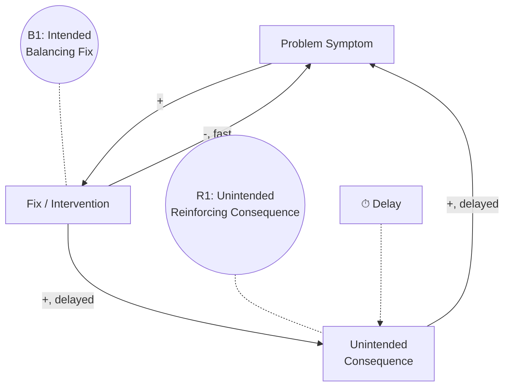
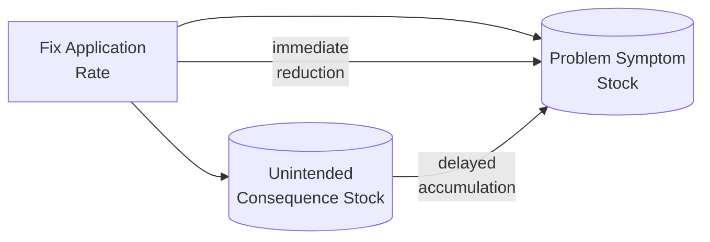

## Fixes That Fail Archetype

### Overview

Fixes That Fail describes a systems pattern in which a solution applied to a problem symptom produces immediate, visible relief, but also triggers an unintended consequence that — after a delay — causes the original problem to return, often more severely than before. Unlike Shifting the Burden, where a fundamental solution is neglected in favor of a competing quick fix, Fixes That Fail involves only a single intervention whose own delayed side effect recreates or worsens the very problem it was meant to solve. This archetype explains why well-intentioned interventions can leave a system worse off than doing nothing, and why the same "fix" is often reapplied repeatedly with diminishing or even negative net effect.

### Structural Definition

The archetype consists of two feedback loops sharing the same problem symptom:

1. **Balancing Loop (Intended Fix)** — the fix reduces the problem symptom quickly and directly; this is the loop decision-makers intend and typically perceive
2. **Reinforcing Loop (Unintended Consequence)** — the same fix, after a delay, produces a side effect that feeds back to worsen the original problem symptom, often unnoticed because of the time lag separating the fix from its consequence

**Key Points**

- **B1 (the intended fix loop)** operates on a short time horizon and is what the decision-maker sees and credits as "working"
- **R1 (the unintended consequence loop)** operates on a longer time horizon, often long enough that the causal link back to the original fix goes unrecognized
- The defining structural feature is that **both loops trace back to the same fix** — this is what distinguishes it from Shifting the Burden, where two *separate* interventions (a quick fix and a fundamental solution) are in play

### Why the Delay Is Central

The delay between applying the fix and the emergence of its unintended consequence is the archetype's most important structural element. Without a meaningful delay, the negative side effect would be immediately visible and the fix would likely be abandoned or revised quickly. Because the delay separates cause from effect in time, decision-makers frequently:

- Fail to attribute the later-emerging problem to the earlier fix
- Interpret the returning symptom as a "new" or "different" problem requiring a "new" solution — which, if it is a variant of the same fix, restarts the cycle
- Reapply the same fix with increasing frequency or intensity, since it does provide genuine (if temporary) short-term relief, deepening the long-term damage

### Mathematical/Stock-Flow Representation

**Illustrative equations with explicit delay:**

$$\text{Symptom}_{t+1} = \text{Symptom}_t - \alpha \cdot \text{FixRate}_t + \beta \cdot \text{SideEffect}_{t-\tau}$$

$$\text{SideEffect}_{t+1} = \text{SideEffect}_t + \gamma \cdot \text{FixRate}_t$$

where $\alpha$ is the immediate relief coefficient, $\beta$ is the strength of the delayed consequence's effect on the symptom, $\gamma$ is the rate at which the side effect accumulates from fix application, and $\tau$ is the delay length. The net long-run effect of the fix depends critically on the relative magnitudes of the short-term relief ($\alpha$) versus the delayed, compounding cost ($\beta \cdot \gamma$) — a fix can appear net-positive in the short window and net-negative once $\tau$ has elapsed.

### Behavioral Signature

<svg xmlns="http://www.w3.org/2000/svg" viewBox="0 0 640 360">
<text x="20" y="24" font-size="15" font-weight="bold" fill="#222">Fixes That Fail: Behavior Over Time (svg_diagram)</text>
<line x1="60" y1="300" x2="600" y2="300" stroke="#333" stroke-width="2" />
<line x1="60" y1="300" x2="60" y2="40" stroke="#333" stroke-width="2" />
<text x="290" y="330" font-size="13" fill="#333">Time</text>
<text x="15" y="180" font-size="13" fill="#333" transform="rotate(-90 15,180)">Problem Symptom Level</text>
<path d="M60,240 L120,150" fill="none" stroke="#2980b9" stroke-width="2.5" />
<path d="M120,150 L180,190" fill="none" stroke="#c0392b" stroke-width="2.5" />
<path d="M180,190 L240,120" fill="none" stroke="#2980b9" stroke-width="2.5" />
<path d="M240,120 L300,175" fill="none" stroke="#c0392b" stroke-width="2.5" />
<path d="M300,175 L360,95" fill="none" stroke="#2980b9" stroke-width="2.5" />
<path d="M360,95 L420,165" fill="none" stroke="#c0392b" stroke-width="2.5" />
<path d="M420,165 L480,75" fill="none" stroke="#2980b9" stroke-width="2.5" />
<path d="M480,75 L540,160" fill="none" stroke="#c0392b" stroke-width="2.5" />
<line x1="60" y1="240" x2="540" y2="160" stroke="#999" stroke-dasharray="5,3" stroke-width="1.5" />
<text x="420" y="55" font-size="12" fill="#333">Fix applied (dips)</text>
<line x1="120" y1="150" x2="140" y2="150" stroke="#2980b9" stroke-width="3" />
<text x="150" y="230" font-size="12" fill="#333">Underlying baseline worsens</text>
<text x="150" y="245" font-size="12" fill="#333">despite each apparent improvement</text>
</svg>

The characteristic pattern is a sawtooth or oscillating trajectory — the symptom repeatedly improves after each fix application, then relapses and, in the more severe cases, trends toward a progressively higher baseline severity across cycles, even though each individual fix genuinely produced short-term relief.

### Real-World Examples

#### 1. Traffic Congestion and Road Expansion

Adding highway lanes reduces congestion in the short term (fix), but improved travel conditions attract more drivers to use the route over time (delayed unintended consequence, related to "induced demand"), eventually restoring or worsening the original congestion level.

#### 2. Antibiotic Overuse and Resistance

Broad-spectrum antibiotics rapidly resolve an infection's symptoms (fix), but repeated or excessive use promotes the emergence of antibiotic-resistant bacterial strains (delayed unintended consequence), which can make future infections harder to treat — sometimes with the same or related pathogens.

#### 3. Overtime to Meet Deadlines

Assigning overtime work relieves an immediate project deadline pressure (fix), but sustained overtime leads to employee fatigue, errors, and burnout (delayed unintended consequence), which reduces overall team productivity and can recreate or worsen the original schedule pressure on subsequent projects.

#### 4. Price Cuts to Boost Sales

Cutting prices increases short-term sales volume (fix), but can erode brand perception, train customers to wait for discounts, and compress margins (delayed unintended consequence), ultimately harming long-run revenue and potentially requiring even steeper discounts to achieve the same volume effect later.

#### 5. Layoffs to Cut Costs

Reducing headcount lowers costs and improves near-term financial metrics (fix), but the resulting loss of institutional knowledge, overburdened remaining staff, and reduced capacity can degrade product quality or service levels (delayed unintended consequence), which can suppress revenue or require costly re-hiring and retraining later.

### Distinguishing from Shifting the Burden

| Aspect | Fixes That Fail | Shifting the Burden |
| --- | --- | --- |
| Number of distinct interventions | One (the fix itself) | Two (symptomatic quick fix + separate fundamental solution) |
| Source of long-term harm | The fix's own delayed side effect recreates the same problem | The quick fix erodes capacity to pursue an existing, separate fundamental solution |
| Presence of a "path not taken" | Not necessarily — there may be no alternative fundamental solution in the picture at all | Central — a viable fundamental solution exists but is neglected |
| Typical intervention | Identify and account for the delayed side effect before or while applying the fix | Deliberately protect and invest in the fundamental solution alongside/despite the quick fix |

[Inference] In practice, some real-world situations exhibit characteristics of both archetypes simultaneously (a fix with a delayed negative side effect *and* a neglected fundamental alternative) — the two archetypes are not mutually exclusive, and diagnosing which structural elements are actually present in a given case should be done empirically rather than assumed from surface similarity to either canonical pattern.

### Diagnostic Signals

**Key Points**

- **Recurring problem after repeated "successful" fixes**: The same fix keeps being reapplied and appears to work each time, yet the underlying problem trend is flat or worsening across a longer time horizon
- **A plausible causal delay**: Investigate whether a delay exists between the fix and a return of the symptom — if the returning problem consistently follows fix application by a similar lag, this is a strong diagnostic signal
- **Misattribution to a "new" cause**: Stakeholders describe the recurring symptom as a distinct, unrelated problem, when in fact it traces back to the original fix's own delayed consequence
- **Escalating fix intensity over time**: Needing progressively larger or more frequent applications of the same fix to achieve the same level of short-term relief, consistent with a compounding reinforcing side-effect loop

### Intervention Strategies

**Key Points**

- **Extend the analysis time horizon**: Evaluate proposed fixes not just on immediate impact but on projected effects across a longer window that could reveal delayed side effects before committing
- **Explicitly map potential unintended consequences**: Before applying a fix, deliberately ask "what delayed, indirect effect could this action have that might eventually recreate or worsen this same symptom?" — a structured pre-mortem exercise
- **Track leading indicators of the side effect**, not just the primary symptom, so early signs of the delayed consequence are visible before it fully manifests and restores the original problem
- **Favor fixes with verifiably short or absent delayed side-effect loops** when equally effective options exist, since the archetype's danger is proportional to the strength and length of the delayed reinforcing loop
- **Combine with root-cause investigation**: If a fix is suspected to be recreating its own problem, investigate whether a genuinely different fundamental solution (rather than a variant of the same fix) is needed — at which point the situation may also involve elements of the Shifting the Burden archetype

### Common Pitfalls

**Key Points**

- **Confusing short-term success with long-term effectiveness**: Judging an intervention purely on its immediate, visible impact without tracking whether the underlying trend improves over a longer horizon
- **Failing to search for delayed side effects at all**: Treating "no immediate negative consequence" as equivalent to "no negative consequence," when the archetype's defining feature is precisely that the consequence is delayed, not absent
- **Reapplying the same fix indefinitely**: Escalating the frequency or intensity of a fix that has already shown a pattern of temporary relief followed by relapse, rather than investigating the causal delay driving the relapse
- **Misdiagnosing this archetype as Shifting the Burden or vice versa**: The two require different interventions (addressing a delayed side effect of one action vs. protecting resources for a separate, neglected fundamental solution) — applying the wrong archetype's remedy will not resolve the actual structural cause
- The specific existence, direction, and magnitude of a delayed side effect for any given real-world fix is often difficult to establish with certainty from observational data alone; behavior may vary depending on context-specific factors not captured in the generic archetype structure, so causal claims linking a specific fix to a specific delayed relapse should be treated as [Inference] unless supported by controlled analysis or strong domain evidence

**Related Topics**

- Shifting the Burden Archetype
- Shifting the Burden to the Intervenor
- Delays in Feedback Loops and Their Effect on System Stability
- Policy Resistance and Structural Validity in System Dynamics
- Limits to Growth Archetype
- Reinforcing and Balancing Feedback Loop Fundamentals
- Model Validation and Calibration (for testing delayed side-effect hypotheses against data)
- Sensitivity Analysis and Scenario Testing (for exploring delay-length sensitivity)