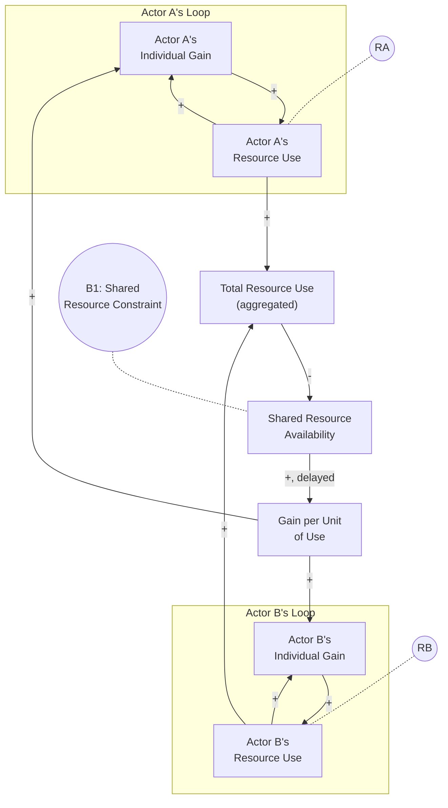
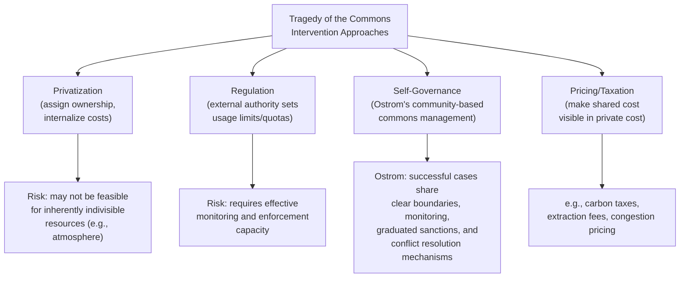

## Tragedy of the Commons Archetype

### Overview

Tragedy of the Commons describes a systems pattern in which multiple independent actors share access to a common, finite resource, and each actor — acting rationally to maximize their own individual benefit — increases their use of the resource, without accounting for the cumulative effect their combined usage has on the resource's availability. Because each actor experiences the full benefit of their own use but only a fraction of the shared cost of depletion, the aggregate effect of individually rational decisions is collective resource degradation or collapse, even though no individual actor intends this outcome. The term originates from ecologist Garrett Hardin's 1968 essay, though the underlying structural pattern applies far beyond ecological resources.

### Structural Definition

The archetype consists of multiple identical (or similar) reinforcing loops — one per actor — all drawing from and constrained by a single shared balancing loop tied to the common resource's finite capacity.

**Key Points**

- Each actor's individual loop (**RA**, **RB**, etc.) is a self-contained reinforcing loop: more use → more individual gain → more use — from any single actor's local perspective, using more of the resource always appears beneficial
- The single shared balancing loop (**B1**) connects total aggregate use back to resource availability, and from there back to the *per-unit* return each actor receives — but this feedback is diluted across all actors and delayed, so each individual actor experiences only a small, delayed fraction of the consequence of their own added use
- The structural trap is the **asymmetry between private benefit and shared cost**: each actor captures 100% of their own individual gain from increased use, but bears only a small fraction (roughly 1/N, where N is the number of actors) of the resulting depletion cost, which is distributed across the entire group

### Mathematical Representation

For $N$ actors each choosing a use rate $u_i$, with shared resource stock $R$:

$$\frac{dR}{dt} = g(R) - \sum_{i=1}^{N} u_i$$

where $g(R)$ is the resource's natural regeneration function (often itself logistic, e.g., $g(R) = rR(1 - R/K)$, connecting this archetype structurally to the Limits to Growth pattern for the resource itself).

Each actor's individual payoff might be modeled as:

$$\text{Payoff}_i = u_i \cdot v(R) - c(u_i)$$

where $v(R)$ is the value per unit of resource used (which declines as $R$ depletes) and $c(u_i)$ is the actor's private cost of their own usage level. Because each actor optimizes $\text{Payoff}_i$ considering only their own $u_i$ and treating $R$'s depletion as largely outside their control (since it results from the *sum* of everyone's use, not just their own), the individually optimal $u_i$ for each actor tends to be higher than the collectively optimal level that would maximize $\sum \text{Payoff}_i$ across all actors — this gap is the formal signature of the tragedy.

### Behavioral Signature

<svg xmlns="http://www.w3.org/2000/svg" viewBox="0 0 640 360">
<text x="20" y="24" font-size="15" font-weight="bold" fill="#222">Tragedy of the Commons: Behavior Over Time (svg_diagram)</text>
<line x1="60" y1="300" x2="600" y2="300" stroke="#333" stroke-width="2" />
<line x1="60" y1="300" x2="60" y2="40" stroke="#333" stroke-width="2" />
<text x="290" y="330" font-size="13" fill="#333">Time</text>
<text x="15" y="180" font-size="13" fill="#333" transform="rotate(-90 15,180)">Level</text>
<path d="M60,260 C160,255 260,245 340,220 C400,195 440,160 480,120 C520,90 560,80 600,78" fill="none" stroke="#c0392b" stroke-width="2.5" />
<path d="M60,80 C160,90 260,110 340,150 C400,190 440,230 480,260 C520,280 560,288 600,290" fill="none" stroke="#27ae60" stroke-width="2.5" />
<line x1="420" y1="55" x2="440" y2="55" stroke="#c0392b" stroke-width="3" />
<text x="445" y="59" font-size="12" fill="#333">Aggregate resource use (rising)</text>
<line x1="420" y1="130" x2="440" y2="130" stroke="#27ae60" stroke-width="3" />
<text x="445" y="134" font-size="12" fill="#333">Shared resource stock (depleting)</text>
</svg>

The characteristic pattern shows aggregate usage climbing while the shared resource stock declines — often accelerating as remaining scarcity drives a "race to extract before others do" dynamic, sometimes culminating in resource collapse (connecting this archetype to Overshoot and Collapse dynamics for the underlying resource stock).

### Real-World Examples

#### 1. Overfishing in Shared Fisheries

Individual fishing operations maximize their own catch (individual gain), but the fish population is a shared, finite stock. Each vessel's added catch contributes only marginally to overall depletion from that vessel's own perspective, but the sum of all vessels' catches can exceed the fish population's regeneration rate, leading to stock collapse.

#### 2. Corporate Use of Shared IT/Network Infrastructure

Individual teams within an organization consume shared computing resources (bandwidth, compute capacity, storage) to maximize their own project's speed or convenience, without fully internalizing the cumulative effect on overall system performance for all teams — leading to congestion or degraded service for everyone.

#### 3. Groundwater Extraction

Individual farmers or households drawing from a shared aquifer each benefit fully from their own water extraction, while the aquifer's depletion is a shared consequence distributed across all users — often leading to falling water tables and eventual scarcity for the entire community.

#### 4. Carbon Emissions and Atmospheric Capacity

Individual firms or nations benefit fully from their own emissions-generating economic activity, while the atmosphere's capacity to absorb greenhouse gases without severe climate effects is a shared global resource — each actor's individual emissions decision has a negligible individual effect on global climate outcomes, but the aggregate effect across all actors is significant.

#### 5. Open-Access Grazing Land

Hardin's original formulation: herders sharing common pasture land each benefit fully from adding more of their own livestock, while the pasture's carrying capacity is a shared constraint — leading to overgrazing when aggregate livestock numbers exceed what the land can sustainably support.

### Diagnostic Signals

**Key Points**

- **Individually rational decisions producing collectively harmful outcomes**: No single actor is behaving irrationally or maliciously from their own local perspective, yet the aggregate outcome harms the whole group, including the actors themselves
- **A resource with open or weakly restricted access**: The archetype requires that actors can use the resource without full accounting for or internalization of the shared depletion cost — resources with clear ownership and internalized costs (private property with full cost-bearing) are structurally less prone to this pattern
- **Escalating competitive usage as scarcity increases**: Rather than actors naturally reducing usage as the shared resource becomes scarcer, usage sometimes *increases* as actors race to capture remaining value before depletion — a particularly severe variant sometimes called the "race to the bottom"
- **Diffusion of responsibility**: No single actor perceives themselves as the cause of the problem, since each actor's individual contribution to aggregate depletion is small — this diffusion makes voluntary self-restraint structurally difficult without coordination

### Intervention Strategies

Hardin's original essay and subsequent work (notably Elinor Ostrom's Nobel Prize-winning research on commons governance) identify several structural categories of intervention:

**Key Points**

- **Privatization**: Assigning clear ownership rights over portions of the resource so that the owner internalizes both the benefit and the full cost of depletion — effective for divisible resources (land parcels) but difficult for inherently shared, indivisible resources (atmosphere, ocean fisheries spanning multiple jurisdictions)
- **External regulation**: A governing authority (government, regulatory body) sets and enforces usage limits (quotas, permits, caps) that constrain aggregate use below the resource's sustainable capacity — effectiveness depends heavily on monitoring and enforcement capability
- **Community self-governance (Ostrom's framework)**: Elinor Ostrom's empirical research documented numerous real-world cases where communities successfully self-managed shared commons without privatization or external regulation, typically featuring clearly defined resource boundaries, community-based monitoring, graduated sanctions for violations, and accessible conflict-resolution mechanisms
- **Pricing/taxation mechanisms**: Introducing a price or tax on resource use calibrated to reflect its true shared cost, so that each actor's private cost calculation better internalizes the externality they impose on others (e.g., carbon pricing, congestion pricing, extraction royalties)
- **Effective interventions generally work by realigning individual incentives with collective outcomes** — either by internalizing the previously externalized cost (pricing, privatization) or by changing the decision context through monitoring, communication, and enforced norms (regulation, self-governance) rather than relying on voluntary individual restraint alone

### Common Pitfalls

**Key Points**

- **Assuming individual moral appeals alone will resolve the pattern**: Because the archetype's root cause is structural (misaligned incentives), asking actors to voluntarily reduce usage without changing the underlying incentive structure typically fails to produce a durable solution, since any actor who complies while others do not bears a private cost with no corresponding shared benefit
- **Treating privatization as a universal solution**: Some resources (atmosphere, open ocean, migratory species) are not practically divisible into private ownership units, making privatization structurally infeasible regardless of theoretical appeal
- **Underestimating monitoring and enforcement costs**: Both regulatory and self-governance solutions require ongoing investment in monitoring compliance and enforcing consequences for violations — solutions that look elegant on paper can fail in practice if this operational cost is not sustained
- **Ignoring Ostrom's finding that no single governance model universally succeeds**: [Inference] Effective commons governance in practice appears highly context-dependent on the specific resource type, community characteristics, and existing institutions, so generic prescriptions (e.g., "always privatize" or "always regulate") should be treated cautiously rather than applied uniformly across different commons situations
- The precise threshold at which aggregate use exceeds a shared resource's sustainable regeneration capacity is often difficult to observe or predict with certainty in real systems, particularly for complex ecological or social resources; behavior may deviate from idealized model predictions due to measurement uncertainty, actor heterogeneity, or unmodeled dynamics

**Related Topics**

- Limits to Growth Archetype (shared resource capacity dynamics)
- Overshoot and Collapse (severe depletion trajectories)
- Shifting the Burden Archetype
- Fixes That Fail Archetype
- Elinor Ostrom's Design Principles for Commons Governance
- Reinforcing and Balancing Feedback Loop Fundamentals
- Sensitivity Analysis and Scenario Testing (for exploring regulatory threshold effects)
- Model Validation and Calibration (for calibrating multi-actor resource-use models)