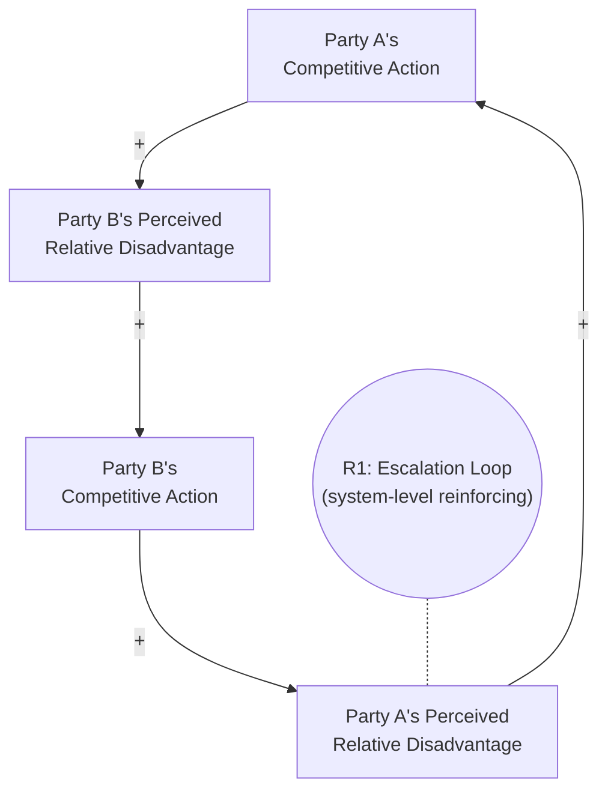

## Escalation Archetype

### Overview

Escalation describes a systems pattern in which two (or more) parties, each perceiving the other's actions as a threat or as gaining relative advantage, respond by increasing their own competing actions to restore parity or superiority. Each party's response becomes the trigger for the other's next response, and the two reinforcing loops interlock into a single system-level reinforcing loop that drives both parties' competing efforts upward, often without either side intending or benefiting from the eventual outcome. Escalation is among the archetypes most associated with arms races, competitive rivalries, and conflict spirals, and it illustrates how locally rational, defensive actions can aggregate into a mutually destructive dynamic.

### Structural Definition

The archetype consists of two mirrored balancing loops (each party trying to close a perceived gap relative to the other) that combine into a single system-level reinforcing loop.

**Key Points**

- From **Party A's local perspective**, their loop looks like a defensive balancing action: "we are behind, so we increase our effort to close the gap" — a seemingly stabilizing, rational response
- From **Party B's local perspective**, the same logic applies symmetrically in reverse
- When both parties' individually "balancing" perspectives are combined at the system level, the two loops interlock into a single **reinforcing loop (R1)**: A's increase triggers B's increase, which triggers A's further increase, and so on — an upward spiral neither party controls alone
- This is a key insight of the archetype: **each party experiences their own behavior as balancing/defensive, while the system as a whole experiences unbounded reinforcing escalation** — the mismatch between local perception and system-level structure is what makes this archetype so persistent and hard for participants to recognize from within

### Mathematical Representation

A simple formalization models each party's competitive level as responding proportionally to the *gap* relative to the other party:

$$\frac{dA}{dt} = k_A (B - A), \quad \frac{dB}{dt} = k_B (A - B)$$

where $A$ and $B$ are the two parties' competitive effort/capability levels, and $k_A, k_B > 0$ are responsiveness coefficients (how aggressively each party reacts to a perceived gap). Depending on the relative magnitudes of $k_A$ and $k_B$ and the presence of any absolute ceiling, this system can produce:

- **Unbounded escalation**: both $A$ and $B$ grow without limit if no external constraint intervenes
- **Convergence to a stable ratio**: if the responsiveness coefficients and any implicit constraints balance out, the gap $A - B$ can shrink toward zero while both levels continue rising together (an escalating but stable-ratio "arms race" trajectory)
- **Oscillation**: if there are significant response delays, $A$ and $B$ can oscillate around each other rather than escalating smoothly

A more general formulation incorporating an absolute resource or capacity limit (linking this archetype to Limits to Growth dynamics for each party individually) is:

$$\frac{dA}{dt} = k_A (B - A) \cdot \left(1 - \frac{A}{K_A}\right)$$

where $K_A$ represents Party A's own capacity ceiling (budget, resources, physical constraints), which can eventually cap the escalation independent of the rival dynamic.

### Behavioral Signature

<svg xmlns="http://www.w3.org/2000/svg" viewBox="0 0 640 360">
<text x="20" y="24" font-size="15" font-weight="bold" fill="#222">Escalation: Behavior Over Time (svg_diagram)</text>
<line x1="60" y1="300" x2="600" y2="300" stroke="#333" stroke-width="2" />
<line x1="60" y1="300" x2="60" y2="40" stroke="#333" stroke-width="2" />
<text x="290" y="330" font-size="13" fill="#333">Time</text>
<text x="15" y="180" font-size="13" fill="#333" transform="rotate(-90 15,180)">Competitive Effort Level</text>
<path d="M60,270 Q140,255 180,220 Q220,190 260,235 Q300,180 340,150 Q380,195 420,120 Q460,155 500,90 Q540,130 580,60" fill="none" stroke="#c0392b" stroke-width="2.5" />
<path d="M60,275 Q140,260 190,225 Q230,195 270,240 Q310,185 350,155 Q390,200 430,125 Q470,160 510,95 Q550,135 590,65" fill="none" stroke="#2980b9" stroke-width="2.5" stroke-dasharray="6,3" />
<line x1="420" y1="55" x2="440" y2="55" stroke="#c0392b" stroke-width="3" />
<text x="445" y="59" font-size="12" fill="#333">Party A effort</text>
<line x1="420" y1="75" x2="440" y2="75" stroke="#2980b9" stroke-width="3" stroke-dasharray="6,3" />
<text x="445" y="79" font-size="12" fill="#333">Party B effort (tracking, slightly lagged)</text>
</svg>

The characteristic pattern shows two competing quantities that rise together in a stair-step or ratchet fashion, each responding to and slightly lagging the other, with both trending upward over time even though the *relative gap* between them may stay roughly constant.

### Real-World Examples

#### 1. Military Arms Races

Nation A increases defense spending or weapons capability in response to a perceived threat from Nation B; Nation B, perceiving the resulting relative disadvantage, increases its own spending/capability in response, triggering further increases from Nation A — a dynamic historically observed in numerous geopolitical rivalries.

#### 2. Advertising and Marketing Spend Wars

A company increases advertising spend to gain market share; competitors, perceiving lost relative visibility, increase their own advertising spend to compensate, prompting the original company to increase spend further — total industry advertising costs rise while relative market share may remain largely unchanged.

#### 3. Price Wars

One retailer lowers prices to attract customers from competitors; competitors respond by lowering their own prices to avoid losing market share, prompting further price cuts — potentially compressing industry-wide margins for all participants without any lasting shift in relative market position.

#### 4. Feature/Specification Wars in Product Development

A technology company adds a new feature or spec (e.g., camera resolution, screen size) to differentiate from competitors; competitors match or exceed the addition to avoid appearing inferior, prompting further additions — potentially driving up development cost and product complexity beyond what customers actually value.

#### 5. Workplace "Face Time" or Overtime Culture

An employee stays late to appear more dedicated or productive relative to peers; peers, perceiving relative disadvantage, also extend their hours, prompting further extension — potentially normalizing excessive hours across the team without corresponding productivity gains.

### Diagnostic Signals

**Key Points**

- **Both parties frame their own actions as purely defensive or responsive**: Each side describes their behavior as "keeping up" or "responding to" the other's prior action, rather than recognizing their own contribution to the escalating cycle
- **Symmetric, mirrored escalation**: The two parties' trend lines rise in a similar pattern with a consistent lag, suggesting each is responding to the other rather than independently pursuing separate goals
- **The relative gap stays roughly constant while absolute levels rise**: Neither party gains lasting relative advantage despite escalating investment — a signature indicator that resources are being consumed by the escalation dynamic itself rather than by genuine competitive differentiation
- **Rising costs or risks with no corresponding rise in either party's underlying objective achievement**: Both sides may recognize, if asked directly, that the escalating competition is not serving their actual goals, yet feel unable to unilaterally de-escalate without appearing to concede relative position

### Intervention Strategies

**Key Points**

- **Recognize the system-level reinforcing structure**: The core intervention insight is helping both parties see that their individually "defensive" actions combine into a jointly reinforcing spiral neither controls or benefits from alone — reframing from "their aggression, my defense" to "our shared escalation dynamic"
- **Negotiated mutual de-escalation or arms-control-style agreements**: Formal or informal agreements where both parties commit to simultaneous, verifiable reductions can break the cycle, since unilateral de-escalation is individually risky (perceived weakness) even when mutually beneficial
- **Shift competitive focus to a non-escalating dimension**: Redirect competitive energy toward differentiation that does not directly trigger a matching response (e.g., competing on service quality or innovation rather than directly matching price cuts or feature counts)
- **Introduce a trusted third-party monitor or verification mechanism**: Reduces the perceived risk of unilateral de-escalation by providing assurance that the other party is genuinely reducing their competitive action in kind, rather than exploiting a unilateral pause
- **Set and communicate a clear absolute ceiling or resource constraint** in advance, which can act as a natural circuit-breaker on runaway escalation independent of the rival dynamic (connecting to Limits to Growth-style capacity constraints)

### Distinguishing from Related Archetypes

| Archetype | Core Mechanism | Key Difference from Escalation |
| --- | --- | --- |
| Escalation | Two parties' mirrored balancing responses combine into one system-level reinforcing loop | Requires two (or more) competing parties responding to each other's relative position |
| Limits to Growth | Single reinforcing loop meets a single balancing constraint from a fixed or eroding limit | No second competing party — the constraint is a resource/capacity limit, not a rival's counter-action |
| Tragedy of the Commons | Multiple actors independently draw down a shared resource | Actors are not directly responding to each other's specific actions; they share a resource constraint rather than a rivalrous relative-position dynamic |
| Success to the Successful | An early advantage leads to preferential resource allocation, widening the gap over time | Involves asymmetric resource allocation reinforcing an existing gap, not symmetric mutual response to close a gap |

### Common Pitfalls

**Key Points**

- **Assuming the other party will unilaterally stop first**: Each side waiting for the other to de-escalate without a mutual mechanism typically perpetuates the cycle indefinitely, since unilateral restraint is individually costly under the archetype's structure
- **Treating the rival's actions as the sole cause while ignoring one's own reinforcing contribution**: Both parties tend to attribute the escalation entirely to the other's aggression, obscuring the mutual, self-reinforcing nature of the system-level loop
- **Escalating negotiation tactics themselves**: Attempting to resolve an escalation dynamic through unilateral pressure or threats can itself become a form of escalation rather than a genuine circuit-breaker
- **Ignoring capacity ceilings until they bind abruptly**: Assuming the escalation can continue indefinitely without accounting for each party's actual resource or capability limits, which can produce a sudden, disruptive halt (or destabilizing failure) rather than a controlled de-escalation when a ceiling is finally reached
- Real-world escalation dynamics often involve more than two parties, asymmetric responsiveness coefficients, or external actors with their own incentives to prolong the rivalry; behavior may deviate substantially from the simplified two-party model depending on these additional factors, so specific predictions about how quickly or how far a given real escalation will proceed should be treated with appropriate caution

**Related Topics**

- Limits to Growth Archetype
- Tragedy of the Commons Archetype
- Success to the Successful Archetype
- Shifting the Burden Archetype
- Reinforcing and Balancing Feedback Loop Fundamentals
- Delays in Feedback Loops and Their Effect on System Stability
- Game Theory Perspectives on Competitive Dynamics and Arms Races
- Sensitivity Analysis and Scenario Testing (for exploring responsiveness coefficient effects)