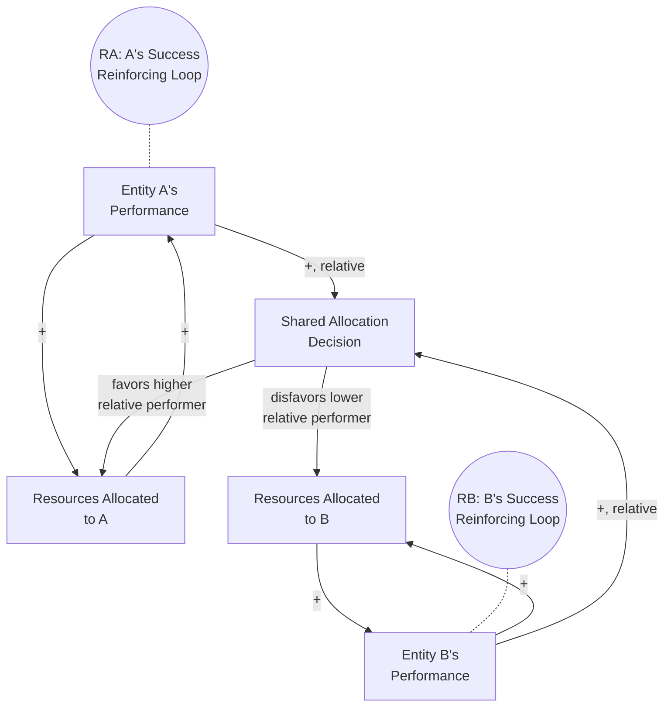

## Success to the Successful Archetype

### Overview

Success to the Successful describes a systems pattern in which two (or more) competing entities draw from a shared, limited pool of resources, and an initial, often small, difference in performance or allocation causes one entity to receive disproportionately more resources or opportunities. This additional allocation improves that entity's performance further, justifying even greater future allocation, while the other entity — receiving comparatively less — sees its performance stagnate or decline, justifying further reduced allocation. The result is a self-reinforcing divergence: winners keep winning and losers keep losing, often regardless of the entities' original underlying capability, and frequently disproportionate to any genuine difference in merit.

### Structural Definition

The archetype consists of two mirrored reinforcing loops connected through a shared, limited resource-allocation mechanism.

**Key Points**

- **RA and RB are each self-contained reinforcing loops**: more resources → better performance → justification for more resources, operating independently for each entity
- The two loops are coupled through a **shared, zero-sum or resource-constrained allocation mechanism**: because total resources are limited, more allocation to A structurally implies less available for B (or at least, a slower rate of increase)
- The critical dynamic is that the allocation mechanism responds to **relative performance**, not absolute need or original potential — a small initial edge for A (which may be due to random chance, timing, or a marginal early advantage) triggers a self-widening gap purely through the structure of the resource-allocation feedback, independent of any inherent difference in the entities' underlying capability

### Mathematical Representation

Let $P_A, P_B$ represent performance levels and let total resources $R$ be allocated proportionally to relative performance:

$$\text{Alloc}_A = R \cdot \frac{P_A}{P_A + P_B}, \quad \text{Alloc}_B = R \cdot \frac{P_B}{P_A + P_B}$$

$$\frac{dP_A}{dt} = f(\text{Alloc}_A), \quad \frac{dP_B}{dt} = f(\text{Alloc}_B)$$

where $f$ is an increasing function mapping allocation to performance growth. Because allocation is proportional to the *ratio* $P_A / (P_A + P_B)$, even a small initial difference ($P_A(0)$ slightly greater than $P_B(0)$) produces a self-amplifying divergence: A's growing performance share increases A's allocation share, which further increases A's performance, and so on, while B's declining relative share reduces B's growth rate correspondingly.

This structure is mathematically related to **preferential attachment** models (as seen in network growth, e.g., the Barabási–Albert model), where entities that already have more connections/resources are more likely to receive additional connections/resources — producing highly skewed, "winner-take-most" distributions over time.

### Behavioral Signature

<svg xmlns="http://www.w3.org/2000/svg" viewBox="0 0 640 360">
<text x="20" y="24" font-size="15" font-weight="bold" fill="#222">Success to the Successful: Diverging Trajectories (svg_diagram)</text>
<line x1="60" y1="300" x2="600" y2="300" stroke="#333" stroke-width="2" />
<line x1="60" y1="300" x2="60" y2="40" stroke="#333" stroke-width="2" />
<text x="290" y="330" font-size="13" fill="#333">Time</text>
<text x="15" y="180" font-size="13" fill="#333" transform="rotate(-90 15,180)">Performance / Resource Share</text>
<path d="M60,220 Q140,200 220,160 Q320,100 420,60 Q500,40 580,30" fill="none" stroke="#27ae60" stroke-width="2.5" />
<path d="M60,230 Q140,245 220,265 Q320,280 420,290 Q500,296 580,298" fill="none" stroke="#c0392b" stroke-width="2.5" />
<circle cx="60" cy="220" r="4" fill="#27ae60" />
<circle cx="60" cy="230" r="4" fill="#c0392b" />
<line x1="70" y1="215" x2="70" y2="235" stroke="#666" stroke-width="1" />
<text x="75" y="228" font-size="11" fill="#666">small initial gap</text>
<line x1="420" y1="50" x2="440" y2="50" stroke="#27ae60" stroke-width="3" />
<text x="445" y="54" font-size="12" fill="#333">Entity A (early edge → widening lead)</text>
<line x1="420" y1="285" x2="440" y2="285" stroke="#c0392b" stroke-width="3" stroke-dasharray="6,3" />
<text x="445" y="289" font-size="12" fill="#333">Entity B (falls further behind)</text>
</svg>

The characteristic pattern is a small early gap that widens progressively over time into a large, often extreme divergence — the classic "rich get richer" trajectory, sometimes producing near-monopolistic or winner-take-all outcomes even when initial capability differences between entities were minor.

### Real-World Examples

#### 1. Internal Corporate Resource Allocation Between Divisions/Products

A company's best-performing product line receives disproportionate marketing budget and R&D investment (justified by its strong returns), which further improves its performance and justifies even more investment, while a promising but currently underperforming product line receives shrinking investment and eventually stagnates — regardless of its underlying long-term potential.

#### 2. Academic Funding and the "Matthew Effect"

Researchers or institutions with early publication success or grant wins tend to receive disproportionately more future funding and opportunities (a phenomenon well-documented in sociology of science as the "Matthew Effect"), which further increases their output and visibility, while equally capable but less initially fortunate researchers receive comparatively fewer resources and opportunities to demonstrate further capability.

#### 3. Sales Territory or Lead Allocation

A sales representative who closes an early deal is rewarded with better leads or a more lucrative territory (justified by demonstrated performance), improving their subsequent close rate and justifying further preferential allocation, while a representative with an early unlucky break receives progressively worse leads, compounding their initial disadvantage.

#### 4. Educational Tracking and Resource Allocation

Students identified early as "advanced" (sometimes based on relatively minor initial differences) are often placed in enriched programs with more resources and attention, which improves their measured performance and reinforces their advanced track placement, while students identified as "behind" receive comparatively fewer resources, potentially widening an initially small gap over years of schooling.

#### 5. Platform and Network Effects (Preferential Attachment)

An early-successful product or platform attracts more users, which increases its value to each additional user (network effects), attracting still more users and investment, while competing platforms with a comparable initial offering but slightly less early traction struggle to attract the critical mass needed to compete — often resulting in winner-take-most market structures.

### Diagnostic Signals

**Key Points**

- **Divergence disproportionate to any genuine underlying capability difference**: The eventual gap between entities is far larger than what the original difference in inherent quality or potential would predict — a signal that the resource-allocation mechanism itself, not merit alone, is driving the outcome
- **Allocation decisions explicitly or implicitly based on relative recent performance**: Resource, budget, or opportunity decisions that reward whoever is currently ahead, rather than being based on absolute need, long-term potential, or an independent assessment of underlying capability
- **Early, possibly random or minor advantages compounding over time**: Tracing the origin of a large eventual gap often reveals a surprisingly small or even arbitrary initial difference (timing, a lucky break, an early evaluator's subjective judgment)
- **Structural inability of the disadvantaged entity to "catch up" through effort alone**: Because the allocation mechanism itself is tilted by relative performance, the lagging entity faces a structurally harder path to improvement than the leading entity, independent of comparable effort

### Distinguishing from Related Archetypes

| Archetype | Core Mechanism | Key Difference from Success to the Successful |
| --- | --- | --- |
| Success to the Successful | Shared resource allocated by relative performance, widening gap between competing entities | Requires an explicit resource-allocation mechanism responding to relative (not absolute) standing |
| Escalation | Two parties mutually respond to each other's competitive actions to close a perceived gap | Escalation involves both parties increasing effort in response to each other; here, the disadvantaged entity's position often *worsens* rather than triggering a matching competitive response |
| Tragedy of the Commons | Multiple actors independently deplete a shared resource | No explicit allocation mechanism favoring one actor over another based on relative performance — depletion results from aggregate independent use, not a comparative allocation decision |
| Limits to Growth | Single reinforcing loop meets a single balancing constraint | No second competing entity — a single system's growth is constrained by an approaching limit, not divided between rivals |

### Intervention Strategies

**Key Points**

- **Decouple allocation from short-term relative performance**: Establish resource-allocation criteria based on absolute potential, independent assessment, or long-term strategic value rather than purely on current relative standing, to reduce the mechanism's tendency to compound small early differences
- **Set minimum resource floors for all competing entities**: Guaranteeing a baseline level of investment or opportunity for lower-performing entities can prevent the disadvantaged entity from falling below a threshold where recovery becomes structurally impossible
- **Periodically re-evaluate allocation with fresh, unbiased criteria**: Regularly reassessing entities independent of their accumulated track record can surface cases where an early disadvantage was due to circumstance rather than genuine lower capability, correcting for compounded historical bias
- **Introduce deliberate "handicapping" or equalization mechanisms** in contexts where the goal is genuinely fair competition rather than pure efficiency maximization — commonly used in sports, some grant programs, and diversity-oriented resource allocation policies
- **Recognize when the pattern is actually desirable**: Not every instance of this archetype is undesirable — in some contexts (e.g., allocating capital to a demonstrably superior technology or genuinely higher-potential venture), reinforcing early success may be an efficient and intended outcome; intervention is warranted primarily when the compounding divergence is disproportionate to genuine merit or when the disadvantaged entity's long-term potential is being unfairly suppressed

### Common Pitfalls

**Key Points**

- **Assuming the eventual gap reflects a proportionate underlying quality difference**: The archetype's central insight is that the resource-allocation *structure* itself, not necessarily inherent capability, can be the primary driver of large eventual gaps — attributing the full gap to merit alone can be a significant misdiagnosis
- **Failing to recognize the archetype until the gap is already extreme**: Because the early divergence starts small, the compounding dynamic is often not noticed or addressed until the disadvantaged entity's position has become severely and perhaps irreversibly weakened
- **Applying equalization interventions indiscriminately**: Removing all performance-based allocation entirely can undermine legitimate incentives and efficient resource use in contexts where the current allocation mechanism is appropriately merit-based rather than structurally biased
- **Ignoring the disadvantaged entity's potential due to compounded low relative performance**: A track record shaped substantially by cumulative underinvestment can understate an entity's genuine underlying capability, leading to continued underinvestment based on a self-fulfilling historical pattern
- The degree to which any specific real-world divergence is attributable to this archetype's structural mechanism versus genuine, persistent capability differences is often difficult to disentangle empirically; claims about the relative contribution of "structural compounding" versus "true merit differences" in a specific case should be treated as [Inference] unless supported by controlled comparison or counterfactual analysis

**Related Topics**

- Escalation Archetype
- Tragedy of the Commons Archetype
- Limits to Growth Archetype
- Shifting the Burden Archetype
- Reinforcing and Balancing Feedback Loop Fundamentals
- Preferential Attachment and Network Growth Models (Barabási–Albert)
- The Matthew Effect in Sociology of Science and Resource Allocation
- Sensitivity Analysis and Scenario Testing (for exploring initial-condition sensitivity)